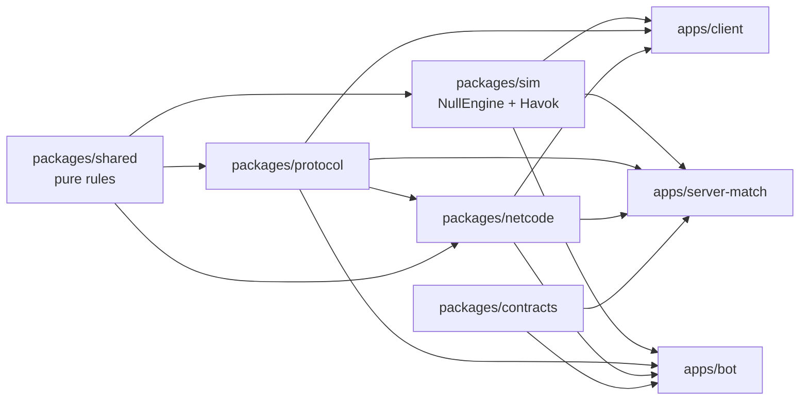
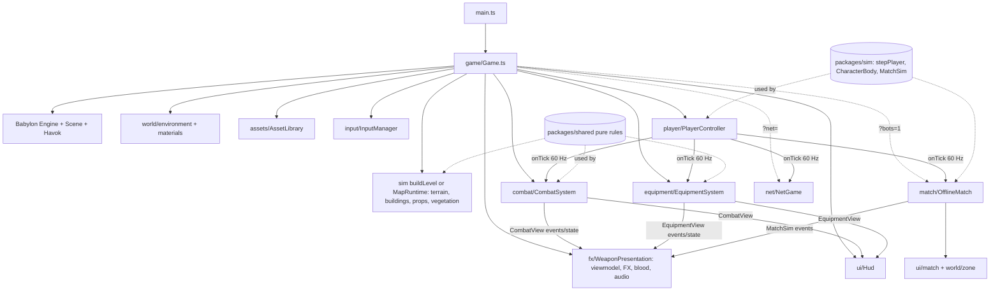

# twobullets: architecture and tech stack

This is the entry point to the codebase. It describes the architecture as of the offline game on Map v1 (equipment, offline bot matches) plus the M3 local networking core (server-authoritative movement over WebSocket). For the full multiplayer backend plan (M3–M5), see [`backend/architecture.md`](backend/architecture.md).

## Tech stack

| Layer | Choice | Why |
|---|---|---|
| Language | TypeScript 7 (strict), ESM | One language for client, shared simulation, match server and bots |
| Monorepo | pnpm 11 workspaces, Node 24 | `apps/*` + `packages/*` share code without publishing |
| Build/dev | Vite 8 (Rolldown) | Fast HMR, workers, multi-page (`buildings.html`, `props.html`) |
| Engine | Babylon.js 9.26 (`@babylonjs/core`, `loaders`, `inspector`), exact pins | Full engine in TS; NullEngine runs headless in `packages/sim` for the server, bots and tests |
| Physics | Havok WASM (`@babylonjs/havok`) via Babylon Physics v2 | Character controller, heightfield, raycasts; the same binary in browser and Node |
| Tests | vitest in every package, including headless NullEngine + Havok (`packages/sim/test`, `apps/client/test`) | Pure rules are unit-tested; engine behaviour, bot matches and netcode are checked headless |
| Assets | glTF/GLB with meshopt and KTX2 (Basis), locally hosted decoders | Small downloads, low GPU memory, no CDN at runtime |
| Audio | Raw WebAudio (HRTF panners, buses, limiter); Opus with AAC fallback | Needs filters, sends and exact scheduling that Babylon audio lacks |
| UI | DOM overlay (no framework), CSS tokens in `ui/hud.css` | Cheap updates, PUBG-style minimal HUD |
| Networking (M3) | Bit-packed protocol (`packages/protocol`), netcode library (`packages/netcode`), WebSocket (`ws`) in `apps/server-match` | Local server-authoritative movement works; WebTransport, CI gates and hosting are not built yet |
| Backend (planned) | Node 24 match servers, WebTransport with WSS fallback, OVH Singapore | See `backend/architecture.md` |

## Repository layout

```
apps/client/            Vite app (the game)
  index.html, buildings.html, props.html
  public/assets/        processed assets: weapons, characters, equipment, vfx, environment, props, map bake, audio, decoders
  src/
    main.ts             bootstraps Game
    game/Game.ts        creates everything, owns the frame loop
    input/              InputManager (pointer lock, keys, mouse buttons, wheel), bindings
    player/             PlayerController (look, fixed 60 Hz tick through sim's stepPlayer, input history), PlayerLife (death/respawn)
    combat/             CombatSystem (weapon tick, projectiles, Havok raycasts, hitboxes, armor), CombatView contract
    equipment/          EquipmentSystem (throwables, items, vitals, loot), EquipmentView contract, presentation/ (models, throw arms, flipbook VFX), loot/
    targets/            SoldierCharacter/SoldierAnimator (Mixamo soldier, clips, bone hitboxes), TargetRange/TargetDummy
    viewmodel/          first-person weapon rigs (real GLB arms and guns), ADS alignment, red dot
    fx/                 WeaponPresentation (effects, tracers, impacts, casings, blood), pooled FX batches
    audio/              AudioEngine/GameAudio/AudioDirector, footsteps, near-miss, equipment audio
    ui/                 Hud, CombatHud, compass, ammo, health/armor, scope, kill feed, inventory screen, equipment HUD, NetDebugHud (F6), match/ (zone timer, feed, death/result screens)
    world/              environment (IBL, sun, shadows, fog), materials, terrain, buildings visuals, props, vegetation, mapRuntime, zone/ (ZoneWall)
    match/              OfflineMatch (hosts MatchSim), HumanActor, BotBodies, MatchPresentation, Spectator, BotDebugOverlay, URL options, trace
    net/                NetGame (wiring), NetClient (handshake, sync, snapshots), LocalPlayerNet (prediction/reconcile), NetClock, RemoteRoster/RemotePlayers, WebSocketTransport
    assets/             AssetLibrary, WeaponInstance, CharacterInstance, EquipmentInstance, manifests (typed)
    perf/               bench runner, perf overlay, feature flags, graphics presets, dynamic resolution
    debug/, dev/        F3/F8/F9 tools; buildings and props preview pages
  test/                 headless net/ (NetClient vs an in-process server) and match/ (offline start path)
apps/server-match/src/  Node match server (M3): app/main (ws listener, dev token, /healthz), host/ (LocalMatchHost), match/ServerMatch,
                        sched/TickScheduler, session/, snapshot/ (SnapshotBuilder, replication), transport/ (WsSession), auth/joinToken, dev/HeadlessClient
apps/bot/               headless bot client and load driver (T3.6: stub); test/boundaries.test.ts gates the package dependency rules
packages/shared/src/    pure, deterministic gameplay (no Babylon, no node:*)
  constants.ts          SIMULATION (60 Hz), MOVEMENT, CAMERA, FALL_DAMAGE
  input.ts, aim.ts      PlayerInput/PlayerState, Btn, quantized aim, move modifiers and gates
  tickClock.ts, inputRing.ts  TickClock + AccumulatorClock, PlayerInputRing (input history by tick)
  movement/             computeDesiredVelocity, stances (stand/crouch/prone), fall damage
  weapons/              weapon defs, stepWeapon (fire modes, reload, ADS, spread, recoil, seeded RNG), ballistics
  equipment/            items, inventory, armor, vitals (knock/revive), item use, throw/bounce, explosion, smoke, fire, flash, loot, equipmentStep
  hitreg/               procedural hitbox rig (poseHitboxes, segmentVsRig)
  bots/                 nav (2.5D grid, A*), perception, memory, brain (utility goals), motor, aim, profiles (easy/normal/hard)
  match/                zone schedule, BR rules (teams, knock, placements, win), spawn plan, noise radii, MatchState/MatchEvent types
  level/                arena LevelData and types
  map/                  MapData types, mapV1 layout, terrain/ (heightfield, flatten, surface mask, bake), buildings/ (kit, prefabs, collision data), layout/ (roads, scatter, props, worker)
packages/sim/src/       Babylon NullEngine + Havok, render-agnostic, Node-safe (deep @babylonjs/core imports only)
  index.ts              createSimWorld, stepPlayer, PlayerBody/StepResult contracts
  CharacterBody.ts, WorldRaycaster.ts, collisionLayers.ts
  level/                buildLevel, collision, shapes
  map/                  terrainBody (Havok heightfield), buildingPhysics, buildBuilding, mapCollision (headless Map v1 world)
  match/                MatchSim (headless BR match: bots, projectiles vs rig, equipment world, zone, rules), projectiles, lootQuery
packages/protocol/src/  bit reader/writer, quantize, framing, ticks, messages (control, input, ping, snapshot), content hash, decode CLI
packages/netcode/src/   timeSync, timeDilation, inputBuffer (server input ring), baselines, interpolation, prediction (reconcile, smoothing),
                        transport/Session, testing/ (LinkConditioner, network profiles, memory session, virtual clock)
packages/contracts/src/ match lifecycle and host agent ↔ match IPC types (plain JSON, imports nothing)
tools/
  assets/               FBX/GLB → optimized GLB + manifest (character merge, weapon clip tables), verify; equipment/ (throw arms, throwables, consumables, gear)
  environment/          Poly Haven fetch + external Sketchfab models → textures, HDRI sky/IBL, props, cover props and vegetation GLBs with LODs
  vfx/                  CC0 flipbooks → premultiplied KTX2 sheets + vfxManifest.ts + credits
  audio/                CC0 fetch → trimmed, normalized Opus/AAC clips + manifest, verify, fp-mix
  map/                  terrain bake + SVG overview
  bench/                netcode, runtime (backend design) and bots (nav build, full headless matches) benchmarks
assets-src/             raw downloads (gitignored, never committed) and DOWNLOADS-<date>.md records
docs/                   design docs, ADRs, devlog (see docs/README.md)
```

### Package dependency direction



- `shared`, `protocol`, `netcode` and `contracts` are pure: no `@babylonjs/*` and no `node:*`. `sim` is the only package with Babylon; it and the Node apps never import the `@babylonjs/core` barrel.
- Allowed workspace dependencies: `protocol` → `shared`; `netcode` → `shared`, `protocol`; `sim` → `shared`; `shared` and `contracts` → nothing. The apps use `shared` directly as well. `apps/bot/test/boundaries.test.ts` enforces all of this in `pnpm test`.

## Runtime architecture (client)



`?bots=1` and `?net=` are DEV-only and exclusive: `?net` disables the bot match and Map v1 (the M3 server runs the arena), and `?bench` disables both.

### Frame loop (`Game.ts`)
1. `net.update(dt)` (only with `?net`): handshake and clock sync, time dilation, hard resync, remote interpolation sampling. It runs before the player so the tick clock is current.
2. `player.update(dt)`: mouse look every frame, then fixed 60 Hz ticks from its `TickClock` (the offline `AccumulatorClock`, or `NetClock` when networked). Each tick samples a `PlayerInput` into `inputHistory`, runs `stepPlayer` (shared movement + Havok `CharacterBody`) and fires `player.onTick`.
3. On each tick, in subscription order: `CombatSystem` and `EquipmentSystem` step the shared weapon and equipment rules (inputs are queued between ticks), then `PlayerLife` runs. Networked, `NetGame` records the prediction and sends the tick's input. In a bot match, `OfflineMatch` (subscribed when the match starts) ticks `MatchSim` once: bots, projectiles, zone and rules, with the human as an external actor.
4. `match.update(dt)`: bot soldiers placed between the last two match ticks, spectator camera, zone wall, death/result screens, match HUD.
5. `net.lateUpdate(dt)`: remote players and the F6 net panel.
6. `combat.update(dt)`, `equipment.update()`, `presentation.update(dt)`, `loot.update()`, `world.update(dt)`: frame-rate work (ADS smoothing, animation, effects, LOD).
7. `scene.render()`: Havok steps, animations apply, then rendering.
8. `hud.update(...)`, `inventory.update()`, `input.endFrame()`.

### Key principles
- **Shared simulation is authoritative-ready.** Movement, weapons, equipment, terrain, loot, bots and match rules are pure and deterministic (seeded RNG from counters, injected raycasts, no Babylon in `shared`). `packages/sim` adds the Havok body and world so the client, the Node server and headless tests step the same `stepPlayer` and `MatchSim`.
- **Contracts between systems.** `CombatView`, `EquipmentView` and `MatchView` expose events plus read-only state. Presentation, HUD and audio never mutate gameplay. Contract changes are additive.
- **Performance by design.**
  - Thin instances per cell, pooled FX, no per-frame allocations.
  - Per-cascade shadow culling, graphics presets (render scale).
  - Feature flags (`perf/flags.ts`, `?opt=`) with A/B variants in `?bench=v1`.
- **Assets are offline-processed.** Raw files in `assets-src/` become optimized outputs with manifests and credits. The client loads them through typed manifests.

### Main data flows
- **A shot:**
  1. input → `CombatInputQueue` → tick `stepWeapon` → `FiredShot`
  2. `spawnProjectiles` → each tick `stepProjectiles` with a Havok raycast
  3. on a hit: hitbox → zone → `computeDamage` → armor → target/player vitals
  4. events → blood/FX, audio, hit marker
- **A grenade:**
  1. `EquipmentSystem` throw state → pure bounce sim (injected raycast)
  2. detonation → occlusion-sampled explosion damage → `onDetonate`, `onAreaDamage`
  3. presentation renders explosion/smoke/fire; audio plays layered sounds
- **Map load (`?map=v1`):**
  1. a worker fetches the terrain bake, verifies the checksum and builds the layout
  2. main thread: heightfield body, terrain chunks, buildings (compound colliders + thin-instance visuals), props and vegetation (thin instances + pooled colliders)
  3. loot from the seeded generator
- **Offline bot match (`?bots=1`, details in [`bots/design.md`](bots/design.md)):**
  1. load: Map v1, then `OfflineMatch.create` builds the nav grid on the main thread, the team spawn plan and pooled bot soldiers
  2. the first pointer lock ("START MATCH") builds `MatchSim` with ports: `WorldRaycaster`, nav query, `equipment.groundLoot`, the `EquipmentSystem` world, `HumanActor`, `new CharacterBody(scene, feet)`
  3. each player tick: `MatchSim.tick()` runs rules → external poses → brains (`PlayerInput` per bot) → bot `stepPlayer`/equipment/weapon steps → projectiles vs world and rig → vitals, zone damage, team wipes → `MatchEvent`s
  4. human bullets hit bot bone hitboxes (`CombatSystem`) and bot grenades go through `EquipmentSystem`; both call `MatchSim.damageActor`. Bot bullets reach the human through `HumanActor` → `EquipmentSystem` vitals
  5. frame: `BotBodies` interpolates soldiers and picks clips; `MatchPresentation` turns `MatchFxEvent`s into gunshots, tracers, impacts and blood; `MatchHud`, `ZoneWall` and the death/result screens read `MatchView`
- **Networked movement (`?net=ws://localhost:7350/m/local`, details in [`backend/m3-local-run.md`](backend/m3-local-run.md)):**
  1. connect: dev join token over HTTP → WebSocket → Hello/Welcome → sync (10 snapshots, 5 ping echoes) → `NetClock` starts ahead of the server tick
  2. client tick: `PlayerController` predicts with `stepPlayer`; `NetClient` sends a packet of up to 6 inputs (this tick's plus unacked older ones); `LocalPlayerNet` records the quantized predicted state
  3. server tick (`TickScheduler` → `ServerMatch.tick`): each player's `ServerInputBuffer` gives the input for that tick (a synthetic repeat when missing) → `stepPlayer` in a headless `SimWorld` → `SnapshotBuilder` writes per-client bit-packed snapshots at 60 Hz, deltas against the newest acked baseline, with the recipient's owner block
  4. client snapshot: `ClientSnapshotStore` decodes → `TimeSync` and time dilation; the owner block is compared with the prediction for that tick, and a mismatch restores the server state and replays recorded inputs (`replay: true`, no FX), with the visual jump smoothed over 100 ms; remote entities go to `RemoteRoster` and render with Hermite interpolation at `serverTime − interpDelay`
  5. only movement is networked in M3; combat, equipment and loot stay local
- **Equipment art ([`equipment/art.md`](equipment/art.md)):** Sketchfab downloads in `assets-src/equipment/` → `pnpm assets:equipment` (`tools/assets/equipment/`: bake, resize to real size, spoon/ring parts, spec-gloss → metal-rough, triangle budget, KTX2 + meshopt) → `public/assets/equipment/*.glb`, `manifest.json`, `credits.json` → `AssetLibrary` loads them as optional assets → `itemMeshes`/`ThrowableViewmodel` (throw arms with a grip node) and ground loot, with procedural stand-ins when a model is missing.
- **Throwable VFX ([`fx-throwables.md`](fx-throwables.md)):** CC0 flipbooks in `assets-src/vfx/` → `node tools/vfx/build.mjs` → premultiplied-alpha KTX2 sheets in `public/assets/vfx/` plus the generated `vfxManifest.ts` → `VfxLibrary` (one thin-instanced `VfxBatch` per sheet, particle pools) → `ExplosionEffects`, `SmokeRenderer` and `FireRenderer` driven by equipment events; smoke volume and fire area still come from the shared rules.

## Server (M3 local, M4–M5 planned)
`apps/server-match` runs today in local mode (`pnpm server:dev`, `ws://localhost:7350/m/local`, arena only) with server-authoritative movement, per-client snapshots, dev join tokens and `--fake-net` link profiles. The plan for the rest:
- 60 Hz ticks and snapshots, client prediction and reconciliation (done for movement);
- networked combat with projectile lag compensation capped at 200 ms (M4);
- a bit-packed delta protocol over WebTransport with a WSS fallback (WebSocket only so far);
- the BR loop networked with `MatchSim` and lobby bots (M5);
- one process per match, a self-built matchmaker/allocator, OVH Singapore hosting.

Prerequisite refactors and the M3–M5 plan: [`backend/architecture.md`](backend/architecture.md).
