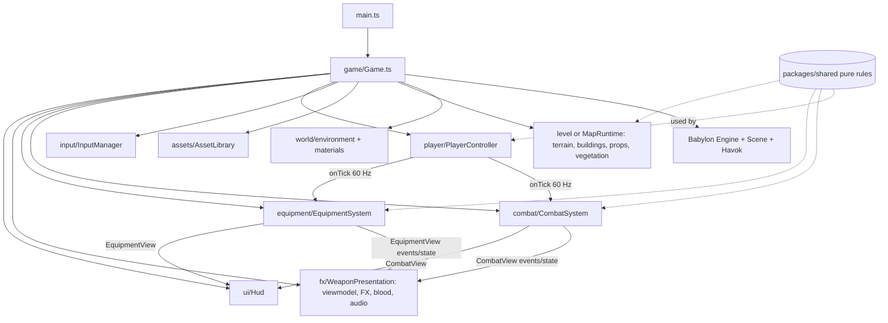

# twobullets: architecture and tech stack

This is the entry point to the codebase, describing the architecture as of the offline game (Map v1 plus equipment, before bots and backend). For the planned multiplayer backend, see [`backend/architecture.md`](backend/architecture.md).

## Tech stack

| Layer | Choice | Why |
|---|---|---|
| Language | TypeScript 7 (strict), ESM | One language for client, shared simulation and the future server |
| Monorepo | pnpm 11 workspaces, Node 24 | `apps/*` + `packages/*` share code without publishing |
| Build/dev | Vite 8 (Rolldown) | Fast HMR, workers, multi-page (`buildings.html`) |
| Engine | Babylon.js 9.26 (`@babylonjs/core`, `loaders`, `inspector`) | Full engine in TS; NullEngine runs headless for the server and tests |
| Physics | Havok WASM (`@babylonjs/havok`) via Babylon Physics v2 | Character controller, heightfield, raycasts; the same binary in browser and Node |
| Tests | vitest (`packages/shared`), plus headless NullEngine + Havok scripts | Pure rules are unit-tested; engine behaviour is checked headless |
| Assets | glTF/GLB with meshopt and KTX2 (Basis), locally hosted decoders | Small downloads, low GPU memory, no CDN at runtime |
| Audio | Raw WebAudio (HRTF panners, buses, limiter); Opus with AAC fallback | Needs filters, sends and exact scheduling that Babylon audio lacks |
| UI | DOM overlay (no framework), CSS tokens in `ui/hud.css` | Cheap updates, PUBG-style minimal HUD |
| Backend (planned) | Node 24 match servers, WebTransport with WSS fallback, OVH Singapore | See `backend/architecture.md` |

## Repository layout

```
apps/client/            Vite app (the game)
  index.html, buildings.html
  public/assets/        processed assets: weapons, characters, environment, props, map bake, audio, decoders
  src/
    main.ts             bootstraps Game
    game/Game.ts        creates everything, owns the frame loop
    input/              InputManager (pointer lock, keys, mouse buttons, wheel), bindings
    player/             PlayerController (look, fixed 60 Hz tick, camera), CharacterBody (Havok controller), PlayerLife (death/respawn)
    combat/             CombatSystem (weapon tick, projectiles, Havok raycasts, hitboxes, armor), CombatView contract
    equipment/          EquipmentSystem (throwables, items, vitals, loot), EquipmentView contract, presentation/, loot/
    targets/            SoldierCharacter (Mixamo soldier, animation blending, bone hitboxes), TargetRange/TargetDummy
    viewmodel/          first-person weapon rigs (real GLB arms and guns), ADS alignment, red dot
    fx/                 WeaponPresentation (effects, tracers, impacts, casings, blood), pooled FX batches
    audio/              AudioEngine/GameAudio/AudioDirector, footsteps, near-miss, equipment audio
    ui/                 Hud, CombatHud, compass, ammo, health/armor, scope, kill feed, inventory screen, equipment HUD
    world/              environment (IBL, sun, shadows, fog), materials, terrain renderer, buildings visuals, props, vegetation, mapRuntime
    assets/             AssetLibrary, WeaponInstance, CharacterInstance, manifest (typed)
    perf/               bench runner, perf overlay, feature flags, graphics presets, dynamic resolution
    debug/              F3/F8/F9 tools
packages/shared/src/    pure, deterministic gameplay (server-reusable)
  constants.ts          SIMULATION (60 Hz), MOVEMENT, CAMERA, FALL_DAMAGE
  movement/             computeDesiredVelocity, stances (stand/crouch/prone), fall damage
  weapons/              weapon defs, stepWeapon (fire modes, reload, ADS, spread, recoil, seeded RNG), ballistics
  equipment/            items, inventory, armor, vitals (knock/revive), item use, throw/bounce, explosion, smoke, fire, flash, loot generation
  level/                arena LevelData + buildLevel (render-agnostic boxes/ramps)
  map/                  MapData types, mapV1 layout, terrain/ (heightfield, flatten, surface mask, bake), physics/ (Havok heightfield), buildings/ (kit, prefabs, collision), layout/ (roads, scatter, worker)
tools/
  assets/               FBX/GLB → optimized GLB + manifest (character merge, weapon clip tables), verify
  environment/          Poly Haven fetch → textures, HDRI sky/IBL, props and vegetation GLBs with LODs
  audio/                CC0 fetch → trimmed, normalized Opus/AAC clips + manifest, verify, fp-mix
  map/                  terrain bake + SVG overview
  bench/                netcode and runtime benchmarks (backend design)
assets-src/             raw downloads (gitignored, never committed)
docs/                   design docs, ADRs, devlog (see docs/README.md)
```

## Runtime architecture (client)



### Frame loop (`Game.ts`)
1. `player.update(dt)`: mouse look every frame, then fixed 60 Hz ticks. Each tick builds a `MoveInput`, runs the shared movement step and the Havok controller, and fires `player.onTick`.
2. On each tick, `CombatSystem` and `EquipmentSystem` step the shared weapon and equipment rules in lockstep with movement (inputs are queued between ticks).
3. `combat.update(dt)`, `equipment.update()`, `presentation.update(dt)`, `world.update(dt)`: frame-rate work (ADS smoothing, animation, effects, LOD).
4. `scene.render()`: Havok steps, animations apply, then rendering.
5. `hud.update(...)`, `input.endFrame()`.

### Key principles
- **Shared simulation is authoritative-ready.** Movement, weapons, equipment, terrain and loot are pure and deterministic (seeded RNG, injected raycasts, no Babylon in the pure folders), so the Node server can run the same code for authority and the client for prediction.
- **Contracts between systems.** `CombatView` and `EquipmentView` expose events plus read-only state. Presentation, HUD and audio never mutate gameplay. Contract changes are additive.
- **Performance by design.**
  - Thin instances per cell, pooled FX, no per-frame allocations.
  - Per-cascade shadow culling, graphics presets (render scale).
  - Feature flags (`perf/flags.ts`, `?opt=`) with A/B variants in `?bench=v1`.
- **Assets are offline-processed.** Raw files in `assets-src/` become optimized outputs with manifests and credits. The client loads them through typed manifests.

### Main data flows
- **A shot:**
  1. input → `CombatInputQueue` → tick `stepWeapon` → `FiredShot`
  2. `spawnProjectiles` → each tick `stepProjectiles` with a Havok raycast
  3. on a hit: hitbox → zone → `computeDamage` → armor → target/player vitals
  4. events → blood/FX, audio, hit marker
- **A grenade:**
  1. `EquipmentSystem` throw state → pure bounce sim (injected raycast)
  2. detonation → occlusion-sampled explosion damage → `onDetonate`, `onAreaDamage`
  3. presentation renders explosion/smoke/fire; audio plays layered sounds
- **Map load (`?map=v1`):**
  1. a worker fetches the terrain bake, verifies the checksum and builds the layout
  2. main thread: heightfield body, terrain chunks, buildings (compound colliders + thin-instance visuals), props and vegetation (thin instances + pooled colliders)
  3. loot from the seeded generator

## Planned server (summary)
Node 24 bundled match servers run the same `packages/shared` simulation with Havok headless:
- 60 Hz ticks and snapshots, client prediction and reconciliation;
- projectile lag compensation capped at 200 ms;
- a bit-packed delta protocol over WebTransport with a WSS fallback;
- one process per match, a self-built matchmaker/allocator, OVH Singapore hosting.

Prerequisite refactors and the M3–M5 plan: [`backend/architecture.md`](backend/architecture.md).
