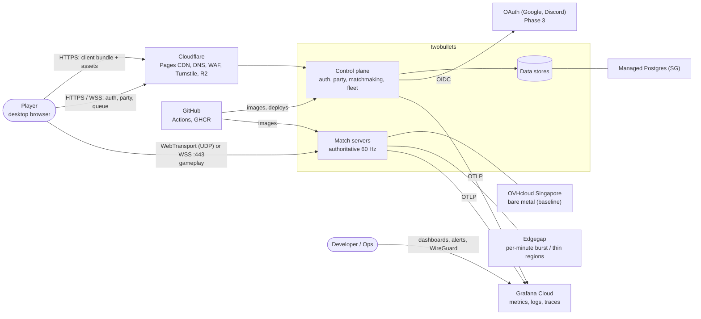
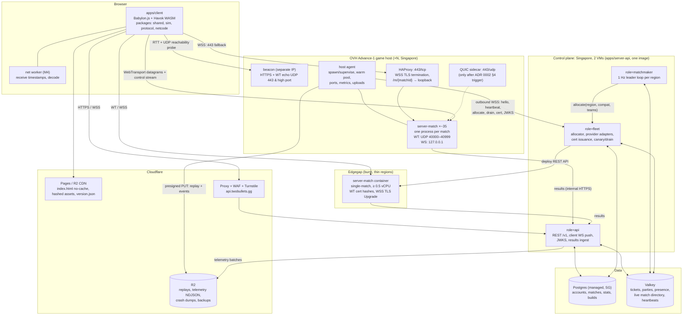
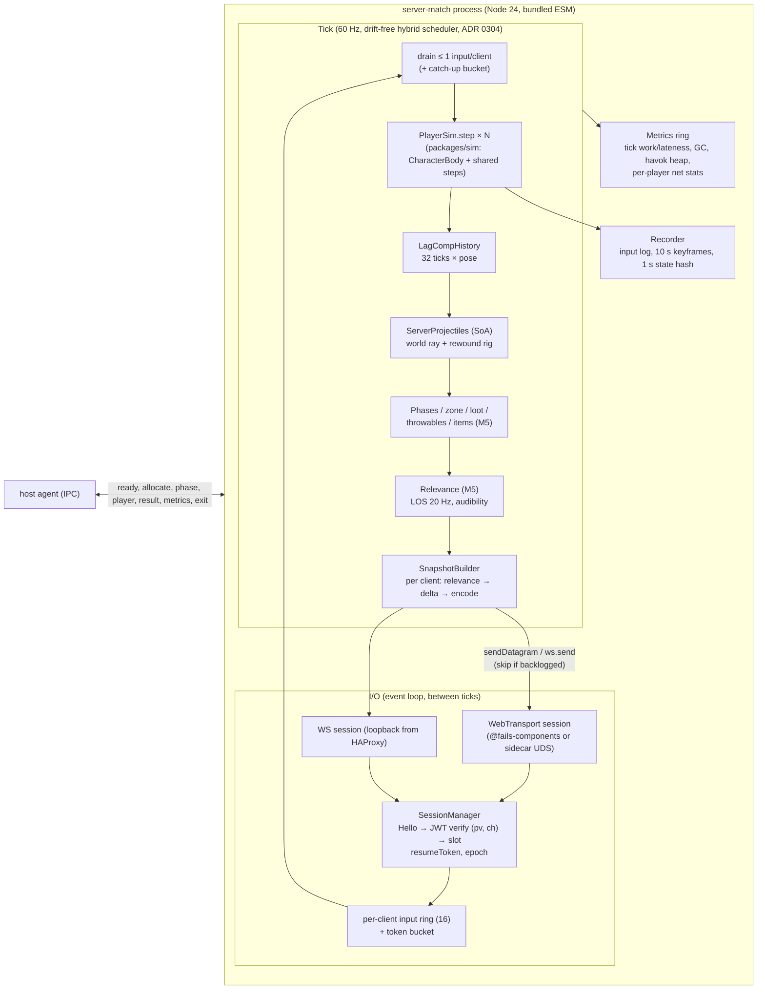
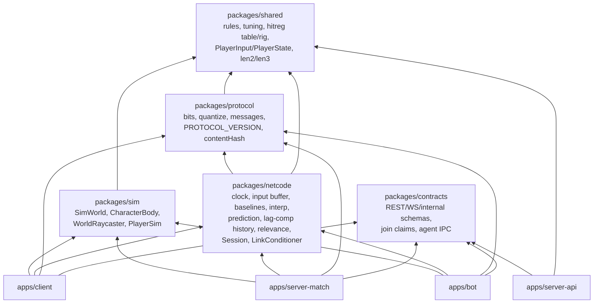
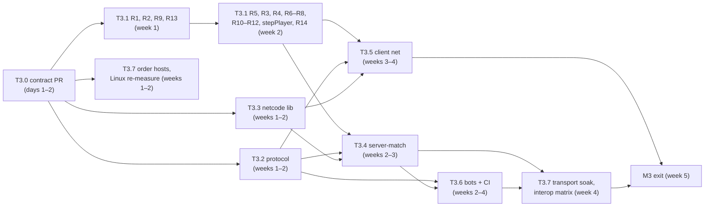
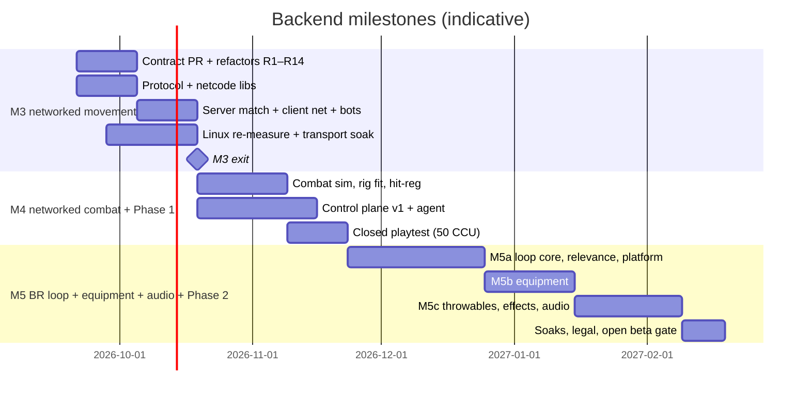

# twobullets backend architecture

- **Owner:** Principal Architect.
- **Status:** authoritative. This document merges the three specialist designs, resolves their conflicts and defines the implementation plan.
- **Date:** 2026-09-14. Code baseline: commit `12f0d9c` ("realistic art swap").
- **Inputs:**
  - [netcode.md](netcode.md) + ADR 02xx: Netcode Architect
  - [runtime-performance.md](runtime-performance.md) + ADR 03xx + `tools/bench/runtime/results/*.json`: Runtime & Performance Engineer
  - [platform.md](platform.md) + ADR 01xx: Platform & Infrastructure Architect
  - `tools/bench/netcode/*`: codec and lag-compensation benchmarks
- **Principal ADRs:** [0001](adr/0001-capacity-bandwidth-cost-baseline.md) capacity and cost · [0002](adr/0002-match-endpoints-ports-tls-and-admission.md) endpoints, ports, admission · [0003](adr/0003-hitbox-model-and-shared-hitbox-table.md) hitboxes · [0004](adr/0004-match-process-model-and-packing-trigger.md) process model · [0005](adr/0005-monorepo-package-boundaries-and-server-build.md) package boundaries. Full index: [adr/README.md](adr/README.md).
- **Precedence:** where this document or a 00xx ADR disagrees with a specialist document, this document wins. Specialist documents remain the detailed reference for everything not overridden here. They are cited as `file §section`.

> **Measurement caveat.** Every CPU, memory and tail number comes from an Apple M2 Pro laptop that was swapping heavily (runtime-performance.md §2 caveats). Numbers marked **[re-measure]** are provisional until they are re-run on the target Linux x86-64 host, planned in M3 (§5.8).

---

## Contents

1. [Executive summary](#1-executive-summary)
2. [System context and containers](#2-system-context-and-containers)
3. [Unified decisions](#3-unified-decisions)
4. [Conflict resolution log](#4-conflict-resolution-log)
5. [Reconciled numbers](#5-reconciled-numbers)
6. [Budgets and SLOs](#6-budgets-and-slos)
7. [Implementation plan](#7-implementation-plan)
8. [Risk register](#8-risk-register)
9. [Open questions for the product owner](#9-open-questions-for-the-product-owner)
10. [Source map](#10-source-map)

---

## 1. Executive summary

**What we are building.** Browsers connect to our servers in Singapore for a 10-player, 5-team battle royale.

- **The server is the referee.** It runs the same game code the browser runs: movement, weapons, bullet flight, damage. The browser sends only what the player pressed and where they aimed.
- **Players never have to trust each other's machines.** Speed hacks, rapid fire and fake hits don't work. Wallhacks get little to see, because the server doesn't send enemies the player can neither see nor hear.
- **Moving feels instant.** The browser predicts the player's own movement and silently corrects it in the rare case the server disagrees.
- **Hits go where the player aimed.** The server rewinds targets by up to 200 ms to where the shooter saw them.

**How it is built.**

- **One language (TypeScript) everywhere.** The match server is Node.js running the same simulation package as the browser, including the same Havok physics binary. Measured cost: under 1 ms of CPU per 10-player tick. The simulation is not our cost problem.
- **One process per match**, on rented dedicated servers in Singapore (OVHcloud, $136/month each, unlimited bandwidth, DDoS protection included). Each server runs about 35 matches.
- **A per-minute cloud provider (Edgegap) as overflow** and for small far-away regions. It costs about 5–10× more per match-hour than our own boxes, so it stays overflow.
- **Transport:** fast UDP-like delivery (WebTransport) when the network allows, with an automatic fallback to secure WebSocket on port 443 when it doesn't (cafés, campuses, offices).
- **Small messages:** a custom bit-packed format keeps a player at about **85 kbps down / 45 kbps up**, about as much as a voice call.
- **A small control plane** (login, parties, matchmaking, server allocation) in one TypeScript service, with Postgres, Redis and Cloudflare R2. We build the matchmaker ourselves: several hosting and matchmaking vendors shut down in 2026, and our rules (duos, fill, backfill) are simple.

**What it costs (monthly, planning estimates; see §5.5).**

| Peak concurrent players | 100 | 1,000 | 10,000 |
|---|---|---|---|
| Recommended stack | **≈ $320** (min. $190) | **≈ $1.0–1.2k** | **≈ $6.5–8.3k** |
| All on a per-minute provider (for comparison) | ≈ $360 | ≈ $3.4k | ≈ $32k |

**What changed in the merge.**

1. **Bandwidth is double Platform's assumption** (85 vs 40 kbps). That doubles egress cost on metered providers, so owning boxes pays off sooner.
2. **CPU per match** is set at 0.2 vCPU: between Platform's guess and Runtime's optimistic figure.
3. **The fallback connection runs on port 443 from the first playtest**, not "later if needed".
4. **The hitbox table becomes shared game data**, used by client and server, with an automated check against the animated model.
5. **Clear triggers** for when to pack several matches into one process, and when to add a native transport component.

**Plan.**

| Milestone | Duration (indicative) | Scope |
|---|---|---|
| **M3** | ~5 weeks | Networked movement: prerequisite refactors, protocol, server loop, prediction, bots, a Linux re-measure, and a go/no-go on the transport library |
| **M4** | ~6 weeks | Networked combat: server hit registration with rewind, events, guest login, simple matchmaking, one host. Ends in a closed playtest |
| **M5** | ~10–12 weeks | The battle royale loop plus equipment and audio: landing, glide, zone, loot, armor, consumables, grenades, smoke, sound replication, anti-wallhack culling, parties, overflow hosting, load tests. Ends in open beta |

**Decisions needed from you** (§9): friendly fire, knock-down/revive, killcams, high-ping players, guest accounts, budget ceiling. **Legal advice on Vietnam's data-protection law is a launch gate.**

---

## 2. System context and containers

### 2.1 System context (C4 level 1)



### 2.2 Containers (C4 level 2)



### 2.3 Match server components (`apps/server-match`, single-match mode)



### 2.4 Owned host layout and ports (ADR 0002, ADR 0004)

| Listener | Protocol / port | Who | Exposure |
|---|---|---|---|
| WebTransport per match | UDP 40000–40999 | match process (in-process binding) | Public |
| WSS fallback | **TCP 443** | HAProxy → `127.0.0.1:41000–41999` (plain WS) | Public |
| Future QUIC sidecar | UDP 443 | sidecar → match processes over Unix sockets | Public, reserved |
| Beacon | TCP 443 + UDP 443 + one UDP high port, on a **separate IP** | beacon process | Public |
| Agent → fleet | outbound WSS | agent | No inbound control port |
| Ops | WireGuard | — | Private |
| CPU layout | 1 physical core (2 threads) for agent, HAProxy, kernel and IRQs; 5 cores (10 threads) for match processes, pinned by cpuset, both SMT siblings together | | |

---

## 3. Unified decisions

"Rejected" lists the main alternatives. Details are in the linked ADRs.

| # | Area | Decision | Rejected alternatives | ADR |
|---|---|---|---|---|
| D1 | **Match runtime** | **Node.js 24 LTS + TypeScript**. Server bundled to one ESM file with rolldown. Babylon loaded only via **deep imports**. Havok WASM identical to the client's. Sim code Bun-compatible (`erasableSyntaxOnly`) | Bun now (younger ops tooling; re-evaluate after the transport gate); Rust/Go sim port (breaks prediction parity); native physics addon; runtime TS (`--experimental-transform-types`) | [0301](adr/0301-node-typescript-match-runtime.md), [0302](adr/0302-havok-via-babylon-deep-imports-bundled.md), [0005](adr/0005-monorepo-package-boundaries-and-server-build.md) |
| D2 | **Package boundaries** | `shared` (pure rules + tuning, zero deps) ← `protocol` ← `netcode`; `shared` ← `sim` (Babylon deep + Havok); `contracts` (schemas); apps on top. Barrel import banned server-side by CI | Single `shared` with sub-paths; sim inside server app | [0005](adr/0005-monorepo-package-boundaries-and-server-build.md) |
| D3 | **Process model** | **Launch default: one OS process per match** (owned and burst). `MatchHost` supports packed workers from M3 (CI-tested). **Switch** when measured gain ≥ 1.5× matches/host with ≥ 3 hosts in the region, or lateness SLO misses after tuning, or hosts ≥ 32 threads, or burst billing favours packing; **and** transport runs outside sim workers, recycling and canary are in place | Packed from day one; worker per match; never pack | [0004](adr/0004-match-process-model-and-packing-trigger.md) (supersedes 0303) |
| D4 | **Tick scheduling** | Absolute-deadline timer + `setImmediate` spin (1 ms single-match, 2 ms packed); back-to-back catch-up; tick numbers never skipped; hitch signal after 250 ms behind. cpusets, `performance` governor, **no CFS quota < 0.5 vCPU** | `setInterval`; plain timers; busy spin | [0304](adr/0304-drift-free-hybrid-tick-scheduler.md) |
| D5 | **Rates** | Sim **60 Hz** (no sub-steps). Input **60 Hz** datagrams with ≤ 6 unacked redundant inputs. Snapshots **60 Hz** per client, adaptive to 30/20 Hz; warmup 30 Hz; landing select and end 10 Hz | 30 Hz + sub-steps; 128 Hz; fixed 30 Hz snapshots; batched input | [0202](adr/0202-tick-and-send-rates.md) |
| D6 | **Authority and prediction** | Server-authoritative for everything. Clients send intent + quantized aim (yaw 20 b, pitch 18 b; the client simulates the quantized aim). **Same `PlayerSim.step`** on server, client and bots. Babylon `PhysicsCharacterController` kept for parity, with `resetForReplay`. **No player-vs-player movement collision.** Tolerance-based reconciliation (1 cm, 5 cm/s, exact discrete, ±1 tick); smoothing τ = 100 ms, snap > 1 m; replay cap 20 ticks. Remote players: Hermite interpolation with adaptive delay 25–150 ms; ≤ 100 ms dead reckoning | Client-authoritative movement; lockstep; player collision in prediction; different server physics | [0201](adr/0201-server-authoritative-shared-simulation.md) |
| D7 | **Lag compensation** | Server-simulated projectiles; each segment tested against hitboxes **rewound by the shooter's view delay D** (client-sent, clamped to expected ± 2 ticks). **MAX_REWIND = 200 ms** (ring 32 ticks). Explosions, fire and zone in present time. Hitmarker/damage only on server confirm | Client hit claims; no rewind; hitscan-style world rewind; caps of 100–150 or ≥ 300 ms | [0205](adr/0205-projectile-lag-compensation-shooter-time-rewind.md) |
| D8 | **Hitbox model** | **Procedural rig** from `{feet, yaw, pitch, stanceBlend}` with analytic ray–sphere/capsule/OBB tests; no Havok hitbox bodies on the server. **`SOLDIER_HITBOXES` moves to `packages/shared/src/hitreg/`** as the single dimensional source of truth; a generated `SOLDIER_RIG_FIT` maps it to the procedural rig; a CI **drift gate** compares against bone-driven placement. Client `SoldierHitboxes` (bone-driven Havok triggers) kept for offline dummies and as the debug reference | Bone-driven server hitboxes (history and divergence); rig in `packages/netcode`; Havok ANIMATED bodies server-side | [0003](adr/0003-hitbox-model-and-shared-hitbox-table.md) (supersedes 0206) |
| D9 | **Protocol and codec** | Hand-rolled LSB-first **bit packing**, quantized, **per-client delta** against the newest acked baseline (ring 128). Tiers: **U** datagrams, **R** reliable-over-unreliable events inside snapshots, **S** one ordered control stream. Snapshot cap min(1,000 B, `maxDatagramSize`). Measured: full 220 B, delta ~105 B | protobuf / FlatBuffers / msgpack / JSON(+deflate); all-reliable events | [0204](adr/0204-bitpacked-delta-snapshot-protocol.md) |
| D10 | **Versioning** | One **compat key** `(PROTOCOL_VERSION, contentHash)`, exact match per match. `contentHash` covers tuning, hitbox table + fit, loot tables **and exact Babylon/Havok versions**. Carried in `version.json`, tickets, `server_builds`, allocator pinning, join JWT (`pv`, `ch`) and `Hello` | N/N-1 compatibility; protocol version only | [0002](adr/0002-match-endpoints-ports-tls-and-admission.md) §6, [0204](adr/0204-bitpacked-delta-snapshot-protocol.md) |
| D11 | **Transport** | **WebTransport primary** (one session: control stream + datagrams), **WSS fallback** with identical messages; no WebRTC. Behind a `Session` interface. M3: `ws` + `@fails-components/webtransport` in process. **Transport gate at M3 exit** (Linux soak); on failure a Rust QUIC sidecar (`web-transport-quinn`) in M4 | WSS only; WebRTC DataChannel; WT only; central QUIC proxy | [0203](adr/0203-webtransport-primary-websocket-fallback.md), [0002](adr/0002-match-endpoints-ports-tls-and-admission.md) §4 |
| D12 | **Ports and TLS** | Owned hosts: WT on per-process UDP 40000–40999; **WSS on TCP 443 via HAProxy from Phase 1**; UDP 443 reserved for the sidecar. Wildcard `*.tbgs.net` (Let's Encrypt DNS-01, separate domain, renewed every 20 d). Burst: provider ports + ECDSA P-256 cert hashes (≤ 10 d) + Edgegap TLS Upgrade. Beacons probe UDP 443 and UDP high ports | High-port WSS until telemetry complains; UDP/TCP 443 sidecar from M3; SNI routing; IP certs as primary | [0002](adr/0002-match-endpoints-ports-tls-and-admission.md) (supersedes 0105) |
| D13 | **Matchmaking and allocation** | **Build** in `server-api`: Redis tickets, 1 Hz per-region leader loop, fill-solo pairing, time-based relaxation, backfill until landing lock, requeue priority. Thin allocator with `FleetProvider` (`owned`, `edgegap`, later `gameye`/`agones`). Placement prefers owned hosts for UDP-restricted networks and for Firefox/Safari | Open Match 2, Nakama, GameLift + FlexMatch (plan B), Colyseus, Photon; vendors that exited in 2026 | [0102](adr/0102-build-matchmaker-and-allocator.md), [0002](adr/0002-match-endpoints-ports-tls-and-admission.md) §5 |
| D14 | **Hosting** | **OVH Advance-1 Singapore** baseline (N+1; 35 matches/host plan), **Edgegap** burst at **≥ 0.5 vCPU** per match; Gameye evaluated in Phase 2 (egress included is ~40% cheaper per burst match-hour at measured bandwidth). No Kubernetes until ~50 hosts. Singapore only at launch; Tokyo next | Burst-only; GameLift; cloud VMs for game servers; Fly.io; Agones on day one | [0103](adr/0103-hybrid-hosting-owned-baseline-burst-provider.md), [0104](adr/0104-region-strategy-singapore-first.md), [0001](adr/0001-capacity-bandwidth-cost-baseline.md) |
| D15 | **Control plane shape** | One TS **modular monolith** `apps/server-api` (Fastify or Hono), roles `api` / `matchmaker` / `fleet` / `all`, 2 VMs; Kamal deploys | Microservices; Nakama; serverless | [0101](adr/0101-modular-monolith-backend.md) |
| D16 | **Data stores** | Managed **Postgres** (SG, PITR) source of truth; **Valkey** ephemeral (tickets, parties, presence, directory, heartbeats); **R2** for replays (14 d), telemetry NDJSON (90 d), crash dumps, backups; ClickHouse Phase 3; DuckDB over R2 until then | Self-hosted PG; NoSQL; OLAP from day one | [0107](adr/0107-data-stores.md) |
| D17 | **Auth and join** | Guests first (Turnstile), OAuth in Phase 3. Access JWT 15 min + refresh cookie. **Join JWT Ed25519**, TTL 120 s, claims `sub, mid, hid, team, pv, ch, epoch, rc, jti`, verified offline against cached JWKS. Resume ladder: QUIC migration (≤ 5 s) → `resumeToken` HMAC (≤ 10 s, no API) → token re-issue (60 s grace). M3 dev tokens use the same verification path | Opaque tickets checked in Redis; HS256; long-lived tokens | [0106](adr/0106-signed-join-tokens-and-reconnect.md), [0002](adr/0002-match-endpoints-ports-tls-and-admission.md) §7 |
| D18 | **Anti-cheat and relevance** | Intent-only input, server-enforced fire rate/ammo/speed; D clamps; ≤ 1 input/tick + 6 catch-up/s; datagram rate limit 72/s (kick at sustained 180/s). **Relevance (M5):** teammates always; enemies full only if potentially visible (LOS 20 Hz with 150 ms lookahead, smoke opaque, 15 m radius, 500 ms hysteresis), audible-only at 0.5 m precision, otherwise absent. Landing choices team-only; zone centres revealed per phase. Aim telemetry for detection; reports + replays | Send everyone; distance-only culling; client-side audibility; kernel anti-cheat (impossible in browser) | [0201](adr/0201-server-authoritative-shared-simulation.md), [0207](adr/0207-visibility-and-audibility-relevance.md), platform.md §6 |
| D19 | **Replays** | Input log + **10 s full-state keyframes** + 1 s state hashes (~1 MB zstd per match), written by the match process at `Ended`, uploaded by the agent. Re-simulation trusted only on the same build and Node version | 2 Hz keyframes only; mid-match checkpointing | [0201](adr/0201-server-authoritative-shared-simulation.md) §7, netcode.md §1.2 |
| D20 | **Observability** | OpenTelemetry → Grafana Cloud (free tier first). Match metrics: tick work/lateness histograms, overruns, hitches, GC, `havok_heap_bytes`, `nr_throttled`, inputs dropped, snapshots skipped, per-player RTT/jitter/loss/transport/fallback reason/corrections per min/extrapolated %/rewind clamps. No match-ID labels (per-match summaries go to Postgres). pino JSON logs; queue→join traces | Per-match Prometheus labels; per-tick logging | platform.md §7, runtime-performance.md §5.3, netcode.md §13.1 A12 |
| D21 | **Performance engineering** | Budgets (§6.1), allocation-free hot paths (`len2`/`len3`, SoA typed arrays, pooled scratch, stable shapes, precreated stance shapes), CI gates on a dedicated runner (§6.9) | Profile when it hurts; gates on shared runners | [0305](adr/0305-performance-budgets-and-ci-gates.md) |
| D22 | **Performance escape hatches** | In order, each only on its trigger: minimal shared capsule controller → packed matches → transport sidecar → shared WASM physics core (Jolt/Rapier) → never native server physics | Rewrite in Rust | [0306](adr/0306-performance-migration-path.md), [0004](adr/0004-match-process-model-and-packing-trigger.md) |
| D23 | **Capacity and cost baseline** | 0.20 vCPU and 200 MB per match process; 85 kbps down per in-match player; 35 matches per Advance-1; three tick-target tiers | Platform's 40 kbps / 0.25–0.5 vCPU; Runtime's 0.15 vCPU | [0001](adr/0001-capacity-bandwidth-cost-baseline.md) |

---

## 4. Conflict resolution log

Each row gives the inconsistency, the evidence, the resolution and the rationale. **P** = platform.md, **N** = netcode.md, **R** = runtime-performance.md.

| # | Conflict | Evidence | Resolution | Rationale |
|---|---|---|---|---|
| C1 | **ADR numbering.** Three parallel schemes; N and P invite renumbering | N header, P header, R header | **Keep 01xx/02xx/03xx; add 00xx for principal decisions.** Never renumber. Status tracked in [adr/README.md](adr/README.md); superseded headers edited in one line | Renumbering breaks every cross-link in three docs and in git history; area prefixes carry meaning |
| C2 | **CPU per match.** P assumed 0.25/0.5 vCPU (P §4.6); R planned 0.15/0.25 (R §4.2) | R measured sim only; transport unmeasured (R §4.1) | **0.20 vCPU plan**, range 0.12–0.30 **[re-measure]** (§5.1) | Blends measured sim, Netcode costs, estimated transport, SMT conversion and the low-duty-cycle penalty; R's 0.15 omits the Babylon CC delta (C3) |
| C3 | **R's capacity runs used the direct controller**, while the decision keeps Babylon's CC | `tools/bench/runtime/lib/matchWorker.ts` imports `DirectMatch`; Babylon no-hitbox tick 0.371 vs direct 0.207 ms p50 (`havok-tick-*-nohitbox.json`) | Add **+0.16 ms per match-tick** to R's "20–25 matches per P-core" (→ ~15–18). Linux re-measure runs the Babylon path through `MatchHost` | Capacity must be measured on the code path that ships |
| C4 | **Usable threads per host.** P and R §4.2 use 11 of 12 threads; R §3.3 reserves a whole core | R §3.3 vs R §4.2, P §4.6 | **10 threads** for matches (1 core, both siblings, for agent, HAProxy, kernel, IRQs) × 70% = 7 vCPU | IRQ and agent jitter on a sim core hits every match on it; SMT siblings share caches |
| C5 | **Memory per match.** P 150–300 MB; R ≤ 150 MB (est. 110–150); measured Babylon deep-import match 181 MB after setup, 243 MB after warm-up incl. ~40 MB TS tooling | `havok-tick-babylon-deep.json`, `startup.json`, `memory-per-match-babylon-deep.json` | **Plan 200 MB**; CI gate ≤ 160 MB for a warm idle bundled process (R's gate kept); alert 256 MB; `memory.max` 512 MB. Requires refactor R13 (collision-only level, no render meshes) and no Havok hitbox bodies | The measured scenario still had 200 hitbox bodies and 300 render meshes; after removing them 160 MB is plausible but unproven. Memory isn't binding (35 × 200 MB = 7 GB) |
| C6 | **Downstream bandwidth.** P assumed 40 kbps (P A5); N measured 80 kbps combat / 87 glide at 60 Hz, WT IPv4 (N §2.4) | `tools/bench/netcode/snapshot-codec.mjs`, 0 decode mismatches | **85 kbps** mean per in-match player; p99 160 kbps. Egress ×2.1: **12.3 GB/month per peak CCU**. Edgegap egress at 1k CCU $578 → **$1,229/month** | Measured beats assumed. IPv6 (+~10 kbps) and warmup at 30 Hz (−40 kbps) roughly cancel; equipment adds ~3 kbps (N §9.7). Doesn't change owned cost (unmetered); strengthens owned-first |
| C7 | **Upstream and input rate limits.** P A5 ≤ 30 kbps up and "token bucket 60/s + 20%" (P §6.2); N 45 kbps typical / 64 p99, ≤ 1 input consumed per tick + 6 catch-up/s (N §11.2) | N §2.2 measured input datagram sizes | **45/64 kbps.** Two layers: **transport** datagram rate limit 72/s (drop), kick at sustained 180/s for 5 s; **simulation** consumption per N (1/tick + 6/s) | Different layers, both needed: the datagram limit protects the process, the sim rule defeats speedhacks |
| C8 | **Havok world ray cost.** N assumed 5–20 µs, making world rays the dominant projectile cost (N §5.5); R measured 1.4–1.6 µs (R §2.2) | `havok-queries` results | **1.5 µs.** 150 bullets ≈ 0.23 ms/tick; LOS relevance with 150 rays ≈ 0.23 ms. N's "open-air skip grid" and pellet-merge optimizations are **deferred** (not in M4/M5) | Measured; the budget (≤ 1 ms projectiles + hit-reg, ≤ 0.5 ms relevance) holds with 2× margin |
| C9 | **Port strategy.** P: per-process UDP 40000–40999 + TCP 41000–41999, TCP 443 proxy "if telemetry shows need" (P §4.3, ADR 0105). N: UDP 443 + TCP 443 via per-host sidecar (N A7, ADR 0203) | Corporate/campus/café networks block high ports; UDP/443 blocked on 3–5% of networks (N §7.1) | **WSS on TCP 443 via HAProxy from Phase 1**; WT on per-process UDP high ports; UDP 443 only with the sidecar, triggered by beacon data (≥ 2% of players with 443 working but high ports blocked) or by the transport gate | The fallback must work on restrictive networks from the first playtest; a sidecar is a bigger step that should be data-driven (ADR 0002) |
| C10 | **Edgegap fractional vCPU.** P costs Edgegap at 0.25 vCPU (P §2.7, §4.6); R: no CFS quota below 0.5 vCPU (R §3.3, ADR 0304) | CFS `cpu.max` 25/100 ms stalls up to 75 ms after a burst; plan c = 0.2 leaves 5 ms headroom per period at 0.25 | **≥ 0.5 vCPU** per burst match; move to 1 vCPU if `nr_throttled` > 0.1% of periods in the staging test. Burst compute cost ×2 vs P's low case | A 60 Hz sim can't absorb 4 lost ticks from quota exhaustion; burst is overflow, so its unit cost matters less than tick quality |
| C11 | **WebTransport server library maturity and when to decide.** N: Node binding for M3, decide at the M4 soak (N §7.2). R: transport CPU unmeasured, sidecar is the first native component (R §7); R's Bun rejection partly cites the Node WT ecosystem (R §1.2). P asked whether any production-grade server exists (P Q1) | `@fails-components/webtransport` README: "duct tape-style", datagram options unimplemented (N §7.1) | **Decide at M3 exit**, not the end of M4: Linux transport soak with explicit criteria (ADR 0002 §4). On failure, a Rust `web-transport-quinn` sidecar becomes an M4 workstream; WSS on 443 carries playtests meanwhile. Bun re-evaluated after the gate | An earlier decision avoids colliding with hit-reg work; the "Node WT ecosystem" argument for Node weakens if the sidecar ships, but Node's ops tooling still justifies it (R §1.2) |
| C12 | **Tick target.** P: p99 ≤ 16.7 ms in ≥ 99% of match-minutes (P §7.4, A3). R: work p99 ≤ 4 ms, lateness p99 ≤ 2 ms (ADR 0304/0305). N: total p99 ≤ 8 ms (N A3) | Three docs | **Three tiers** (ADR 0001 §5): engineering budget 4/2 ms (CI + admission control); **player SLO (lateness+work) p99 ≤ 8 ms in ≥ 99% of match-minutes**; page at host p99 > 16.7 ms for 5 min | Each number serves a different consumer; 16.7 ms as the SLO is too late, 4 ms as a page is too noisy |
| C13 | **Compatibility key.** P tickets, `server_builds` and join JWT carry `protocolVersion` only (P §2.1, §3.5, ADR 0106). N requires exact `(PROTOCOL_VERSION, contentHash)` (N §6.8). Client `package.json` uses caret ranges for `@babylonjs/core` and `@babylonjs/havok` | `apps/client/package.json`, `packages/shared/package.json` | **Compat key end to end + exact version pins; Babylon/Havok versions hashed into `contentHash`** (ADR 0002 §6) | A tuning-only change or a Babylon minor bump would otherwise silently break prediction |
| C14 | **Replay format.** P: input stream + 2 Hz keyframes, ~5 MB raw / 1–2 MB compressed (P §6.4). N: input log + 10 s keyframes + 1 s state hash, ~3.5 MB raw / ~1 MB zstd (N §1.2, §11.4) | — | **N's format.** Match process writes it at `Ended`; the **agent** uploads it (spooled on disk if the API or R2 is down) | Keyframes only need to bound re-simulation time and detect divergence (hash); 2 Hz adds size without value. Agent upload keeps recycle-by-exit fast |
| C15 | **Hitbox table location and bone-driven justification.** N ADR 0206: rig in `packages/netcode/src/hitreg/rig.ts`; table "should move to shared". R measured server skeletal animation at 0.034 ms/tick, weakening 0206's CPU argument. Client `soldierRig.ts` mixes the data with Babylon and asset types | `apps/client/src/targets/soldierRig.ts`, R §2.3 | **Table + rig fit + posing + intersectors in `packages/shared/src/hitreg/`; history/rewind in `packages/netcode`**; drift gate in CI (ADR 0003) | Hitboxes are gameplay tuning (they belong in `contentHash`). CPU was never the deciding argument; history size and client/server skeleton divergence are |
| C16 | **Process-model switch trigger unreachable.** ADR 0303: switch when a host exceeds ~60 matches; the Advance-1 fits 35 | ADR 0001 §1 | **Measured-gain triggers** (≥ 1.5× matches/host with ≥ 3 hosts; lateness after tuning; ≥ 32-thread hosts; burst billing) + prerequisites (ADR 0004) | A trigger that can't fire isn't a trigger |
| C17 | **Population model.** R §4.4: 1,000 CCU = 100 full matches; P §4.6: 80% in match, 6 average live players → 133 matches | — | **P's population model (P/7.5 matches)** with CPU sized for a full 10-player match | Conservative on both axes; CPU peaks in glide and early combat when all 10 are alive |
| C18 | **Backpressure thresholds.** R §3.5: skip a client's snapshot when > ~2 snapshots are queued, then step the rate down. N §2.3: step down on WSS `bufferedAmount` > 4 snapshots or > 10% loss for 2 s | — | **Skip at > 2 queued snapshots** (WT `desiredSize` or WS `bufferedAmount`). **Step down to 30 Hz** when > 10% of snapshots are skipped or lost over 2 s, or on a QUIC congestion signal; to 20 Hz if that persists 2 s more. **Step up** after 5 s clean | Skipping is lossless with delta baselines; one rule set covers both transports |
| C19 | **Boot target.** P A2: cold boot ≤ 3 s. R: ready ≤ 0.5 s (CI gate) | R §2.5 | **CI gate ready ≤ 0.5 s** (bundled, deep imports); operational SLO ≤ 3 s; allocate → ticking ≤ 50 ms | The gate catches barrel regressions; the SLO is what the warm pool needs |
| C20 | **Soak test definitions.** N: 20 matches × 10 bots × 12 min (N §11.4). P: 24 h at 50% capacity + chaos (P §7.5). R: 1,000 simulated CCU across 2 hosts for 2 h (R §5.4) | — | **Four named tiers:** (1) **M3 transport soak**: 30 matches × 10 bots, 1 h, one Advance-1; (2) **M4 hit-reg soak**: 20 matches × 10 bots × 12 min; (3) **M5 capacity soak**: 1,000 simulated CCU on 2 hosts for 2 h; (4) **M5 stability soak**: 24 h at 50% + chaos | Each answers a different question at the milestone where it matters |
| C21 | **Bots and network shaping locations.** P: `tools/loadtest`, `tools/netem`. N and R: `apps/bot`, in-process `LinkConditioner` | — | `apps/bot` (headless client + `scenarios/` for load tests); `packages/netcode/src/testing/LinkConditioner.ts`; OS-level scripts in `infra/hosts/netem/` | Bots must use the real sim, protocol and netcode packages, so they are an app, not a tool |
| C22 | **Repo layout.** P: `shared`, `protocol`, `contracts`. N: + `netcode`, `sim`. R: + `sim` | P §8, N §12.1, R §1.3 | Union with explicit dependency rules (ADR 0005) | — |
| C23 | **Phase names and the glide → combat transition.** P: `LandingSelection`; "Glide → Combat: all players landed or glide timer" (P §3.1). N: `LandingSelect`; "first player lands / 90 s cap" (N §8) | — | Server lifecycle states per P (`Booting … Exited`); gameplay phases **`Warmup, LandingSelect, Glide, Combat, End`**. `Glide` ends when **all** players have landed or at the **90 s** cap (force-deploy). Per-player `moveMode` handles mixed air/ground; weapons are enabled per player on landing. The zone timer starts at glide start | A match-level phase can't flip on the first landing while others still glide; per-player state already exists in N's design |
| C24 | **Who uploads results and replays.** P's container diagram: match server PUTs to R2; P §5.2 and R §3.5: the agent uploads | — | Match process POSTs the **result summary** to the API (30 s timeout, spooled by the agent on failure) and writes replay + events files; the **agent** uploads files | Keeps the match process exit fast and survives API or R2 blips |
| C25 | **Dev join tokens.** P Phase 0: "join without accounts (dev token)". N: `Hello` with JWT | — | M3 uses **Ed25519 JWTs signed by a local dev key** with production claims | One verification path; no dev-only branch to forget |
| C26 | **Resume without the API.** ADR 0106 lists transport-level resume as an open question; N §7.4 proposes a `resumeToken` | — | Three-layer ladder (D17); the per-process HMAC secret mints resumes only for its own match | Complementary, not conflicting; closes ADR 0106's open consequence |
| C27 | **Lag-comp cap.** P §6.2: "≤ 200–250 ms, Netcode to confirm"; N: 200 ms | — | **200 ms** | Netcode owns it; full favor-the-shooter to ~150 ms RTT covers the 90 ms matchmaking limit with margin |
| C28 | **How host capacity is measured.** P §7.5: add matches until tick p99 > 16.7 ms. R: engineering budget + 70% utilisation | — | **Capacity = min(N within work p99 ≤ 4 ms and lateness p99 ≤ 2 ms; N at 70% CPU)** | P's method measures the failure point, not the operating point |
| C29 | **Cost at 1,000 CCU.** R §4.4: compute $400–950; P §4.6: total $1.1–1.8k | Different c, match counts, egress | **≈ $1.0–1.2k/month total**; owned match compute **$680** (§5.5) | Recomputed with reconciled inputs |
| C30 | **Latency-fit SLO vs Vietnamese geography.** P §7.4: ≥ 90% of SEA players on a server ≤ 60 ms. P §4.1: Hanoi → Singapore 67 ms | — | Keep the SLO but **report per country**. Hanoi (the owner's home market) is expected at 60–75 ms: inside matchmaking (≤ 90 ms) and full favor-the-shooter (≤ 150 ms). No Hong Kong region for it (HCMC → HK 53 ms, Hanoi → HK not measured); revisit with real client RTT data | An aggregate SLO would hide a structurally slower home market |
| C31 | **Transport receive timing in single-match mode.** N A6 wants receive timestamps at socket read; R §3.4: transport on the same event loop | — | Accept up to one tick of work (≤ 4 ms) of timestamp error in single-match mode; RTT and hold math use the callback time. The sidecar or a transport worker removes it if clock-error telemetry exceeds 2 ms | Error is bounded and small relative to 25 ms+ interpolation delay |
| C32 | **Hidden controller state beyond N's list.** N §1.2 lists `_manifold`, `_lastDisplacement`, `_lastVelocity`, `_lastInvDeltaTime`. Code check: `PhysicsCharacterController` also has `_stepUpSavedManifold`; `CharacterBody.teleport()` forces **stand** stance; `setShapeOptions` allocates a new WASM capsule per stance change | `node_modules/@babylonjs/core/Physics/v2/characterController.{js,d.ts}`, `apps/client/src/player/CharacterBody.ts` | `restore(feet, velocity, stance)` clears **all five** private fields, sets stance without forcing stand, swaps **precreated** stand/crouch shapes (refactor R5) | Replay must restore crouched states exactly; per-stance allocation churns the WASM heap |
| C33 | **Recoil during replay.** N §3.6: "recoil needs no replication; the kick is already in the next input's aim". Code: `CombatSystem.tick` calls `player.kickAim()` for every emitted shot | `apps/client/src/combat/CombatSystem.ts` | Replay must **not** re-apply `kickAim`; kicks apply only to shots with `shotId > lastEmittedShotId` (refactor R11) | Otherwise every replay over a firing tick double-kicks the camera |

---

## 5. Reconciled numbers

### 5.1 CPU per match (single-match process, full 10-player match, 60 Hz)

| Stage | M2 P-core, p50 | Source | Status |
|---|---|---|---|
| Movement: 10 × Babylon `CharacterBody.step` + world step (no Havok hitbox bodies) | 0.28 ms | `havok-tick-babylon-nohitbox.json` (move 0.243 + worldStep 0.035) | measured |
| Weapons: 10 × `stepWeapon` | 0.002 ms | R §2.1 | measured |
| Projectiles: 50 → 150 in flight (step + world rays at 1.5 µs) | 0.08 → 0.23 ms | R §2.1, §2.2 | measured / derived |
| Lag-comp history + rewound analytic tests (150 bullets) | 0.13 ms | N §5.5 | measured |
| Relevance LOS ≤ 150 rays (M5) | 0.23 ms | R §4.1 | derived |
| Input decode + snapshot build/delta/encode × 10 | 0.04–0.14 ms | N §2.4, R §2.4 | measured (prototype) |
| **Sim + netcode subtotal** | **≈ 0.55 typical / ≈ 0.95 heavy** | | |
| Transport send + receive (QUIC AEAD, native crossings, ACK processing) | 0.4–0.8 ms | R §4.1 estimates send only; receive added here | **estimate [re-measure]** |
| Timer spin (1 ms window) | ≈ 0.2 ms-equivalent (+1.2% of a core) | R §2.8 | measured (macOS) |
| **Total per match-tick** | **≈ 1.2 ms typical / ≈ 1.9 ms heavy** | | |

Conversion to a production vCPU **[re-measure]**:

- **Low-duty-cycle penalty** for one process per match: macOS measured 4× (1.66 vs 0.39 ms, R §2.7). On Linux with the `performance` governor, limited C-states and cpusets, **assume 1.3×** (range 1.0–1.6).
- **SMT thread vs M2 P-core:** 0.6× (R §4.2; EPYC 4244P Zen 4 with both siblings loaded).
- **Result:** typical 1.2 × 1.3 / 0.6 = 2.6 ms → 0.16 vCPU; heavy 1.9 × 1.3 / 0.6 = 4.1 ms → 0.25 vCPU; 70/30 blend ≈ 0.18.

| | Low | **Plan** | High |
|---|---|---|---|
| vCPU per full match | 0.12 (typical, no duty penalty) | **0.20** | 0.30 (heavy, 1.6× penalty) |

Server bots in matchmaking (Phase 3) cost the same as players (R §5.4): count them as players.

### 5.2 Memory per match

| Deployment | Per match | Basis |
|---|---|---|
| **Single-match process**, bundled, deep imports, collision-only level, no hitbox bodies | **Plan 200 MB RSS**, target ≤ 160 MB (CI gate), alert 256 MB, `memory.max` 512 MB | Measured 181–243 MB with TS tooling and extra bodies/meshes (C5) **[re-measure]** |
| Havok WASM heap (single match) | 16.9–20 MB, never shrinks; alert > 64 MB | R §2.1, §5.2 |
| Packed (direct/minimal controller, shared shapes) | 3–4 MB per match + ~50 MB per worker | R §2.7 (measured) |
| Packed (Babylon Scene per match) | ~12 MB per match + ~100 MB per worker | R §4.3 (measured heap delta) |
| Warm idle process | Same as active minus players: ~0 CPU (1 Hz idle tick) | R §4.3 |
| Per-client netcode state on the server | ~50 KB per client (128 baselines, rings) → ~0.5 MB per match | N §6.6 (est.) |
| Advance-1 at 35 matches + 4 warm | ≈ 7.8 GB of 32 GB | not binding |

### 5.3 Bandwidth per player

| Direction | Mean (plan) | p99 budget | Basis |
|---|---|---|---|
| Down, WebTransport, 60 Hz, combat / glide | **85 kbps** (80 / 87 measured, IPv4) | **160 kbps** | N §2.4 |
| Down during warmup (30 Hz) / landing select (10 Hz) | ~41 / ~10 kbps | — | N §2.3, §2.4 |
| Down, extra IPv6 header | +~10 kbps | — | N §2.4 |
| Down, equipment and throwables (M5) | +3 kbps mean, ≤ +15 kbps burst | within 160 | N §9.7 |
| Down, WSS fallback | 89 kbps (+ TCP ACKs) | — | N §2.4 |
| Up (input with redundancy) | **45 kbps** | **64 kbps** | N §2.2 |
| Per player-hour, down | **38 MB** | — | 85 kbps |
| Per 12-minute 10-player match, server egress | ~75 MB | — | N §2.4 |
| Per month per peak CCU (0.55 average/peak × 80% in match × 730 h) | **12.3 GB** | — | derived |
| Peak egress at 10k CCU across all hosts | ~680 Mbps (~16 Mbps per host) | — | derived; far below port capacity |

### 5.4 Matches per host

| Host | Usable | Low (0.12) | **Plan (0.20)** | High (0.30) |
|---|---|---|---|---|
| OVH Advance-1 (EPYC 4244P 6c/12t, 32 GB) | 10 threads × 70% = 7 vCPU | 58 | **35** | 23 |
| Advance-1 in packed mode (if ≥ 1.5× gain, ADR 0004) | same | — | ≥ 52 | — |
| Edgegap container | 0.5 vCPU | 1 | 1 | 1 |

The warm pool per host is `max(2, ceil(0.1 × capacity))` = 4 processes (P §4.5).

### 5.5 Monthly cost

**Assumptions** (P §4.6 population model, reconciled inputs; prices as researched by Platform on 2026-09-14, re-check before buying):

| Symbol | Value |
|---|---|
| Peak CCU `P` | 100 / 1,000 / 10,000 |
| Average CCU | 0.55 × P |
| Share of CCU in a match | 80% |
| Average live players per match | 6 → peak matches **P / 7.5** = 13 / 133 / 1,333 |
| Match-hours per month | 0.55 × P/7.5 × 730 = 5.4k / 53.5k / 535k |
| CPU per match | 0.20 vCPU (sized per full match) |
| Owned host | OVH Advance-1 SG, **$136/month**, setup fee ≈ one month, unmetered |
| Spares | +1 box up to 10 hosts, +10% above |
| Edgegap | $0.069/vCPU-h at **0.5 vCPU**, $0.10/GB egress |
| Gameye | $0.07/vCPU-h at 0.5 vCPU, egress included |
| Egress | 12.3 GB per peak CCU per month |

**Match servers:**

| | 100 CCU | 1,000 CCU | 10,000 CCU |
|---|---|---|---|
| **Owned OVH** (35 matches/host) + spares | **2 boxes = $272** (1 prod + 1 spare doubling as staging, perf-gate runner and bot driver) | **4 + 1 = 5 boxes = $680** | **39 + 4 = 43 boxes = $5,848** |
| Egress on owned (unmetered) | $0 (1.2 TB) | $0 (12.3 TB) | $0 (123 TB) |
| Edgegap only (compute + egress) | $185 + $123 = **$308** | $1,847 + $1,229 = **$3,076** | $18,469 + $12,286 = **$30,755** |
| Gameye only (on-demand, egress incl.) | $187 | $1,874 | $18,737 |
| **Hybrid** (own 60% of peak +10%, burst ≈ 8% of match-hours; P's split) | — | — | Edgegap burst: $3,536 + $1,478 + $983 = **$5,997**; Gameye burst: $3,536 + $1,499 = **$5,035** |

**Platform (non-match)**, from P §4.6, with thin-region burst egress doubled:

| | 100 | 1,000 | 10,000 |
|---|---|---|---|
| API/matchmaker/fleet VMs, Valkey, Postgres, R2, observability, Cloudflare | ≈ $50 | ≈ $150–250 | ≈ $1.3–2.1k |
| Thin regions on burst (Tokyo/US/EU), measured bandwidth | — | ≈ $150–300 (was $100–200) | ≈ $200–400 (hybrid covers SG) |
| HAProxy, beacons (one extra IP per region) | ≈ $0–5 | ≈ $5 | ≈ $20 |
| **Subtotal** | **≈ $50** | **≈ $300–550** | **≈ $1.5–2.5k** |

**Totals (recommended stack):**

| Peak CCU | Monthly | Per peak CCU | One-time setup fees | Notes |
|---|---|---|---|---|
| **100** | **≈ $320** | $3.20 | ≈ $272 | Minimum viable ≈ $190: 1 box, Edgegap as failover, perf gates run off-peak on the prod box |
| **1,000** | **≈ $1.0–1.2k** | $1.00–1.20 | ≈ $680 | Owned compute is ~55–70% of the total |
| **10,000** | **≈ $6.5–8.3k** | $0.65–0.83 | ≈ $3.5–5.8k | Owned-only ≈ $7.3–8.3k; hybrid with Gameye burst ≈ $6.5–7.5k |

Per in-match player-hour at 1,000 CCU: owned **$0.0021**, Edgegap-only **$0.0096**.

### 5.6 Sensitivity (1,000 peak CCU, 133 peak matches)

| CPU per match | Matches per Advance-1 | Owned boxes (N+1) | Owned $/month | Edgegap compute $/month |
|---|---|---|---|---|
| 0.12 | 58 | 4 | $544 | $1,847 (0.5 vCPU floor) |
| **0.20** | **35** | **5** | **$680** | **$1,847** |
| 0.30 | 23 | 7 | $952 | $1,847 |
| 0.50 (P's high) | 14 | 11 | $1,496 | $1,847 |
| Burst throttled → 1 vCPU | — | — | — | $3,694 |

| Downstream mean | Monthly egress | Edgegap egress $ | Owned $ |
|---|---|---|---|
| 60 kbps (dead-reckoned deltas + adaptive rates) | 8.7 TB | $867 | $0 |
| **85 kbps** | **12.3 TB** | **$1,229** | $0 |
| 120 kbps | 17.3 TB | $1,734 | $0 |
| 160 kbps (p99 sustained) | 23.1 TB | $2,313 | $0 |

| Other lever | Effect at 1,000 CCU |
|---|---|
| Packed mode at ≥ 1.5× matches/host | 52+/host → 3 + 1 boxes = $544 (−$136) |
| Average live players 8 instead of 6 | 100 peak matches → 3 + 1 boxes = $544 |
| Duty-cycle penalty 2× instead of 1.3× | c ≈ 0.28 → 25/host → 6 + 1 = $952 |

**Conclusion:** owned cost stays within $544–1,496 across every plausible input. Burst-only cost swings between $2.7k and $6k. The architecture's cost is dominated by *where* matches run, not by netcode or runtime choices.

### 5.7 Owned vs burst break-even

- Edgegap match-hour ≈ **$0.0575**: $0.0345 for 0.5 vCPU + $0.023 egress for 6 players × 38 MB.
- Gameye ≈ **$0.035**.
- A $136 box costs the same as **~2,370 Edgegap match-hours/month ≈ 3.2 average concurrent matches** (Gameye: 5.3).
- **Rule** (amends P §4.5 "owned wins above ~40% of a box"): a region deserves an owned box once its average burst load exceeds ~3–5 concurrent matches (≈ 25–40 average in-match players). ADR 0103's "burst spend > 60% of a box price" trigger stays, **with egress included in spend**.

### 5.8 Must be re-measured on Linux x86-64 target hardware (M3, staging Advance-1)

| # | Number | Current value | How |
|---|---|---|---|
| M1 | Per-match CPU, single-match processes at 10/20/30/35/45 matches | 0.20 vCPU (derived) | `MatchHost` + bots (movement in M3; weapons re-run in M4) |
| M2 | Low-duty-cycle penalty | 1.3× (assumed) | Single-match vs packed at equal load |
| M3 | SMT conversion vs M2 P-core | 0.6× (assumed) | `havok-tick.ts` pinned to one thread with the sibling idle and loaded (R App. A.4) |
| M4 | Transport CPU per match-tick, `sendDatagram` p99, datagram loss | 0.4–0.8 ms (estimate) | M3 transport soak (ADR 0002 §4) |
| M5 | Tick lateness p99 with 1 ms spin under 30+ processes | 0.38 ms (macOS, single process) | `scheduler.ts` + soak metrics |
| M6 | RSS of a bundled warm idle and an active process | 200 MB plan / 160 MB gate | `startup.ts` probe of the bundle |
| M7 | GC pause tails under host load | ≤ 5 ms max (macOS, loaded) | soak `perf_hooks` |
| M8 | Matches per host at the engineering budget | 35 | C28 method |
| M9 | Edgegap throttling at 0.5 vCPU | unknown | Staging deployment, `nr_throttled` (Phase 2) |
| M10 | Bandwidth with real QUIC (ACK frames, IPv6 mix) | 85 kbps | Server `net_bytes_out_per_player` in playtests |

Results go to `tools/bench/runtime/results/linux-x64/`. This section and ADR 0001's table are then revised in the same PR.

---

## 6. Budgets and SLOs

### 6.1 Tick budget per 10-player match (target hardware)

| Stage | p99 budget |
|---|---|
| Input drain + movement (10 × CC) | ≤ 1.0 ms |
| Projectiles + lag-comp hit-reg (≤ 150 in flight) | ≤ 1.0 ms |
| Relevance (≤ 150 LOS rays, M5) | ≤ 0.5 ms |
| Phases, zone, loot, throwables, items (M5) | ≤ 0.2 ms |
| Snapshot build + delta + encode, all clients | ≤ 0.3 ms |
| Send (hand-off to transport) | ≤ 1.0 ms |
| **Work, total** | **≤ 4 ms** |
| **Start lateness** | **≤ 2 ms** |
| Overruns (tick end > next deadline) | < 0.1% of ticks |
| Hitches (> 250 ms behind) | 0 per match (alert on any) |

Three tiers (ADR 0001 §5):

- **Budget** 4/2 ms: CI gates and per-host admission control (stop allocating on breach).
- **Player SLO:** (lateness + work) p99 ≤ 8 ms in ≥ 99% of match-minutes.
- **Page:** host tick-end p99 > 16.7 ms for 5 minutes.

### 6.2 Network budgets per client

| Metric | Budget |
|---|---|
| Downstream mean / p99 | 85 / 160 kbps |
| Upstream mean / p99 | 45 / 64 kbps |
| Snapshot payload cap | min(1,000 B, `maxDatagramSize`); measured max 244 B |
| Stream bursts | `LootResync` ≤ 24 KB, chunked 4 KB |
| Interpolation delay | 25–150 ms adaptive (WSS floor 50 ms) |
| Client replay cost | ≤ 2 ms per frame; ≤ 20 ticks |
| Mispredictions at "typical" profile | < 1 correction/min per player; mean visual correction < 2 cm |
| Extrapolated remote frames | < 1% |
| Clock error after 2 s | < 2 ms |

### 6.3 RTT by region (Singapore game region; WonderNetwork average ping, P §4.1)

| From | RTT to SG | Band | Experience |
|---|---|---|---|
| Jakarta | 19 ms | Good (≤ 60) | Peeker's advantage ≈ 70 ms |
| Bangkok | 23 ms | Good | |
| Hong Kong | 30 ms | Good | |
| Manila | 32 ms | Good | |
| Ho Chi Minh City | 37 ms | Good | |
| Taipei | 44 ms | Good | |
| **Hanoi** | **67 ms** | Acceptable (60–90) | Full favor-the-shooter; ≈ 115 ms peeker's advantage vs a 60 ms opponent |
| Seoul | 73 ms | Acceptable | Japan/Korea move to the Tokyo region later (ADR 0104); Tokyo → SG not in P §4.1 |
| EU / US | 150–250 ms | Degraded (> 150: must lead targets) | Owner decision (§9 Q4) |

| Rule | Value |
|---|---|
| Matchmaking acceptable region | max member RTT ≤ 90 ms, or the ticket's best region (P §2.2) |
| Full favor-the-shooter | RTT ≤ ~150 ms (MAX_REWIND 200 ms, N §5.2) |
| Latency-fit SLO | ≥ 90% of SEA players ≤ 60 ms, **reported per country** (C30) |
| Peeker's advantage at 60/60 ms RTT | ~111 ms at 60 Hz snapshots (N §5.4) |

### 6.4 Packet loss, reordering and outages

| Condition | Handling | Visible effect |
|---|---|---|
| Upstream loss ≤ 6 consecutive ticks | Input redundancy (≤ 6 unacked inputs per datagram) | None |
| Upstream loss > 6 ticks | Server repeats the last input with edge-triggered buttons cleared, marks the tick synthetic; client reconciles | Small correction |
| Downstream loss | Next delta supersedes; R events resent until acked; interpolation cushion +1 interval when loss > 1% | Slightly higher interpolation delay |
| Sustained loss > 10% / 2 s, congestion, or > 2 queued snapshots | Skip (lossless), then 30 Hz, then 20 Hz; back up after 5 s clean (C18) | Remotes a little less smooth |
| Reordering / duplication | Keyed by tick; late inputs for simulated ticks dropped and counted; R events dedup by 12-bit seq | None |
| Late burst (client froze) | ≤ 1 input consumed per tick + ≤ 6 catch-up/s; excess dropped; client hard-resyncs if > 10 ticks off | Snap |
| Blip ≤ 5 s | QUIC path migration; extrapolate 100 ms, then hold; full snapshot when acks resume (baseline ring 2.1 s) | "Lagging" indicator on remote after 250 ms |
| Session lost ≤ 10 s | `Resume` with `resumeToken` (no API) | Brief freeze |
| Session lost ≤ 60 s | Join-token re-issue via `GET /v1/me/active-match`; character stays in world, damageable | Reconnect UI |
| UDP blocked | Beacon pre-detects → WSS on 443; or datagram echo check fails → WSS within 3–5 s; per-network choice cached 24 h | "TCP" indicator; 50 ms interpolation floor |
| Server tick overrun | Back-to-back catch-up; tick numbers never skipped; hitch event → clients resync clocks | 2-tick snapshot step |

### 6.5 Memory ceilings

| Item | Target | Alert | Hard limit |
|---|---|---|---|
| Match process RSS (single-match) | ≤ 160 MB warm idle (CI gate) | > 256 MB | `memory.max` 512 MB → OOM → abort flow (P §3.4) |
| Havok WASM heap per single match | 17–20 MB | > 64 MB | — |
| Packed worker Havok heap | — | > 200 MB | Recycle at 256 MB or 200 matches (ADR 0004) |
| V8 `--max-old-space-size` | never below 512 MB (R §3.3) | — | — |
| Host agent | ≤ 150 MB | > 300 MB | — |
| Host memory | ≤ 50% of RAM at 35 matches + warm pool | > 75% | Admission control stops allocation |

### 6.6 Boot and allocation

| Metric | Target |
|---|---|
| Process start → ready (Havok + level loaded) | **≤ 0.5 s** CI gate; ≤ 3 s operational |
| Allocate → first tick | ≤ 50 ms |
| Allocation latency p95 | ≤ 1 s owned (warm pool), ≤ 60 s burst |
| Server image size | ≤ 80 MB (R R14) |

### 6.7 Control-plane and player-journey SLOs (30-day, P §7.4)

| SLO | Target | Page when |
|---|---|---|
| Match completion (no server-fault abort) | ≥ 99.5% | abort rate > 2% over 15 min |
| Tick health | per §6.1 player SLO | host p99 > 16.7 ms for 5 min |
| Join success within 10 s of `match.found` | ≥ 99% | < 97% over 15 min |
| Queue time, SEA prime time | p90 ≤ 60 s, p99 ≤ 120 s | p90 > 120 s for 15 min |
| API availability (auth, party, tickets) | 99.9% | 2% of budget burnt in 1 h |
| WT → WSS fallback rate | tracked by browser and host type; ticket if > 10% | — |
| Certificate expiry | > 14 days | ticket |

### 6.8 Netcode quality gates (bots, per milestone)

| Gate | Threshold |
|---|---|
| Codec roundtrip + fuzz | 100% pass; random bytes never throw uncaught or allocate > 64 KB |
| Replay consistency (10k random inputs) | Bitwise equal in Node; ≤ 1 mm Chromium vs Node |
| Movement convergence, 10 bots, 5 min, "typical" | Per §6.2 |
| Transport fallback with UDP blocked mid-session | Recovers on WSS in < 5 s |
| Hit-reg agreement (shooter's client view vs server) | ≥ 99% "typical", ≥ 97% "bad" |
| Favor-the-shooter cap (300 ms RTT shooter) | Hits beyond 200 ms rewind rejected |
| Speedhack / backtrack bot | Never exceeds the sim bound; D clamps logged |
| Relevance leak test | Silent enemy behind walls absent from decoded snapshots |
| Hitbox drift gate (ADR 0003) | Head/torso centre error ≤ 10 cm in aim poses, ≤ 15 cm in locomotion |

### 6.9 CI performance gates (merged R §5.5, N §11.4, P §7.6, ADR 0003/0005)

| Gate | Runner | Threshold |
|---|---|---|
| Package boundaries (no Babylon in `shared/protocol/netcode`; no barrel in `sim`/servers/bot) | GitHub-hosted, per PR | fail |
| `tsc` with `erasableSyntaxOnly` on server-consumed packages | per PR | fail |
| Server bundle contains `@babylonjs/core/index.js` | per PR | fail |
| Protocol schema changed without a `PROTOCOL_VERSION` bump; `contentHash` stale | per PR | fail |
| Codec roundtrip/fuzz; replay consistency; determinism sanity counters vs golden (same Node version) | per PR | fail on mismatch |
| Allocation per call for zero-alloc hot paths (`shared-code.ts` cases) | per PR | 0 B → > 0 B fails |
| Snapshot size (`snapshot-codec.mjs`, fixed seed) | per PR | mean delta size +10% fails |
| Hitbox drift gate | per PR touching `hitreg` or soldier assets | per §6.8 |
| Tick cost (`havok-tick.ts` babylon + direct, 3,600 ticks) | **dedicated runner**: staging Advance-1, pinned cores, nightly + on-demand label | p50 +10% fails; p99 +25% warns |
| Startup/memory probe of the bundle | dedicated runner | ready > 500 ms or RSS > 160 MB fails |
| Capacity (`MatchHost` + bots, N matches) | dedicated runner, weekly | matches at budget −10% warns |
| Micro benchmarks (serialization, havok-queries, lagcomp) | dedicated runner, nightly | report and chart |

---

## 7. Implementation plan

### 7.1 Packages, dependency direction and interfaces



Interfaces fixed in the M3 contract PR (T3.0). The signatures are the contract; bodies are implementation detail.

```ts
// packages/shared/src/input.ts
export const Btn = { jump: 1, sprint: 2, crouch: 4, fire: 8, aim: 16, reload: 32, interact: 64, altThrow: 128 } as const;
export interface PlayerInput {
  readonly tick: number;                 // u32 client tick == server tick it is meant for
  readonly forward: -1 | 0 | 1;
  readonly right: -1 | 0 | 1;
  readonly buttons: number;              // Btn bit set
  readonly select: number;               // 0 none, 1..15
  readonly yawQ: number;                 // 20-bit quantized; sims use dequantizeYaw(yawQ)
  readonly pitchQ: number;               // 18-bit quantized
  readonly viewOffset8: number;          // D in 1/8 tick, valid when fire/throw set
  readonly action: PlayerAction | null;  // M5: pickup/drop/use/cancel/equipAttach
}
export interface PlayerState {
  readonly move: MoveState;              // existing, plus moveMode (M5)
  readonly weapon: WeaponState;          // existing
  // M5: throw: ThrowState; item: ItemUseState; vitals: Vitals (server-owned, not predicted)
}
export function deriveMoveModifiers(weapon: WeaponState, input: PlayerInput): { speedScale: number; allowSprint: boolean };
export function len2(x: number, z: number): number;
export function len3(x: number, y: number, z: number): number;

// packages/shared/src/hitreg/rig.ts (ADR 0003)
export interface HitPose { x: number; y: number; z: number; yaw: number; pitch: number; stanceBlend: number }
export function poseHitboxes(pose: HitPose, out: Float64Array): void;              // 13 shapes, fixed layout
export function segmentVsRig(shapes: Float64Array, ax: number, ay: number, az: number,
                             bx: number, by: number, bz: number): RigHit | null;     // nearest t, shape index, zone

// packages/sim/src/index.ts
export interface SimWorld {
  readonly raycastWorld: RaycastFn;                   // static world only, direct HP_* allowed (ADR 0302 §4)
  createBody(feet: Vec3): PlayerBody;
  dispose(): void;
}
export function createSimWorld(havok: HavokModule, level: ServerLevel, opts?: { shared?: SharedShapes }): Promise<SimWorld>;
export interface PlayerBody {
  readonly feet: Readonly<Vec3>;
  restore(feet: Vec3, velocity: Vec3, stance: Stance): void;   // includes resetForReplay()
  dispose(): void;
}
export interface StepResult { readonly state: PlayerState; readonly shots: readonly FiredShot[]; readonly events: readonly SimEvent[] }
export function stepPlayer(body: PlayerBody, s: PlayerState, i: PlayerInput, dt: number, o: { replay: boolean }): StepResult;

// packages/netcode/src/transport/Session.ts (N §7.2, unchanged)
export interface Session {
  readonly kind: "webtransport" | "websocket";
  readonly maxDatagramSize: number;
  sendDatagram(bytes: Uint8Array): boolean;            // false = dropped / backpressure
  sendStream(bytes: Uint8Array): void;
  onDatagram(cb: (bytes: Uint8Array, recvTimeMs: number) => void): void;
  onStream(cb: (bytes: Uint8Array) => void): void;
  queuedBytes(): number;                               // added: backpressure (C18)
  close(code: number): void;
}

// apps/server-match/src/host/MatchHost.ts (ADR 0004)
export interface MatchHost {
  createMatch(config: MatchConfig): Match;             // MatchConfig from packages/contracts
  start(): void;                                       // one scheduler over all matches
  drain(): Promise<void>;
}
export interface Match {
  readonly id: string;
  readonly phase: MatchPhase;
  attach(session: Session, claims: JoinClaims): AttachResult;
  tick(tick: number): void;                            // never awaits
}

// packages/contracts/src/agent.ts (P A8)
export type AgentToMatch = { t: "allocate"; config: MatchConfig } | { t: "drain" } | { t: "jwks"; keys: Jwk[] } | { t: "cert"; pem: string };
export type MatchToAgent =
  | { t: "ready"; udpPort: number; wsPort: number; certHash?: string }
  | { t: "phase"; phase: MatchPhase; freeSlots: number }
  | { t: "player"; accountId: string; event: "joined" | "left" }
  | { t: "metrics"; m: MatchMetrics }
  | { t: "result"; summary: MatchResult; files: string[] }
  | { t: "exit"; code: number };
```

### 7.2 Prerequisite refactors (M3, before networking code depends on them)

All of these were verified against commit `12f0d9c`. **Owner** is the agent task in §7.3 that holds the files.

| # | Refactor | Files | Why | Acceptance |
|---|---|---|---|---|
| **R1** | **Split `packages/shared`** into pure `shared` + Babylon `packages/sim`. Move `level/buildLevel.ts`, `CharacterBody.ts`, the raycaster adapter. Remove `@babylonjs/core` from `shared/package.json`. Drop `buildLevel` from the barrel so `index.ts` becomes pure | `packages/shared/src/index.ts`, `level/buildLevel.ts`, `apps/client/src/player/CharacterBody.ts`, `apps/client/src/combat/HavokRaycaster.ts` | Barrel costs 680–840 ms, 85–97 MB per server process (R §2.5) | Boundary lint passes; `import "@twobullets/shared"` in Node < 10 ms; client unchanged in play |
| **R2** | `erasableSyntaxOnly` + exact Babylon/Havok pins | tsconfigs of shared/sim/protocol/netcode/contracts/server-*/bot; all `package.json` Babylon deps | Bun/strip compatibility (ADR 0005); parity (C13) | `tsc` passes; no `^`/`~` on `@babylonjs/*` |
| **R3** | **Move ADS speed and sprint modifiers into the tick.** `deriveMoveModifiers(weaponState, input)` from **tick** `adsBlend` and fire/aim bits; remove `speedScale` from `MoveInput` (wire and sim). Tick order: modifiers from start-of-tick weapon state → movement → weapon. Sensitivity and zoom stay render-side | `apps/client/src/combat/CombatSystem.ts` `update()`, `packages/shared/src/movement/{types,movement}.ts`, `PlayerController.sampleInput` | Render-frame, render-smoothed values can't be predicted, replayed or trusted (N §1.4 #2) | Same `PlayerInput` stream yields identical state at 30, 60 and 144 fps in a headless test |
| **R4** | **Stop dropping backlog ticks in `PlayerController`.** Tick count comes from a `TickClock` interface (offline: accumulator; networked: `NetClock`). ≤ 5 ticks/frame; carry the backlog; if > 10 ticks behind in networked mode, hard-resync instead of `accumulator %= TICK`. Sample one `PlayerInput` per tick (move + combat + jump queue) into a history ring | `apps/client/src/player/PlayerController.ts` `update()`, `packages/shared/src/constants.ts` (`maxTicksPerFrame` doc), `CombatInputQueue.ts` | Tick number is a clock shared with the server (N §1.4 #3) | A 500 ms frame hitch loses no input ticks (networked) |
| **R5** | **`CharacterBody.restore()` / `resetForReplay()`.** Clear `_manifold`, `_stepUpSavedManifold`, `_lastDisplacement`, `_lastVelocity`, `_lastInvDeltaTime = 1/60`; set stance **without** forcing stand; set position and velocity. **Precreate stand/crouch capsules** and swap via `shape` instead of `setShapeOptions` allocating | `packages/sim/src/CharacterBody.ts` (moved) | Hidden solver state breaks replay; `teleport()` forces stand; per-stance WASM allocation (C32) | **Replay-consistency test**: 10k random inputs, restore at random ticks, replay → bitwise equal in Node |
| **R6** | **`Math.hypot` → `len2`/`len3` (`Math.sqrt`)** in sim hot paths | `packages/shared/src/movement/movement.ts` (×4), `weapons/ballistics.ts`, `weapons/weaponStep.ts`, `sim/CharacterBody.ts` (`tryStepUp`), `CombatSystem.ts` ctx | 15 ns + allocation vs 1.1 ns (R §2.3); `sqrt` is correctly rounded, `hypot` is implementation-approximated | Zero-alloc gate; golden tests regenerated **in the same PR** |
| **R7** | **Typed-array projectile stepping.** `ProjectileBuffer` SoA (`Float64Array` pos/vel/distance/age + `Int32Array` ids/weapon/shooter); stable ids `slot << 20 \| (shotCounter & 0xFFFF) << 4 \| pellet`; `stepProjectiles` object API kept as a thin adapter for tests | `packages/shared/src/weapons/{ballistics,types}.ts`, `CombatSystem.ts` (`nextProjectileId`) | 12× cheaper, 0 B/tick (R §2.3); ids must match across machines (N §1.4 #5) | 0 B/tick gate; existing ballistics tests pass through the adapter |
| **R8** | **Shared hitbox table.** Move `SOLDIER_HITBOXES`, `SoldierHitboxShape/Def` and a `HitboxBone` union to `packages/shared/src/hitreg/soldierHitboxes.ts`; client `soldierRig.ts` re-exports and keeps animation data; `satisfies` check against `CharacterBoneRole` | `apps/client/src/targets/soldierRig.ts`, `SoldierHitboxes.ts` | Single source of truth in `contentHash` (ADR 0003) | Dummies behave identically; table in `contentHash` input |
| **R9** | **Node type-stripping fixes.** Replace parameter properties in files moving to `sim` (`HavokRaycaster` → `WorldRaycaster` with explicit fields; world-only mask variant for the server) | `apps/client/src/combat/HavokRaycaster.ts` | `ERR_UNSUPPORTED_TYPESCRIPT_SYNTAX` (R §1.3); extensionless imports are handled by bundling (ADR 0005) | `sim` compiles under `erasableSyntaxOnly` |
| **R10** | **Exports for replication.** `shotDirections(def, shotId, yaw, pitch, spreadDeg)`; `quantizeAim`/`dequantizeAim`; the client simulates the **dequantized** aim, the camera keeps raw aim | `packages/shared/src/weapons/weaponStep.ts`, `PlayerController.getAim` path | Remote tracers from `Shot` events; identical pellets on both sides (N §1.4 #6–7) | Property test: server and client pellets equal for random aims |
| **R11** | **Recoil and FX suppression in replay.** `stepPlayer(..., {replay: true})` emits nothing to observers; `kickAim` applies only to shots with `shotId > lastEmittedShotId` | `CombatSystem.tick`, new `apps/client/src/net/LocalPlayerNet.ts` | Double-kick on replay (C33) | Replay over a firing tick leaves camera aim unchanged |
| **R12** | **Server-owned spawn and respawn** in networked mode (offline keeps `Math.random` spawn and `killY` respawn) | `PlayerController.respawn`, `killY` | Authority (N §1.4 #4) | Networked client never teleports itself |
| **R13** | **Collision-only server level.** `buildCollision(level)` creates Havok shapes on `TransformNode`s (no `Mesh`/`VertexData`); client keeps `buildLevel` for rendering and calls the same shape factory | `packages/sim/src/level/*` | Render meshes waste server heap (C5); same shapes on both sides | Server RSS gate; identical collision in the replay test |
| **R14** | **Offline parity trace.** Record a 2-minute input trace in the current client and assert the refactored `stepPlayer` reproduces the trajectory (≤ 1 mm, ignoring the R6 golden update) | `apps/bot/test/offline-parity.test.ts` | Refactors must not change feel | Passes before any networking PR merges |

Order: **R1 → R2 → R9 → R13 → R5 → R3 → R4 → R6 → R7 → R8 → R10 → R11 → R12 → R14.** R1–R2 unblock every other package. R5 and R3 are the prediction-critical pair.

### 7.3 M3: networked movement (~5 weeks)

**Goal:** 10 bots + 2 humans move on the arena through `server-match` at 80 ms simulated RTT, over WebTransport and WSS, with prediction, reconciliation and interpolation. Locally and on the staging Advance-1.

**Workstreams and agent tasks (file ownership is exclusive; others read only):**

| Task | Scope | Owns (write) | Depends on | Parallel with |
|---|---|---|---|---|
| **T3.0 Contract PR** (day 1–2) | Package skeletons (`sim`, `protocol`, `netcode`, `contracts`, `server-match`, `bot`), §7.1 interface files with stub bodies, boundary lint | `packages/*/package.json`, `tsconfig*`, interface files listed in §7.1 | — | — |
| **T3.1 Sim refactors** | R1–R14, `stepPlayer` (movement only), replay-consistency + offline parity tests | `packages/shared/**`, `packages/sim/**`, `apps/client/src/{player,combat}/**`, `apps/client/src/targets/soldierRig.ts`; `apps/client/src/game/Game.ts` **until end of week 2** | T3.0 | T3.2, T3.3, T3.7 |
| **T3.2 Protocol** | `bits`, `quantize`, `ticks` (u16 unwrap), `Input`, `Snapshot` (header, owner move block, entity list, no events), `Hello`/`Welcome`/`Disconnect`/`Resync`, generated `version.ts`, roundtrip + fuzz, decode-to-JSON CLI | `packages/protocol/**` | T3.0 | T3.1, T3.3 |
| **T3.3 Netcode lib** | `timeSync`, `timeDilation`, `ServerInputBuffer` + token bucket, `baselines`, `interpolation` (Hermite), `PredictionHistory` + replay driver, `LinkConditioner` | `packages/netcode/**` | T3.0 | T3.1, T3.2 |
| **T3.4 Server match** | `MatchHost` (single + packed flag), scheduler (ADR 0304) with injectable clock, `SessionManager` (dev-JWT verify, compat key), per-client input rings, `SnapshotBuilder` (all relevant), `ws` transport, `@fails-components/webtransport` transport, backpressure (C18), stdout metrics, `--mode=single-match\|local`, `--fake-net=profile` | `apps/server-match/**`, `packages/contracts/src/{agent,match}.ts` | T3.0; T3.1 `stepPlayer` by week 2 (stub before) | T3.5 from week 3 |
| **T3.5 Client net** | `NetClient`, WT/WS transports + fallback policy, `NetClock` as `TickClock`, `LocalPlayerNet` (prediction glue, smoothing), `RemotePlayers` (capsule placeholder → `SoldierCharacter` locomotion params), net debug HUD | `apps/client/src/net/**`, `apps/client/src/ui/NetDebugHud.ts`; `Game.ts` **from week 3** | T3.1, T3.2, T3.3 | T3.4, T3.6 |
| **T3.6 Bots and CI** | `apps/bot` headless client (wander/strafe), in-process integration harness (server + N bots on `LinkConditioner`, virtual clock), network profiles, convergence and fallback tests, CI workflows for §6.9 PR gates | `apps/bot/**`, `.github/workflows/**`, `infra/hosts/netem/**` | T3.2, T3.3; T3.4 by week 3 | T3.5 |
| **T3.7 Perf host and ops** | Order 2 × Advance-1 SG (staging + bot driver); host tuning (cpusets, governor, C-states, sysctl); Runtime App. A.4 re-measure; dedicated perf runner; **transport soak** (ADR 0002 §4); browser interop matrix | `infra/hosts/**`, `tools/bench/runtime/results/linux-x64/**` | T3.4 + T3.6 for the soak | all |

**Sequence:**



**Test strategy for M3:**

- **Unit/property:** codecs (fuzz), quantizers, tick unwrap, interpolation, time-dilation controller.
- **Determinism:** replay consistency (R5); offline parity trace (R14); golden sanity counters.
- **In-process integration:** server + 10 bots, virtual clock, all profiles in §6.4 (`lan` → `awful`, `tcp-fallback`).
- **Localhost real transport:** `ws` + WT.
- **Linux staging:** `tc netem` profiles, 1 h transport soak, browser matrix (Chromium automated via Playwright; Firefox and Safari manual checklist).

**M3 definition of done:**

1. §6.8 gates: codec 100%, replay consistency, movement convergence at "typical", transport fallback < 5 s.
2. 10 bots + 2 humans at 80 ms simulated RTT on WT and on WSS (the staging host already uses the Phase 1 layout: WSS on 443 through HAProxy); corrections < 1/min per player; no visible rubber-banding on step-ups and crouch.
3. Mismatched compat key rejected at `Hello`; dev JWT verified through the production path.
4. On the staging Advance-1: 30 movement-only matches meet work p99 ≤ 4 ms and lateness p99 ≤ 2 ms; §5.8 M1–M8 measured, ADR 0001 and §5 revised.
5. **Transport gate decided** and recorded (ADR 0002 §4): sidecar needed or deferred.
6. CI gates of §6.9 live (PR gates on GitHub runners, tick/startup gates on the dedicated runner); server bundle passes the barrel and RSS gates.
7. Offline single-player range still works (dummies, bone-driven hitboxes) with unchanged feel (R14).
8. Bandwidth within 10% of `snapshot-codec.mjs` for an equivalent movement-only scenario.

### 7.4 M4: networked combat (~6 weeks) + Platform Phase 1

**Goal:** networked shooting with server hit registration and rewind, a guest login → queue → match → results loop on one Singapore host, and a closed 50-CCU playtest.

| Task | Scope | Owns (write) | Depends on |
|---|---|---|---|
| **T4.1 Sim combat** | `stepPlayer` adds the weapon step with tick modifiers; weapon reconciliation; replay suppression; `shotDirections` for remotes | `packages/shared/src/weapons/**`, `packages/sim/**` | M3 |
| **T4.2 Hitbox rig fit** | `tools/assets/fit-hitbox-rig.ts` → `soldierRigFit.generated.ts`; `verify-hitbox-rig.ts` drift gate | `tools/assets/**`, `packages/shared/src/hitreg/soldierRigFit.generated.ts` | R8 |
| **T4.3 Hit registration** | `poseHitboxes`, intersectors (shared); `LagCompHistory`, rewind sampling, pose cache (netcode); `ServerProjectiles` (SoA, world ray + rig, D validation and clamps, shotgun aggregation, edge rules N §5.2) | `packages/shared/src/hitreg/{rig,intersect}.ts`, `packages/netcode/src/hitreg/**`, `apps/server-match/src/hitreg/**` | T4.1, T4.2 (rig table can start with a hand fit) |
| **T4.4 Protocol events** | Owner weapon/ammo/vitals groups; R-tier event queue (seq, resend, acks); `Shot`, `PlayerHit`, `HitConfirm`, `DamageTaken`, `Kill`; `KillFeed` stream; size cap and drop order | `packages/protocol/**`, `packages/netcode/src/reliableEvents.ts` | M3 |
| **T4.5 Client combat net** | Remote tracers from `Shot`; cosmetic hit prediction on the shared rig (subtle sound only); hitmarkers, damage numbers, blood and kill feed from confirms; `?debug=hitboxes` overlay (procedural vs bone-driven); net worker for receive timestamps and decode | `apps/client/src/net/**`, `apps/client/src/debug/**`, HUD bindings in `apps/client/src/ui/CombatHud.ts` | T4.1, T4.4 |
| **T4.6 Server match features** | Health, death, spectate, warmup respawn rules; input log + 10 s keyframes + 1 s hash; adaptive snapshot rates; OTel metrics (D20); agent mode (spawn/supervise, warm pool, ports, HAProxy map, cert/JWKS hot-reload, spooled uploads) | `apps/server-match/**` (except `hitreg/`), `packages/contracts/src/agent.ts` | M3 |
| **T4.7 Control plane v1** | `apps/server-api` (`all` role): guest auth + Turnstile, access/refresh tokens, JWKS + join JWT (`pv`, `ch`), matchmaker v1 (solo + fill duos, one region, start rules without backfill), fleet with the `owned` provider, results ingest into Postgres (migrations), `version.json` + 426 | `apps/server-api/**`, `packages/contracts/src/{rest,ws,claims}.ts`, `infra/{kamal,terraform}/**` | T4.6 agent IPC |
| **T4.8 Client front door** | Guest login, queue UI, `match.found` → connect, reconnect via `active-match`, abort UI; Cloudflare Pages deploy | `apps/client/src/{menu,platform}/**` | T4.7 |
| **T4.9 Bots, CI, soak** | Shooter/strafer bots; hit-reg agreement, favor cap, speedhack/backtrack tests; M4 hit-reg soak (C20 tier 2); host saturation test (C28) | `apps/bot/**`, `.github/workflows/**` | T4.3, T4.4 |
| **T4.10 Transport sidecar** *(only if the M3 gate failed)* | Rust `web-transport-quinn` sidecar, UDS forwarding with a 4-byte session header, `Session` adapter, same soak criteria | `apps/transport-sidecar/**`, `apps/server-match/src/transport/uds.ts` | M3 gate |
| **T4.11 Ops Phase 1** | Grafana dashboards 1–4 (P §7.3), alerts, staging env, CI deploy of images, wildcard cert pipeline, backups | `infra/**` | T4.6, T4.7 |

**Parallelism:**

- **Weeks 1–2:** T4.1, T4.2, T4.4, T4.6 and T4.7 run in parallel.
- **Weeks 2–4:** T4.3 after T4.1 and the hand-fitted rig. T4.5 after T4.4. T4.8 after the T4.7 auth endpoints.
- **Weeks 4–6:** T4.9 and T4.11 hardening; closed playtest.

**Test strategy:**

- Hit-reg agreement bot suite across profiles.
- Deterministic server-projectile tests with scripted poses: a hit at exactly `MAX_REWIND` passes, one tick beyond fails.
- Rig drift gate.
- API contract tests from TypeBox schemas.
- Matchmaker storm test with a fake allocator (P §7.5 scenario 2).
- Chaos: `kill -9` a match process, verify abort → requeue.

**M4 definition of done:**

1. §6.8 hit-reg gates: ≥ 99% "typical" / ≥ 97% "bad" agreement; favor cap enforced; speedhack/backtrack contained.
2. Weapon state mispredictions (ammo/phase) < 1 per player per 10 min at "typical".
3. Guest → queue → match → results → requeue works end to end on the staging Advance-1; join JWT verified offline; abort flow tested.
4. Closed playtest, 50 CCU, 1 week (P Phase 1 exit):
   - abort rate < 2%;
   - join success > 97%;
   - player tick SLO met;
   - dashboards for corrections/min, hit-reg clamps, transport mix and fallback reasons live.
5. Host saturation test done; matches per host confirmed or ADR 0001 revised.
6. Input logs and keyframes recorded and uploaded (store only).
7. Transport: sidecar shipped and soaked, or the deferral re-confirmed with playtest data.

### 7.5 M5: battle royale loop, equipment and audio (~10–12 weeks) + Platform Phase 2

M5 splits into three sub-milestones that can ship to the playtest group independently.

**M5a: BR loop core + anti-ESP + Phase 2 platform (~4–5 weeks)**

| Task | Scope | Owns |
|---|---|---|
| T5.1 | Phases `Warmup → LandingSelect → Glide → Combat → End` (C23); landing select with team-only `TeamMarker`; `glide.ts` (freefall/parachute) in `stepPlayer`; spawn at altitude; `ZonePhase`/`ZoneWarning`, zone damage (server secret salt); `MatchEnd` | `packages/shared/src/{movement/glide,zone,match}/**`, `apps/server-match/src/match/**` |
| T5.2 | **Relevance (ADR 0207):** LOS at 20 Hz with lookahead, hysteresis, 15 m radius, round-robin ≤ 150 rays; audibility radii in shared data; audible-only entity form; `AudioShot`; spectator relevance; leak and pop-in tests | `packages/netcode/src/relevance/**`, `packages/shared/src/audio/audibility.ts`, `apps/server-match/src/net/Relevance.ts` |
| T5.3 | Terrain heightfield + 1 km map server assets (`server/` folder from the asset pipeline); `SharedArrayBuffer` heightfield for JS height queries | `tools/assets/**` (server export), `packages/sim/src/level/**` |
| T5.4 | Session `Resume` token; reconnect grace per phase; AFK rules | `apps/server-match/src/net/**`, `packages/protocol/src/messages/control.ts` |
| T5.5 | Platform Phase 2: parties (≤ 2, fill toggle), backfill until landing lock, latency-based region selection using beacons (UDP 443 + high-port probes), Edgegap `FleetProvider` + daily synthetic match, placement rules (ADR 0002 §5), canary + drain deploys, privacy export/delete | `apps/server-api/**`, `infra/**` |
| T5.6 | Client: landing map UI, glide camera/animation, zone rendering and HUD, spectate | `apps/client/src/{br,ui}/**` |

**M5b: equipment (~3 weeks)**

| Task | Scope | Owns |
|---|---|---|
| T5.7 | Loot: `generateLoot(matchSeed, lootTableVersion, spots)` (0 B initial), `LootDelta` R events, `lootVersion` check + chunked `LootResync`; death crates | `packages/shared/src/loot/**`, `apps/server-match/src/match/Loot.ts`, `packages/protocol/**` (loot messages) |
| T5.8 | Inventory + backpack: owner-only, `InventorySnapshot` (stream) + versioned `InventoryDelta` (R); actions ride input redundancy; server validation (≤ 3 m, LOS, capacity); pickups **not** predicted, "picking up" UI state | `packages/shared/src/items/inventory.ts`, `apps/server-match/src/match/Inventory.ts`, `apps/client/src/inventory/**` |
| T5.9 | Consumables: `stepItemUse` (bandage, first aid, medkit, energy drink, painkiller), 0.5 speed scale derived in the tick, boost meter; phase predicted, health not | `packages/shared/src/items/itemUseStep.ts` |
| T5.10 | Armor: helmet/vest L1–3, durability, `applyArmor` in the damage pipeline; remote equipment bits | `packages/shared/src/items/armor.ts` |

**M5c: throwables, area effects, audio replication (~3–4 weeks)**

| Task | Scope | Owns |
|---|---|---|
| T5.11 | `stepThrow` (cook/throw/cancel) + `stepThrowables` (world-only bounces, injected `RaycastFn`); predicted for the thrower, local sim from `ThrowStart` for others, 10 Hz `ThrowableState` corrections (> 5 cm → re-sim + 100 ms blend), `Detonate` | `packages/shared/src/throwables/**`, `apps/server-match/src/throwables/**` |
| T5.12 | Effects: frag (present-time exposure rays, falloff), smoke (analytic sphere, `smokeRadius(t)` shared; opaque for relevance), flashbang (`flashExposure` → `flashedTicks`), molotov (9-disc fire area, DoT); `AreaEffectStart/End` | `packages/shared/src/throwables/effects.ts`, client VFX in `apps/client/src/fx/**` |
| T5.13 | **Audio replication layer:** `NetEvents` → audio system. Derived: footsteps (surface ray + anim phase), jump/land, reload/equip/bolt, pin pull, heal, parachute, bounces, near-miss cracks from tracer sim. Explicit: `Shot`/`AudioShot`, `PlayerHit`, `Detonate`, `AreaEffectStart`, `ZoneWarning` (N §10) | `apps/client/src/audio/net/**` |
| T5.14 | Dead-reckoned position deltas (only if telemetry mean > 90 kbps); replay keyframe finalization | `packages/protocol/**` |

**Equipment and audio replication summary** (placed in M5):

| Feature | Authority | Wire | Prediction | Bandwidth (N §9.7) | Test |
|---|---|---|---|---|---|
| Throwables | Server `stepThrowables`, world-only bounces | `ThrowStart` (R, 18 B), `ThrowableState` (U, 10 Hz), `Detonate` (R) | Thrower: full; others: local sim from spawn tick | +1.8 kbps mean, +9 kbps with 10 in the air | Correction error < 5 cm on Chromium; bounce agreement |
| Area effects (smoke, fire) | Analytic volumes with lifetimes | `AreaEffectStart/End` (R) | Shared `smokeRadius(t)`; disc offsets re-derived | +0.6 kbps | Smoke visual volume = relevance volume |
| Flashbang | `flashExposure` server-side → `flashedTicks` | `Detonate` + owner vitals | Visual only; gameplay penalty from server | ~0 | Spread penalty applied server-side |
| Inventory / loot | Server rules | `InventorySnapshot` (S), `InventoryDelta`/`LootDelta` (R), actions in input | Not predicted ("picking up" state) | +0.6 kbps early game | Two-player race on one item |
| Consumables | `stepItemUse` | owner phase + `phaseStart` | Phase predicted, health not | ~0.3 kbps | Cancel races |
| Armor | `applyArmor` | owner vitals, remote 2-bit levels | Not predicted | ~0 | Damage tables |
| Audio | Server decides *who may hear* (relevance) | Mostly derived; `Shot`/`AudioShot`/`PlayerHit`/`Detonate` | Client-side mixing only | included above | Audio-event agreement bot log ≥ 99%; leak test: no sound data for absent enemies |

**M5 definition of done (open beta gate = P Phase 2 exit):**

1. Full loop with 10 bots + humans: warmup/backfill → landing → glide → combat with zones → end → results/stats → requeue.
2. Equipment and audio features per the table, each with its test passing. Downstream p99 ≤ 160 kbps in the grenade-heavy bot scenario.
3. Relevance leak test and pop-in test pass. LOS cost within budget (≤ 0.5 ms p99).
4. **M5 capacity soak:** 1,000 simulated CCU on 2 hosts for 2 h meets the SLOs. **24 h stability soak** at 50% with chaos (process kill, host loss, Redis restart) passes.
5. Drain deploy with zero aborted matches; canary auto-rollback exercised; Edgegap burst allocation exercised daily; 426 flow verified.
6. p90 queue ≤ 60 s at SEA prime time in beta, or the bots decision (§9 Q7) taken.
7. **Legal:** Vietnam PDPL advice obtained and actions done (privacy policy, transfer impact assessment, processor agreements), export/delete live.
8. Relevance culling live (ESP protection) **before** any public exposure.

### 7.6 Cross-cutting test strategy

| Layer | Tooling | Runs | Covers |
|---|---|---|---|
| Unit / property | vitest (+ `fast-check` when installed) | PR | Codecs, quantizers, pure steps (movement, weapon, glide, zone, throwables, items, armor), intersectors, rig |
| Determinism | Golden sanity counters, replay consistency, offline parity trace | PR | Prediction parity, refactor safety |
| In-process integration | `MatchHost` + N `BotClient`s over `LinkConditioner` sessions, injectable clock (faster than real time) | PR | Prediction, reconciliation, interpolation, events, relevance, phase flow under all network profiles |
| Localhost transport | server-match + bots over real `ws` and WT | PR (smoke), nightly (full) | Transport adapters, fallback, backpressure |
| Browser | Playwright Chromium (WT + WSS) automated; Firefox and Safari manual checklist per milestone | nightly / milestone | Client transports, cert hashes, fallback UI |
| Linux staging | `tc netem` profiles (N §11.3), dedicated perf runner | nightly / weekly | Tick budget, capacity, GC, transport CPU |
| Soak / load / chaos | Tiers in C20 | milestone exits | Stability, capacity, operations |
| Playtests | Telemetry dashboards (corrections/min, hit-reg clamps, fallback reasons, RTT by country) | M4+ | What bots can't feel |

### 7.7 Rules for agent teams

1. **Interface first.** Each milestone starts with a contract PR (T3.0, and the same pattern for M4 and M5) that fixes §7.1-style signatures and message IDs. Implementation agents code against the stubs.
2. **Exclusive file ownership** per task, as in the tables above. Changes in another task's files go through that owner. Cross-package edits need both owners' review.
3. **Wire or tuning changes** bump `PROTOCOL_VERSION` or regenerate `contentHash` in the same PR. CI enforces this.
4. **One refactor owner at a time** for `packages/shared` and `packages/sim` during M3 (T3.1), because every other task depends on them.
5. **Measured claims** land with a benchmark script and a JSON result under `tools/bench/**/results/`, including machine info and load average.
6. **ADRs:** a decision that changes an accepted ADR needs a new ADR number (00xx if it crosses areas), plus an index update.

### 7.8 Timeline summary (indicative, one developer + AI agent teams)



---

## 8. Risk register

L = likelihood, I = impact (H/M/L).

| # | Risk | L | I | Early signal | Mitigation | Owner |
|---|---|---|---|---|---|---|
| K1 | **Node WebTransport server library** (`@fails-components/webtransport`) unstable, leaks, drops datagrams, or fails interop with Safari/Firefox | M | H | M3 soak metrics; interop matrix | `Session` interface; WSS on 443 always available; **gate at M3 exit**; pre-scoped Rust `web-transport-quinn` sidecar (T4.10) | Runtime lead + Netcode lead |
| K2 | **Babylon `PhysicsCharacterController` hidden state** breaks replay or diverges between browser and Node | M | M | Replay-consistency test; corrections/min telemetry | `restore()` clears all five private fields, precreated stance shapes (R5); exact version pins + `contentHash`; plan B: shared minimal capsule controller (ADR 0306 step 1, prototype in `tools/bench/runtime/lib/directMatch.ts`) | Netcode lead + Client lead |
| K3 | **Noisy neighbours / low-duty-cycle scheduling** inflate tick tails on Linux (macOS showed p99 9.7 → 48–97 ms under load) | M owned / H burst | H | Lateness p99, `nr_throttled`, steal time | cpusets with SMT siblings, `performance` governor, C-state limits, IRQ affinity, 70% ceiling, admission control; burst ≥ 0.5 vCPU; packed mode trigger (ADR 0004) | Runtime lead + Platform lead |
| K4 | **WASM heap growth** (never shrinks) in long-lived packed workers; fragmentation | L | M | `havok_heap_bytes` | Process per match at launch (heap dies with the process); recycle packed workers at 256 MB / 200 matches; precreated shapes (no per-stance allocation) | Runtime lead |
| K5 | **Firefox (and possibly Safari) `serverCertificateHashes` behaviour** pushes burst-host players to WSS | M | M | Fallback rate by browser × host type | Owned hosts use a real wildcard cert; placement rule sends Firefox/Safari tickets to owned hosts first (ADR 0002 §5); WSS via Edgegap TLS Upgrade | Platform lead |
| K6 | **Vietnam PDPL** (effective 2026-01-01): Singapore hosting is an offshore transfer; fines up to 5% of revenue; also Singapore PDPA and GDPR later | H (applies) | H | — | **Local legal advice before public launch (M5 gate)**; PII minimization (guests have no email or name, IPs truncated); transfer impact assessment; DPAs with Cloudflare, Neon, OVH, Edgegap, Grafana; export/delete endpoints; age gate | **Product owner** |
| K7 | **Laptop numbers don't transfer** (capacity, costs, tails) | H | M | M3 re-measure | §5.8 re-measure plan; ADR 0001 revised at M3 exit; cost sensitivity (§5.6) shows owned cost bounded at $544–1,496 at 1k CCU | Runtime lead |
| K8 | **Transport CPU** far above the 0.4–0.8 ms estimate | M | M | Soak CPU profile | High case c = 0.30 already costed; move transport to a worker or sidecar; packed mode | Runtime lead |
| K9 | **UDP-hostile networks** (SEA net cafés, campuses) worse than 3–5% | M | M | Beacon probes, fallback reasons | WSS on TCP 443 from Phase 1; UDP 443 sidecar trigger (≥ 2%); per-network cached choice | Netcode lead |
| K10 | **Cross-engine float divergence** (Firefox/Safari vs V8) raises correction rates | L–M | L | Corrections/min by browser | Tolerances; aim quantized before simulating; `len3` helpers; optional `dmath` (fdlibm port) | Netcode lead |
| K11 | **ESP/radar cheats before relevance ships** (M3–M4 send all players) | H | M | Reports in closed playtests | Invite-only playtests until M5; relevance (ADR 0207) is an open-beta gate | Netcode lead |
| K12 | **Aimbots / no-spread** (predictable seed) | M | M | Aim telemetry outliers | Detection pipeline (P §6.3), replays, reports; later per-life salted spread seed | Platform lead |
| K13 | **Burst or matchmaking vendor exit** (2026 precedents: Hathora, Rivet, Multiplay) | M | M | Vendor news | `FleetProvider` abstraction; Gameye adapter as the second provider; owned baseline carries 100% of normal load | Platform lead |
| K14 | **UDP DDoS on game hosts** | M | H | Traffic anomalies, OVH mitigation events | OVH anti-DDoS; host IPs revealed only at `match.found`; beacons on separate IPs; drain + reallocate; unauthenticated sessions dropped within 3 s | Platform lead |
| K15 | **Solo-developer operational load** of owned hardware (failures, patching) | M | M | Toil hours, incident count | Agent automation, N+1, auto-quarantine, Edgegap as failover, drain → reboot runbooks; plan B "buy everything" (GameLift, ~2–3× cost) | Principal |
| K16 | **Procedural hitbox fidelity** complaints (reload/sprint poses) | M | M | Hit-reg agreement on moving targets; playtest feedback | Drift gate (ADR 0003); debug overlay; baked per-clip tracks upgrade path | Netcode lead + Client lead |
| K17 | **M5 scope** (BR loop + equipment + audio + Phase 2) slips the open beta | H | M | Burn-down at M5a exit | Sub-milestones M5a/b/c shippable independently; minimum beta = M5a + M5b; throwables can follow | Principal + Product owner |
| K18 | **Low population** → long queues at launch | H | H | Queue p90 | Singapore only; relaxation to 4–6 players with backfill; bots in matchmaking (§9 Q7); region opening rule (ADR 0104) | Product owner + Platform lead |
| K19 | **Certificate expiry / Let's Encrypt lifetime cuts** (64 d in 2027, 45 d in 2028) | L | H | Expiry alert | Renew every 20 d, alert < 14 d, IP-certificate fallback, burst hashes independent | Platform lead |
| K20 | **Egress on burst** higher than planned | M | L–M | `burst_spend_usd_est` including egress | Owned-first; break-even rule (§5.7); Gameye evaluation | Platform lead |
| K21 | **Babylon upgrade** silently changes CC behaviour | M | M | Replay/parity tests after an upgrade | Exact pins; versions in `contentHash`; upgrade = coordinated client + server release | Client lead |
| K22 | **HAProxy on 443** misconfiguration or crash drops all WSS sessions on a host | L | M | WSS session drops per host | Agent-generated config, systemd restart, resume ladder; health checks; alert on WSS share collapse | Platform lead |

---

## 9. Open questions for the product owner

Each question has a recommended default that the plan assumes unless you decide otherwise.

| # | Question | Recommended default | Why it matters |
|---|---|---|---|
| Q1 | **Friendly fire?** | **Off** in public queues (server config flag, on for custom games later) | Griefing in fill-duos; the netcode supports both |
| Q2 | **Down-but-not-out and revive** in duos? | **Yes, in M5b**: knocked players crawl, bleed out in ~60 s, teammate revives in ~8 s. Wire bits are already reserved. If M5 slips, ship without | Core to duo play; affects life states, hitboxes (downed rig) and kill credit |
| Q3 | **Killcams?** | **No at launch.** Show a death recap (killer, weapon, distance, damage dealt/taken). Revisit in Phase 3 once replays exist | A killcam needs server-side replay streaming on death |
| Q4 | **High-ping players** (150–250 ms, e.g. EU/US) in Singapore matches? | **Allow up to 150 ms** (still full favor-the-shooter). **Above 150 ms: allowed only when no better region exists**, with a visible ping warning; never used to fill a match that is already full of good-ping players | A fairness call; the netcode works either way |
| Q5 | **Accounts at launch or guests?** | **Guests at launch** (Turnstile-protected), optional Google/Discord linking in Phase 3; stats stored against the guest account and kept on linking | Friction vs abuse; guests keep PDPL scope small |
| Q6 | **Monthly budget ceiling?** | **$500/month through open beta** (≈ 2 boxes + platform + burst margin), with an alert when burst spend exceeds $150/month. Revisit at 1,000 CCU (~$1.0–1.2k) | Sets the burst cap and when to buy boxes |
| Q7 | **Server bots to fill thin lobbies?** | **Not at launch**; enable in beta if prime-time queue p90 > 90 s (bot kills excluded from stats, bots flagged in results) | Cheap in CPU, but changes the competitive feel |
| Q8 | **Players pass through each other** (no body blocking; ADR 0201)? | **Accept for launch**; optional soft separation later if playtests dislike it | Removes rubber-banding and doorway-blocking exploits |
| Q9 | **Legal advice on Vietnam PDPL**: who engages counsel and when? | **Engage during M4**; findings are an open-beta gate | Lead time; fines up to 5% of revenue |

---

## 10. Source map

The specialist sections this document relies on:

| Topic here | Specialist sources |
|---|---|
| §1–2 architecture and flows | P §1.1–1.5, §3.1–3.5, §4.3; N §1.1, §3.2, §7.3; R §3.4–3.5 |
| D5–D9 netcode decisions | N §0, §2, §3, §4, §5, §6; ADR 0201–0205, 0207 |
| D1, D3, D4, D21–D22 runtime | R §1, §2, §3, §5, §7; ADR 0301–0306 |
| D13–D17, D20 platform | P §2, §4, §5, §6, §7; ADR 0101–0107 |
| §5 numbers | R §2.1–2.8, §4; N §2.4, §5.5, §9.7; P §4.6; `tools/bench/runtime/results/{havok-tick-babylon-nohitbox,havok-tick-babylon-deep,havok-tick-direct-nohitbox,capacity-w1-m1-shared,capacity-w1-m20-shared,capacity-w6-m15-shared,memory-per-match-babylon-deep,startup}.json`; `tools/bench/netcode/snapshot-codec.mjs`, `lagcomp.mjs` |
| §6 budgets | R §4.1, §5.5, §8.1; N §2.4, §3.4, §11; P §7.4 |
| §7 plan | N §1.4, §12; R §1.3, §5.1, §5.4; P §7.5–7.7, §10 |
| §8 risks | N §14; R §7; P §5.4, §6.6 |
| Code validation | `packages/shared/src/{index.ts,movement/*,weapons/*}`; `apps/client/src/player/{PlayerController,CharacterBody}.ts`; `apps/client/src/combat/{CombatSystem,CombatInputQueue,HavokRaycaster,hitboxes}.ts`; `apps/client/src/targets/{soldierRig,SoldierHitboxes}.ts`; `@babylonjs/core/Physics/v2/characterController.{js,d.ts}`; `apps/client/package.json`; tiny checks: Node 24 native import of `packages/shared/src/movement/movement.ts` fails (`ERR_MODULE_NOT_FOUND`), TS 7.0.2 accepts `erasableSyntaxOnly` |
