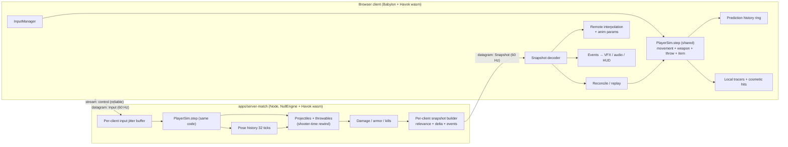
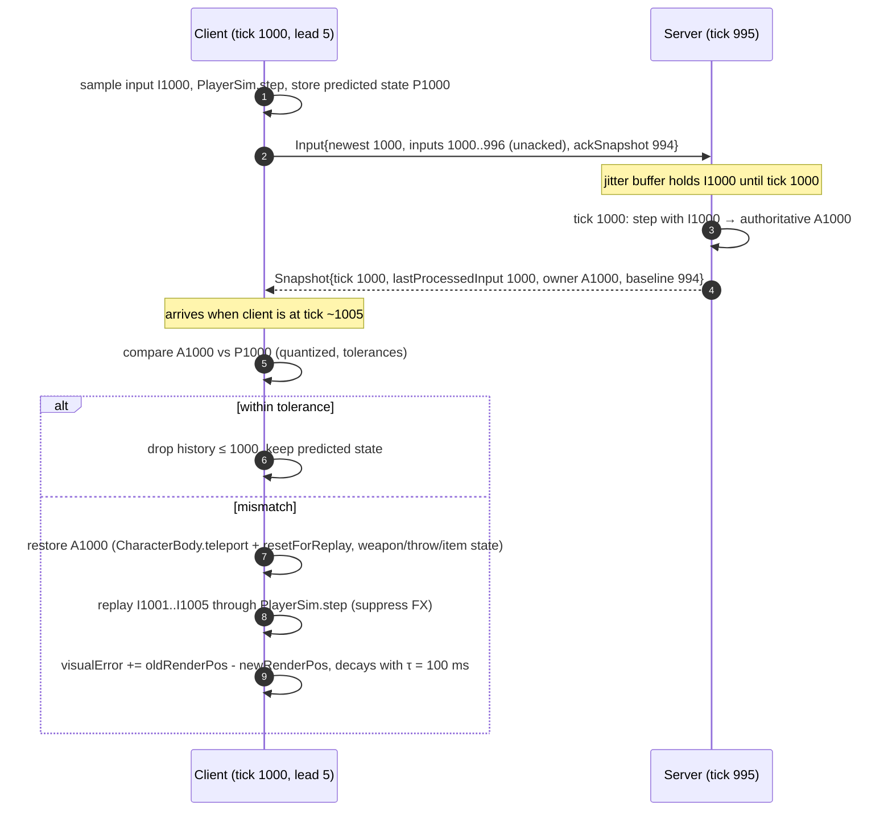
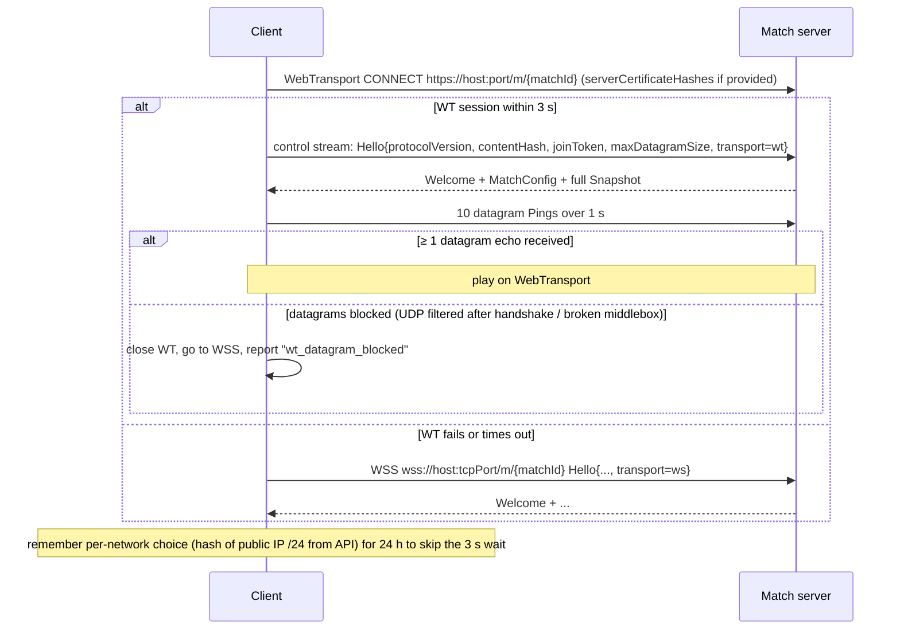
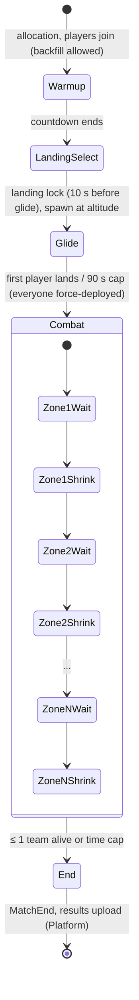

# twobullets netcode design

- Owner: Netcode Architect. Status: proposal for the Principal Architect to merge with [platform.md](platform.md) and the Runtime doc.
- Date: 2026-09-14. Browser and library facts were researched on this date; see §17 for sources.
- ADR numbers **0200–0299** (`docs/backend/adr/02NN-*.md`) avoid collisions with Platform (0100–0199) and Runtime. The Principal may renumber them.
- Benchmarks: `tools/bench/netcode/` (§15). Every size and cost quoted as "measured" comes from those scripts on this machine (Apple Silicon, Node 24.19).

---

## 0. Summary

| Topic | Decision | Key numbers |
|---|---|---|
| Authority | Server-authoritative. The server runs the **same TypeScript tick** as client prediction: `computeDesiredVelocity` + Havok `CharacterBody`, `stepWeapon`, `stepProjectiles`, plus new pure steps for glide, throwables and item use. **No player-vs-player movement collision.** [ADR 0201](adr/0201-server-authoritative-shared-simulation.md) | Client and server worlds are both "static level only" for movement, so prediction errors come only from cross-engine float noise and late or lost inputs |
| Rates | Sim **60 Hz**. Input **60 Hz** datagrams with redundancy. Snapshots **60 Hz** per client, adaptive down to 30/20 Hz. [ADR 0202](adr/0202-tick-and-send-rates.md) | Δ = 16.67 ms |
| Bandwidth (measured, 10 players) | Bit-packed, quantized, delta against the last acked snapshot | Combat **~105 B/snapshot** (p95 135 B) → **~80 kbps down** per client over WebTransport IPv4. Glide ~85 kbps. Upstream **~45 kbps**. Budget: 160 kbps down p99, 64 kbps up |
| Prediction | Input sequence = client tick. The server acks the last processed input in every snapshot. Replay only on mismatch; corrections are smoothed. | Replay if position error > 1 cm, velocity error > 5 cm/s, or any discrete mismatch. Visual error decay τ = 100 ms; snap if > 1 m. Replay cap 20 ticks |
| Remote players | Snapshot interpolation with an adaptive delay. Dead reckoning for ≤ 100 ms, then hold. | Delay = interval × (1 + loss cushion) + 2.5σ jitter, floor 25 ms. Typically **25–50 ms at 60 Hz** |
| Hit registration | **Server-simulated projectiles with a shooter-time rewind:** each tick every bullet segment is tested against hitboxes as they were `D` ms earlier, where `D` is the shooter's view delay. Pellets come from the shared seeded RNG. [ADR 0205](adr/0205-projectile-lag-compensation-shooter-time-rewind.md) | **Max rewind 200 ms** (full favor-the-shooter up to ~150 ms RTT). History 32 ticks. Measured **0.13 ms/tick for 150 bullets in flight** (excluding the Havok world ray) |
| Hitboxes | **Procedural shapes** from replicated pose inputs (feet, yaw, pitch, stance), shared by server, client prediction and debug draw. Sizes mirror the client's new bone-driven `SOLDIER_HITBOXES` table; posing is not bone-driven. [ADR 0206](adr/0206-procedural-capsule-hitboxes.md) | 13 shapes; 24 B of history per player per tick (7.7 KB for 10 players × 32 ticks) |
| Protocol | Hand-rolled bit packing over `Uint8Array` with shared codecs; three reliability tiers. [ADR 0204](adr/0204-bitpacked-delta-snapshot-protocol.md) | A full 10-player snapshot is 220 B bit-packed vs 414 B float32 struct vs 1,826 B JSON. Delta ~105 B. deflate saves 3–4%, so don't |
| Transport | **WebTransport** (HTTP/3 datagrams + one control stream) primary, **WebSocket (WSS)** fallback with the same message format. No WebRTC. [ADR 0203](adr/0203-webtransport-primary-websocket-fallback.md) | WebTransport is Baseline since Safari 26.4 (March 2026) |
| Relevance and anti-ESP | Teammates always; enemies only when potentially visible (server LOS with lookahead, smoke-aware) **or audible**. Audible-only enemies are sent at reduced precision. [ADR 0207](adr/0207-visibility-and-audibility-relevance.md) | Phased: all-relevant in M3/M4, culling in M5 |
| Throwables and equipment | Pure injected-raycast `stepThrowables`, predicted for the thrower, event plus local sim for others, server corrections at 10 Hz. Area effects are analytic events with lifetimes. Inventory is owner-only, versioned deltas. | +2–4 kbps average, ≤ 15 kbps in a grenade-heavy burst |

The two things that matter most for competitive feel are **60 Hz snapshots** (about 25 ms less peeker's advantage than 30 Hz, §5.4) and **keeping the client's movement world identical to the server's** (no player collision, no moving level geometry without replication), so reconciliation almost never fires.

---

## 1. Authority model

### 1.1 What runs where



| Component | Server (authority) | Local client (prediction) | Remote client view |
|---|---|---|---|
| `computeDesiredVelocity` + `CharacterBody` (Havok CC: `checkSupport`, `integrate`, `tryStepUp`, `snapToGround`, `canStand`) | Full, every player, 60 Hz | Full, own player only; replayed on correction | Not run. Interpolated kinematic proxy |
| Glide (`computeGlideVelocity`, new) | Full | Full | Interpolated |
| `stepWeapon` (fire rate, reload, ADS, bloom, spread RNG from `shotCounter`) | Full | Full; replayed on correction | Derived from state bits + events |
| `stepProjectiles` + hit tests | Authoritative, rewound hitboxes | Cosmetic: tracers, world impacts, *predicted* hits (no damage) | Cosmetic tracers from `Shot` events |
| `stepThrowables` (new) | Authoritative | Predicted for own throws | Local sim from `ThrowStart`, corrected at 10 Hz |
| `computeDamage`, armor, health, kills, zone damage, heals | Authoritative | HUD from owner block; never predicted | From snapshots/events |
| Loot, inventory, match phase, zone | Authoritative | Owner inventory from versioned deltas; zone computed locally from phase params | Same |

**How much Havok runs on the server:** all of `CharacterBody.step` for every player, the static level (and later the terrain heightfield) as Havok bodies for character queries and world ray casts, and nothing else. Player hitboxes are **not** Havok bodies on the server (see §5.3 and ADR 0206). That avoids the ANIMATED-body caveat in `HavokRaycaster.ts` ("moving hitboxes are queried as of the last rendered frame"), which would otherwise add a one-tick hitbox lag and make rewinding impossible without stepping the physics world.

### 1.2 Determinism boundaries

We **never require bitwise determinism between client and server.** The server is the authority and sends enough state for the client to restart from it exactly.

| Layer | Bitwise-identical client vs server? | Why | Consequence |
|---|---|---|---|
| Integer/boolean logic (phases, ammo, counters, timers in ticks) | Yes | Pure integer transitions | Exact comparison in reconciliation |
| Float maths in pure TS (`computeDesiredVelocity`, `stepWeapon`, `buildShot`, ballistics) | Same JS engine: yes. V8 (Node) vs SpiderMonkey/JavaScriptCore: **not guaranteed** | ECMA-262 marks `Math.sin/cos/tan/hypot/...` as *implementation-approximated* [(spec)](https://tc39.es/ecma262/#sec-math.sin). Chrome/Edge share V8 with Node; Firefox and Safari may differ in the last ULP. | Sub-µm differences in aim or velocity. Tolerances in §3.4 absorb them. If a Firefox/Safari correction rate shows up in telemetry, ship a small deterministic `dmath` (fdlibm port) in `packages/shared` |
| Havok wasm | Same binary + same world + same call order: in practice yes. Otherwise no | wasm floats are IEEE-754 deterministic (except NaN payloads), but the CC also runs Babylon JS (`PhysicsCharacterController`), and the client world differs whenever anything dynamic differs | Keep the movement world static and identical (no player-player collision, §1.3) |
| `PhysicsCharacterController` internal state | **No, not captured by our state** | It keeps private `_manifold`, `_lastDisplacement`, `_lastVelocity`, `_lastInvDeltaTime` (see `characterController.d.ts`). `setPosition` doesn't reset them. | Replay must call a `resetForReplay()` that clears the manifold and last-step values (a small subclass or patch in `packages/sim`), on client **and** server after teleports. Verify with the M3 replay-consistency test (§11.4) |
| Remote entities on the client | No | Interpolated in the past, quantized | Never used for movement; cosmetic-only hit prediction |

**Replays (Platform Q5):** re-simulating from input logs is feasible on the **same server build, same Node version**, because the whole server sim (TS + Havok wasm) runs in one engine. Cross-architecture (x64 vs arm64) is *likely* identical because V8's `Math` uses its own fdlibm port and wasm is portable, but that is unproven. Record inputs plus 10 s keyframes (full server state) so replay and killcam fall back to keyframe + resim if a mismatch is detected (hash the state every second in the log).

### 1.3 No player-vs-player movement collision

In the current client, dummies have a solid blocker capsule. For networked players we **don't** add remote players to the movement query world:

- Otherwise the client collides with remote players' *interpolated past* positions while the server uses *present* positions. Every body contact becomes a misprediction and a rubber-band, which is the classic source of "stuck on teammate" jitter.
- It also removes body-blocking exploits in doorways.
- Optional later: a **soft separation** applied server-side after the movement step (push overlapping capsules apart at ≤ 1.5 m/s). It shows up as rare, small corrections only while overlapping.

Bullets and grenades still hit players (grenades bounce off the world only in v1, §9.2).

### 1.4 Code changes the shared sim needs (found while reading the code)

These are prerequisites for M3. Other engineers own those files, so these are requests, not edits.

| # | Where | Issue | Change |
|---|---|---|---|
| 1 | `apps/client/src/player/CharacterBody.ts` | Client-only, but the server must run it | Move to `packages/sim/src/CharacterBody.ts` (Babylon + Havok, no rendering). Add `resetForReplay()` (§1.2) |
| 2 | `apps/client/src/combat/CombatSystem.ts` `update()` | `modifiers.speedScale` and `allowSprint` are computed **per render frame** from the **render-smoothed** `adsBlend` and fed into the next `MoveInput`. That is frame-rate dependent, so it can't be predicted or replayed, and the server can't trust a client-sent `speedScale` | Compute both **inside the tick** from `WeaponState.adsBlend` (tick value), the active weapon and the input's fire/aim bits. **Remove `speedScale` from the wire**; the server derives it |
| 3 | `PlayerController.update()` | Drops backlog ticks beyond `maxTicksPerFrame`. With networking, the tick number is a clock shared with the server | Drive ticks from `NetClock` (§10). Run up to 5 ticks per frame; if the backlog exceeds 10 ticks, hard-resync the clock instead of silently skipping input ticks |
| 4 | `PlayerController.respawn()`, `killY` | Client-side `Math.random` spawn | Server-owned (match phases, §8) |
| 5 | `CombatSystem.nextProjectileId` | Local counter, so ids differ across machines | `projectileId = slot << 20 \| (shotCounter & 0xFFFF) << 4 \| pelletIndex`. `HitConfirm` references it |
| 6 | `weaponStep.buildShot` | Pellet directions can only be regenerated with the full `WeaponContext` | Export `shotDirections(def, shotId, yaw, pitch, spreadDeg)` so remote clients can regenerate pellets from a `Shot` event (§6.5) |
| 7 | `MoveInput.yaw/pitch` | float64 aim | The client **quantizes its aim before simulating** (yaw 20 bits, pitch 18 bits) so client and server fire exactly the same direction. The camera keeps the unquantized value (difference ≤ 6 µrad, 6 mm at 1 km) |
| 8 | `HavokRaycaster` / `hitboxes.ts`, and the new `targets/SoldierHitboxes.ts` + `soldierRig.ts` (added in parallel while this doc was written) | Hitboxes as ANIMATED Havok triggers following Mixamo bones: 13 shapes (head sphere, neck capsule, chest/abdomen/pelvis boxes, arm and leg capsules) | Networked players use the analytic procedural rig (`packages/netcode/src/hitreg`, ADR 0206). **Keep `SOLDIER_HITBOXES` as the dimensional source of truth**: the procedural rig is fitted to those shapes in the soldier's idle/aim/crouch poses. Offline dummies can keep the bone-driven Havok version, which also serves as the debug reference for the fit |
| 9 | `packages/shared` | Mixes pure code with Babylon (`buildLevel`) | Keep `movement`, `weapons` and new pure modules free of Babylon imports (lint rule `no-restricted-imports`). Babylon-dependent code goes to `packages/sim` (answers Platform Q3 from the netcode side) |

### 1.5 Anti-cheat implications of the model

| Client sends | Server trusts? | Validation / mitigation |
|---|---|---|
| Movement axes, jump/sprint/crouch bits | Yes, as intent | Axes ∈ {-1, 0, 1}; sprint is only honored under server rules (no fire/aim, forward component) |
| `speedScale` | **Not sent** | Derived server-side (§1.4 #2) |
| Aim yaw/pitch | Yes (it has to) | Range checks (pitch ±89°); **aim statistics** (snap angular velocity, time-to-target, recoil-compensation smoothness) go to telemetry for review. Aimbots and no-recoil are detected, not prevented |
| Fire/aim/reload/select bits | Yes, as intent | Server runs `stepWeapon`: rate of fire, ammo, reload time and bolt cycle are enforced, so no rapid fire |
| Spread/pellet directions | **Not sent** | Server recomputes them from `shotCounter`. Caveat: the seed is predictable, so a client cheat can pre-compensate spread ("no-spread"). That's accepted for prediction quality; spread values are modest and aim telemetry covers it |
| View delay `D` for lag comp | Bounded | Clamped to `expectedD ± 2 ticks` and to `MAX_REWIND` (§5.2), which defeats backtracking |
| Tick timing (speedhack) | No | Server consumes **at most 1 input per tick**, plus a token-bucket catch-up of ≤ 6 extra per second (§10.3) |
| Positions / hits / damage | **Never sent** | Authoritative |
| Actions (pickup, use item, throw) | As intent | Distance ≤ 3 m and LOS to loot, inventory rules, phase timers |
| Information exposure (ESP, radar) | n/a | Relevance filtering (§6.7, ADR 0207). Don't send inaudible, invisible enemies; don't broadcast enemy landing choices |

---

## 2. Tick, input and snapshot rates

### 2.1 Server simulation: 60 Hz, no sub-stepping

| Criterion | 60 Hz | 30 Hz + 2× sub-step |
|---|---|---|
| Matches `SIMULATION.tickRate`, weapon timers (`TIMER_EPSILON`, RPM overshoot) and client prediction | Yes, identical code path | Prediction must run the same sub-stepping; input granularity halves (a tap lasts ≥ 33 ms) |
| Projectile segment per tick at 900 m/s | 15 m | 30 m, or 15 m with sub-steps (same cost as 60 Hz) |
| Input latency added by the tick boundary | avg 8.3 ms | avg 16.7 ms |
| CPU | Two full steps per 33 ms either way; sub-stepping saves only the snapshot/relevance work, which is cheap (§2.4) | ≈ same |

So sub-stepping buys nothing except worse input granularity. **60 Hz.** 128 Hz isn't justified for projectile weapons with 350–900 m/s flight times and a browser client whose render loop jitters by several ms. Riot runs 128 Hz for hitscan tactical play ([Riot, Peeking into VALORANT's netcode](https://www.riotgames.com/en/news/peeking-valorants-netcode)).

### 2.2 Input: one datagram per client tick, with redundancy

- The client sends an `Input` datagram right after each local tick. It contains the newest input plus every input **not yet acked** by the server, capped at **6** (100 ms of burst-loss cover).
- Measured sizes (bench): 1 input 15 B, 3 inputs 29 B, 5 inputs 43 B. At typical SEA RTT (20–70 ms per [platform.md §4.1](platform.md)) there are 2–5 unacked inputs.
- Upstream ≈ (35 B payload + 58 B overhead) × 8 × 60 = **~45 kbps**.
- Batching two ticks per datagram at 30 Hz would save ~20 kbps but add 8 ms average input delay. Not worth it.

### 2.3 Snapshots: 60 Hz per client, adaptive

The default is one snapshot per tick. The server lowers a client's rate to **30 Hz** (then 20 Hz) when:

- the client's snapshot loss stays above 10% for 2 s, or
- QUIC congestion is signaled (datagram send queue backs up), or
- the transport is WSS and `bufferedAmount`/the socket write queue exceeds 4 snapshots.

It raises the rate again after 5 s of clean delivery. Warmup uses 30 Hz; landing selection and the end screen use 10 Hz (nothing moves).

### 2.4 Bandwidth maths (measured)

`node tools/bench/netcode/snapshot-codec.mjs` simulates 10 players for 60 s (ADS strafing and rifle bursts, sprinting, crouching, jumps, reloads, one dead player, grenades every ~30 s per player, 25% of shots producing reliable hit/damage events). It encodes a per-recipient snapshot with real ack delays (RTTs 30–200 ms, 2% downstream loss), decodes it, and verifies every field (**0 mismatches**).

Per-packet overhead:

- WebTransport datagram over IPv4 ≈ 58 B: IP 20 + UDP 8 + QUIC short header ~11 (8-byte connection ID) + AEAD 16 + DATAGRAM frame type 1 + quarter-stream-id 1 + slack. Add 20 B for IPv6.
- WSS ≈ 77 B, excluding TCP ACKs.

| Scenario | Rate | Mean delta payload | p95 | Full (first/no ack) | **kbps down (WT IPv4)** | kbps down (WSS) |
|---|---|---|---|---|---|---|
| Combat | 60 Hz | 108 B (102 B with dead-reckoned deltas) | 135 B | 226 B | **80** (77) | 89 |
| Combat | 30 Hz | 112 B | 142 B | 230 B | 41 | 45 |
| Combat | 20 Hz | 119 B | 150 B | 232 B | 28 | 31 |
| Glide (10 players at 35–60 m/s) | 60 Hz | 124 B (114 B) | 150 B | 220 B | **87** (83) | 96 |

Byte breakdown at 60 Hz combat: header 11 B, owner block 11.6 B, 9 remote players 79 B (8.8 B each), events 6.5 B.

**20 players (protocol v3, all relevant):** `packages/protocol/test/sizes.test.ts` (`PROTOCOL_SIZES=1`) measures combat delta mean 197 B, p95 227 B, p99 239 B, full 378 B (max 431 B, under the 1000 B cap) → **123 kbps** down over WT IPv4 (p99 143), 132 kbps over WSS, inside the 160 kbps budget before M5 relevance culling. Slots and team ids are 5-bit fields (20 entity slots, 20 teams in solo); Welcome carries `teamSize` and `maxPlayers`.

Budgets to design against (per client):

| Direction | Typical | p99 budget | Notes |
|---|---|---|---|
| Down | 80–90 kbps | **160 kbps** | Worst-case extras: 9 enemies full-auto (105 `Shot` events/s × 8.5 B = +7 kbps), 10 live grenades (+8 kbps), loot resync (one 20 KB burst on the stream) |
| Up | 45 kbps | **64 kbps** | 6 redundant inputs max |
| Per match server egress | 10 × 85 kbps ≈ 0.85 Mbps | 1.6 Mbps | 12-min match ≈ **75 MB** egress (answers Platform Q6 / replaces A5) |

Server CPU for encoding (prototype, unoptimized JS with per-snapshot allocations): **~2 µs per client per snapshot**, decoding ~2.3 µs. 10 clients × 60 Hz = 0.12 ms of every 16.7 ms tick.

---

## 3. Client prediction and reconciliation

### 3.1 Tick numbering and acks

- **Tick number = input sequence number.** The client simulates tick `T` with input `I[T]` and sends `I[T]` tagged `T`. The server simulates its tick `T` with `I[T]`.
- The client runs ahead of the server by `lead ≈ RTT/Δ + inputBufferTarget` ticks (§10), so its input for `T` arrives just before the server simulates `T`.
- Wire ticks are u16 (wrap every 18.2 min) and are unwrapped against the last known u32 tick (nearest-value rule).
- Every snapshot carries `lastProcessedInputTick` for the recipient, so the client knows which predicted tick the owner block corresponds to. Snapshot tick `S` and input tick are the same clock: the owner state in snapshot `S` is the result of simulating input `S`. If input `S` never arrived, the server repeated the previous input; `lastProcessedInputTick < S` tells the client its own input wasn't used.

Client history ring (128 ticks): `{tick, input, moveState, feet, weaponState, throwState, itemState, rngCheck}`, about 200 B per entry.

### 3.2 Sequence



### 3.3 Reconciliation algorithm

```ts
// apps/client/src/net/Prediction.ts (sketch)
onOwnerState(s: OwnerState /* tick = s.tick */) {
  const p = history.get(s.tick);
  if (!p) return hardReset(s);                              // too old or never predicted
  if (withinTolerance(p, s)) { history.dropThrough(s.tick); return; }

  const before = sim.renderFeet();                          // what the player sees right now
  sim.restore(s);                                           // teleport CC + resetForReplay, copy Move/Weapon/Throw/Item state
  const n = currentTick - s.tick;
  if (n > MAX_REPLAY_TICKS /* 20 */) { history.clear(); return; } // snap: server state + extrapolate nothing
  for (let t = s.tick + 1; t <= currentTick; t++) {
    const e = history.get(t)!;
    const r = sim.step(e.input, { replay: true });           // no FX, no audio, no shots re-emitted
    e.state = r;                                             // rewrite predicted states for the next comparison
  }
  smoothing.add(before.subtract(sim.renderFeet()));         // §3.5
  metrics.correction(s.tick, errorMagnitude);
}
```

### 3.4 Misprediction thresholds

Compare the **quantized** owner state (mm position, 1 mm/s velocity) with the predicted state quantized the same way:

| Field | Tolerance | Reason |
|---|---|---|
| Position | 10 mm | Well above quantization (±0.5 mm) and cross-engine float noise. Below 1 cm nobody can see it, and it doesn't accumulate: the next mismatch above 1 cm restores exact server state |
| Velocity | 0.05 m/s per axis | Walk acceleration is 70 m/s² = 1.17 m/s per tick, so 5 cm/s is < 5% of one tick of change |
| `grounded`, `stance`, `sprinting`, `jumpHeld`, moveMode | exact | Discrete |
| `coyoteTimer`, `jumpBufferTimer`, `groundIgnoreTimer` | ±1 tick | Carried in ticks |
| Weapon `activeIndex`, `phase`, magazine, reserve, `shotCounter` | exact | |
| Weapon `phaseTimer`, `cooldown` | ±1 tick | Cooldown carries a fractional overshoot; sent in 1/64-tick units |
| `bloom`, `adsBlend` | ±0.02° / ±0.02 | Floats |
| Throw state, item-use phase | exact phase, ±1 tick timers | |

Health, armor durability and boost are **not predicted** and so never trigger replays.

### 3.5 Smoothing corrections

- Physics state snaps; **rendering** smooths. `visualOffset` (vec3) is added to the interpolated camera/body position and decays exponentially: `offset *= exp(-dt/0.1)` (τ = 100 ms, 95% gone in 300 ms).
- If `|offset| > 1 m`, drop it and snap. Big corrections are server truth (teleport, knockback, stuck); lying about them for 300 ms is worse in a competitive game.
- **Vertical** offsets ≤ 0.35 m reuse the existing camera `stepOffset` path in `PlayerController.updateCamera`, which already eases step-ups.
- Never smooth **aim**. The server never corrects aim, because the client owns yaw/pitch.

### 3.6 Weapon-state prediction

`stepWeapon` is pure and seeded only by `shotCounter`, so prediction is exact whenever the input stream matches:

- **Firing:** the client fires on its tick: muzzle flash, recoil kick (`kickAim`), tracer, ammo decrement and spread from `createRng(shotCounter)`. When the server processes the same input tick it produces the **same pellet directions**, because aim is quantized identically (§1.4 #7).
- **Reload/equip:** predicted phase and timers. The server's `reloadFinished` is implicit in the owner block (magazine value).
- **Misprediction cases:**
  - Server dropped the input (shots never happened): the owner block shows a lower `shotCounter`/higher magazine. Restore and replay; the HUD ammo counter jumps back. Already-shown tracers can't be recalled, but they never confirm hits.
  - Server fired but the client didn't (should be impossible; indicates a bug): replay emits nothing and the HUD corrects.
- **Replay suppression:** `PlayerSim.step(input, {replay: true})` returns shots and events without notifying observers. Shots whose `shotId ≤ lastEmittedShotId` are never re-emitted.
- **Recoil** needs no replication: the kick is already in the next input's aim.

### 3.7 Replay cost

The only expensive part is `CharacterBody.step` (Havok shape casts). At 60 Hz with RTT 60 ms plus a 1-tick buffer, a replay covers ~5 ticks; at 150 ms, ~11. With the thresholds above, replays should be rare on a static world (target < 1 per minute at the "typical" network profile, §11). **Runtime to confirm** `CharacterBody.step` cost in browser and Node. Client replay budget is ≤ 2 ms per frame; `MAX_REPLAY_TICKS = 20`.

---

## 4. Remote players

### 4.1 Interpolation buffer and jitter

Client clock (§10): `serverTimeEstimate(now)` in ticks. Remote entities render at

```
renderTick = serverTimeEstimate(now) - interpDelayTicks
interpDelay = snapshotInterval × (1 + lossCushion) + 2.5 × σ_arrival + 1 ms
  snapshotInterval = 16.7 ms at 60 Hz
  lossCushion      = 1 when downstream loss over the last 2 s > 1%, else 0
  σ_arrival        = std-dev of (arrivalTime − tick×Δ − offset) over the last 2 s
  clamp [25 ms, 150 ms]; grows immediately, shrinks by at most 1 ms per 100 ms (no audible time-warp)
```

Typical values: good network (σ 3 ms, no loss) **25 ms**; typical Wi-Fi (σ 6 ms, 1–2% loss) **~50 ms**; bad (σ 20 ms) ~85 ms.

- **Sampling:** for `renderTick` between snapshots A and B, use a cubic Hermite for position with each snapshot's velocity as tangent (smooth at 60 Hz without overshoot) and shortest-arc lerp for yaw/pitch. Discrete fields (stance, weapon, phase) switch at B's tick.
- **Buffer:** a ring of the last 32 decoded snapshots per client, indexed by tick. Duplicates and older-than-render snapshots are ignored for interpolation. An out-of-order snapshot that is still ahead of `renderTick` is inserted; the jitter buffer *is* this delay.

### 4.2 Extrapolation limits

- If `renderTick` passes the newest snapshot, dead-reckon with the last velocity (gravity only if `grounded = false`) for up to **100 ms**, then hold position. At 250 ms of silence, show the player as "lagging" (subtle); after 1 s, show a "connection interrupted" UI for the local player.
- When data resumes, blend from the extrapolated pose to the interpolated pose over 100 ms.
- Extrapolated remote positions are **never** used for server hit registration. They only affect what the shooter sees, and rewind uses the snapshot ticks the client actually rendered (§5.2).

### 4.3 Animation state replication (Mixamo locomotion blender)

The asset pipeline gives per-clip `rootMotion` speeds (`walk_fwd` 1.84 m/s, `run_fwd` 4.61, `sprint_fwd` 6.91). The remote character controller derives almost everything from snapshot state:

| Anim input | Source | Wire cost |
|---|---|---|
| Locomotion direction and speed (8-way blend) | Replicated velocity rotated into body yaw; playback speed = `|v| / clip.rootMotion` | in `vel` group (30 bits when changed) |
| Stance stand/crouch (prone later) | `flags.stance` | 2 bits |
| Grounded / jump / fall / land | `flags.grounded` + `vy` sign; land on grounded rising edge | 1 bit |
| Freefall / parachute | `flags.moveMode` | 2 bits |
| Sprint | `flags.sprint` | 1 bit |
| Upper-body aim offset (pitch additive, yaw twist within ±60° of body; body turns in place beyond that) | `yaw` (12 bits), `pitch` (10 bits) | 22 bits when changed |
| ADS pose | `flags.ads` | 1 bit |
| Active weapon / holster | `flags.weaponSlot` + equipment group (weapon ids in slots) | 2 bits |
| Fire (muzzle flash, recoil anim, gunshot audio) | `shots` counter low byte: play `min(Δ, 3)` fire anims; exact timing from `Shot` events when present | 8 bits |
| Reload / equip / bolt / item use (bandage, drink) with correct normalized time | `flags.weaponPhase` or `actionKind` + `phaseStart` tick: `t = (renderTick − phaseStart) × Δ / clipDuration` | 16 bits on change |
| Grenade cook (pin pulled) and throw | `flags.cooking` rising edge; `ThrowStart` event | 1 bit |
| Hit reaction | `PlayerHit` unreliable event (zone, direction) | 3 B |
| Downed / death (direction) | `flags.life` + `Kill` event (killer direction) | 2 bits |
| Helmet / vest / backpack visuals | equipment group (levels 0–3 each) | on change |

Nothing in the animation system feeds back into gameplay. Hitboxes come from the same pose inputs via the shared rig (ADR 0206), not from the skeleton.

---

## 5. Hit registration with projectiles

### 5.1 Options considered

| | A. Server projectiles, shooter-time rewind (**chosen**) | B. Client hit claims, server validation | C. Server projectiles, no rewind |
|---|---|---|---|
| What decides a hit | Server segment vs hitboxes at `now − D` | Client says "pellet p hit player X zone Z at tick t"; server re-checks trajectory, rewound hitbox within tolerance, occlusion | Server segment vs present hitboxes |
| Shooter experience | Hits what they saw, within quantization and interpolation error | Exactly what they saw | Must lead by RTT + interp; unplayable for competitive at 60+ ms |
| Cheat surface | Aim only (plus bounded `D`) | Aim + claim fabrication inside tolerance windows; server still needs full history and trajectory | Aim only |
| Server cost | Segment tests per bullet per tick (measured 0.13 ms/tick at 150 bullets) | Similar (validation is a trajectory re-test) plus claim bookkeeping | Lowest |
| Pellets, penetration, ricochet later | Natural | Every pellet needs a claim | Natural |

B is how several browser and older BR shooters got "teleport kills" and silent-aim cheats. Its real advantage (pixel-exact agreement) is mostly gone once the server derives pellet directions from the shared seed and the client quantizes aim. **A** gives the same result without trusting hit data.

### 5.2 Rewind computation and limits

The bullet fired at client tick `T` flies in the shooter's frame of reference:

```
Client at tick T renders remote players at renderTick R (fractional). The shooter "saw" targets as of R.
D = T − R   (ticks, fractional)  ≈ (RTT + inputBuffer + interpDelay) / Δ
Server: bullet spawned at tick T. At server tick T+k the segment [p(k−1), p(k)] is tested
        against hitboxes sampled at (T + k − D).
```

Consequences:

- **History depth depends only on `MAX_REWIND`, not flight time.** A sniper round flying 2.5 s still uses a constant offset `D`. No flight-length hitbox history is needed.
- The client's tracer at flight age `k` is at client tick `T+k` and sees targets at `T+k−D`, so client and server agree for the whole flight.
- **`D` on the wire:** only on inputs with `fire` or `throw` set, as `viewOffset` u8 in 1/8-tick units (0–31.9 ticks). The server clamps it: `D = clamp(claimed, expected − 2, expected + 2) ∩ [0, MAX_REWIND]`, where `expected = (RTT_ewma + inputBufferMs + clientReportedInterpDelay)/Δ` and `clientReportedInterpDelay` is itself clamped to [25, 150] ms. Clamp hits are counted per player (backtrack-cheat telemetry).
- **`MAX_REWIND = 200 ms` (12 ticks)** with the ring sized for 32 ticks (533 ms) so it can be tuned. Full favor-the-shooter is available up to RTT ≈ 200 − 17 − 33 ≈ **150 ms**. Above that the shooter must lead by the excess, which is the right trade for a region with a 90 ms matchmaking limit (Platform §2.2).
- **Victim protection:** a victim can be hit at most `MAX_REWIND + own RTT/2` after reaching cover in their own view. Tuning below 150 ms makes 100 ms players miss moving targets noticeably; above 250 ms makes "died behind cover" common. For reference, Source exposes the same cap as `sv_maxunlag` ([Valve, Latency Compensating Methods](https://developer.valvesoftware.com/wiki/Latency_Compensating_Methods_in_Client/Server_In-game_Protocol_Design_and_Optimization)).

**Edge rules:**

- A shooter who is dead at server tick `T` (input arrived after death) → shot rejected. Bullets **already in flight** when the shooter dies keep going (trade kills are possible, and legitimate).
- A victim who is dead at server *present* time takes no more damage, even if alive at `T+k−D`.
- Invulnerability windows (spawn, landing) are evaluated at present time.
- Friendly fire: off by default; server config.
- Zone kills are server present-time.

### 5.3 Hitbox history storage

- Per player per tick: `feet xyz (float32 ×3), yaw, pitch (float32), stanceBlend (float32)` = **24 B** (life and move mode come from the snapshot history). 10 players × 32 ticks = **7.7 KB**. Capsules are not stored; they are posed lazily.
- Sampling at fractional `t`: lerp between the two surrounding ticks (shortest-arc yaw).
- **Broadphase:** segment vs a vertical bounding capsule (r = 0.62 m, 0.25–1.55 m above feet, crouch-scaled) at the rewound pose. In the benchmark 0.1% of tests overlap.
- **Narrowphase:** pose the rig (`poseHitboxes(pose) → Float64Array`), cached per (shooter, target, tick) because all of a shooter's bullets share `D`. Then analytic ray-capsule / ray-sphere (Quilez `capIntersect`, verified in the bench) and ray-OBB for the three torso boxes, keeping the nearest `t` along the segment. The bench uses 11 capsules; the production rig mirrors the 13 `SOLDIER_HITBOXES` shapes, which costs about the same (boxes are a slab test).
- **World occlusion:** one Havok ray per segment against the static world (already done by `stepProjectiles` via `RaycastFn`). The hit is the nearest of the world hit and the capsule hit. The world isn't rewound (static).
- Why not bone-driven hitboxes on the server (as the client's new `SoldierHitboxes` does for dummies): the server would have to run Mixamo animation for 10 players (69 bones, cross-fades that depend on frame timing). Client and server skeleton poses would diverge anyway, and history would need bone matrices (10 × 32 × 13 × 12 floats). See ADR 0206, which also keeps a baked-per-clip upgrade path that reuses `SOLDIER_HITBOXES`.

### 5.4 Peeker's advantage

Formula after Riot: the peeker sees the holder before the holder sees the peeker by roughly `RTT_peeker/2 + serverInputWait + serverBuffer + serverProcessing + RTT_holder/2 + interpDelay_holder + sendWait + render_holder` ([Riot, Peeking into VALORANT's netcode](https://www.riotgames.com/en/news/peeking-valorants-netcode)).

Both players at 60 ms RTT, a clean network (jitter σ ≈ 3 ms, no loss cushion), 144 Hz displays:

| Component (ms) | 60 Hz snapshots | 30 Hz | 20 Hz |
|---|---|---|---|
| Peeker RTT/2 | 30 | 30 | 30 |
| Server tick boundary wait (avg) | 8.3 | 8.3 | 8.3 |
| Server input jitter buffer (target) | 8 | 8 | 8 |
| Server processing + send | 2 | 2 | 2 |
| Holder RTT/2 | 30 | 30 | 30 |
| Holder interpolation delay | 25 | 41 | 58 |
| Snapshot send wait (avg) | 0 | 8.3 | 16.7 |
| Holder frame + scan-out | 8 | 8 | 8 |
| **Peeker's advantage** | **~111** | **~136** | **~161** |

Mitigations we adopt:

- 60 Hz snapshots.
- Send snapshots immediately after the tick.
- Adaptive (not fixed 100 ms) interpolation delay.
- Input buffer target of 1 tick, adapted.
- Matchmaking RTT limit (Platform: ≤ 90 ms).
- Tick processing budget p99 ≤ 4 ms (Runtime).
- Optional later: move the transport into a Worker so datagram receive isn't delayed by render frames (~4–8 ms at 60–144 fps).

### 5.5 Server projectile cost (measured)

`node tools/bench/netcode/lagcomp.mjs` runs 10 strafing players, bullets at 620 m/s aimed near players (a hot-path-heavy case) and per-shooter rewinds of 2–12 ticks:

| In flight | Per projectile-step | Per tick | Pose evals | Hits/s |
|---|---|---|---|---|
| 150 | 838 ns | **0.126 ms** | ~100/s | 26 |
| 600 | 694 ns | 0.417 ms | ~380/s | 91 |

What's excluded: one Havok world ray per projectile-step. At an assumed 5–20 µs (Runtime to measure), 150 bullets cost 0.75–3 ms/tick, which **dominates**.

Realistic in-flight counts:

- Rifle: 700 rpm, 500 m range at 620 m/s → ≤ 0.8 s, so ≤ 9.3 bullets per spraying player.
- Sniper: ≤ 2.5 s, but at 50 rpm.
- Shotgun: 8 pellets × 0.17 s.
- 10 players in a full firefight → ≤ ~120 in flight. Typical is far lower.

Optimizations if needed: skip world rays for segments in open air using a coarse per-cell max height grid; merge the 8 shotgun pellets' world query into one short sweep per tick for their first 2 ticks.

### 5.6 Shotgun pellets and damage events

- The server spawns 8 projectiles from one `FiredShot` (pellet ids 0–7), all with the same `D`.
- Hits are **aggregated per (shotId, victim) per tick** into one `HitConfirm` to the shooter: pellets hit (4 bits), zones mask, total damage (0.1 HP), killed/downed/armor flags. The victim gets one `DamageTaken`.
- `computeDamage` per pellet, then armor (§9.6), then health. Rounded to 0.1 HP as today.

### 5.7 Kill confirmation latency and cosmetic prediction

From click to hitmarker = RTT + tick wait and input buffer (~16 ms) + bullet flight time + snapshot send wait (0 at 60 Hz) + client frame (~7 ms):

| Case (RTT 60 ms) | Flight | Local tracer impact | Server confirm on screen | Confirm lag behind tracer |
|---|---|---|---|---|
| Shotgun 10 m (350 m/s) | 29 ms | 29 ms | ~112 ms | ~83 ms |
| Rifle 50 m (620 m/s) | 81 ms | 81 ms | ~164 ms | ~83 ms |
| Sniper 300 m (400 m/s, ~3.6 m drop) | ~760 ms | 760 ms | ~843 ms | ~83 ms |

The constant ~RTT + 23 ms gap is independent of distance, which is the key property of the shooter-time rewind.

Cosmetic policy:

- **Immediate:** muzzle flash, tracer, world impact decals and dust, local ammo.
- **Predicted but subtle:** a dull "thwack" sound when the local tracer intersects a remote capsule (shared rig, interpolated pose), no blood and no marker.
- **On confirm:** hitmarker, damage number, blood, kill feed. Designers can flip `predictBodyHitFx` for playtests; we default to honesty.
- Kills also arrive as a `Kill` reliable event and in the kill feed.

---

## 6. Protocol

### 6.1 Encoding choice (measured)

| Format | One full 10-player snapshot | Encode | Delta support | Sub-byte quantization | Verdict |
|---|---|---|---|---|---|
| JSON | 1,826 B (deflate 480 B) | 14–28 µs | no | no | Debug/replay tooling only |
| float32 byte-aligned struct (the size class of FlatBuffers / protobuf with float fields) | 414 B | 0.5–1.8 µs | manual | no | Rejected |
| msgpack | ≈ JSON minus keys (not measured, not installed) | — | no | no | Rejected |
| **Hand-rolled bit packing, quantized, with a delta** | **220 B full / ~105 B delta** | ~2 µs per client (unoptimized prototype) | yes, per field group | yes | **Adopt** |

- deflate-raw on the bit-packed deltas saves **3–4%** (measured), so no generic compression on datagrams.
- FlatBuffers/Cap'n Proto are good for zero-copy reads of large structured blobs. Our problem is 100-byte, mostly-unchanged, quantized state, which they don't address.
- The schema lives in TypeScript codecs in `packages/protocol`, shared by client, server and bots. A codec fuzz/roundtrip test is a CI gate.

### 6.2 Channels and reliability tiers

| Tier | Carrier (WebTransport) | Carrier (WSS fallback) | Used for |
|---|---|---|---|
| **U: unreliable, latest wins** | Datagrams | WS binary message (the server drops stale snapshots when the send queue backs up) | `Input`, `Snapshot` state, `Shot`, `PlayerHit`, `AudioShot`, throwable corrections |
| **R: reliable-over-unreliable** (resend in every snapshot until an acked snapshot contains it; client dedups by 12-bit event seq) | Inside `Snapshot` datagrams | Same | `HitConfirm`, `DamageTaken`, `Kill`, `ThrowStart`, `Detonate`, `AreaEffectStart/End`, `InventoryDelta`, `LootDelta`, `ZoneWarning` |
| **S: reliable ordered stream** | One bidirectional stream ("control"), length-prefixed | Same WS, type-tagged | `Hello`/`Welcome`, `MatchConfig`, `PhaseChange`, `LandingSelect`/`TeamMarker`, `ZonePhase`, `InventorySnapshot`, `LootResync`, `KillFeed`, `MatchEnd`, `Resync`, pings/markers |

- Tier R avoids head-of-line blocking: a lost hit confirm is resent in the next snapshot (≤ 17 ms later), not stalled behind a TCP-style retransmit on a stream.
- Client actions (pickup, use, drop, throw-cancel) ride the **input** redundancy: an action stays in every input packet until the server's `lastProcessedInputTick` covers it. That makes upstream actions reliable without a stream.
- After the first 2 sends, R events resend every 2nd snapshot to halve the multiplier at high RTT.

### 6.3 Quantization

| Quantity | Encoding | Range | Precision | Bits |
|---|---|---|---|---|
| Position x, z | unsigned mm, offset −24 m | [−24, 1024.6) m | 1 mm | 20 each |
| Position y | unsigned mm, offset −12 m | [−12, 512.3) m | 1 mm | 19 |
| Position delta (vs baseline) | zigzag, shared bucket for the vector: 2-bit class {±127 mm, ±2047 mm, ±32767 mm, absolute} | | 1 mm | 2 + 3×{8,12,16} or 59 |
| Remote yaw | uniform | [0, 2π) | 0.088° | 12 |
| Remote pitch | uniform | ±89° | 0.174° | 10 |
| Remote velocity | zigzag, 0.125 m/s | ±64 m/s | | 10 each |
| Owner velocity | zigzag, 1 mm/s | ±65.5 m/s | | 17 each |
| **Input aim** yaw / pitch | uniform | [0, 2π) / ±89° | 6.0 µrad / 11.8 µrad (6 mm / 12 mm at 1 km) | 20 / 18 |
| `Shot` event aim | uniform | | 96 µrad (tracer only) | 16 / 16 |
| Health, damage | 0.1 HP | 0–102.3 | matches `computeDamage` rounding | 10 / 11 |
| Timers | ticks | | 1 tick | 4–9 |
| Weapon cooldown | 1/64 tick | ≤ 2 s | 0.26 ms | 13 |
| Zone center / radius | u16 per axis over 1,024 m | | 1.6 cm | 16 |

Why 1 mm positions: owner reconciliation compares at 1 cm, and at 60 Hz a 1-cm quantum would add visible jitter to slow crouch-walks (3.2 m/s = 53 mm/tick). With deltas, 1 mm costs ~2 extra bits per axis.

### 6.4 Message catalogue

IDs are the first byte of every datagram and every stream frame. Datagram IDs 0x00–0x3F, stream IDs 0x40–0x7F; 0x80+ is reserved for extensions.

| ID | Name | Dir | Tier | Size | Rate |
|---|---|---|---|---|---|
| 0x01 | `Input` | C→S | U | 15–63 B (typ. 35) | 60 Hz |
| 0x02 | `Ping` (datagram echo for RTT when idle / beacon) | both | U | 7 B | 2 Hz in menus |
| 0x10 | `Snapshot` | S→C | U + R events | typ. 105 B, full ~230 B, cap 1,000 B | 60 Hz |
| 0x11 | `SnapshotAudioOnly` (spectator/dead-cam lite) | S→C | U | ~40 B | 20 Hz |
| 0x40 | `Hello` | C→S | S | ~260 B (JWT) | once |
| 0x41 | `Welcome` | S→C | S | 40 B | once |
| 0x42 | `MatchConfig` | S→C | S | ~120 B | once per phase load |
| 0x43 | `PhaseChange` | S→C | S | 12 B | per phase |
| 0x44 | `LandingSelect` | C→S | S | 5 B | ≤ 4 Hz while choosing |
| 0x45 | `TeamMarker` | S→C (team only) | S | 8 B | on change |
| 0x46 | `ZonePhase` | S→C | S | 27 B | per zone phase |
| 0x47 | `InventorySnapshot` | S→C | S | ≤ 120 B | spawn/resync |
| 0x48 | `LootResync` | S→C | S | ≤ 24 KB, chunked 4 KB | rare |
| 0x49 | `KillFeed` | S→C | S | 12 B | per kill |
| 0x4A | `MatchEnd` | S→C | S | ~200 B | once |
| 0x4B | `Resync` (request/response: full state, baseline reset) | both | S | 2 B / full | rare |
| 0x4C | `Resume` (session resume token) | C→S | S | 36 B | reconnect |
| 0x4F | `Disconnect` (reason code) | both | S | 3 B | once |

### 6.5 Layouts

Bit order is LSB-first within bytes; multi-bit fields are little-endian. "b" = bits, "B" = bytes.

**`Input` (0x01)** header, 68 bits:

| Field | Bits | Notes |
|---|---|---|
| type | 8 | 0x01 |
| newestTick | 16 | client tick of the first input in the list |
| ackSnapshotTick | 16 | newest snapshot received (drives delta baselines and R-event acks) |
| clientTimeMs | 16 | `performance.now()` mod 65536, echoed by the server for RTT |
| interpDelayMs/2 | 8 | 0–510 ms, used for the expected-`D` check |
| count | 4 | 1–6 inputs, newest first (ticks newestTick, newestTick−1, …) |

Per input: 1 bit when identical to the next-newer input, otherwise 19–85 bits (typically 57 with aim changed):

| Field | Bits |
|---|---|
| sameAsNext (all fields equal to the next-newer input) | 1 → if set, stop |
| forward axis (0 = −1, 1 = 0, 2 = +1), right axis | 2 + 2 |
| jump, sprint, crouch, fire, aim, reload, interact, altThrow (underhand) | 8 |
| select (0 none, 1–15 quick slot) | 4 |
| aimChanged → yaw, pitch | 1 → 20 + 18 |
| fire or throw set → viewOffset (1/8 tick) | 8 |
| hasAction → actionType (pickup, drop, use, cancel, equipAttach, …), actionArg (lootId / slot, qty) | 1 → 4 + 16 |

**`Snapshot` (0x10)** header, 12 B:

| Field | Bits |
|---|---|
| type 0x10 | 8 |
| serverTick | 16 |
| baselineTick (0xFFFF = none) | 16 |
| lastProcessedInputTick (recipient) | 16 |
| clientTimeEcho (from newest input received) | 16 |
| serverHoldMs (receipt of that input → this send) | 8 |
| inputBufferDepth (signed, quarter ticks; time dilation feedback) | 8 |
| sections present: owner, entities, shots, reliable, throwables, zone/loot version | 8 |

Owner block (delta against baseline; each group has a "changed" bit), typically 12 B:

| Group | Bits |
|---|---|
| position (delta buckets) | 1 + 2 + 3×{8,12,16} or 59 |
| velocity (1 mm/s) | 1 + 51 |
| move flags: stance 2, grounded, sprinting, jumpHeld, moveMode 2, coyote 4, jumpBuffer 4, groundIgnore 4 | 1 + 19 |
| weapon core: phase 2, activeIndex 3, phaseTimer 9 (ticks), cooldown 13 (1/64 tick), triggerHeld 1, bloom 8, adsBlend 8, shotCounter 16 | 1 + 60 |
| ammo per slot (mag 7, reserve 9) × slots | 1 + 16×n |
| vitals: health 10, boost 7, helmetDur 7, vestDur 7, flashedTicks 8 | 1 + 39 |
| throw/item phase: kind 4, phase 3, timer 9, throwCounter 8 | 1 + 24 |
| inventoryVersion | 1 + 8 |

Remote entity list (per potentially relevant slot):

| Field | Bits |
|---|---|
| presence: 0 absent, 1 full relevance, 2 audible-only, 3 removed | 2 |
| full: changed bit, then groups (each with its own changed bit if a baseline exists): position, yaw 12, pitch 10, velocity 30, flags 18 (stance 2, moveMode 2, grounded, sprint, ads, weaponSlot 2, weaponPhase/actionKind 2, life 2, helmet 2, vest 2, cooking), health 10, shots 8, phaseStart 16, equipment 24 (slot weapon ids 4×3, backpack 2, suppressor/attachments 6, reserved 4) | typ. 70 when moving |
| audible-only: position at 0.5 m (11+10+11), noise class 3, stance 2 | 37 |

Events:

| Event | Tier | Bits | ≈ B |
|---|---|---|---|
| `Shot` {shooter 4, weapon 3, shotCounter 16, tickOffset 2, yaw16, pitch16, spread u8 (0.05°)} | U, send once | 65 | 8 |
| `AudioShot` {pos 1 m 10+9+10, weapon 3, suppressed 1} (audible but not visible shooter) | U | 33 | 4 |
| `PlayerHit` {victim 4, zone 2, armor 1, dirYaw 5} (bystander FX within 50 m) | U | 12 | 2 |
| `HitConfirm` {seq 12, type 5, victim 4, pellets 4, zones 3, damage 11, killed, downed, armorHit, armorBroken} | R | 43 | 6 |
| `DamageTaken` {seq, type, attacker 4, dirYaw 8, amount 11, zone 2, source 3} | R | 45 | 6 |
| `Kill` {seq, type, killer 4, victim 4, weapon 5, headshot, distance 10} | R | 41 | 6 |
| `ThrowStart` {seq, type, thrower 4, kind 3, throwId 8, origin 59, vel 3×12 (0.05 m/s), fuse 9, tickOffset 4} | R | 140 | 18 |
| `ThrowableState` {throwId 8, pos 59 or delta, vel 36, resting 1, bounced 1} (10 Hz or on bounce) | U | ~70–106 | 9–13 |
| `Detonate` {seq, type, throwId 8, kind 3, pos 59} | R | 87 | 11 |
| `AreaEffectStart` {seq, type, effectId 8, kind 3, center 59, radius u8 (0.05 m), seed 16, startTickOffset 4, duration 12} | R | 127 | 16 |
| `AreaEffectEnd` {seq, type, effectId 8} | R | 25 | 4 |
| `InventoryDelta` {seq, type, version 8, slot 6, itemType 8, qty 10} | R | 49 | 7 |
| `LootDelta` {seq, type, lootId 16, op 2, [itemType 8, qty 10, pos 59]} | R | 35 / 112 | 5 / 14 |
| `ZoneWarning` {seq, type, phase 5, secondsLeft 8} | R | 30 | 4 |

`Welcome` (0x41), 40 B:

| Field | B |
|---|---|
| type | 1 |
| playerSlot, teamId | 1 |
| serverTick (u32) | 4 |
| tickRate, snapshotRate | 2 |
| matchSeed (u32) | 4 |
| phase + phaseEndTick | 5 |
| maxRewindMs/4, interp floor | 2 |
| resumeToken (HMAC-SHA256/128) | 16 |
| contentHash echo | 4 |
| flags | 1 |

### 6.6 Delta compression and baselines

- Each client acks its newest received snapshot in every `Input`. The server keeps a **ring of the last 128 snapshot ticks** it sent per client (quantized owner + entity state + event seqs) and encodes against the newest acked one. With no usable ack (join, >2.1 s outage), it sends a full snapshot.
- The client keeps decoded snapshots for 128 ticks, indexed by tick.
- Field groups carry a changed bit; positions use the vector bucket code (§6.3).
- **Dead-reckoned position deltas** (predict the baseline forward with its quantized velocity) saved 6% in combat and 8% in glide (measured). Ship plain deltas in M3 and add the predictor in M5 if bandwidth matters; it's a codec-internal change behind the protocol version.
- **Entity baselines:** an entity that becomes relevant again after absence is encoded as full (never against a baseline that didn't contain it).
- **Size cap:** the snapshot payload must stay ≤ min(1,000 B, `maxDatagramSize` reported in `Hello`). When over the cap, the builder drops sections in this order: extra `Shot` events (U, oldest first), `PlayerHit`, audible-only entities (sent next tick), then far entities. R events and the owner block are never dropped. Measured max in combat was 244 B, so this is a safety net.

### 6.7 Priority and relevance

With 10 players, bandwidth doesn't force culling. Information hiding does (ADR 0207):

| Class | Rule | Phase |
|---|---|---|
| Self | Owner block always | M3 |
| Teammate | Always full | M3 |
| Enemy potentially visible | Full. Server LOS test at 20 Hz per (viewer, enemy): rays from the viewer's eye, and from the eye extrapolated 150 ms along the viewer's velocity, to 5 points on the enemy's bounding capsule, against the Havok world plus analytic smoke spheres. Visible if any ray is clear, if within 15 m, or if visible in the last 500 ms (hysteresis) | M5 |
| Enemy audible only | Audible-only form (0.5 m position, noise class, stance) when the enemy's current noise radius (§10.2) covers the viewer | M5 |
| Enemy neither | Absent (a "removed" presence code once, then nothing) | M5 |
| Glide phase | Everyone full (sky is open) | M5 |
| Spectating a teammate | Relevance computed from the **spectated** player's viewpoint | M5 |
| Projectiles | Never replicated per tick; `Shot` event only to viewers for whom the shooter is visible or audible (else `AudioShot` or nothing) | M4 |
| Throwables | `ThrowStart` + corrections to viewers within 150 m or with LOS to the grenade; `Detonate` to everyone within 300 m | M5 |
| Area effects | Smoke/fire to everyone (visual obstruction at distance matters) | M5 |
| Loot | Initial layout from `matchSeed` (0 B); `LootDelta` to all (low rate) | M5 |
| Zone | Phase parameters to all | M5 |

LOS cost: 90 viewer-enemy pairs × ≤ 10 rays at 20 Hz = up to 300 Havok rays/tick worst case, early-out on first clear ray. **Runtime to include in the tick budget.** Cap at 150 rays/tick by round-robin, never dropping a pair below 10 Hz.

### 6.8 Versioning (Platform Q8)

- `PROTOCOL_VERSION` (u16) is bumped on any wire change. `contentHash` (u32) is a hash of gameplay tuning (`MOVEMENT`, `WEAPONS`, `BALLISTICS`, throwable/item defs), generated at build time into `packages/protocol/src/version.ts`.
- **Exact match only, per match.** Prediction requires identical tuning, so N/N-1 compatibility would mean shipping two simulations. A server build supports exactly one `(PROTOCOL_VERSION, contentHash)`; the allocator pins it (Platform's canary flow already assumes this). A mismatch at `Hello` → `Disconnect{reason: versionMismatch}` → the client reloads.
- Message IDs never get reused. New optional sections use the snapshot "sections present" bits.

---

## 7. Transport

### 7.1 2026 landscape

| | WebSocket (TLS/TCP) | **WebTransport** (HTTP/3 over QUIC) | WebRTC DataChannel |
|---|---|---|---|
| Unreliable delivery | No; TCP head-of-line blocking. A single lost segment stalls every later snapshot until it is retransmitted (about 1 RTT plus the reordering window with fast retransmit, 200 ms+ if recovery falls back to RTO), then they arrive in a burst | Yes: datagrams (RFC 9221/9297) + streams, per-stream HOL only | Yes: SCTP with `ordered:false, maxRetransmits:0` |
| Chrome / Edge | Universal | Since 97 / 98 | Universal |
| Firefox | Universal | Since 114 | Universal |
| Safari (macOS/iOS) | Universal | **Since 26.4 (March 2026)**; datagrams and streams supported ([WebKit blog](https://webkit.org/blog/17862/webkit-features-for-safari-26-4/)) | Universal |
| Global support | All current browsers | ~91% ([caniuse](https://caniuse.com/webtransport)) | All current browsers |
| `serverCertificateHashes` | n/a | Chrome 100+; Firefox's implementation differs from spec ([bug 1873263](https://bugzilla.mozilla.org/1873263)); Safari unclear | n/a (DTLS fingerprints via signaling) |
| Handshake | TCP + TLS: 2–3 RTT | QUIC 1-RTT (0-RTT resumption possible) | ICE + DTLS + SCTP: several RTT plus a signaling channel |
| NAT / firewall | Best (TCP 443) | UDP; complete UDP/443 blocks affect an estimated 3–5% of public networks, and more on corporate/enterprise networks where QUIC is often blocked on purpose ([analysis](https://andrewbaker.ninja/2026/05/02/quic-the-protocol-that-breaks-your-site-without-warning/), [Palo Alto KB](https://knowledgebase.paloaltonetworks.com/KCSArticleDetail?id=kA10g000000ClarCAC)) | UDP with ICE; needs TURN (relay cost) for UDP-blocked networks, and TURN/TLS falls back to TCP anyway |
| Server: Node | `ws`, uWebSockets.js (mature) | `@fails-components/webtransport` (libquiche binding, prebuilds x64 and arm64 Linux/macOS). Its README calls it **"duct tape-style"** until Node has native support, and some datagram options (`maxDatagramSize`, `incoming/outgoingMaxAge`) are unimplemented ([repo](https://github.com/fails-components/webtransport)). Node's own `node:quic` is experimental with **no WebTransport yet** ([Node docs](https://github.com/nodejs/node/blob/main/doc/api/quic.md)) | `node-datachannel` (libdatachannel), geckos.io ([repo](https://github.com/geckosio/geckos.io)) |
| Server: Rust | tokio-tungstenite | `wtransport` 0.7 (pure Rust, "not completely production-ready" per docs) ([docs.rs](https://docs.rs/wtransport)); `web-transport-quinn` (moq-dev, used by Media-over-QUIC) ([repo](https://github.com/kixelated/web-transport)) | webrtc-rs, str0m |
| Server: Go | gorilla/coder websocket | `quic-go/webtransport-go` (draft-16, active releases through Aug 2026, one 2026 memory-exhaustion advisory) ([pkg.go.dev](https://pkg.go.dev/github.com/quic-go/webtransport-go), [advisories](https://advisories.gitlab.com/pkg/golang/github.com/quic-go/webtransport-go)) | pion (mature) |

### 7.2 Decision (Platform Q1)

**Primary: WebTransport** (one session per match: one bidirectional control stream + datagrams). **Fallback: WSS** carrying the same message IDs and codecs (datagram-class messages become WS binary messages; the server drops stale snapshots instead of queueing). **No WebRTC**: now that WebTransport is Baseline, its only advantage is older Safari, and it costs signaling, ICE, TURN and SCTP overhead. ADR 0203.

**Server library risk is the main open item.** The netcode layer is transport-agnostic behind:

```ts
interface ServerTransport {            // apps/server-match/src/transport/
  onSession(cb: (s: Session) => void): void;
}
interface Session {
  readonly kind: "webtransport" | "websocket";
  readonly maxDatagramSize: number;    // 0 for WS (message-sized)
  sendDatagram(bytes: Uint8Array): boolean;          // false = dropped (congestion/backpressure)
  sendStream(bytes: Uint8Array): void;               // length-prefixed control frames
  onDatagram(cb: (bytes: Uint8Array, recvTimeMs: number) => void): void;
  onStream(cb: (bytes: Uint8Array) => void): void;
  close(code: number): void;
}
```

Recommended implementation path (**Runtime decides**):

1. **M3:** WSS + `@fails-components/webtransport` in-process in Node, to prove the model quickly.
2. **M4 soak test.** If the Node binding shows instability, datagram drops under load or p99 send latency > 1 ms, move QUIC termination to a **Rust sidecar per host** (`web-transport-quinn` or `wtransport`). It forwards datagrams to match processes over a Unix domain socket with a 4-byte session header (one QUIC listener on UDP 443 per host, connection-ID/`:path` routing to the match). This also answers Platform's port-model question and lets UDP 443 replace the high port range, which corporate networks often block.

### 7.3 Connection strategy and fallback



- **Region beacons (Platform Q10):** probe over WebTransport datagram echo *and* HTTPS. A UDP failure at probe time pre-selects WSS and skips the 3 s timeout. Queue RTT should come from the datagram echo when available, because it matches gameplay.
- On WSS: set `TCP_NODELAY`; use snapshot rate 30 Hz if the measured TCP retransmit rate is > 1% (fewer stale bursts); interpolation delay floor 50 ms. Players get a small "degraded connection (TCP)" indicator; that's the honest trade.
- `maxDatagramSize`: read `transport.datagrams.maxDatagramSize` on the client and send it in `Hello`. Snapshots are capped at 1,000 B regardless.
- **Workers:** WebTransport and WebSocket are both available in Web Workers. M4 should move receive timestamping and decode into a Worker, so arrival times used for jitter and clock estimation aren't distorted by render frames.

### 7.4 Session resume without a new join token (Platform Q4)

- **WebTransport:** QUIC survives NAT rebinding (passive migration) as long as the server uses non-zero-length connection IDs and nothing between client and server breaks CID routing. Set the QUIC idle timeout to 10 s. A blip of ≤ 5 s needs no new session: the client extrapolates for 100 ms, holds, then gets a full snapshot when acks resume (baseline ring 2.1 s).
- **Session lost (tab still open, either transport):** reconnect with `Resume{matchId, playerSlot, resumeToken, epoch+1}`. `resumeToken` is a 128-bit HMAC issued in `Welcome`, valid 10 s after the last packet, single-use, rotated on every resume. After 10 s, use Platform's join-token reconnect (60 s grace, ADR 0106). The server keeps the player's character in-world (no invulnerability) during both.

---

## 8. Match phases



| Phase | Server sim | Replication | Snapshot rate |
|---|---|---|---|
| Warmup | Players in a lobby area, can walk and shoot at dummies, no damage between players | Normal snapshots; `PhaseChange` on stream | 30 Hz |
| LandingSelect (30 s) | No bodies. Each player picks `(x, z)` on the map | `LandingSelect` C→S (u16 x, u16 z at 1.6 cm). Server clamps to playable area and sends `TeamMarker` **to teammates only**. Enemies' choices are never sent | 10 Hz (header + owner only) |
| Glide (≤ 90 s) | Spawn each team at altitude 380–420 m above its own choice, ±25 m apart. `computeGlideVelocity` (shared, pure) + a sphere-cast sweep against the world; `CharacterBody.teleport` when supported | Normal snapshots, everyone relevant, `moveMode` freefall/parachute | 60 Hz (measured ~85 kbps) |
| Combat | Full sim, zone damage | Normal + `ZonePhase` + `ZoneWarning` | 60 Hz |
| End | Freeze inputs, spectate | `MatchEnd` stream | 10 Hz |

### 8.1 Glide physics

`packages/shared/src/movement/glide.ts`, pure, same pipeline as walking (the `MoveState.moveMode` switch lives in `PlayerSim`):

- **Freefall:** input pitch controls the dive. Look down → horizontal target 15 m/s, vertical −60 m/s. Look level → horizontal 35 m/s, vertical −25 m/s. Steering by yaw with 1.5 s⁻¹ response. Terminal speeds as above.
- **Parachute:** auto-deploy at 120 m above ground (height from a downward Havok ray every 6 ticks, or the terrain heightfield query), or manually when below 250 m. Horizontal 8–14 m/s, vertical −5 to −8 m/s, forward/back input trades one for the other.
- **Collision:** in air, a sphere cast (r = 0.35) along the tick's displacement against the world. On hit with walkable normal → landing: switch to the ground mode, `CharacterBody.teleport(feet)` + `resetForReplay`. On a wall hit, slide.
- **Prediction:** identical to walking (it's just another branch of `PlayerSim.step`). Corrections use the same thresholds. Rubber-banding in glide is rare because the world is open air.
- **Replication cost:** measured +7 kbps over combat because positions change 35–60 m/s (larger delta buckets).

### 8.2 Zone

- `ZonePhase` (stream, 27 B with the type byte): `{phase u8, waitStartTick u32, shrinkStartTick u32, shrinkEndTick u32, from {cx u16, cz u16, r u16}, to {cx, cz, r}, dps ×10 u8}`. Clients compute `zoneAt(tick)` with the same pure function (`packages/shared/src/zone/zone.ts`).
- Damage is server-side (every 6 ticks), shown through owner vitals and `DamageTaken{source: zone}` aggregated per second.
- Future circle centers are sent **only when a phase starts** (no leaking the whole sequence at match start). Centers come from `matchSeed` plus a **server-secret** salt that is never sent.

### 8.3 Loot

- **Initial layout:** `generateLoot(matchSeed, lootTableVersion, mapSpots)` runs identically on server and client → 0 B.
  - Loot spawn positions are public game knowledge (the same for everyone); knowing them via a client hack is a low-value advantage, and **loot type by location** can be salted server-side later if it matters.
  - `lootTableVersion` is part of `contentHash`.
- **Changes:** `LootDelta` R events (removed 5 B, spawned/dropped 14 B). Death crates are `LootDelta` spawn batches.
- **Consistency:** a `lootVersion` u16 in the snapshot "zone/loot version" section every 30 ticks. On mismatch the client sends `Resync{loot}`, and the server streams `LootResync` (≤ 2,000 items × 10 B, chunked).

---

## 9. Throwables, consumables, armor and inventory

All four throwables (frag, smoke, flashbang, molotov), consumables (bandage, first aid, medkit, energy drink, painkiller), helmet and vest levels 1–3, backpacks and inventory ship in **M5 (BR loop)**, after networked combat (lead's scope confirmation).

### 9.1 Throw input and prediction

New pure state machine `stepThrow(state: ThrowState, input: CombatInput & ThrowInput, ctx: WeaponContext, dt) → {state, thrown: ThrownItem[], events}` in `packages/shared/src/throwables/throwStep.ts`, run in `PlayerSim.step` after `stepWeapon`:

| Phase | Entered by | Rules |
|---|---|---|
| `idle` | select throwable slot → `equipping` (0.4 s) → `ready` | |
| `cooking` | fire **pressed** (pin pull; `flags.cooking` → remote anim and audio) | Frag fuse (5.0 s) starts now, so frags can be cooked. Flashbang and smoke fuses (2.0 s each) start on release; molotov detonates on impact. Reload key cancels (pin back). If a frag's fuse reaches 0 in hand, it detonates at the hand position (server) |
| `throwing` | fire **released** (or fuse remaining < 0.05 s) | 0.25 s release anim; the item spawns at the release tick |
| back to `ready`/next slot | | Quantity from inventory |

- **Throw velocity:** `aimDir × (altThrow ? 11 : 22) m/s + 0.8 × playerVelocity`, origin at eye + 0.3 m forward + 0.1 m right (quantized aim → identical on client and server).
- **Prediction:** the thrower's client runs the same `stepThrow` and spawns a **predicted throwable** with `throwId = throwCounter & 0xFF` on the release tick. The server's `ThrowStart` and `ThrowableState` for that throwId replace it (§9.2).
- **Lag compensation:** none for throwables (their effects resolve in server present time; §9.3).

### 9.2 Bounce simulation (server-authoritative, shared pure step)

`packages/shared/src/throwables/throwableStep.ts`, modeled on `stepProjectiles` with an injected `RaycastFn`:

```ts
export function stepThrowables(items: readonly Throwable[], dt: number, raycast: RaycastFn): ThrowableStepResult
// Per item per tick, up to 3 collision iterations:
//   v.y -= g·dt; segment p→p+v·dt; hit = raycast(p, end)
//   on hit: p = hit.point + n·0.04; vn = (v·n)n; vt = v − vn; v = vt·(1−friction 0.25) − vn·restitution(0.35 frag/flash/smoke)
//           molotov: any hit with n.y > 0.5 → detonate immediately; other hits bounce with restitution 0.2
//           record bounce (audio / correction trigger)
//   rest: |v| < 0.3 m/s and n.y > 0.7 → resting (smoke starts emitting 1.0 s after rest or at fuse)
//   fuse −= dt; fuse ≤ 0 → detonate
```

- **Collides with world only in v1** (no player bounce). This keeps client and server paths identical: the world is static and the same Havok geometry. Bouncing off players is a later addition that would need present-time capsules on the server and would mispredict.
- **Thrower's client:** predicted local sim from the release tick.
- **Other clients:** on `ThrowStart` (origin, velocity, fuse, spawn tick), run `stepThrowables` from the spawn tick and fast-forward to `renderTick` (a few ms of pure sim), then keep stepping locally. The grenade is **rendered on the remote timeline** (interpolation delay) so it matches the thrower's hand animation.
- **Corrections:** `ThrowableState` U-messages at 10 Hz and on every bounce: the server's pos/vel at a tick. The client compares against its local sim at that tick. If error > 5 cm, re-simulate from the server state and blend the render offset over 100 ms. Expected errors are ~0 on Chromium (same engine), and small elsewhere.
- **Detonation:** `Detonate` R event with authoritative position. The client snaps the visual grenade there, then plays VFX and audio.

### 9.3 Effects

| Item | Server (authoritative) | Replication | Client |
|---|---|---|---|
| **Frag** | Damage radius 9 m: full ≤ 2.5 m, linear falloff to 0 at 9 m, base 150. **Exposure** = fraction of 3 rays (head, chest, pelvis of **present-time** capsules) from the blast center + 0.1 m n unoccluded by world. Smoke doesn't block. Vest reduces explosion damage. Self and team damage per config | `Detonate`, `DamageTaken{source: explosive}`, `HitConfirm` to the thrower | Explosion VFX, camera shake by distance, tinnitus if within 4 m |
| **Smoke** | Analytic volume: sphere grows 0 → 6.5 m radius over 3 s, holds, fades over the last 4 s, lifetime **35 s**. Used by the relevance LOS test (§6.7) and later bots. **Does not stop bullets** | `AreaEffectStart{kind smoke, center, radius 6.5, seed, duration}` + `AreaEffectEnd` (e.g. when the match ends early) | Volumetric smoke from `seed` with the same growth curve `smokeRadius(t)` (shared pure function), so the visual volume matches the server's culling volume |
| **Flashbang** | Only the gameplay-relevant part: `flashExposure(eyePos, viewDir, blast, occluded)` computed server-side with server-known aim; sets `flashedTicks` (max 4 s) in the victim's owner vitals, used for aim-spread penalty and HUD. The pure function is shared | `Detonate` | Visual whiteout and ringing from the same function (visual stays smooth; server value is authority for gameplay). Note: an "anti-flash" cheat can remove the whiteout, which can't be prevented; the spread penalty can't be removed |
| **Molotov** | On detonation, sample 9 ground points (center + 8 at 2 m) with downward rays; fire area = union of 2.2 m discs at hits (≤ 9 discs), lifetime 9 s. DoT 10 HP/s to feet within a disc (checked every 6 ticks), ignores armor. A smoke overlapping a disc center extinguishes that disc | `AreaEffectStart{kind fire, center, seed}` + `AreaEffectEnd`; disc offsets are re-derived client-side with the same rays (static world), or sent as 9×(dy i8) if mismatch risk shows up | Fire VFX; `DamageTaken{source: fire}` aggregated per second |

### 9.4 Consumables

- A pure `stepItemUse(state, input, ctx, dt)` handles the `using` phase with a timer:
  - bandage 4 s (+15 HP up to 75)
  - first aid 6 s (to 75 HP)
  - medkit 8 s (to 100)
  - energy drink 4 s (+40 boost)
  - painkiller 6 s (+60 boost)

  Movement `speedScale` while using is 0.5, derived in the tick (like ADS, §1.4 #2). Fire, select, jump or sprint cancel it.
- **Prediction:** phase and progress bar are predicted; health **isn't** (applied on server completion, visible in owner vitals ~RTT later). This avoids HP flicker on cancel races.
- **Boost:** a server-side meter (0–100) with decay and heal-over-time; `boost` in owner vitals; remote players' boost isn't sent.
- **Remote:** `flags.weaponPhase/actionKind` = using + `phaseStart` → heal animation and sound.

### 9.5 Inventory and backpack

- **Owner-only state.** Item types (u8), quantities (u10), ≤ 32 stacks; capacity = base 150 + backpack level (0–3) × 50 weight units (server rules).
- **Messages:**
  - `InventorySnapshot` (stream, ≤ 120 B) at spawn and on `Resync`.
  - `InventoryDelta` R events carry `version` (u8, wraps). The client applies them in version order and holds out-of-order deltas (resend closes gaps within ~RTT). The owner block's `inventoryVersion` detects divergence → `Resync{inventory}`.
- **Actions** (pickup `lootId`, drop `slot, qty`, use `slot`, equip attachment) ride in `Input` (§6.2). The server validates distance ≤ 3 m, LOS and capacity, then emits `LootDelta` + `InventoryDelta`.
- **Pickups aren't predicted.** Item pops into the bag after ~RTT + 1 tick (≈ 60–110 ms in SEA). This is the PUBG model, and a mispredicted pickup (two players grabbing one item) is worse than a short delay. A "picking up" UI state shows instantly.
- **Ammo pickup** updates `reserve` in the owner block weapon ammo group; weapon prediction uses the server's reserve.

### 9.6 Armor

- **Levels:** helmet and vest levels 0–3 go in remote flags (2 bits each, visual) and in the owner vitals. Durability (u7, %) is owner-only.
- **Damage pipeline** (server, pure `applyArmor` in `packages/shared/src/items/armor.ts`):
  - `computeDamage(def, zone, distance)`
  - → if `zone === "head"` and helmet: `×(1 − [0.3, 0.4, 0.55][lvl−1])`
  - → if `zone === "body"` and vest: `×(1 − [0.3, 0.4, 0.55][lvl−1])`
  - → durability `−= absorbed × 100 / maxDur[lvl]`
  - → level 0 when durability ≤ 0 (`armorBroken` flag in `HitConfirm`; `PlayerHit.armor` bit for bystander sounds)
- Explosions use vest only; fire ignores armor.

### 9.7 Bandwidth impact (per client downstream)

Assumptions: 10 players, ~1 throwable per player per 30 s, grenades live ~5 s, RTT 60 ms so R events are sent ~4 times.

| Item | Per occurrence | Average rate | Average kbps | Burst |
|---|---|---|---|---|
| Frag/flash throw | `ThrowStart` 18 B × 4 + `ThrowableState` 11 B × 10 Hz × 5 s + `Detonate` 11 B × 4 ≈ 670 B | 0.33/s | **1.8** | 10 grenades in the air: **+9 kbps** |
| Smoke | throw ≈ 500 B + `AreaEffectStart` 16 B × 4 | 0.1/s | 0.4 | |
| Molotov | throw ≈ 300 B + `AreaEffectStart` + DoT `DamageTaken` 6 B/s × victims | 0.05/s | 0.2 | |
| Inventory while looting | `InventoryDelta` 7 B × 4 + `LootDelta` 5–14 B × 4 per pickup | 1 pickup/s (early game) | 0.6 | death crate: 30 `LootDelta` spawns ≈ 1.7 KB once |
| Armor/backpack visuals, equipment group | 3 B on change | rare | ~0 | |
| Owner vitals / throw / item groups | ≤ 7 B on change | while healing/throwing | ~0.3 | |
| **Total** | | | **~3 kbps** | **≤ 15 kbps** |

The 160 kbps p99 budget (§2.4) holds.

---

## 10. Gameplay audio replication

### 10.1 Derived vs explicit

**Rule:** anything the client can reconstruct from replicated state it would need anyway is derived. Only discrete happenings that aren't visible in state get events, and the server never sends data about players the listener couldn't perceive.

| Sound | Mechanism | Wire data | Notes |
|---|---|---|---|
| Footsteps (surface, stance, speed) | **Derived.** Remote velocity, grounded, stance, moveMode; foot-plant timing from locomotion anim phase; **surface** from a client raycast down into the level's `SurfaceKind` (already per mesh in `buildLevel`) | none | Audible-only entities carry noise class + stance so footsteps play without full state |
| Jump / land (thud scaled by fall speed) | Derived: grounded edges + `vy` | none | |
| Gunshot (weapon, distance, suppressed, indoor/outdoor tail) | Derived trigger from the `shots` counter; weapon from `weaponSlot`/equipment; suppressor from attachment bits; distance and occlusion client-side | `Shot` (8 B) when visible; `AudioShot` (4 B) when audible but not visible | Shot events also give exact tick timing for automatic fire |
| Near-miss crack / whiz | **Derived client-side** from `Shot` events: simulate the tracer with pure ballistics (no hit tests) and compute closest approach to the listener's head. ≤ 3 m and speed > 343 m/s → supersonic crack (rifle, sniper, pistol at 380 m/s); else whiz (shotgun at 350 m/s decays below Mach 1) | none extra | For `AudioShot`s there's no trajectory; no crack (the shooter isn't visible, and at those distances cracks are marginal) |
| Bullet impacts near the listener | Derived from the local tracer sim vs world ray | none | |
| Body hit / armor hit | `PlayerHit` U (2 B) to listeners within 50 m; `HitConfirm` flags for the shooter | 2–6 B | |
| Reload, equip, bolt cycle, pump | Derived: `weaponPhase` + `phaseStart` + weapon; bolt/pump after each `shots` increment | none | |
| Grenade pin pull | Derived: `flags.cooking` rising edge | none | |
| Grenade throw whoosh | `ThrowStart` | (already sent) | |
| Grenade bounce | Derived from the client's local `stepThrowables` (bounce flag on collision); the server's `bounced` bit in `ThrowableState` corrects timing if needed | none extra | |
| Explosion, flashbang bang, molotov ignite | `Detonate` / `AreaEffectStart` R events | (already sent) | Sent to listeners ≤ 300 m (explosion audible range) |
| Smoke hiss, fire crackle loops | Derived from area effect lifetime | none | |
| Healing, energy drink | Derived: `actionKind` + `phaseStart` | none | |
| Parachute flap, freefall wind | Derived: `moveMode` | none | |
| Zone siren / closing | `ZoneWarning` R, `ZonePhase` | 4 B | |
| Kill / knock confirm | `Kill` R / `HitConfirm.killed` | | |

### 10.2 Audibility and anti-cheat

- **Server-side noise radii** live in shared data (`packages/shared/src/audio/audibility.ts`), so relevance and the client mixer agree. Starting values: crouch-walk 8 m, walk 20 m, sprint 40 m, landing 25 m, reload/heal 12 m, pin pull 10 m, suppressed shot 150 m, unsuppressed rifle 800 m, sniper map-wide, explosion 300 m.
- Each tick, the server takes a player's **current loudest noise** (from its own sim state) and marks listeners within that radius as "audible" for 500 ms (tail).
- **Leak prevention:**
  - An enemy who is neither potentially visible nor audible to a listener is **absent from that listener's snapshots**: no position, no `Shot`, no `PlayerHit`. A radar/ESP cheat gets nothing about a crouch-walking enemy 30 m behind a wall.
  - **Audible-only enemies** are sent at 0.5 m precision with no aim, weapon, health or equipment (enough for 3D panning and occlusion, not for a pre-aimed headshot through a wall).
  - `AudioShot` positions are quantized to 1 m, and only sent within the weapon's audible range.
  - The client never computes audibility for relevance. It only mixes what it's given.
  - Don't derive footstep *existence* from teammates' positions. Teammate data is full anyway; enemy data follows the rules above.
- Accepted leaks, by design: gunshot direction at long range (a core BR mechanic); smoke clients see full-precision data for enemies inside the smoke only when they would be visible through it (the LOS test treats smoke as opaque, so usually they're not).

---

## 11. Time sync, loss handling and testing

### 11.1 Clock estimation

**RTT:** every `Input` carries `clientTimeMs`; every snapshot echoes the newest one plus `serverHoldMs`. Then `RTT_sample = now − echo − hold`. Keep an EWMA (α = 0.1) plus a **min-filter over 2 s** (the least-delayed path). Jitter σ comes from the snapshot arrival residuals.

**Server time offset:** each snapshot with tick `S` received at local `a` gives `o = a − S·Δ`. With `o_min` = the min over a 2 s window (a queuing-delay-free estimate; NTP-style minimum filtering):

```
serverTickNow(t)   ≈ (t − o_min)/Δ + (RTT_min/2)/Δ   // o_min already includes the downstream half
remote renderTick  = (t − o_min)/Δ − interpDelay/Δ      // what the latest snapshots allow
client sim target  = serverTickNow(t) + (RTT_min/2)/Δ + bufferTarget   // input for tick T arrives just before S = T
```

**Tick alignment (time dilation):**

- The server reports `inputBufferDepth` (queued inputs beyond the tick being simulated, in quarter ticks) in every snapshot.
- The client runs its tick at `Δ_client = Δ × (1 + 0.02 × clamp(depth − target, −2.5, 2.5))`, i.e. ±5% speed. A PI controller with a 1 s integral window avoids oscillation.
- `target` = 1 tick, raised to 2–3 when upstream jitter σ > 8 ms.
- Hard resync (re-align the tick number, discard prediction history, full snapshot) if the error exceeds 10 ticks.

**Startup:** after `Welcome`, the client collects 10 ping echoes (500 ms), sets the offset, and starts ticking at `serverTick + lead`. It converges within ~2 s.

### 11.2 Loss, reordering, duplication

| Case | Upstream (inputs) | Downstream (snapshots) | Stream |
|---|---|---|---|
| Loss | Redundancy covers bursts ≤ 6 ticks. Beyond that the server **repeats the last input** for that tick (held buttons stay held; edge-triggered actions — jump press, reload, select, interact — are cleared) and marks the tick synthetic. The client reconciles when the ack shows its input was not used | Next snapshot supersedes (delta against the older acked baseline). R events resend. Interpolation cushion grows when loss > 1% | QUIC/TCP retransmit |
| Reordering | Server keys inputs by tick. A late input for a tick not yet simulated is inserted; for an already simulated tick it's dropped (counted) | Older-than-newest snapshot: use for interpolation if still ahead of `renderTick`; never for reconciliation or baseline decisions | n/a |
| Duplication | Keyed by tick, idempotent | Keyed by tick; R events dedup by seq (4,096 window) | n/a |
| Late burst (client froze, then sends 30 inputs) | Token bucket: ≤ 1 input consumed per tick, plus ≤ 6 catch-up per second (a tick may consume 2 inputs when the bucket has tokens). Excess is dropped and the client resyncs | | |
| Server tick overrun (tick took > Δ) | Runtime's loop catches up without skipping tick numbers (ticks run back-to-back); snapshot of the last caught-up tick only | Clients see a 2-tick snapshot step; interpolation absorbs it | |

### 11.3 Network condition simulation

- **In-process `LinkConditioner`** (`packages/netcode/src/testing/LinkConditioner.ts`) wraps any `Session` (both directions, seeded RNG):
  - latency + jitter (normal or Pareto)
  - loss with a **Gilbert–Elliott** burst model
  - duplication, reordering probability
  - bandwidth token bucket
  - datagram MTU drop
  - scripted outages ("drop everything 2.5 s at t = 30 s")

  It's usable from unit tests, bots and `server-match --fake-net=profile` (Platform Q9 local mode).
- **OS-level for real browsers:** Linux `tc qdisc netem` on the server interface (`delay 40ms 8ms distribution normal loss gemodel 1% 25%`), macOS `dnctl` + `pfctl` dummynet pipes. Don't rely on browser DevTools throttling for WebTransport or UDP. Always test with OS-level shaping.

| Profile | RTT | Jitter σ | Loss | Other |
|---|---|---|---|---|
| lan | 1 ms | 0 | 0 | |
| good (SG ↔ Jakarta wired) | 30 ms | 2 ms | 0.1% | |
| typical (Wi-Fi, HCMC ↔ SG) | 60 ms | 8 ms | 1% bursty | |
| bad | 120 ms | 25 ms | 3% bursty | 0.5% reorder |
| awful | 250 ms | 50 ms | 8% bursty | 2 s outage per 5 min |
| tcp-fallback | 60 ms | 8 ms | 1% (TCP retransmits) | WSS transport |

### 11.4 Automated bots and CI gates

`apps/bot`: a headless Node client that uses the **real** `packages/protocol`, `packages/netcode` and `packages/sim` (NullEngine + Havok), so bots exercise prediction and reconciliation, not a fake. Behaviors: wander, strafe duel, spray-transfer, snipe, grenade, loot run, heal. Scripted and seeded.

| Milestone | Test | Gate |
|---|---|---|
| M3 | Codec roundtrip + fuzz (random bytes never throw uncaught or allocate > 64 KB) | 100% |
| M3 | **Replay consistency:** run 10,000 random inputs through `PlayerSim`; snapshot at random ticks, restore, replay; compare | Bitwise equal in Node; ≤ 1 mm in Chromium vs Node |
| M3 | Movement convergence: 10 bots, 5 min, "typical" profile | Corrections < 1/min per bot; mean visual correction < 2 cm; extrapolated render frames < 1%; clock error < 2 ms after 2 s |
| M3 | Transport fallback: WT with UDP blocked mid-session | Recovers on WSS < 5 s |
| M4 | **Hit-reg agreement:** a shooter bot fires at a strafing bot; compare "would hit" in the shooter's client view (shared rig on interpolated poses) with the server result | ≥ 99% agree (typical), ≥ 97% (bad) |
| M4 | Favor-the-shooter cap: 300 ms RTT shooter | Hits beyond 200 ms rewind rejected |
| M4 | Speedhack / backtrack: bot sends inputs 10% fast and forges `viewOffset` | Position never exceeds the sim bound; `D` clamps logged |
| M5 | Soak: 20 matches × 10 bots × 12 min on one host | Runtime tick p99 target met; no desync resyncs at "typical" |
| M5 | Relevance leak test: an enemy bot behind walls, silent | Absent from the listener's decoded snapshots |

Input logs for replays and disputes: about 60 × 10 × 8 B = 4.8 KB/s ≈ 3.5 MB per 12-minute match before compression (Platform R2).

---

## 12. Phased implementation plan

### 12.1 Module layout

```
packages/
  shared/                          # gameplay rules, pure (no Babylon in these folders; lint-enforced)
    src/movement/{movement,glide,types}.ts
    src/weapons/{weaponStep,ballistics,weapons,types}.ts     # + export shotDirections()
    src/throwables/{types,defs,throwStep,throwableStep,effects}.ts      # M5
    src/items/{types,defs,itemUseStep,armor,inventory}.ts               # M5
    src/zone/zone.ts  src/loot/generateLoot.ts  src/audio/audibility.ts  src/match/phases.ts
  protocol/                        # wire format only, zero deps (Platform calls this packages/protocol)
    src/bits.ts  src/quantize.ts  src/ticks.ts (u16 unwrap)  src/version.ts (generated contentHash)
    src/messages/{ids,input,snapshot,events,control}.ts
    test/{roundtrip,fuzz}.test.ts
  netcode/                         # transport-agnostic algorithms shared by client, server, bots
    src/timeSync.ts  src/timeDilation.ts  src/inputBuffer.ts  src/reliableEvents.ts
    src/baselines.ts  src/interpolation.ts  src/prediction.ts (history ring, compare, replay driver)
    src/hitreg/{rig,history,segmentVsRig,rewind}.ts
    src/relevance/{visibility,audibility}.ts
    src/testing/LinkConditioner.ts
  sim/                             # Babylon NullEngine + Havok, shared by client, server, bots
    src/HavokWorld.ts  src/WorldRaycaster.ts  src/CharacterBody.ts (moved) src/PlayerSim.ts
apps/
  client/src/net/
    NetClient.ts  NetClock.ts  transports/{WebTransportClient,WebSocketClient}.ts
    LocalPlayerNet.ts (prediction glue)  RemotePlayers.ts (interp + anim params)  NetCombat.ts
    NetEvents.ts (events → fx/audio/HUD observables)  worker/netWorker.ts (M4)
  server-match/src/                # Platform's name; Runtime owns process model
    match/{MatchSim,Phases,Zone,Loot}.ts  net/{SessionManager,SnapshotBuilder,Relevance}.ts
    hitreg/ServerProjectiles.ts  throwables/ServerThrowables.ts  transport/{wt,ws}.ts
  bot/src/{BotClient,behaviours/*}.ts
tools/bench/netcode/               # this doc's benchmarks
```

### 12.2 M3: networked movement

**Goal:** 10 bots + 2 humans move on the arena through `server-match` at 80 ms simulated RTT, on WebTransport and WSS, with prediction, reconciliation and interpolation.

| # | Task | Module | Owner |
|---|---|---|---|
| 1 | Split pure vs Babylon code; move `CharacterBody` to `packages/sim`; `resetForReplay`; tick-derived `speedScale` (§1.4 #1–3, #7) | shared, sim, client | Netcode + gameplay engineer |
| 2 | `PlayerSim.step` (movement only) + replay-consistency test | sim | Netcode |
| 3 | `bits`, `quantize`, `ticks`, `Input`, `Snapshot` (owner + entities, no events), `Hello`/`Welcome` + roundtrip/fuzz tests | protocol | Netcode |
| 4 | `timeSync`, `timeDilation`, `inputBuffer`, `baselines`, `interpolation`, `LinkConditioner` | netcode | Netcode |
| 5 | Server match loop, sessions, input buffer, snapshot builder (all relevant), WSS + WT transports | server-match | Runtime (loop) + Netcode (net) |
| 6 | Client `NetClient`, `NetClock` driving `PlayerController`, prediction glue, `RemotePlayers` with capsule placeholder, then Mixamo locomotion params | client | Netcode + gameplay |
| 7 | Bot client (wander) + CI network profiles; metrics (RTT, jitter, loss, corrections, extrapolation %) exported | bot, netcode | Netcode |

**Exit:** gates in §11.4 (M3 rows); bandwidth within 10% of this doc's numbers.

### 12.3 M4: networked combat

| # | Task | Module |
|---|---|---|
| 1 | `PlayerSim` adds the weapon step; owner weapon groups; weapon reconciliation; replay suppression of FX | sim, protocol, client |
| 2 | Hitbox rig (ADR 0206) + debug draw on client; pose history; `ServerProjectiles` with shooter-time rewind and `D` validation | netcode/hitreg, server-match |
| 3 | Events tier R/U in snapshots: `Shot`, `HitConfirm`, `DamageTaken`, `Kill`, `PlayerHit`; kill feed | protocol, server-match, client |
| 4 | Remote tracers from `shotDirections`; cosmetic hit prediction; hitmarker/damage from confirms | client |
| 5 | Health/death/respawn flow (warmup rules); input log recording | server-match |
| 6 | Net worker for receive timestamps; adaptive snapshot rate; WS degradations | client, server-match |
| 7 | Hit-reg agreement, favor-cap and backtrack tests | bot, CI |

**Exit:** §11.4 M4 gates; closed playtest (Platform Phase 1) with correction and hit-reg telemetry dashboards.

### 12.4 M5: battle royale loop (incl. equipment)

| # | Task | Module |
|---|---|---|
| 1 | Phases, landing select (team-only markers), glide (`glide.ts`) + replication | shared, server-match, client |
| 2 | Zone (`ZonePhase`, damage), `MatchEnd` | shared, server-match |
| 3 | Loot generation, `LootDelta`, `lootVersion` resync; inventory + backpack (`InventorySnapshot`/`Delta`, input actions) | shared, protocol, server-match, client |
| 4 | Consumables (`stepItemUse`), boost, armor (`applyArmor`) with levels 1–3 and durability | shared, server-match |
| 5 | Throwables: `stepThrow`, `stepThrowables`, frag/smoke/flash/molotov effects, `ThrowStart`/`ThrowableState`/`Detonate`/`AreaEffect*` | shared, server-match, client |
| 6 | Relevance: visibility LOS with smoke, audibility, audible-only entities, `AudioShot` (ADR 0207) + leak tests | netcode/relevance, server-match |
| 7 | Audio derivation layer (`NetEvents` → audio system): footsteps from surface raycast, cracks from shot sim | client |
| 8 | Dead-reckoned deltas if bandwidth telemetry warrants; session resume token | protocol, netcode |
| 9 | Soak and leak tests; replay keyframes | bot, CI, server-match |

---

## 13. Interfaces with Runtime / Platform

### 13.1 Assumptions this design makes

| # | Assumption | Owner to confirm |
|---|---|---|
| A1 | The match simulation runs in **Node 24 (V8)** with Babylon NullEngine + Havok wasm, one process (or worker) per match. The netcode reuse argument depends on the sim being TypeScript. If Runtime picks Rust/Go for the sim, the shared movement/weapon code must be ported and kept bit-for-bit in sync with the client, which we consider a major risk. A native **transport** sidecar is fine | Runtime |
| A2 | Tick loop: fixed 60 Hz with drift correction (no `setInterval`), back-to-back catch-up on overrun, never skipping tick numbers. Snapshot encode and send happen right after the sim step in the same tick | Runtime |
| A3 | Per-tick budgets (10 players): sim ≤ 3 ms p99 (10 × `CharacterBody.step` + weapons); projectiles + world rays ≤ 2 ms at 150 in flight; relevance LOS ≤ 1 ms (≤ 150 rays); snapshot build and encode ≤ 0.5 ms; total p99 ≤ 8 ms, leaving headroom on SMT/shared vCPU | Runtime (measure) |
| A4 | Costs this doc can't measure: `CharacterBody.step` in Node and in Chromium, a Havok world ray, 1 km heightfield memory. Needed for §3.7 and §5.5 | Runtime (`tools/bench/runtime` in progress) |
| A5 | GC pauses under 2 ms at p99 (codecs designed allocation-free: preallocated `BitWriter`, typed-array rings) | Runtime |
| A6 | Datagram I/O adds < 1 ms p99 between `sendDatagram` and the wire; receive timestamps taken at socket read | Runtime |
| A7 | Game hosts expose **UDP** for QUIC and TCP for WSS per match (Platform §4: UDP 40000–40999, TCP 41000–41999). We recommend moving to **UDP 443 + TCP 443 per host** with QUIC CID / `:path` routing (sidecar), because corporate and campus networks block high ports | Platform + Runtime |
| A8 | Certificates per ADR 0105 (wildcard on owned hosts, hashes on burst). Firefox's `serverCertificateHashes` divergence means **burst hosts will see more WSS fallback on Firefox**; measure by browser | Platform |
| A9 | Matchmaking region RTT ≤ 90 ms (Platform §2.2). Netcode full favor-the-shooter covers ≤ ~150 ms | Platform |
| A10 | Join token in `Hello` (ADR 0106); `resumeToken` for ≤ 10 s blips is netcode-issued, per match, HMAC with a per-process secret | Platform (agree) |
| A11 | Replays: input log + 10 s keyframes per match (~3.5 MB raw, ~1 MB zstd) uploaded with results | Platform |
| A12 | Per-player in-match metrics exported with results/telemetry: RTT p50/p95, jitter, up/down loss, transport kind and fallback reason, corrections/min, extrapolated-frame %, rewind clamps, input underruns, snapshot rate changes (Platform Q10). Canary gate "client correction rate" is corrections/min per player | Platform |
| A13 | The protocol is exact-match per match (Platform Q8); the allocator must never mix client builds in a match | Platform |

### 13.2 Answers to Platform's open questions

| Q | Answer |
|---|---|
| Q1 | WebTransport primary + WSS fallback, behind a transport interface. Node binding for M3; Rust QUIC sidecar with UDP 443 if the soak test fails (§7.2) |
| Q4 | Yes: QUIC rides out ≤ 5 s blips and NAT rebinding; a lost session reconnects with a 10 s `resumeToken` without a new join token (§7.4) |
| Q5 | Deterministic on the same build and Node version in practice (TS + wasm in one engine), not guaranteed across engines or architectures. Record inputs + keyframes and verify by state hash (§1.2) |
| Q6 | 60 Hz snapshots; mean ~105 B/snapshot, ~80–90 kbps down, ~45 kbps up per player; p99 budget 160/64 kbps; ~75 MB egress per match (§2.4) |
| Q7 | `MAX_REWIND = 200 ms`; `D` clamped to expected ± 2 ticks; ≤ 1 input per tick + 6 catch-up per second; pitch ±89°, axes ∈ {-1, 0, 1}; actions: ≤ 3 m reach, LOS (§1.5, §5.2, §11.2) |
| Q8 | Exact match of `PROTOCOL_VERSION` and `contentHash` per match (§6.8) |
| Q10 | Beacons: datagram echo when WebTransport is available, HTTPS otherwise (also pre-detects UDP blocking); in-match metrics per A12 |

### 13.3 Open questions

| # | Question | For |
|---|---|---|
| N1 | Is the Node WebTransport binding stable at 20–30 matches per host (≈ 300 sessions, 36k datagrams/s)? Decide by the M4 soak | Runtime |
| N2 | Terrain representation (Havok heightfield vs mesh) and its ray cost. It drives world-ray and LOS budgets | Runtime |
| N3 | Do we allow the **Havok CC to run in a worker** on the client (off the render thread)? It would change replay latency characteristics | Runtime + client engineers |
| N4 | Friendly fire, DBNO (down-but-not-out) for duos, revive: game design calls that affect `life` states and events (bits reserved) | Product |
| N5 | Should killcams exist? They need server-side replay of the killer's view (input log + keyframes) and a stream download on death | Product + Platform |
| N6 | Anti-cheat client module (integrity checks, obfuscation) is out of scope here; the server-side telemetry list (A12 + aim stats) needs a pipeline owner | Platform |
| N7 | Players outside SEA at 150–250 ms: allow them into SEA matches (degraded favor-the-shooter) or block? Netcode works either way; it's a fairness call | Product + Platform |
| N8 | Bots in matchmaking (Platform §2.6): should server bots run the same `PlayerSim` in-process (cheap, no network) or as headless clients (realistic)? We recommend in-process for production and headless for tests | Runtime |

---

## 14. Risks

| Risk | Likelihood | Impact | Mitigation |
|---|---|---|---|
| Node WebTransport server immaturity | Medium | High | Transport interface; WSS always available; Rust sidecar plan (§7.2) |
| `PhysicsCharacterController` hidden state breaks replay | Medium | Medium | `resetForReplay`; M3 replay-consistency gate; worst case, snap instead of replay on large errors |
| Cross-engine float divergence (Firefox/Safari) raises correction rates | Low–Medium | Low | Tolerances; per-browser telemetry; `dmath` fallback |
| UDP blocked for a significant player share (cafés, campuses) | Medium (SEA net cafés) | Medium | WSS fallback, 443 ports, remembered per-network choice |
| No-spread cheat via predictable RNG | Medium | Low–Medium | Moderate spread; aim telemetry; option to salt the seed with a per-life server secret sent only to the owner (still visible to a cheat, but rotates) |
| Relevance culling pop-in | Medium | Medium | 150 ms lookahead eye, 15 m always-relevant, 500 ms hysteresis; leak/pop-in tests |

---

## 15. Benchmarks

Both scripts use only Node built-ins, stay under 10 MB heap and self-terminate after 120 s.

```
node tools/bench/netcode/snapshot-codec.mjs [--scenario=combat|glide] [--seconds=60] [--loss=0.02]
node tools/bench/netcode/lagcomp.mjs [--projectiles=150] [--seconds=10]
```

- `bitpack.mjs`: `BitWriter`/`BitReader` prototype for `packages/protocol/src/bits.ts`.
- `snapshot-codec.mjs`: 10-player behavior sim; per-recipient delta encode against ack-delayed baselines with loss; full decode and field-by-field verification; JSON and float32 references; deflate check; input datagram sizes. Results in §2.4 and §6.1.
- `lagcomp.mjs`: pose history ring, procedural 11-capsule rig, fractional rewind sampling, segment-vs-bounding-capsule broadphase, analytic ray-capsule narrowphase (unit-checked). Results in §5.5.

Packages we would want (not installed; package.json not edited): `@fails-components/webtransport` (M3 server transport), `ws` (WSS fallback server), `fast-check` (property-based codec tests).

---

## 16. Glossary

- **Δ**: tick duration, 1/60 s.
- **Owner block**: the recipient's own authoritative state inside its snapshot.
- **Baseline**: the snapshot a delta is encoded against (the newest acked one).
- **D**: shooter view delay used for rewind, in ticks.
- **R/U/S tiers**: reliable-over-unreliable, unreliable, stream (§6.2).
- **Potentially visible**: the server's conservative LOS test result, including lookahead and hysteresis.

---

## 17. Sources

- WebTransport browser support: https://caniuse.com/webtransport · https://webkit.org/blog/17862/webkit-features-for-safari-26-4/ · https://webrtc.ventures/2026/04/webtransport-is-now-baseline-what-it-means-for-real-time-media/ · https://developer.mozilla.org/en-US/docs/Web/API/WebTransportDatagramDuplexStream
- `serverCertificateHashes`: https://chromestatus.com/feature/5690646332440576 · https://bugzilla.mozilla.org/1873263
- Server libraries: https://github.com/fails-components/webtransport · https://www.npmjs.com/package/@fails-components/webtransport · https://github.com/nodejs/node/blob/main/doc/api/quic.md · https://docs.rs/wtransport · https://github.com/BiagioFesta/wtransport · https://github.com/kixelated/web-transport · https://pkg.go.dev/github.com/quic-go/webtransport-go · https://advisories.gitlab.com/pkg/golang/github.com/quic-go/webtransport-go · https://github.com/geckosio/geckos.io · https://www.npmjs.com/package/node-datachannel/v/0.3.3
- UDP/QUIC blocking: https://andrewbaker.ninja/2026/05/02/quic-the-protocol-that-breaks-your-site-without-warning/ · https://knowledgebase.paloaltonetworks.com/KCSArticleDetail?id=kA10g000000ClarCAC · https://dl.acm.org/doi/10.1145/3737611.3776622
- QUIC/HTTP datagrams: RFC 9221 https://www.rfc-editor.org/rfc/rfc9221 · RFC 9297 https://www.rfc-editor.org/rfc/rfc9297
- Netcode practice: Riot, Peeking into VALORANT's netcode https://www.riotgames.com/en/news/peeking-valorants-netcode · Riot, Demolishing Wallhacks with VALORANT's Fog of War https://technology.riotgames.com/news/demolishing-wallhacks-valorants-fog-war · Valve, Latency Compensating Methods https://developer.valvesoftware.com/wiki/Latency_Compensating_Methods_in_Client/Server_In-game_Protocol_Design_and_Optimization · Glenn Fiedler, Snapshot Compression https://gafferongames.com/post/snapshot_compression/
- JS numeric determinism: ECMA-262 `Math.sin` (implementation-approximated) https://tc39.es/ecma262/#sec-math.sin
- Ray-capsule intersection: Inigo Quilez, intersectors https://iquilezles.org/articles/intersectors/
