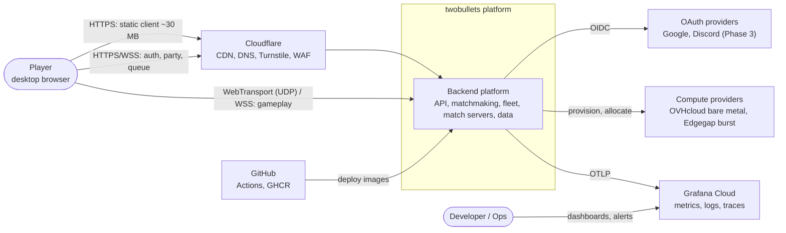
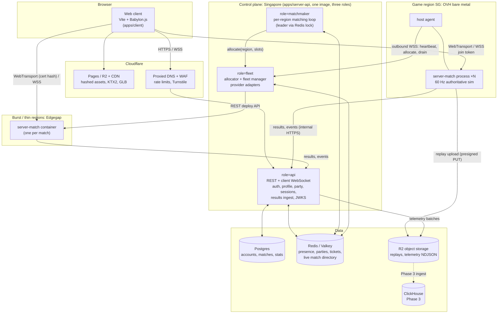
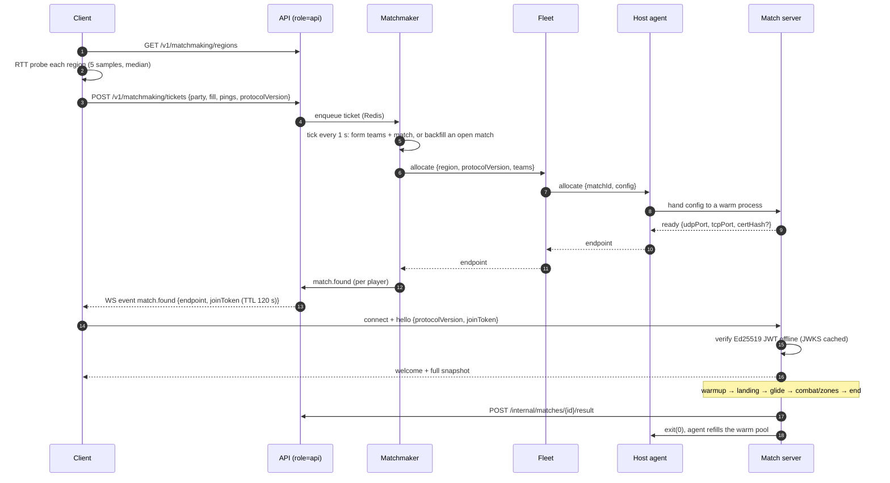
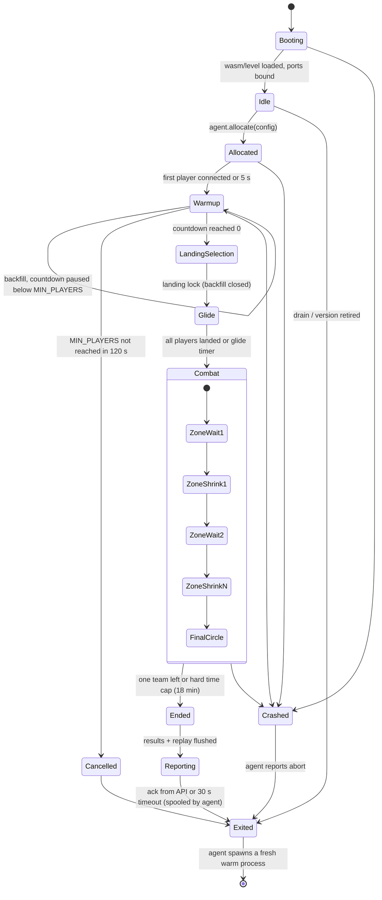
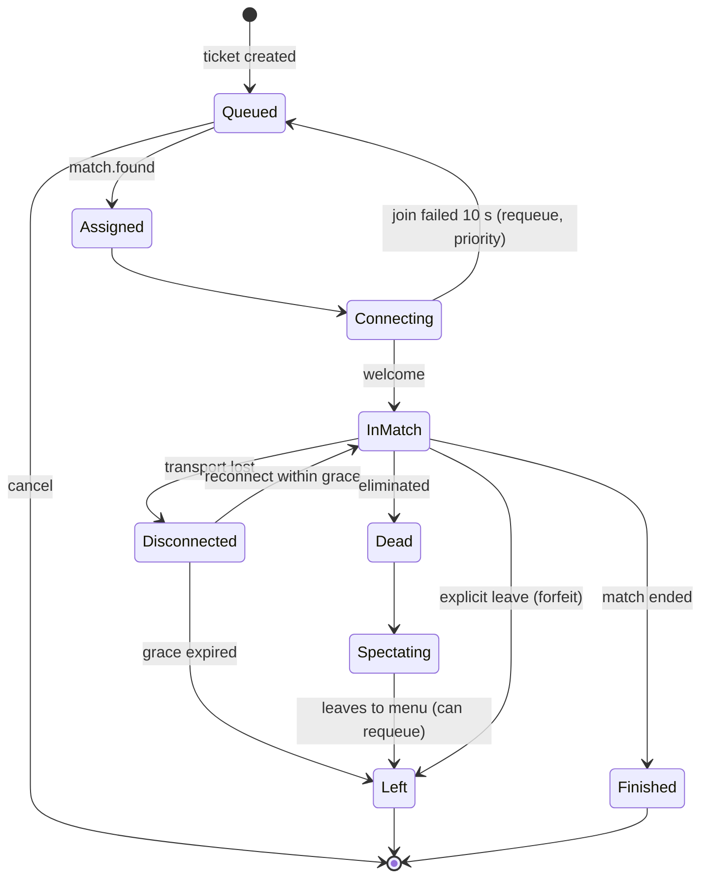
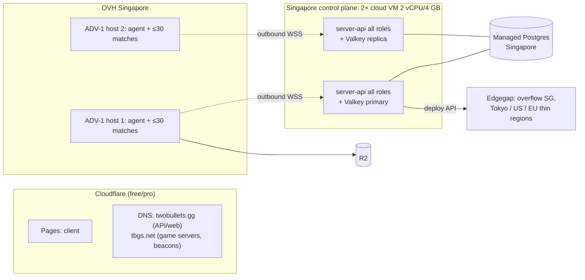
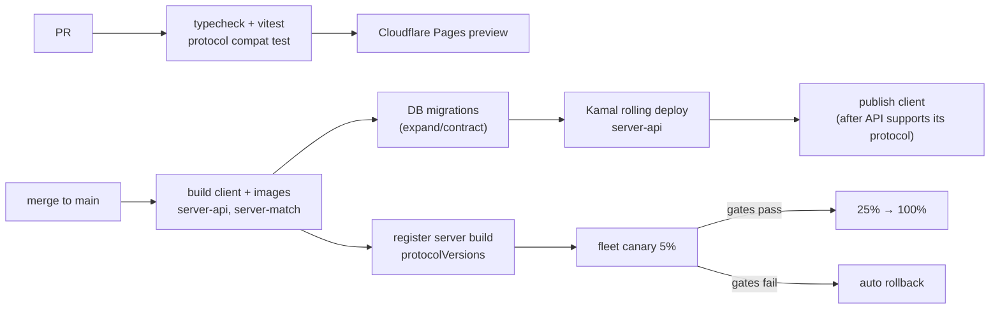

# Backend platform and infrastructure

Owner: Platform & Infrastructure Architect. Status: proposal for the Principal Architect to merge with the Netcode and Runtime docs. Research date: 2026-09-14. Prices change often, so re-check every cited price before committing money.

Platform ADRs use numbers **0100–0199** (`docs/backend/adr/01NN-*.md`) so they don't collide with the parallel Netcode and Runtime ADRs. The Principal may renumber them.

---

## 0. Summary

| Topic | Recommendation |
|---|---|
| Shape | One TypeScript **modular monolith**, `apps/server-api`, deployed with three roles: `api`, `matchmaker` and `fleet`. Plus `apps/server-match`: one OS process per match, supervised by a small **host agent**. [ADR 0101](adr/0101-modular-monolith-backend.md) |
| Matchmaking | **Build.** A 10-player, 5-team queue is small. Redis tickets feed a per-region matching loop, with latency-based region choice, fill/no-fill, relaxation over time and backfill until landing lock. [ADR 0102](adr/0102-build-matchmaker-and-allocator.md) |
| Hosting | **Owned bare-metal baseline, rented burst.** Start with OVHcloud Advance dedicated servers in Singapore (6c/12t, US$136/mo, unmetered bandwidth, anti-DDoS included). Behind a provider interface in our allocator, use Edgegap (per-minute billing) for peaks and for regions too small to justify a box. No Kubernetes at launch; Agones is the path at roughly 50+ hosts. [ADR 0103](adr/0103-hybrid-hosting-owned-baseline-burst-provider.md) |
| Regions | **Singapore only at launch.** It reaches HCMC in 37 ms, Bangkok 23, Jakarta 19, Manila 32, Hong Kong 30 and Taipei 44. Tokyo is the second region, then US and EU. A region's queue opens only once it can fill matches. [ADR 0104](adr/0104-region-strategy-singapore-first.md) |
| Game-server TLS | Per-host names on a **separate registrable domain** with a Let's Encrypt wildcard (DNS-01) on owned hosts. Burst hosts use `serverCertificateHashes`. WSS is the fallback everywhere. [ADR 0105](adr/0105-game-server-tls-and-endpoints.md) |
| Join and reconnect | Short-TTL **Ed25519 JWT join tokens** bind player, match, server and protocol version, and are verified offline by the match server. A 60 s reconnect grace uses re-issued tokens. [ADR 0106](adr/0106-signed-join-tokens-and-reconnect.md) |
| Data | Managed **Postgres** in Singapore (Neon or equivalent) is the source of truth. **Redis/Valkey** holds ephemeral state. **Cloudflare R2** stores replays and raw telemetry (NDJSON). ClickHouse comes only in Phase 3. [ADR 0107](adr/0107-data-stores.md) |
| Edge | Cloudflare serves the client (Pages or R2 + CDN) and provides DNS, Turnstile and HTTP DDoS protection for the API. |
| Observability | OpenTelemetry → Grafana Cloud (the free tier to start). SLOs cover match completion, tick p99, queue time and join success. |
| Estimated cost | ~**$190/mo** at 100 CCU · ~**$1.1–1.8k/mo** at 1,000 CCU · ~**$6.8–12.5k/mo** at 10,000 CCU (§4.6) |

---

## 1. Service architecture

### 1.1 System context (C4 level 1)



### 1.2 Containers (C4 level 2)



### 1.3 Queue → play → results (sequence)



### 1.4 Service catalogue

For a solo developer, "service" here means a **module with its own tables, keys and API**, not necessarily a separate deployable. Splits happen only when scaling or failure isolation requires them.

| Service | Responsibilities | API sketch | Data owned | Scaling characteristics |
|---|---|---|---|---|
| **Web client (CDN)** | Static SPA, assets, version manifest | `GET /index.html` (no-cache), `/assets/*` (immutable, hashed); `GET /version.json` {clientVersion, protocolVersion} | none | Free to scale on Cloudflare. About 30 MB per cold visit, then cached. R2 has zero egress fees. |
| **Gateway / API** (`role=api`) | TLS termination is Cloudflare's job. The API does routing, authN/Z, rate limiting, request validation and client WebSocket fan-out. | REST `/v1/*`; `WSS /v1/ws` for push; `/.well-known/jwks.json` | none directly (delegates to modules) | Stateless and horizontal. WS connections are sticky per node; cross-node push goes through Redis pub/sub. One 2 vCPU node handles far more than 10k CCU of control traffic; run 2 for redundancy. |
| **Auth / identity** | Guest accounts first, OAuth later (Google, Discord, maybe Apple), account linking, refresh tokens, bans, token signing keys | `POST /v1/auth/guest {turnstileToken}` → access JWT (15 min) + refresh cookie (30 d, httpOnly); `POST /v1/auth/refresh`; `GET /v1/auth/oauth/{provider}/start` and `/callback`; `POST /v1/auth/link/{provider}`; `POST /v1/auth/logout` | `accounts`, `identities`, `refresh_tokens`, `sanctions`; the Ed25519 private key (secret) | Only DB writes on login and refresh; low load. |
| **Profile** | Display name, settings, GDPR export and delete | `GET/PATCH /v1/me`; `GET /v1/me/export`; `DELETE /v1/me` | `profiles` | Trivial |
| **Party** | Create, invite, join, leave, kick; leader toggles fill; party size ≤ 2 | `POST /v1/parties` → {partyId, inviteCode}; `POST /v1/parties/{id}/join {inviteCode}`; `POST …/leave`, `…/kick`; `PATCH /v1/parties/{id} {fill}`; WS events `party.updated`, `party.invite` | Redis `party:{id}` (TTL refreshed while members are online) | In-memory only, tiny |
| **Session / presence** | Online status, active-match directory for reconnects, WS connection registry | `GET /v1/me/active-match` → {matchId, phase, endpoint, joinToken}; WS `presence.*` | Redis `presence:{acct}` (TTL 60 s), `active:{acct}` → matchId, `match:{id}` → endpoint, phase, roster | O(CCU) keys, cheap |
| **Matchmaker** (`role=matchmaker`) | Tickets, region choice, team formation, match formation, relaxation, backfill, requeue with priority after aborts | `POST /v1/matchmaking/tickets`; `DELETE /v1/matchmaking/tickets/{id}`; `GET /v1/matchmaking/regions`; WS `ticket.status`, `match.found`. Internal: `openMatch.update {freeSlots, phase}` from the match server via fleet | Redis `ticket:{id}`, `queue:{region}:{queue}` (ZSET by enqueue time), `open:{region}` (backfillable matches) | One leader loop per region, 1 Hz. Even at 10k CCU the arrival rate is about 1,250 tickets/min, microseconds of CPU. Leader election uses a Redis lock with a 5 s lease. |
| **Allocator / fleet manager** (`role=fleet`) | Host registry, capacity, warm pools, version pinning, canary percentage, bin-packing, drain, burst spill-over, provider adapters (`owned`, `edgegap`, later `agones`), host health | Agent channel: `WSS /internal/agents` (agent dials out): `hello`, `heartbeat`, `allocate`, `drain`, `setDesiredVersion`. `POST /internal/allocations {region, protocolVersion, teams, config}` → {matchId, hostId, endpoint}. Admin: `GET /internal/fleet` | Redis `host:{id}` (heartbeat TTL 10 s), `alloc:{matchId}`; Postgres `server_builds`, `hosts` (inventory) | Control traffic only. Allocation takes under 1 s from the warm pool and 5–60 s on burst, depending on the provider's image cache. |
| **Host agent** (part of `apps/server-match`, `--mode=agent`) | Runs on every owned host. Spawns and supervises match processes, keeps N warm processes (level loaded, wasm initialised), assigns ports, tick watchdog, collects metrics and logs, uploads replays, self-updates to the desired version | Local IPC with children (stdio / Node IPC): `ready`, `allocated`, `phase`, `playerJoined/Left`, `result`, `exit` | Local only | One per host |
| **Dedicated match server** (`apps/server-match`) | Authoritative simulation (movement, weapons, ballistics, zone), transport endpoints, join-token verification, reconnect grace, input validation, replay recording, result reporting | Client: WebTransport `https://{host}:{udpPort}/m/{matchId}`; WSS `wss://{host}:{tcpPort}/m/{matchId}`. Internal: `POST /internal/matches/{id}/state`, `/result`, `/abort`, `/reports` | In-memory match state only; nothing survives a crash (§3.4) | 0.25–0.5 vCPU and 150–300 MB per match (assumed, see §9). About 15–30 matches per 12-thread host. |
| **Stats / leaderboards** (Phase 3) | Aggregate match results into lifetime and seasonal stats and leaderboards | `GET /v1/players/{id}/stats`; `GET /v1/leaderboards/{season}/{board}?cursor=` | `player_stats`, `seasons`, Redis ZSET `lb:{season}:{board}` rebuilt from Postgres | A write per match end; reads cached |
| **Telemetry** | Client perf/error batches, server gameplay events, funnel analytics | `POST /v1/telemetry/client` (batched, sampled, ≤ 32 KB). Server events travel with the result upload as NDJSON. | R2 `telemetry/{date}/{region}/*.ndjson.gz`; later ClickHouse `events` | Buffered through a Redis Stream, batch-flushed every 60 s or 5 MB |

### 1.5 Internal trust boundaries

- **Client ↔ API** uses access JWTs (EdDSA, 15 min) and an httpOnly refresh cookie on the API domain. All API traffic is proxied by Cloudflare, and the origin firewall only allows Cloudflare IP ranges.
- **Client ↔ match server** uses a join JWT (TTL 120 s, single match) sent in the first message. Game servers never see refresh or access tokens.
- **Agent/match server ↔ control plane** uses per-host service credentials: a client certificate or a signed service JWT, rotated every 24 h and issued at host bootstrap. Agents dial **out**, so game hosts expose no inbound control port.
- **Operators** get SSH only over WireGuard/Tailscale. No public SSH.

---

## 2. Matchmaking (10 players, 5 teams, parties of 1–2)

### 2.1 Queue model

- **Queue `br-duo`** (the only queue at launch): up to 5 **team slots**, each holding 1 or 2 players, so at most 10 players.
- A ticket belongs to a party of 1 or 2 players and carries `fill` (default true for solos). A 2-player party ignores `fill`.
  - A **solo with fill** gets paired with another fill-solo into one team slot.
  - A **solo without fill** takes a team slot alone and plays a duo match short-handed, by choice.
- Later queues (`br-solo` with 10 slots of 1, events, custom games) reuse the same engine with different `slotSize`. Don't split the population until prime-time CCU supports it (§2.5).

**Ticket**

```jsonc
{
  "ticketId": "t_01J…",
  "queue": "br-duo",
  "partyId": "p_…",            // absent for solo
  "members": [{ "accountId": "a_…", "mmr": null }],   // mmr added in Phase 3
  "fill": true,
  "pings": { "sg": 38, "tyo": 104, "use": 240 },     // median RTT in ms, measured by the client
  "protocolVersion": 7,
  "createdAt": 1789000000000,
  "priority": 0                // >0 after being requeued from an aborted/failed match
}
```

### 2.2 Region selection by measured latency

1. `GET /v1/matchmaking/regions` returns only **open** regions (§2.5), each with a beacon URL (for example `https://ping-sg.tbgs.net/p`), served by a tiny HTTP/3 + HTTP/1.1 responder on a game host in that region, not through Cloudflare.
2. The client sends 1 warm-up request plus 5 timed ones per region, in parallel. Browsers can't send raw UDP, so this uses `fetch` with `cache: "no-store"` over a kept-alive connection. It takes the **median**. If WebTransport ships, a datagram echo on the beacon gives closer-to-real UDP RTT. Results are cached for 5 minutes and re-measured when the player enters a queue.
3. A region is **acceptable** for a ticket if `max(member RTT) ≤ 90 ms`, or if it is the ticket's best region. The **preferred** region is the lowest RTT.
4. The matchmaker places a ticket in its preferred region's pool and, as it waits longer, lets it be pulled into other acceptable regions (§2.3).
5. Players outside every open region (for example EU players at launch) can still queue in their best region. Before queueing they see the expected ping ("~220 ms").

### 2.3 Match formation, relaxation and the trade-off between wait time and match quality

The loop runs every second per region:

1. **Backfill first.** For each open match in `Warmup` with free slots and the same `protocolVersion`, take the oldest compatible tickets (party size ≤ free players in a slot).
2. **Team formation.** Pair fill-solos with each other, preferring the closest RTT (and MMR later). 2-parties and no-fill solos are already team slots.
3. **Match formation.** Take team slots by descending `priority`, then ascending `createdAt`, until 5 slots are full.
4. **Start rules.** The rules relax with the oldest ticket's wait `w`:

| Oldest wait `w` | Allocate a new match when… | Region rule | Skill rule (Phase 3) |
|---|---|---|---|
| 0–30 s | 5 slots and ≥ 9 players | preferred region only | ±200 MMR |
| 30–60 s | ≥ 8 players | any acceptable region with RTT ≤ best + 30 ms | ±400 |
| 60–90 s | ≥ 6 players (3+ teams) | any acceptable region | ±800 |
| > 90 s | ≥ 4 players (2+ teams); bots fill later (§2.6) | any acceptable region | ignore |

An allocated match is **not** closed. It goes into `open:{region}` and keeps receiving backfill during warmup (§2.4). Starting a little under-filled and backfilling beats making the first players wait for a perfect lobby.

**Why these numbers:** a player's loop is about 8 min (queue ~1 min, time alive ~6.5 min, menu ~0.5 min), so tickets arrive at roughly `CCU / 8` players per minute in a region. At 100 regional CCU that is about 12 players/min, and a 10-player lobby fills in about 50 s. At 40 CCU it takes around 2 min, which is why the relaxation drops to 4–6 players with backfill. Tune this from the `queue_wait_seconds` histogram (§7).

### 2.4 Minimum players, countdown and backfill before landing

- The server enters `Warmup` when it is allocated and tells the matchmaker `{freeSlots}` on every change.
- The **countdown** (45 s) starts once `connectedPlayers ≥ MIN_PLAYERS` (4 at launch, 6 once population allows). When the lobby is full, the countdown drops to `min(remaining, 10 s)`. If players fall below the minimum, the countdown pauses. If the minimum isn't reached within 120 s of allocation, the match is **cancelled**: tickets are requeued with `priority = 1` and the server is released.
- **Backfill is allowed** during `Warmup` and `LandingSelection` until **landing lock**, 10 s before the glide phase. After that the match leaves `open:{region}`. There is no late join after landing; a half-empty BR is fine, a player dropped mid-zone is not.
- A player who disconnects during warmup frees their slot after 15 s. A teammate left alone keeps the slot, and backfill may add a fill-solo to it if the remaining player's party had `fill`.
- There is no ready check: auto-join keeps friction low. Dodging (closing the tab) during warmup is allowed, with a queue cooldown after 3 dodges in 10 minutes.

### 2.5 Opening regions

Only open a region's queue once it can fill matches. The rule: its **prime-time CCU is ≥ ~100** for 7 consecutive days, or the forecast p90 wait is ≤ 60 s. Until then, those players queue into the nearest open region. Splitting 150 players across three regions produces three empty queues.

### 2.6 Bots (later)

- Server-side AI players use the same input path as humans (the shared movement and weapon step), so bots cost the same CPU as players. The Runtime teammate should confirm this.
- Enabling bots lets the start rule become "start at `w > 45 s` with ≥ 2 humans; bots fill up to 10". Bot kills are excluded from stats and leaderboards, and the bot flag is visible in results. This is also the cold-start answer for new regions.

### 2.7 Build vs buy

2026 status matters: several vendors in this space changed or disappeared this year ([Gameye summary](https://gameye.com/blog/game-server-shake-up-2026/)).

| Option | 2026 status and pricing | Browser transport | Authoritative Node/Rust fit | Lock-in | Verdict |
|---|---|---|---|---|---|
| **Build (TS + Redis)** | Our own code, about 1–2 weeks for v1 | Anything we implement | Native | None | **Adopt**: small problem, full control of region, backfill and party logic |
| **Open Match 2** | Public preview. Go + gRPC data layer; you still write the match function and director ([repo](https://github.com/googleforgames/open-match2), [overview](https://openmatch.dev/site/v2/overview/)) | n/a (matchmaking only) | Language-agnostic via gRPC | Low | Reject for now; revisit at 100k+ CCU or for complex MMR |
| **Nakama** (Heroic Labs) | OSS, self-host free. Heroic Cloud is sales-led; published tiers start around $600/mo ([pricing](https://heroiclabs.com/pricing/)). Matchmaker supports parties, and authoritative matches get a match ID via a matched hook ([docs](https://heroiclabs.com/docs/nakama/concepts/multiplayer/matchmaker/)) | Built-in WS; no WebTransport | Its in-process authoritative matches aren't suited to a 60 Hz ballistic sim. Usable as a matchmaker, social and auth layer in front of our own servers. | Medium-high (identity, sessions and storage model) | **Strong alternative**, rejected at launch. Reconsider if friends, chat and groups become urgent. |
| **Colyseus** | OSS (MIT). Colyseus Cloud from $15/mo ([pricing](https://colyseus.io/pricing/)). WebTransport is experimental since 0.16 ([docs](https://docs.colyseus.io/server/transport/webtransport)) | WS by default, experimental H3 | Rooms share Node processes, and state sync uses its schema model. That conflicts with one-process-per-match at 60 Hz and a custom binary snapshot protocol. Its matchmaking is room-filling with no latency or backfill logic. | Medium | Reject |
| **Photon** (Fusion/Quantum) | 100 CCU free, $125 per 500 CCU, $0.50/CCU above 2k ([pricing](https://www.photonengine.com/fusion/pricing)) | Photon Cloud relays | Unity/C# simulation; not usable for a TS/Babylon authoritative server | High | Reject |
| **Hathora** | **Shut down May 5, 2026** after joining Fireworks AI ([Gameye](https://gameye.com/gameye-vs-hathora/)) | — | — | — | Reject. This is why we keep a provider abstraction. |
| **Rivet** | **No longer hosts game servers**; pivoted to actor and agent infrastructure ([rivet.dev/cloud](https://rivet.dev/cloud/)) | — | — | — | Reject |
| **Unity Multiplay** | Direct support ended Mar 31, 2026; licensed to Rocket Science Group ([Gameye](https://gameye.com/blog/game-server-shake-up-2026/)) | — | — | — | Reject |
| **Edgegap** | $0.00115/vCPU-min (≈ $0.069/vCPU-h), fractional down to 1/4 vCPU, **$0.10/GB egress**, 615+ locations. Private bare-metal fleet $280–350 per 16-vCPU host. Matchmaker from ~$22/mo ([pricing](https://edgegap.com/resources/pricing)) | UDP/TCP 1:1 port mapping; WSS via a "TLS Upgrade" proxy ([docs](https://docs.edgegap.com/learn/advanced-features/deployments)). WebTransport isn't documented but works over a UDP port with `serverCertificateHashes`. | Any Docker image | Low (image + REST) | **Adopt as the burst and thin-region provider** behind our allocator |
| **Gameye** | $0.07/vCPU-h on demand, $0.027 reserved, **egress included**, per-second billing ([pricing](https://gameye.com/pricing/)) | UDP/TCP ports (container) | Any Docker image | Low | **Alternative burst provider.** Evaluate Asia coverage in Phase 2; egress-included beats Edgegap once traffic is heavy. |
| **GameFabric** (Nitrado) | Agones-based; enterprise sales; Hathora's recommended migration path ([Edgegap comparison](https://edgegap.com/comparison/edgegap-vs-nitrado-gamefabric-multiplayer-servers-orchestration-allocation)) | Ports | Any container | Medium | Later option for managed Agones at 10k+ CCU |
| **PlayFab Multiplayer Servers** | Core-hour billing. The docs' example: D2v2 $0.252/VM-h, egress $0.05–0.08/GB, standby adds ~20% overhead ([MS Learn](https://learn.microsoft.com/en-us/gaming/playfab/multiplayer/servers/billing-for-thunderhead)) | Ports | Container plus GSDK heartbeat (implementable in Node) | High (Azure) | Reject: cost and lock-in at indie scale |
| **Amazon GameLift Servers + FlexMatch** | FlexMatch is free with managed hosting ([pricing](https://aws.amazon.com/gamelift/servers/pricing/flexmatch-pricing/)). **Bandwidth free on gen-6+ instances since Jun 15, 2026** ([AWS blog](https://aws.amazon.com/blogs/gametech/free-network-bandwidth-amazon-gamelift-servers-is-here-yes-really/)). AWS's own example: 1,000 CCU 5v5 on c6g.xlarge costs $2,978/mo compute. Generated TLS certs + per-instance DNS for WSS ([docs](https://docs.aws.amazon.com/gameliftservers/latest/apireference/API_CertificateConfiguration.html)) | Ports, TLS-enabled fleets | Official server SDKs: C++, C#, Go ([docs](https://docs.aws.amazon.com/gameliftservers/latest/developerguide/reference-serversdk.html)). Node or Rust needs a community SDK or a sidecar. | High (AWS) | **Plan B** "buy everything": about 2–3× our owned cost; SDK friction |
| **Agones on Kubernetes** | OSS, v1.60.0 (Aug 12, 2026), CNCF Sandbox ([releases](https://github.com/agones-dev/agones/releases)) | Ports | SDK sidecar with REST; any language | Low (open source), but needs Kubernetes | **Scale path** at roughly 50+ hosts or multiple providers; not at launch |

---

## 3. Match lifecycle

### 3.1 Match server state machine



- **Recycle by exit.** A process runs **one match and exits**. Nothing leaks between matches (memory, RNG, cheaters' state), and the agent keeps the warm pool full. Warm spawn cost is paid ahead of time, so allocation needs no boot.
- **Hard time cap.** 18 minutes of match time, 20 minutes wall clock since allocation. This bounds drain time on deploys (§3.5).

### 3.2 Player session state machine



### 3.3 Reconnects, leaving and AFK

- **Source of truth.** Redis `active:{accountId} → matchId` is set when a player is assigned and cleared by the result, by an explicit leave, or when grace expires.
- **Reconnect flow** (tab reload, Wi-Fi blip):
  1. The client calls `GET /v1/me/active-match`.
  2. The API returns the endpoint plus a **fresh** join token with `rc=1`, a new `jti` and an incremented `epoch`.
  3. The client connects.
  4. The server matches `sub` to the existing player slot, accepts only if `epoch` is higher than the last one seen, and closes any older connection.
  5. The server sends a full snapshot.
- **Grace windows.**

  | Phase | Grace | Behaviour while disconnected |
  |---|---|---|
  | Warmup | 15 s, then the slot is freed | — |
  | LandingSelection / Glide | 60 s | Auto-lands at the team's marker |
  | Combat | 60 s | The character stays in the world, idle and damageable, as in PUBG. After 60 s the player counts as left; the body stays as lootable until killed. |
  | Transport-level resume | ≤ 5 s | Handled by the Netcode layer without a new token if possible (open question Q4) |

- **Explicit leave** is immediate. The player is eliminated with placement recorded as "left". Leaving repeatedly in the first 60 s of combat counts toward a leaver penalty (Phase 3).
- **AFK.** No input for 90 s in `Warmup` means a kick with requeue allowed. No input for 180 s in combat means "left".

### 3.4 Crashes

- **No mid-match persistence.** A match's state lives only in its process. Checkpointing a 60 Hz BR costs complexity for a rare event.
- **Process crash** (non-zero exit, or the tick watchdog sees no tick for 5 s):
  1. The agent reports `abort {matchId, reason, exitCode, lastPhase}` to the fleet.
  2. The fleet publishes `match.aborted`.
  3. The API clears `active:*` and pushes `match.aborted` to connected clients. A client that dropped sees it via `GET /v1/me/active-match` → `{status: "aborted"}`.
  4. The UI shows "The match server stopped. This match won't count." with one-click requeue at `priority = 1`.
- **Host loss** (no heartbeat for 10 s): every allocation on that host is aborted the same way, and the host is quarantined until an operator or auto-reboot clears it.
- **Stats.** Aborted matches write a `matches` row with `status = 'aborted'` and no participant stats. Nothing to refund: the game is free-to-play with no entry cost. If entry costs ever exist, they must be escrowed until `Ended`.
- **Core dumps and last 30 s of logs** go to R2 `crash/{build}/{matchId}/`. Alert when the abort rate exceeds 2% over 15 min (§7).

### 3.5 Graceful drain on deploy

1. CI publishes build `server-match:X`, registered in `server_builds` with the `protocolVersion` values it supports.
2. The fleet sets `desiredVersion = X` with `canaryPercent = 5`. The allocator sends 5% of new matches to X, and only for tickets whose `protocolVersion` X supports.
3. Canary gates are checked after ≥ 200 matches or 2 h. The canary must stay within 10% of the baseline on abort rate, tick p99, join failures and client correction rate (a Netcode metric). If it passes, go to 25% → 100%; if not, set `desiredVersion` back automatically.
4. **Drain.** Old-version processes receive no new allocations. Their `Idle` processes exit right away, running matches finish (bounded by the 20-minute cap), then the agent retires them. For host maintenance, `drain(host)` does the same for the whole host.
5. **Clients.** `index.html` is `no-cache`, and `version.json` is polled every 5 minutes in menus. When the API gets a ticket with an unsupported `protocolVersion`, it returns `426 Upgrade Required` and the client reloads. A tab that is mid-match is never forced to reload.
6. **API deploys** are rolling (Kamal) with WS reconnect and backoff in the client. Tickets live in Redis, so they survive API restarts.

---

## 4. Deployment and hosting

### 4.1 Regions

Latency from [WonderNetwork](https://wondernetwork.com/pings/Singapore) (Singapore) and [WonderNetwork](https://wondernetwork.com/pings/Ho%20Chi%20Minh%20City) (HCMC), average ping:

| From \ to | Singapore | Hong Kong | Tokyo |
|---|---|---|---|
| Ho Chi Minh City | 37 ms | 53 ms | 104 ms |
| Hanoi | 67 ms | — | — |
| Bangkok | 23 ms | — | — |
| Jakarta | 19 ms | — | — |
| Manila | 32 ms | — | — |
| Taipei | 44 ms | — | — |
| Seoul | 73 ms | — | — |
| Hong Kong | 30 ms | — | — |

- **Launch: Singapore only.** It is the hub for all of SEA and covers Hong Kong and Taiwan acceptably.
- **Second: Tokyo**, for JP, KR and TW, once §2.5 is met. Start it on Edgegap burst (no fixed cost), then move to owned hardware when average load exceeds about half a box.
- **Hong Kong:** skip. Singapore reaches it in 30 ms and Tokyo covers the north; a separate HK region would only split the pool.
- **Later: US-West, US-East, EU (Frankfurt).** Same pattern: burst-only first, owned hardware when sustained.
- **Control plane:** single-region Singapore until 10k CCU. Players elsewhere see about 150–250 ms on **menu** calls only, which is acceptable. Gameplay is regional.

### 4.2 Provider comparison for match servers

| Provider type | Example | Price signal | Pros | Cons | Use |
|---|---|---|---|---|---|
| Bare metal, Asia | **OVHcloud Advance-1, Singapore**: EPYC 4244P 6c/12t, 1–5 Gbps public, anti-DDoS included, **US$136/mo** + equal setup fee ([OVH SG](https://www.ovhcloud.com/asia/bare-metal/dedicated-server-singapore/)) | ≈ $11/thread-month, **no egress fees** | Cheapest per vCPU, predictable tick (no noisy neighbours), unmetered traffic, DDoS mitigation | Provisioning takes hours to days; you pay 24/7; hardware failure is on us (keep N+1) | **Baseline in SG** |
| Bare metal, gaming | OVHcloud GAME-1 2026: Ryzen 7 9800X3D 8c/16t, S$420/mo, Game DDoS protection ([OVH Game](https://www.ovhcloud.com/en-sg/bare-metal/game/)); not clearly offered in Singapore | ≈ US$20/thread-month | Very high single-thread speed (good tick p99) and a game-aware UDP firewall | Region availability; price | EU/US owned regions later |
| Bare metal, Tokyo | Latitude.sh (Tokyo, Singapore); smallest 6-core / 32 GB ≈ $190/mo ([summary](https://www.spheron.network/blog/latitude-alternatives/)) | ≈ $16/thread-month | API-driven bare metal in Tokyo | DDoS story weaker than OVH; verify egress terms | Tokyo owned hardware when justified |
| Cloud VPS, dedicated vCPU | Hetzner CCX13 Singapore (2 dedicated vCPU) **€53.99/mo** after the 2026 increases; **Singapore traffic 0.5–8 TB included, then €7.40/TB** ([Northflank](https://northflank.com/blog/hetzner-cloud-server-price-increases), [CostGoat](https://costgoat.com/pricing/hetzner)); Vultr Optimized Cloud from ~$28/mo ([Better Stack](https://betterstack.com/community/guides/web-servers/vultr-review/)) | ≈ $25–30/vCPU-month plus metered egress | Fast to provision, API | Asia egress overage, weak DDoS protection on UDP | API/control-plane VMs, not game servers in SG |
| Serverless machines | Fly.io performance-1x $32.19/mo (EU baseline); APAC egress $0.04/GB; UDP requires a dedicated IPv4 ($2/mo) and `fly-global-services` ([pricing](https://fly.io/docs/about/pricing/), [UDP](https://fly.io/docs/networking/udp-and-tcp/)) | ≈ $32+/vCPU-month | Per-second start/stop | UDP ergonomics, QUIC not documented, cost | Not for match servers |
| Game-server host, per minute | **Edgegap** $0.069/vCPU-h + $0.10/GB | Pay per match-minute | Global reach, no fixed cost, fractional vCPU | Egress adds up, less control | **Burst + thin regions** |
| Game-server host, bandwidth included | **Gameye** $0.07/vCPU-h on demand, $0.027 reserved | Pay per use | Egress included | Asia footprint to verify | Alternative burst |
| Hyperscaler game hosting | GameLift: AWS example $2,978/mo for 1,000 CCU (c6g.xlarge), free gen-6+ bandwidth | ≈ 2–3× owned | Mature fleets, Spot, generated TLS | Lock-in, SDK languages | Plan B |

### 4.3 Recommended launch topology (Phase 2)



- **Owned game hosts.** Ubuntu LTS with Docker. The agent runs as a systemd unit and starts one container per host that contains the agent and its child match processes (no container per match on owned hosts, to avoid overhead). CPU pinning with `taskset` per process, `sysctl` UDP buffers raised, host firewall allows only the game port ranges plus WireGuard.
- **Burst hosts (Edgegap).** Same image, `--mode=single-match`, reading config from env or the allocation API. The provider adapter implements `allocate(region, config) → endpoint` and `release(id)`.
- **Ports** (owned hosts): per-process UDP `40000–40999` for WebTransport and TCP `41000–41999` for WSS. Phase 2 adds a host-level TCP 443 → local WSS proxy for networks that block high ports, if telemetry shows failures.
- **Images.** `ghcr.io/<org>/server-match:<semver>-<sha>` (distroless Node 24 or a static Rust binary; Runtime decides), target ≤ 150 MB so Edgegap pulls fast. `server-api` is a separate image.

### 4.4 TLS for game servers

WebTransport and WSS both need a certificate the browser trusts. Details in [ADR 0105](adr/0105-game-server-tls-and-endpoints.md).

1. **Owned hosts:** each host gets a DNS name `sg-01.tbgs.net` on a **separate registrable domain** from the website and API. A **wildcard `*.tbgs.net`** comes from Let's Encrypt via DNS-01, using a Cloudflare API token scoped to that zone. It is issued centrally by the fleet role, pulled by agents over their authenticated channel, and hot-reloaded. Let's Encrypt lifetimes are shrinking (64-day default from Feb 2027, 45-day from Feb 2028, [LE](https://letsencrypt.org/2025/12/02/from-90-to-45)), so renew every 20 days and alert at < 14 days. A wildcard avoids the 50-certificates-per-registered-domain-per-week limit ([rate limits](https://letsencrypt.org/docs/rate-limits/)) when hosts churn. A separate domain means a leaked game-host key can't impersonate the API or read its cookies.
2. **Burst/third-party hosts:** WebTransport uses `serverCertificateHashes`. The process generates a fresh **ECDSA P-256** self-signed certificate valid for less than 14 days, reports its SHA-256 to the allocator, and the hash travels with the join payload ([MDN](https://developer.mozilla.org/en-US/docs/Web/API/WebTransport/WebTransport)). WSS uses Edgegap's TLS Upgrade on its FQDN. Browser support for certificate hashes varies (there is a Firefox bug history, [bugzilla 1873263](https://bugzilla.mozilla.org/1873263)), so the client **must** fall back to WSS after a 3 s connect timeout.
3. **Alternative kept in reserve:** Let's Encrypt **IP-address certificates** (6-day, GA since Jan 15, 2026, [LE](https://letsencrypt.org/2026/01/15/6day-and-ip-general-availability)). They avoid DNS but add frequent renewal and need port 80/443 validation on each host.

WebTransport now works in all major browsers, since **Safari 26.4** (March 2026) ([WebKit](https://webkit.org/blog/17862/webkit-features-for-safari-26-4/), [MDN](https://developer.mozilla.org/en-US/docs/Web/API/WebTransport)). Whether it is the primary transport is the Netcode Architect's call. The platform supports both.

### 4.5 Autoscaling and warm pools

- **Warm pool per owned host:** `warm = max(2, ceil(0.1 × capacity))` idle processes. An idle process should use about 0 CPU and ≤ 150 MB (Runtime to confirm).
- **Regional demand signal**, computed every 5 s:

  `neededSlots = formingMatches + ceil(queuedPlayers / 8) + openBackfillShortfall + safety(2)`

  If `ownedFreeSlots < neededSlots`, spill new allocations to the burst provider for that region. Burst matches are released at exit; there is nothing to scale down.
- **Owned capacity planning** (bare metal can't scale within minutes): weekly, from the 7-day p95 of `matches_active / owned_capacity`.
  - Order another box when p95 exceeds 70%, or when monthly burst spend exceeds 60% of a box's price.
  - Cancel a box when p95 is below 35% for 30 days.
- **Bin-packing:** fill the most-loaded eligible host first. Empty hosts can then be drained for maintenance, and in burst regions it minimises active deployments.
- **Pre-warm for events** (streamer, launch day): a manual `minWarm` override per region, plus Edgegap/Gameye pre-provisioned deployments.

### 4.6 Cost model

#### Assumptions (change these and the table updates)

| Symbol | Value | Source / note |
|---|---|---|
| Peak CCU `P` | 100 / 1,000 / 10,000 | Brief |
| Average CCU | `0.55 × P` | Single-region daily curve (evening peak) |
| Share of CCU in a match | 80% | The rest are in menus or queue |
| Average live players per running match | 6 | 10 start; dead players leave and requeue |
| **Peak concurrent matches** | `P × 0.8 / 6 ≈ P / 7.5` → **13 / 133 / 1,333** | |
| CPU per match `c` | **0.25 vCPU** (low) / **0.5 vCPU** (high) | Brief; Runtime teammate to replace |
| Memory per match | 150–300 MB | Not binding: 30 × 300 MB = 9 GB on a 32 GB host |
| Owned host | OVH Advance-1 SG, 12 threads; matches budget = (12 − 1) × 0.7 = 7.7 vCPU → **30 matches (c=0.25) / 15 matches (c=0.5)** | 70% ceiling protects tick p99 |
| Egress server→client | **40 kbps** average per in-match player → 18 MB per player-hour → **`P × 5.8 GB`/month** | Netcode teammate to replace |
| Hours/month | 730 | |

#### Match-server compute (the dominant cost)

| Peak CCU | Owned OVH only, N+1 (c = 0.25 / 0.5) | Edgegap only, compute + egress (c = 0.25 / 0.5) | Gameye on-demand, egress included | GameLift (extrapolated from AWS's 1k CCU example) |
|---|---|---|---|---|
| 100 | 1 box → **$136** / **$136** | $92 + $58 = **$150** / $185 + $58 = **$243** | $94 / $187 | ~$300–400 (min fleet) |
| 1,000 | 6 boxes → **$816** / 10 boxes → **$1,360** | $923 + $578 = **$1,501** / $1,846 + $578 = **$2,424** | $936 / $1,873 | ~$3,000 |
| 10,000 | 50 boxes → **$6,800** / 98 → **$13,328** | $9,229 + $5,780 = **$15.0k** / $18,458 + $5,780 = **$24.2k** | $9.4k / $18.7k | ~$25–30k (before Spot/savings) |
| 10,000 **hybrid** (own 60% of peak + N+10%, burst the rest ≈ 8% of match-hours) | 30 boxes $4,080 + burst $738 + egress $463 = **$5.3k** / 59 boxes $8,024 + $1,477 + $463 = **$10.0k** | | | |

Setup fees for owned boxes are about one month's price, paid once (not shown). At 10k CCU, larger hosts and volume discounts (Edgegap advertises up to 40%) would lower these numbers.

#### Platform (non-match) costs

| Item | 100 CCU | 1,000 CCU | 10,000 CCU |
|---|---|---|---|
| API/matchmaker/fleet VMs (SG) | 1 × 2 vCPU ≈ $20–25 | 2 × ≈ $50 | 4–6 across regions ≈ $250–300 |
| Redis/Valkey | on the API VM, $0 | on the API VMs, $0–20 | HA pair ≈ $100 |
| Postgres (managed, SG) | Neon Launch ≈ $15–30 ([Neon](https://selfhost.dev/blog/neon-pricing-cost-of-serverless-postgres/)) | ≈ $50–100 | HA / Scale ≈ $500–800 |
| Object storage (R2): replays 14 d, telemetry | ≈ $1 | ≈ $5–10 | ≈ $50 |
| Analytics | DuckDB on R2 files, $0 | $0 | ClickHouse Cloud ≈ $200–400 ([pricing](https://dev.to/beton/clickhouse-pricing-teardown-2026-209h)) or self-host on a $136 box |
| Observability | Grafana Cloud Free: 10k series, 50 GB logs, 14-day retention ([Grafana](https://grafana.com/pricing/)), $0 | $0–50 | ≈ $300–500 |
| Cloudflare (Pages, DNS, Turnstile, WAF) | $0 | $0–25 | $25–250 |
| Thin regions on burst (Tokyo/US/EU) | — | ≈ $100–200 | included in hybrid |
| **Platform subtotal** | **≈ $50** | **≈ $250–450** | **≈ $1.5–2.5k** |

#### Totals (recommended stack: owned SG baseline + burst)

| Peak CCU | Monthly estimate | Per peak CCU |
|---|---|---|
| **100** | **≈ $190** (1 OVH box + ~$50 platform) | $1.90 |
| **1,000** | **≈ $1.1k–1.8k** | $1.10–1.80 |
| **10,000** | **≈ $6.8k–12.5k** | $0.70–1.25 |

#### Sensitivity (1,000 peak CCU, 133 peak matches)

| CPU per match | Matches per owned host | Owned hosts (N+1) | Owned cost | Edgegap compute |
|---|---|---|---|---|
| 0.1 vCPU | 77 (memory becomes the limit near 300 MB) | 3 | $408 | $369 |
| 0.25 | 30 | 6 | $816 | $923 |
| 0.5 | 15 | 10 | $1,360 | $1,846 |
| 1.0 | 7 | 20 | $2,720 | $3,692 |

| Egress per player (server→client) | Monthly egress | Edgegap egress cost | Owned OVH (unmetered) |
|---|---|---|---|
| 20 kbps | 2.9 TB | $289 | $0 |
| 40 kbps | 5.8 TB | $578 | $0 |
| 100 kbps | 14.5 TB | $1,445 | $0 |
| 200 kbps | 28.9 TB | $2,890 | $0 (160 Mbps peak across hosts, well within the ports) |

**Reading the tables:** owned bare metal wins as soon as a region averages more than about 40% of a box. Per-minute providers win for spiky or thin regions. Bandwidth-heavy netcode makes owned hosts, Gameye and GameLift (free gen-6+ bandwidth) look better than Edgegap.

---

## 5. Data

### 5.1 Stores

| Store | Holds | Why | Launch choice |
|---|---|---|---|
| **Postgres** | accounts, identities, refresh tokens (hashed), profiles, sanctions, matches, match participants, player stats, server builds, host inventory, reports | Relational, transactional, boring. Scales to 10k CCU on one primary (≈ 250k matches/month × 10 rows ≈ 1 GB/month). | Managed in Singapore (Neon, or Supabase/Aiven/DO as equivalents), with PITR. Self-host only once there's an ops owner. |
| **Redis / Valkey** | presence, parties, tickets and queues, live match directory, host heartbeats, rate-limit buckets, WS pub/sub, telemetry buffer stream | Everything here is **reconstructible or expendable**. Losing Redis costs queued tickets and parties, not accounts. | Valkey on the API VMs (primary + replica), AOF off |
| **Object storage (R2)** | replays, crash dumps, raw telemetry NDJSON, DB logical backups (second copy) | Cheap, zero egress | Cloudflare R2 |
| **ClickHouse** (Phase 3) | gameplay events (kills, damage, positions sampled at 1 Hz), server tick stats, client perf | Fast analytics over billions of rows | ClickHouse Cloud Basic or self-hosted; ingest from R2 files |

Postgres core schema (sketch):

```sql
accounts(id uuid pk, kind text check (kind in ('guest','full')), created_at, last_seen_at, region_hint, deleted_at)
identities(account_id fk, provider text, subject text, email_hash, unique(provider, subject))
refresh_tokens(id pk, account_id fk, token_hash, expires_at, revoked_at, ua_hash, ip_prefix)
profiles(account_id pk fk, display_name citext unique, settings jsonb)
sanctions(id pk, account_id fk, kind, reason, starts_at, ends_at, created_by)
server_builds(version pk, protocol_versions int[], image, status, created_at)
matches(id uuid pk, region, queue, server_build fk, host_id, status check (status in ('ended','aborted','cancelled')),
        allocated_at, started_at, ended_at, player_count, bot_count, replay_key)
match_participants(match_id fk, account_id fk, team smallint, placement smallint, kills smallint, damage int,
                   survival_ms int, left_early bool, disconnects smallint, avg_rtt_ms smallint, primary key(match_id, account_id))
player_stats(account_id pk fk, season, matches, wins, kills, damage, top3, time_alive_ms, updated_at)
reports(id pk, reporter fk, target fk, match_id fk, reason, created_at, status)
```

### 5.2 Event and telemetry pipeline

1. The **match server** buffers events in memory as compact structs and writes NDJSON at `Ended`. The agent uploads it together with the replay to `r2://telemetry/{yyyy-mm-dd}/{region}/{matchId}.ndjson.gz` using a presigned URL. The summary goes to `POST /internal/matches/{id}/result`.
2. **Clients** batch perf data (fps, frame time p95, GPU tier, load times) and errors to `POST /v1/telemetry/client`, 10% sampled for perf and 100% for errors. The API pushes to a Redis Stream, and a flusher writes hourly files to R2.
3. **Phases 1–2:** analysis is `duckdb` over R2 Parquet/NDJSON files, run ad hoc. Dashboards come from Postgres match tables.
4. **Phase 3:** ClickHouse `s3Queue` / `S3` table engine ingests from R2. Retention is enforced with TTL.

### 5.3 Retention

| Data | Retention |
|---|---|
| Accounts / profiles | Until deletion request; guest accounts inactive for 180 days are purged |
| Match results / participants | Indefinite while the account exists; anonymised (account_id → null) on delete |
| Raw gameplay telemetry | 90 days; aggregates indefinitely (non-personal) |
| Replays | 14 days; 90 days if attached to a report or sanction |
| Client perf/error telemetry | 30 days |
| Security logs (IPs, auth events) | 30 days; IPs truncated to /24 (IPv4) or /48 (IPv6) in analytics |
| Application logs | 14 days (Grafana Cloud Free default) |
| Backups | Postgres PITR 7 days; weekly logical dump to R2 kept 8 weeks |

### 5.4 Privacy (GDPR and local law basics)

- **Data minimisation.** Guest accounts collect no email or name. OAuth stores provider subject IDs and a hashed email only if needed for account recovery.
- **Required pieces:** a privacy policy and cookie notice (the refresh cookie is strictly necessary; analytics are consent-gated for EU visitors), self-service `export` and `delete` (`GET /v1/me/export`, `DELETE /v1/me` → 30-day soft delete, then hard delete and anonymisation), data processing agreements with processors (Cloudflare, Neon, OVH, Edgegap, Grafana), and a record of processing activities.
- **Vietnam PDPL** (effective Jan 1, 2026) covers foreign and domestic processing of Vietnamese residents' data. Transfers offshore, such as hosting in Singapore, need a transfer impact assessment and recipient agreements, with fines up to 5% of revenue ([Tilleke & Gibbins](https://www.tilleke.com/insights/vietnams-new-personal-data-protection-law-a-closer-look/), [DFDL](https://www.dfdl.com/insights/legal-and-tax-updates/vietnam-personal-data-protection-2026-what-foreign-organizations-need-to-know/)). Singapore PDPA and EU GDPR apply once we have those players. **Get local legal advice before the public launch**; keeping PII minimal keeps the paperwork small.
- **Age.** Don't target under-13s. Show an age gate and a terms of service line.

---

## 6. Security and anti-cheat

### 6.1 Principles

Browsers are hostile clients. Any JavaScript can be read and patched (devtools, userscripts, extensions reading the Babylon scene graph), and there is no kernel anti-cheat. So:

1. **Server authority.** The client sends intent only.
2. **Send less.** Interest management means clients don't receive what they can't see.
3. **Detect and review.** Telemetry, replays, reports, sanctions.
4. **Add friction** for repeat offenders: account age, OAuth for ranked play, Turnstile.

### 6.2 Server authority and input validation

The Netcode teammate owns the details. The platform requires:

| Check | Rule | Action |
|---|---|---|
| Input rate | Token bucket at tickRate (60/s) + 20% burst; max datagram size | Drop excess; kick after sustained 3× |
| Movement | Client never sends positions. The server runs `computeDesiredVelocity` from `packages/shared`; speed is capped by the `MOVEMENT` constants. | Impossible states are unreachable by construction |
| Fire rate / ammo / reload | The server runs `weaponStep`; RPM, magazine and reload time are authoritative | Excess fire inputs are ignored and counted |
| View angles | Pitch clamped to ±`CAMERA.maxPitchDegrees`. Per-tick yaw/pitch delta is recorded, not blocked (flicks are legitimate). Deltas above 60°/tick feed heuristics. | Flag score |
| Lag compensation | Rewind capped (for example ≤ 200–250 ms, Netcode to confirm); shots older than the cap are rejected | Reject |
| Timestamps / ticks | Client tick must stay within a window of server tick minus RTT | Clamp or reject |
| Protocol | First message must be `hello` with a valid join token within 3 s; unknown message IDs are fatal | Disconnect |

### 6.3 Detection

- Per-match features into telemetry: headshot ratio, time-to-damage after line of sight, snap-angle distribution before hits, tracking through occluders (the server knows visibility), damage per shot fired.
- Phase 3: a nightly job scores accounts, and the top outliers go to a manual review queue with replay links. Sanctions: warning → 24 h → 7 d → permanent. Shadow-queue confirmed cheaters together, which is cheap and effective.
- Player reports: `POST /v1/reports {matchId, target, reason}` pins the replay to 90-day retention.

### 6.4 Replays and demos

- The server records the **input stream** per player, RNG seeds, join/leave events and **keyframe snapshots at 2 Hz**, zstd-compressed. Estimate: 10 players × 60 Hz × ~12 bytes ≈ 7 KB/s raw, so about 5 MB raw and 1–2 MB compressed per 12-minute match.
- Replay by re-simulation needs deterministic shared code for the same `server_build` (open question Q5). Keyframes make seeking and a non-deterministic fallback possible.
- Viewer: the client in spectator mode, admin-only at first.

### 6.5 Rate limiting and abuse (control plane)

- Cloudflare WAF rate rules on `/v1/auth/*` (for example 10/min per IP).
- Redis token buckets per account for tickets (6/min), party actions and telemetry.
- Turnstile on guest creation and OAuth start.
- Pagination caps and strict JSON schema validation (TypeBox/Zod) on every route. Request bodies ≤ 64 KB.

### 6.6 DDoS

- **Web/API/CDN:** Cloudflare proxy. The origin accepts only Cloudflare IPs.
- **Game servers (UDP):**
  - OVH's always-on anti-DDoS is included on all dedicated servers ([OVH](https://www.ovhcloud.com/en-sg/security/game-ddos-protection/)); its GAME range adds a game-aware firewall.
  - Host IPs are **only revealed to matched players** at `match.found`. Beacons run on separate IPs from match ports.
  - The host firewall drops anything that isn't a game port range or WireGuard.
  - QUIC has built-in amplification limits. Unauthenticated connections are dropped within 3 s.
  - Under attack: drain the host, reallocate new matches to other hosts or burst providers.
  - Cloudflare Spectrum for UDP requires Enterprise at about $1/GB ([summary](https://flowtriq.com/blog/ddos-protection-pricing-comparison-2026)), so not for an indie launch.

### 6.7 Join tokens and secrets

- **Join JWT** (details in ADR 0106): EdDSA/Ed25519 with `kid`. Claims `iss`, `aud="match"`, `sub=accountId`, `mid=matchId`, `hid=hostId`, `team`, `pv=protocolVersion`, `epoch`, `rc`, `jti`, `iat`, `exp=iat+120 s`. The server rejects a `mid` or `hid` mismatch, an expired token or a reused `jti`.
- **Keys:** the private key lives only in `server-api` runtime secrets. The public JWKS is fetched by match servers at boot and cached 1 h. Rotate every 90 days with overlap.
- **Secrets management:** SOPS + age-encrypted files in `infra/secrets/` for Kamal/Terraform, GitHub Actions environments with OIDC to cloud APIs where supported, and per-host service credentials issued at bootstrap and rotated daily. No secrets in images. Dependabot, pinned lockfile, GHCR images built only from `main`.

### 6.8 Client hardening (limited value, cheap)

Production builds already strip the `window.__twobullets` handle (`apps/client/src/game/Game.ts`, DEV only). Also: minify/mangle, no source maps in production (upload them privately to error tracking), avoid exposing global Babylon scene references, and keep integrity checks server-side. Assume every client-side check will be bypassed.

---

## 7. Observability and operations

### 7.1 Metrics (OpenTelemetry → Prometheus-compatible)

| Area | Metric | Labels (watch cardinality) |
|---|---|---|
| Match server | `tick_duration_ms` histogram (p50/p99/max), `tick_overrun_total` | region, host, build. **Not** match ID; per-match summaries go to Postgres. |
| | `players_connected`, `matches_active{phase}` | region, host, build |
| | `net_rtt_ms` histogram, `net_loss_ratio`, `net_bytes_out_per_player` | region, transport (wt/wss) |
| | `join_attempt_total{result}`, `reconnect_total{result}` | region, transport, build |
| | `match_end_total{status}` (ended/aborted/cancelled), `abort_reason_total` | region, build |
| Fleet | `hosts{state}`, `warm_pool_size`, `allocation_latency_ms`, `allocation_total{provider,result}`, `burst_spend_usd_est` | region, provider |
| Matchmaker | `queue_wait_seconds` histogram, `tickets_active`, `match_fill_players` histogram, `backfill_total` | region, queue, party_size |
| API | HTTP RED metrics, WS connections, `ccu` (presence count) | route, status class |
| Client (sampled) | fps p5/p50, frame ms p95, load time to playable, WebTransport fallback rate | gpu tier, browser family |
| Hosts | CPU (per core), steal, memory, UDP rcvbuf errors, NIC pps | host |

### 7.2 Logs and traces

- Structured JSON logs (`pino`) with `traceId`, `matchId`, `accountId`, `hostId` and `build`; shipped by Grafana Alloy to Loki. Match servers log at `info` sparingly; there is no per-tick logging.
- Traces: `POST ticket` → matchmaker formation → allocation → `match.found` → join, linked by `ticketId` and `matchId`. This makes "why did my queue take 3 minutes" answerable.

### 7.3 Dashboards

1. **Live ops:** CCU, matches by phase, queue p50/p90 by region, abort rate, allocation failures, burst share.
2. **Match health:** tick p99 heatmap by host, overruns, RTT and loss by region, join success, transport mix.
3. **Fleet:** host capacity and utilisation, warm pools, versions and canary split, drain status.
4. **API:** RED metrics, error budget burn.
5. **Economics:** estimated $/day by provider, egress, $ per match-hour.

### 7.4 SLOs and alerts

| SLO | Target (30-day) | Page when |
|---|---|---|
| Match completion (not aborted by server fault) | ≥ 99.5% of started matches | abort rate > 2% over 15 min |
| Tick health | ≥ 99% of match-minutes with tick p99 ≤ 16.7 ms | host tick p99 > 16.7 ms for 5 min |
| Join success | ≥ 99% of `match.found` joined within 10 s | < 97% over 15 min |
| Queue time (SEA prime time) | p90 ≤ 60 s, p99 ≤ 120 s | p90 > 120 s for 15 min |
| API availability (auth, party, tickets) | 99.9% | fast burn: 2% of budget in 1 h |
| Latency fit | ≥ 90% of SEA players assigned a server ≤ 60 ms RTT | weekly report, no page |
| Allocation | p95 ≤ 1 s owned, ≤ 60 s burst | warm pool empty > 2 min |

Tickets (no page): certificate expiry < 14 days, backup failure, burst spend over budget, disk > 80%, Postgres connections > 80%.

### 7.5 Load testing with headless bots

- `tools/loadtest`: a Node bot client that reuses `packages/shared` (movement, weapon step) and `packages/protocol`. It connects over the same transport (WSS first; WebTransport where a Node client exists), random-walks, strafes and shoots, and reports RTT and corrections.
- Scenarios:
  1. **Host saturation.** One ADV-class host, N matches × 10 bots, increasing N until tick p99 > 16.7 ms. This produces the "matches per host" number that feeds §4.6.
  2. **Matchmaking storm.** 20k synthetic tickets per 10 min with realistic party mix and ping maps, no game servers (fake allocator).
  3. **Soak.** 24 h at 50% capacity: leaks, fd growth, warm-pool churn.
  4. **Chaos.** `kill -9` a match process or agent, drop a host, restart Redis; verify aborts, requeue and SLO alerts.
  5. **Bad network.** `tc netem` on bot hosts (100 ms ± 20, 2% loss) and in-process shaping in dev.
- Run bots from a separate cheap cloud VM in the same region (bots cost CPU too). Grafana Cloud Free includes 500 k6 VUh for HTTP API load.

### 7.6 CI/CD (GitHub Actions)



- **Protocol versioning:** `packages/protocol` exports `PROTOCOL_VERSION` (an integer). CI fails if the wire schema changed without a bump. Each server build declares the versions it supports (usually just the current one). Order of rollout: server builds supporting N+1 → API accepting N+1 → client release. Old clients get `426` at queue time.
- **Migrations:** forward-only, backward compatible for one release.
- **Environments:** `dev` (local), `staging` (1 VM + 1 small game VM, auto-deploy from main), `prod` (manual approval).

### 7.7 Local dev experience

The goal is **one `pnpm dev`** that starts, with low memory use:

| Process | What |
|---|---|
| `client` | Vite dev server (existing) |
| `server-api` (all roles in one process) | Pluggable adapters: **PGlite** (in-process Postgres) or `DATABASE_URL`, and an **in-memory Redis adapter** or `REDIS_URL`. Dev auth auto-issues guest tokens. |
| `server-match --mode=agent --local` | One agent with 1 warm process, fake region `local`, `--fake-latency=80 --jitter=10 --loss=1` applied at the transport layer on both directions |

- Transport in dev: WSS/WS on `localhost`, plus WebTransport with a generated certificate and `serverCertificateHashes` (Chrome).
- `pnpm dev:lan` binds `0.0.0.0` and prints the LAN URL for couch playtests. `pnpm dev:bots -- --count 9` fills a match with bots.
- Optional `pnpm dev:infra` (docker compose: postgres, valkey) for parity testing.
- The root `dev` script would need a process runner. That is a proposal for the owner; this doc changes no `package.json`.

---

## 8. Repo layout proposal

```
apps/
  client/                 existing web client
  server-match/           authoritative match process; --mode=agent | single-match | local
    src/agent/            host agent: spawn/supervise, warm pool, ports, metrics, uploads
    src/match/            match loop, phases, zone, reconnect grace, replay recorder
    src/transport/        WebTransport + WSS endpoints (Netcode)
  server-api/             modular monolith; roles: api | matchmaker | fleet | all
    src/modules/{auth,profile,party,presence,matchmaking,fleet,results,stats,telemetry}/
    src/providers/{owned,edgegap,gameye}/   burst/owned allocation adapters
    migrations/
packages/
  shared/                 existing pure sim (see Q: split Babylon-dependent buildLevel)
  protocol/               wire schema, message IDs, codecs, PROTOCOL_VERSION (Netcode)
  contracts/              REST/WS/internal API schemas (TypeBox), join-token claim types, error codes
tools/
  assets/                 existing
  loadtest/               headless bot client + scenarios
  netem/                  dev latency/loss shim
infra/
  terraform/              cloudflare (DNS zones, Pages, R2, WAF), ovh (servers), neon, grafana
  kamal/                  server-api deploy config
  hosts/                  cloud-init + systemd units + sysctl for game hosts
  docker/                 Dockerfile.server-api, Dockerfile.server-match
  observability/          dashboards and alert rules as code
  secrets/                SOPS-encrypted env files
docs/backend/             platform.md (this), netcode.md, runtime.md, adr/
```

Tooling: **Terraform** for providers with good support (Cloudflare, OVH, Neon, Grafana) and **Kamal 2** for the API (Docker over SSH, zero-downtime). Game hosts use cloud-init plus the agent's self-update. Pulumi adds nothing here; Kubernetes arrives only with Agones (§2.7).

---

## 9. Interfaces with Netcode and Runtime

### 9.1 Assumptions the platform makes

| # | Assumption | Owner |
|---|---|---|
| A1 | **One match = one OS process**, single simulation thread at `SIMULATION.tickRate = 60` (from `packages/shared/src/constants.ts`). The process can bind its own ports. | Runtime |
| A2 | Average **0.25–0.5 vCPU** and **150–300 MB RSS** per 10-player match; an idle warm process uses ~0 CPU and ≤ 150 MB; cold boot to ready ≤ 3 s. | Runtime |
| A3 | **tick p99 ≤ 16.7 ms** on a 70%-loaded 12-thread EPYC host with SMT, and processes tolerate CPU pinning. | Runtime |
| A4 | Transport: **WebTransport primary with WSS fallback**, one UDP port and one TCP port per process, TLS with either a wildcard certificate or a certificate hash. | Netcode |
| A5 | Server→client bandwidth averages **≤ 40 kbps per player** (≤ 150 kbps peak); client→server ≤ 30 kbps. | Netcode |
| A6 | First client message is `hello {protocolVersion, joinToken, epoch}`. The server verifies the Ed25519 JWT offline against cached JWKS. | Netcode + Platform |
| A7 | The server can **resync a reconnecting client** with a full snapshot (no replay of missed deltas). | Netcode |
| A8 | Agent↔match IPC messages: `ready{ports,certHash}`, `allocate{config}`, `phase{name,freeSlots}`, `player{joined/left}`, `result{summary}`, `metrics{…}`, `exit{code}`. | Runtime + Platform |
| A9 | The server records an input log plus 2 Hz keyframes for replays, and emits gameplay events as NDJSON at match end. | Netcode + Runtime |
| A10 | Container images ≤ 150 MB, Linux x86-64 (OVH EPYC; Edgegap). Arm is not required. | Runtime |
| A11 | Hard match cap of 20 minutes wall clock, so drains are bounded. | Game design + Platform |

### 9.2 Open questions

| # | Question | To |
|---|---|---|
| Q1 | Final transport choice, and is there a **production-grade WebTransport server** for the chosen runtime (Node or Rust)? Does the choice change the port model, for example one QUIC listener per host with connection-ID routing? | Netcode, Runtime |
| Q2 | Measured CPU and memory per match at 10 players, including projectiles and zone, plus bots; tick p99 on SMT threads vs physical cores. This replaces §4.6's c values. | Runtime |
| Q3 | `packages/shared/src/level/buildLevel.ts` imports `@babylonjs/core` (Havok bodies), and ballistics needs a `RaycastFn`. What does the server use for collision (Havok wasm under NullEngine, a custom BVH, Rapier)? This drives memory per match and the warm-boot time. Should `shared` be split into a pure part and a Babylon adapter? | Runtime |
| Q4 | Transport-level session resume (≤ 5 s blips) without a new join token? | Netcode |
| Q5 | Is the simulation **deterministic** for the same build across machines (floats, iteration order)? This decides replay by re-simulation vs snapshots only. | Netcode, Runtime |
| Q6 | Snapshot send rate, interest management and **average/peak bytes per player**. This replaces A5 and the egress costs. | Netcode |
| Q7 | Maximum lag-compensation rewind and input-validation bounds (§6.2). | Netcode |
| Q8 | Is protocol compatibility exact-match only, or can a server support N and N-1 during rollout? | Netcode |
| Q9 | Can `server-match` run in **local mode** inside `pnpm dev` with fake latency, without Docker, within the laptop's memory limits? | Runtime |
| Q10 | Should region RTT probes use HTTPS or a WebTransport datagram echo? Should in-match per-player RTT and loss be exported as metrics? | Netcode |
| Q11 | Edgegap fractional vCPU (0.25) is CPU-share based. Is a 60 Hz sim stable there, or must burst deployments request a full vCPU (this doubles burst cost)? | Runtime |

---

## 10. Phased roadmap

| Phase | Game milestone | Scope | Infrastructure | Exit criteria |
|---|---|---|---|---|
| **Phase 0: LAN/local** | **M3 networked movement** | `packages/protocol` v1 (hello, input, snapshot); `server-match` single process with `--fake-latency`; join without accounts (dev token); WSS + WebTransport with cert hash; tick metrics to stdout; bot client v0 (movement) | Laptop or LAN only; `pnpm dev` + `pnpm dev:lan` | 10 bots + 2 humans at 80 ms simulated RTT; tick p99 measured; protocol version handshake rejects mismatches |
| **Phase 1: guest auth, simple matchmaker, one region** | **M4 networked combat** | `server-api` (all roles): guest auth + Turnstile, JWKS, join JWT; matchmaker v1 (solo + fill duos, no parties, 1 region, start rules §2.3 without backfill); agent + warm pool; results to Postgres; crash abort + requeue; Cloudflare Pages client; staging env; CI deploy; Grafana Cloud Free dashboards | 1 × OVH ADV-1 Singapore running agent and matches, 1 × small SG VM for the API + Valkey, managed Postgres ≈ **$190/mo** | Closed playtest of 50 CCU for 1 week; abort rate < 2%; join success > 97%; host saturation test done (Q2 answered) |
| **Phase 2: multi-region + parties** (public launch at the end) | **M5 BR loop** (landing, glide, zones) | Full lifecycle §3 (landing lock, backfill, reconnect grace, AFK); parties of 2 with fill toggle; latency-based region selection; burst provider adapter (Edgegap, evaluate Gameye); Tokyo as a burst-only region; canary + drain deploys; 426 upgrade flow; replay recording (store only); load tests 1–5; SLO alerts; privacy policy + export/delete | 2–6 OVH SG boxes + burst; 2 API VMs; wildcard cert pipeline on the separate game domain ≈ **$0.4–1.8k/mo** depending on CCU | Open beta; 1,000 simulated CCU load test passes SLOs; drain deploy with zero aborted matches; p90 queue ≤ 60 s at SEA prime time |
| **Phase 3: accounts, stats, anti-cheat hardening** | Post-M5 live ops | OAuth (Google, Discord) + guest linking; stats and leaderboards; reports + review queue + sanctions; detection heuristics; replay viewer; ClickHouse analytics; bots in matchmaking; MMR in team/match formation; leaver penalties; Vietnam PDPL/GDPR processes formalised | + ClickHouse, Grafana paid tier as needed | Cheat reports resolved within 72 h; stats consistent with match rows; bots cut p90 queue in thin regions to ≤ 45 s |
| **Phase 4: scale** (only if needed) | — | Owned hardware in Tokyo/US/EU; Agones (or GameFabric) once past ~50 hosts or multiple providers; control-plane read replicas per continent; split `fleet`/`matchmaker` into separate deployables; negotiate reserved or volume pricing | ≈ **$7–12k/mo** at 10k CCU | 10k CCU with the SLOs in §7.4 |

---

## 11. Sources

- Hosting vendor changes in 2026: https://gameye.com/blog/game-server-shake-up-2026/ · https://gameye.com/gameye-vs-hathora/
- Edgegap pricing and docs: https://edgegap.com/resources/pricing · https://docs.edgegap.com/learn/advanced-features/deployments · https://docs.edgegap.com/learn/orchestration/deployments
- Gameye pricing: https://gameye.com/pricing/
- Rivet: https://rivet.dev/cloud/
- Open Match 2: https://github.com/googleforgames/open-match2 · https://openmatch.dev/site/v2/overview/
- Nakama: https://heroiclabs.com/pricing/ · https://heroiclabs.com/docs/nakama/concepts/multiplayer/matchmaker/
- Colyseus: https://colyseus.io/pricing/ · https://docs.colyseus.io/server/transport/webtransport
- Photon Fusion: https://www.photonengine.com/fusion/pricing
- PlayFab MPS billing: https://learn.microsoft.com/en-us/gaming/playfab/multiplayer/servers/billing-for-thunderhead
- GameLift: https://aws.amazon.com/gamelift/servers/pricing/flexmatch-pricing/ · https://aws.amazon.com/blogs/gametech/free-network-bandwidth-amazon-gamelift-servers-is-here-yes-really/ · https://docs.aws.amazon.com/gameliftservers/latest/apireference/API_CertificateConfiguration.html · https://docs.aws.amazon.com/gameliftservers/latest/developerguide/reference-serversdk.html
- Agones: https://github.com/agones-dev/agones/releases · https://agones.dev/site/
- GameFabric: https://edgegap.com/comparison/edgegap-vs-nitrado-gamefabric-multiplayer-servers-orchestration-allocation
- OVHcloud: https://www.ovhcloud.com/asia/bare-metal/dedicated-server-singapore/ · https://www.ovhcloud.com/en-sg/bare-metal/game/ · https://www.ovhcloud.com/en-sg/security/game-ddos-protection/
- Hetzner 2026 prices: https://northflank.com/blog/hetzner-cloud-server-price-increases · https://costgoat.com/pricing/hetzner
- Vultr: https://betterstack.com/community/guides/web-servers/vultr-review/
- Latitude.sh: https://www.spheron.network/blog/latitude-alternatives/
- Fly.io: https://fly.io/docs/about/pricing/ · https://fly.io/docs/networking/udp-and-tcp/
- WebTransport: https://webkit.org/blog/17862/webkit-features-for-safari-26-4/ · https://developer.mozilla.org/en-US/docs/Web/API/WebTransport · https://developer.mozilla.org/en-US/docs/Web/API/WebTransport/WebTransport · https://bugzilla.mozilla.org/1873263
- Let's Encrypt: https://letsencrypt.org/2026/01/15/6day-and-ip-general-availability · https://letsencrypt.org/2025/12/02/from-90-to-45 · https://letsencrypt.org/docs/rate-limits/
- Latency: https://wondernetwork.com/pings/Singapore · https://wondernetwork.com/pings/Ho%20Chi%20Minh%20City
- Data services: https://selfhost.dev/blog/neon-pricing-cost-of-serverless-postgres/ · https://dev.to/beton/clickhouse-pricing-teardown-2026-209h · https://grafana.com/pricing/
- DDoS pricing overview: https://flowtriq.com/blog/ddos-protection-pricing-comparison-2026 · https://developers.cloudflare.com/spectrum/
- Vietnam PDPL: https://www.tilleke.com/insights/vietnams-new-personal-data-protection-law-a-closer-look/ · https://www.dfdl.com/insights/legal-and-tax-updates/vietnam-personal-data-protection-2026-what-foreign-organizations-need-to-know/
