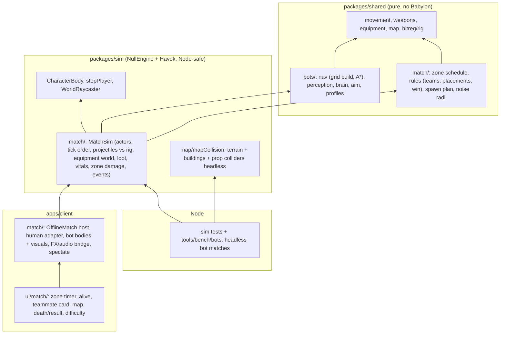
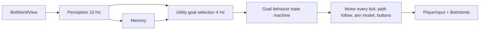

# Offline bots on Map v1: design

An offline battle royale match on Map v1: the human plus one bot teammate against 8 bots in 4 teams (5 teams × 2), a shrinking zone, knock-down and revive, easy/normal/hard. Bots play through the same shared simulation as players and the same brain later runs on the Node match server as M5 lobby bots.

Contracts: [`packages/shared/src/bots/types.ts`](../../packages/shared/src/bots/types.ts), [`packages/shared/src/match/types.ts`](../../packages/shared/src/match/types.ts), checked by `packages/shared/src/bots/contracts.test.ts`.

Contents:

1. [Decisions](#1-decisions)
2. [Architecture](#2-architecture)
3. [Navigation](#3-navigation)
4. [Perception](#4-perception)
5. [Brain](#5-brain)
6. [Aim and fire model, difficulty table](#6-aim-and-fire-model-difficulty-table)
7. [Tick budget and allocation rules](#7-tick-budget-and-allocation-rules)
8. [Match rules](#8-match-rules)
9. [Client integration](#9-client-integration)
10. [HUD](#10-hud)
11. [URL flags and DEV handles](#11-url-flags-and-dev-handles)
12. [Test strategy](#12-test-strategy)
13. [Work split](#13-work-split)
14. [Risks, deferrals, open questions](#14-risks-deferrals-open-questions)

---

## 1. Decisions

| Topic | Decision | Why |
|---|---|---|
| Bot control | A bot is a `BotBrain` that writes one `PlayerInput` (+ small `BotIntents`) per 60 Hz tick. Movement, weapons and equipment are the shared steps; no teleports, no speed or damage scaling | Server-ready (M5 lobby bots are just another input source); no cheating by construction |
| Where the match runs | A headless **`MatchSim`** in `packages/sim/src/match` (NullEngine + Havok, Node-safe) owns bots, projectiles, rules, zone. The client hosts it; the offline human stays on the existing `PlayerController`/`CombatSystem`/`EquipmentSystem` path and joins as a `MatchExternalActor` | Same code in Node tests and the browser; no risky refactor of the verified offline player; M5 server replaces the external actor with networked players |
| Navigation | **Deterministic 2.5D grid built from MapData** (terrain 0.5 m + per-prefab building span layers 0.25 m + 4 m coarse guide grid), time-sliced A*. Not Recast | Pure TS, no WASM dependency in `shared`, builds in ~0.5 s, bit-identical in Node and browser, cheap cost overlays (zone, danger, cover) |
| Hit registration for bot bullets | Shared procedural rig (`hitreg/rig.ts`, ADR 0003/0206) against every actor pose, including the human | Needed headless (no skinned meshes in Node); it is the M4 server model anyway |
| Human bullets on bots | Existing Havok bone hitboxes on the bot's `SoldierCharacter` (unchanged `CombatSystem` path) | Matches what the human sees; blood/wound code already works. Converges on the rig in M4 |
| Brain model | Utility AI picks a goal at 4 Hz with hysteresis; each goal is a small state machine; a motor layer turns move/aim targets into `PlayerInput` every tick | Easy to tune per difficulty, cheap, debuggable (goal + sub-state labels) |
| Perception | 10 Hz, FOV + awareness build-up + LOS rays on the injected static raycast, smoke transmittance, flash blindness, noise radii (ADR 0207), fading memory | Fair and server-safe: a brain only reads `BotWorldView` |
| Body blocking | **Deferred for bots** (CharacterBody still excludes `CollisionLayer.player`); bots steer to keep 0.9 m apart | Needs the SimWorld body sync TODO first; flag stays in `BrRules.bodyBlocking` |
| Landing | Offline v1 spawns each team on the two validated spawns of a distinct POI; `landing`/`glide` phases exist with 0 s duration as the hook | Product rule |

## 2. Architecture

### 2.1 Layers

- **Pure** (`shared/bots`, `shared/match`): state in, state out, seeded RNG (`hash32`/`createRng` from counters: `hash32(matchSeed, slot, counter)`), injected `RaycastFn`, typed arrays for grids, no `Math.random`, no `Math.hypot`.
- **Headless sim** (`sim/match`): the only code that touches `CharacterBody`, Havok rays and ports. `MatchSim` is constructed with ports:
  - `raycastWorld: RaycastFn` (static world, bullets pass fences),
  - `nav: NavQuery`,
  - `equipment: MatchEquipmentPort` (headless: its own `EquipmentWorld`; client: `EquipmentSystem`'s world),
  - `groundLoot: GroundLoot` (headless: `generateLoot`; client: `equipment.groundLoot`, same store the loot renderer draws),
  - `external: MatchExternalActor[]` (client: the human; headless: none),
  - `brainFactory: BotBrainFactory`.
- **Client host** (`apps/client/src/match`): subscribes to `player.onTick` after `EquipmentSystem` and `PlayerLife`, calls `matchSim.tick()`, renders bots, bridges events to HUD/FX/audio.

### 2.2 Actors and ids

- `slot` is the entity id everywhere: equipment ids, `VitalsHit.sourceId`, kill feed, projectile shooter. `slot = team × 2 + member`; the human is slot 0 (matches `LOCAL_PLAYER_ID = 0`), the teammate bot slot 1, enemy teams 1–4 are slots 2–9.
- Headless runs are all bots (slots 0–9).

### 2.3 MatchSim tick order (one 60 Hz tick)

1. **Rules pre-step:** phase timers, `zoneAt(tick)`, zone announcements/warnings.
2. **External actors:** read poses (the host already stepped the human this tick).
3. **Brains:** for each bot in slot order, build its `BotWorldView` (reused object) and call `brain.tick(view, out)`. Before combat (`warmup`), inputs are zeroed except aim.
4. **Bot sim step**, per bot in slot order (the `PlayerSim` order from equipment design §14.3):
   1. gates = `deriveEquipmentModifiers(equipment)` → `stepPlayer(body, {move, weapon}, input, dt, {gates})`
   2. `EquipmentInput` derived from input + intents with edge detection against last tick's input → `stepPlayerEquipment` → release → `equipment.spawnRelease(release, slot)`
   3. `syncWeaponsFromInventory` → `gateCombatInput` → `stepWeapon` → `commitWeaponsToInventory`; shots → projectiles (ids `slot << 20 | shotCounter << 4 | pellet`) and `brain.kickAim(recoilUp, recoilRight)`
   4. `PlayerInput.action`: pickup (≤ `INTERACT.reach` from eye + LOS ray, `pickUp` + `takeGroundItem`/`dropGroundItem`), use (`useItem`), drop
   5. revive hold (`Btn.interact` + `intents.reviveSlot`): team, range `VITALS.reviveRange`, reviver alive and idle → `stepRevive` (external target: `setReviver`)
5. **Projectiles** (all bot shots): `stepProjectiles` against `raycastWorld`; each segment is also tested with `segmentVsRig` against every other actor's posed rig (poses cached once per tick, skip actors beyond the segment AABB); nearest of world/rig wins → `computeDamage` → `applyDamage` (armor, `canBeKnocked` from team rules) or `external.applyDamage`.
6. **Equipment world** (headless only; the client's `EquipmentSystem` already stepped it): `stepEquipmentWorld` → damage requests, flashes.
7. **Vitals and teams:** zone damage every `damageIntervalTicks` to actors outside `zone.current` (downed included, `kind: "zone"`), `findTeamWipes` → `eliminate`, death drops (whole inventory as one ground pile at the feet), `canBeKnocked` refresh for external actors.
8. **Rules post-step:** eliminations → placements → win/end → `MatchEvent`s. Noises for next tick's perception are collected during steps 4–7.

Human-caused damage enters through `MatchSim.damageActor(ExternalDamage)` at any point in the host tick (the human's bullets during `CombatSystem.tick`, grenades during `EquipmentSystem.tick`); it runs the same pipeline as step 5 and emits the same events.

### 2.4 Who hits whom

| Shooter → victim | Path |
|---|---|
| Bot → bot | MatchSim projectile → world ray + rig → `applyDamage` |
| Bot → human | MatchSim projectile → world ray + rig on the human pose → `external.applyDamage` → `EquipmentSystem.damagePlayer` (HUD, hurt direction, knock) |
| Human → bot | `CombatSystem` Havok ray → bot bone hitbox (`SoldierHitboxes` in combat's registry) → `BotDamageable.applyDamage` → `matchSim.damageActor` |
| Human grenade → bot | `EquipmentSystem` world → `targets()` (bots as `EquipmentTarget`, index = slot − 1) → `matchSim.damageActor` |
| Bot grenade → anyone | Client: release into `EquipmentSystem`'s world (rendered, heard, damages human and bots through the rows above). Headless: MatchSim's world |
| Zone, fall, bleed-out | MatchSim (bots) / `PlayerLife` + `EquipmentSystem` (human, fall and bleed) and MatchSim zone damage via `external.applyDamage` |

Friendly fire is on in every row. Kill credit follows `DamageOutcome.killerId`; bleed-out and team-wipe kills credit `knockedById`.

### 2.5 Server path (M5)

`ServerMatch` keeps one `MatchSim` per match, with networked players as actors stepped from their input rings instead of external actors, and lobby bots as brains. Nothing in `shared/bots` or `shared/match` changes; the relevance layer (ADR 0207) can reuse the perception LOS cache.

### 2.6 Body blocking (deferred for bots)

`CharacterBody` excludes `CollisionLayer.player`, so bots and the human pass through each other. Bots add a separation steer (push away from any actor within 0.9 m, stronger for teammates) and never pick cover or loot points within 1 m of another actor. When `SimWorld` syncs other bodies before each step, `MatchSim` turns on player collision with no brain change.

## 3. Navigation

### 3.1 Choice: grid over Recast

| | 2.5D grid from MapData (chosen) | Recast/Detour (recast-navigation-js WASM) |
|---|---|---|
| Input | Exact analytic data: heightfield, prefab box/wedge parts, rooms/openings/stairs/entrances, prop collider groups | Triangle soup (2 M terrain triangles + buildings + props) |
| Determinism | Integer/float TS, same checksum in Node and browser (tested) | Float WASM, deterministic per build; harder to checksum |
| Dependency | None (fits ADR 0005: `shared` has zero runtime deps) | WASM package in `shared` or a `sim`-only nav, breaking pure bots |
| Build (1 km²) | ~0.5 s Node, ~0.7 s in the map worker | 5–20 s single-thread at 0.2 m cells, ~100+ MB peak |
| Memory | ~15 MB static + ~2 MB search scratch | 20–60 MB navmesh + tiles |
| Cost overlays (zone, danger, cover, vegetation) | Per-cell flags, trivial | Area types + query filters; dynamic costs awkward |
| Weakness | Stair-step paths (fixed by string pulling), large grids need hierarchy | Better corridor quality, crowd avoidance we don't need |

### 3.2 Layers

1. **Terrain layer** (world-aligned, `cellSize` 0.5 m over the playable square: 2000 × 2000 cells, `Uint8Array` of `NavFlag` bits, `Uint16Array` component ids).
   - Walkable when slope ≤ 40° (`Terrain.slopeTanAt`, margin under the 50° controller limit) and inside `playableHalfExtent`.
   - Blocked: every prop collider from `propColliderGroups(layout)` (cylinders and yaw boxes, fences too since they block movement), rasterized with `agentRadius` 0.3 m inflation; every building `base` rect (interiors come from layer 2).
   - Flags: `road` from the surface mask, `vegetation` from bush/fern instances (no collider), `nearObstacle` for cells within 1 cell of a blocked cell.
   - Walkable islands smaller than 8 m² are cleared (keeps component count < 65,535 and bots out of unreachable pockets).
2. **Building layers** (prefab-local, `buildingCellSize` 0.25 m, built once per prefab id, shared by all placements).
   - Per column, up to 4 **spans**: the top of each `floor`/`stairs`/`foundation`/`structure` part a capsule can stand on, with ≥ 1.8 m clearance (walkable) or ≥ 1.15 m (`crouchOnly`), tested with `PartBvh.overlapsBox` inflated by `agentRadius`.
   - Neighbours connect when |Δy| ≤ `MOVEMENT.maxStepHeight` (0.35 m), which links stair treads to landings automatically. `door` flags come from `openings`, `stairs` from flights, `indoor` from rooms.
   - Placement links: each prefab `entrance` and every perimeter span within 0.35 m of the terrain height outside connects to the nearest walkable terrain cell (world transform by `localToWorld`).
3. **Coarse guide grid** (4 m, 250 × 250): walkable if the fine cells in it share a dominant component; edge costs from the fine traversable fraction. Used for long routes only.

`NavNodeRef` packs terrain cells first (`iz × width + ix`), then building spans (per-placement base offset + prefab span index).

### 3.3 Search

- **A\*** with an octile heuristic on typed arrays: binary heap in an `Int32Array`, `Float32Array` g-scores, generation-stamped `Uint16Array` visited marks, no allocation per search.
- **Short routes (≤ 150 m):** fine A* restricted to a window of 320 × 320 terrain cells around start and goal (plus the building layers inside it).
- **Long routes:** coarse A* for the corridor, then fine A* toward the corridor point ~60 m ahead, refined again as the bot advances (hierarchical, only the next leg is fine).
- **Time slicing:** `requestPath` queues; the host calls `nav.update(BOT_SCHEDULE.navExpansionsPerTick)` (1,500) once per tick; requests resume where they stopped. A request that exceeds 40,000 expansions returns `partial` (or `unreachable` when `partial` is false).
- **Rejects early:** `reachable(a, b)` compares component ids in O(1); unreachable goals never enter the queue.
- **Costs:** base step × (1 + `avoid` circles) × (zone penalty 4× outside `options.zone`) × (1 − 0.3 × `preferCover` on `vegetation`/`nearObstacle` cells); road cells ×0.95.
- **Smoothing:** string pulling with `lineWalkable` (a supercover line over one layer; crossing a door or stair span keeps that waypoint). Output `NavPath` holds feet-height points and flags (walk through doors/stairs, crouch on `crouchOnly`).
- `sampleRing` returns seeded walkable candidates for cover, strafe, flee and loot approach.

### 3.4 Estimates (Map v1, M2 P-core, Node 24)

| Part | Size | Build |
|---|---|---|
| Terrain flags, 4 M cells × 1 B | 4.0 MB | slope pass ~0.16 s |
| Component ids, 4 M × 2 B | 8.0 MB | flood fill ~0.15 s |
| Prop and building rasterization (3,857 colliders, 43 bases, 2,103 bushes) | in the flags | ~0.03 s |
| Building spans, 12 prefabs (~1,300 m² × 16 cells/m² × ~1.5 spans) ≈ 31 k spans | ~0.4 MB | ~0.08 s |
| Placement links (43 buildings) | < 0.05 MB | < 0.01 s |
| Coarse grid 62.5 k cells + portal costs | ~0.5 MB | ~0.05 s |
| **Static total** | **≈ 13–15 MB** | **≈ 0.5 s** (worker ≈ 0.7 s) |
| Search scratch (fine window 102 k + coarse 62.5 k nodes × 10 B) | ≈ 1.7 MB | per request |

- **Client:** build in the map worker after the layout (the nav module is pure, so it runs there) and transfer the arrays.
- **Bake:** add a gzip bake like the terrain (estimate ~0.5 MB) only if the worker build exceeds 1.5 s.
- **Server:** one `NavGrid` per map, shared by packed matches.
- **Checksum:** `NavGridInfo.checksum` goes into `mapV1.test.ts`, so a stale layout fails CI like the terrain bake.

## 4. Perception

Runs at 10 Hz per bot (`(tick + slot) % 6 === 0`); memory decay and damage reactions run every tick.

- **Candidates:** `view.actors` within `spotRangeMeters` (×1.5 while the bot is scoped), nearest first, at most `maxLosCandidates` (6) ray tests per update. Teammates are always known (`view.teammates`, squad comms).
- **Field of view:** inside `fovDegrees` or within `proximityMeters` (any direction). Outside the central 30°, gain × `peripheralFactor`.
- **Line of sight:** `raycast(eye → target eye)` and, alternating per update, `eye → target chest` (1.2 m standing, 0.8 m crouched, 0.35 m downed). Visible when either is clear and `smokeBlocksSight(smokes, eye, point)` is false. Fences don't block (they are not in the static ray set, same as bullets).
- **Awareness** (0..1, spotted at 1), gained per second while visible:
  `awarenessPerSecond × (50 / max(distance, 10)) × stance (stand 1, crouch 0.6, downed 0.5) × motion (still 0.5, walk 1, sprint 1.4) × (firing ? 3 : 1) × (vegetation cell and crouched and > 15 m ? 0.3 : 1) × peripheral`.
  Decays at 0.5/s when not visible. Being damaged by the actor or seeing it fire within 30 m sets awareness to 1.
- **Reaction:** on reaching 1, `reactTick = tick + seeded sample of reactionSeconds`. Decision and aim code ignore the actor before `reactTick`.
- **Hearing:** each `NoiseEvent` whose radius × `hearingScale` covers the bot creates or refreshes a memory entry (`source: "heard"`) at the noise position plus a seeded Gaussian error with σ = `noiseErrorFraction` × distance. Radii follow ADR 0207:

  | Noise | Radius |
  |---|---|
  | Footstep crouch / walk / sprint | 8 / 20 / 40 m |
  | Landing (fall speed > 6 m/s) | 25 m |
  | Reload, heal, pin pull | 12 m |
  | Pistol / shotgun / rifle / sniper shot | 350 / 450 / 800 / 1,000 m |
  | Explosion | 300 m |
  | Bullet impact near the bot (≤ 4 m) | 40 m, position = shooter direction estimate |

  Enemies within 40 m that are heard and in the bot's hemisphere get awareness +0.35.
- **Damage taken:** sets `lastDamageTick`, `lastDamageFrom` (reverse bullet direction plus seeded ±10° error), awareness 1 on the attacker when visible, and otherwise a memory entry `source: "damage"` 20 m back along the direction.
- **Flash and smoke:** while `vitals.blindSeconds > 0`, no visual updates, awareness decays, aim noise ×4. While `deafSeconds > 0`, no hearing. Visible throwables are LOS-tested like actors (flashbang dodge, grenade escape).
- **Memory:** a fixed pool of 8 `MemoryEntry`s (slot, position, velocity, tick, confidence, source). Confidence decays linearly over `forgetSeconds`; the lowest confidence is evicted. Visible actors refresh their entry every update. Positions of remembered enemies extrapolate for at most 1.5 s.
- **Loot knowledge:** `queryLoot` within 40 m, then keep items in the bot's current building (by room bounds) or with a clear ray eye → item + 0.15 m. The loot scan runs at 2 Hz.
- **Threat selection** (`threatSlot`): visible hostile and awake, scored by `1/distance` × (aiming at the bot within 10° ? 2 : 1) × (recently damaged the bot ? 3 : 1) × (downed ? 0.3 : 1).

## 5. Brain

### 5.1 Layers

### 5.2 Goals and scores (0..1)

The current goal gets +0.10 hysteresis and keeps at least 1 s, except that damage lets `cover`, `flee` and `engage` preempt immediately.

| Goal | Score | Behavior summary |
|---|---|---|
| `engage` | threat visible, awake, within the held weapon's `maxRange`, ammo available: 0.6 + 0.3 × health/100 + 0.1 (target downed or reloading) − 0.3 when outranged (enemy scoped at > our max range) | Weapon by range → ADS beyond `hipFireMeters` → aim model → bursts → strafe → reload in cover or in place |
| `cover` | taking damage in the last 1.5 s, or magazine < 20 % with a threat, and a `coverChance` roll (once per threat encounter): 0.75–0.85 | Pick cover, sprint there, crouch, reload/heal, peek |
| `flee` | health < `fleeHealth` and a visible threat, or no ammo for any gun: 0.85 | Point 40–80 m away from the threat, inside the zone, cover-weighted; sprint; then `heal` |
| `heal` | health < 75 with heals and nothing seen/heard for `healSafeSeconds`: 0.5 + 0.4 × (1 − health/75); in cover below `fleeHealth` with a threat: 0.7; boost when health < 60 and safe: 0.4 | Stop, crouch, `action: use` (medkit < 40 HP, first aid < 75, else bandage); on damage → cover |
| `revive` | teammate downed and reachable: 0.7 + 0.2 × (1 − downedHealth/100) − (visible threats × (1 − `reviveRisk`) × 0.25) | Optional smoke (`smokeReviveChance`), path, hold interact with `reviveSlot`; normal/hard cancel on damage |
| `rotate` | p = (path time to the safe point + `zoneMarginSeconds`) / time until the zone edge passes the bot: 0.9 × clamp(p, 0, 1); outside the current circle: 0.95 | Path with `zone` option, sprint, engage only threats < 60 m or attackers |
| `loot` | best item value (5.3) × 0.6, 0 with a visible threat, × 0.5 once phase 3 is announced | Path to item, look at it, `action: pickup` when within 2.2 m |
| `regroup` | teammate alive and farther than 40 m: 0.3 + 0.3 × min(1, (d − 40)/60). Human teammate: follow within 15–30 m at 0.45 whenever the human moves > 25 m away | Path to a point 4–8 m beside/behind the teammate, face outward |
| `investigate` | recent hostile memory (heard/damage) not visible: 0.35 × confidence | Approach with cover preference, ADS, for `chaseSeconds` |
| `idle` | 0.05 | Hold near cover, scan (sweep yaw ±60°) |

`dead` is forced when life is dead. While downed, the brain only crawls toward the nearest teammate or cover and away from threats.

### 5.3 Loot needs

Value = need × quality × exp(−distance / 25 m). An item is skipped when `maxAddable` is 0 or when it was marked in `skippedLoot`.

| Item | Need |
|---|---|
| Weapon | unarmed 1.0; pistol only → primary 0.8; one primary → second primary 0.35. Quality: rifle 1, shotgun 0.7 (0.4 on hard, who prefer range), sniper 0.6 (0.9 on hard if a rifle is held), pistol 0.3 |
| Ammo for a carried weapon | 1 − reserve/target (5.56: 150, 7.62: 30, 9 mm: 48, 12 g: 28) |
| Helmet / vest | none → 0.7; upgrade 0.35 per level |
| Backpack | 0.3 per level above current |
| Heals | bandage 0.6 × (1 − count/10), first aid 0.6 × (1 − count/3), medkit 0.5 × (1 − count/1) |
| Boosts | 0.25 × (1 − count/3) |
| Throwables | frag 0.3 × (1 − count/2), smoke 0.25 (normal/hard), flash 0.15 (hard), molotov 0.2 × (1 − count/1) |

Weapon pickups set `intents.replaceSlot` to the worse primary when both are full.

### 5.4 Combat micro

- **Weapon choice:** sniper when the target is > 80 m and the bot has one (easy never scopes beyond 150 m); rifle 10–180 m; shotgun < 15 m; pistol fallback. Switching sends `select` and waits for `equipSeconds`.
- **Strafe:** every `strafeIntervalSeconds`, with `strafeChance`, pick left/right perpendicular to the target if `lineWalkable` 2 m that way; normal/hard crouch at > 60 m with a rifle (50 %).
- **Reload:** empty or < 20 % with no visible threat → reload in place; with a threat → `cover` first when cover ≤ 8 m.
- **Peek:** from cover, step to the peek point (sampled candidate with LOS to the last-known position) for `peekSeconds`, fire, return. Hard alternates sides.
- **Grenades:** target hidden in cover for ≥ 4 s at 8–35 m, frag or molotov carried, cooldown ready, `grenadeChance` roll → `select = 5`, `Btn.fire` hold to pull, aim pitch solved from `throwLaunch` speed (analytic no-drag solve, then 3 correction iterations with `predictThrowArc` on a scratch set), release. Hard cooks frags for `fuse − flightTime − 0.5 s`. Bots never throw when a teammate is within 6 m of the predicted landing point.
- **Friendly fire:** before pressing fire, `view.actorOnSegment(eye, aimPoint, self)` must not return a teammate; if it does, strafe to clear the line.
- **Smoke:** a target entering smoke becomes a memory entry; `smokeSuppressChance` keeps firing at the last-known position for `smokeSuppressSeconds`.
- **Flashbangs:** a visible flashbang in flight within 20 m → `flashDodgeChance` roll → turn yaw 120° away until detonation.
- **Knocked enemies:** hard finishes a knocked enemy when no other threat is visible; easy/normal prefer standing threats.

### 5.5 Motor (every tick)

- **Path following:** pure pursuit on the `NavPath` with 1.2 m look-ahead. Replan when the goal moves > 3 m, on a `door`/`stairs` flag change, or when off-path by > 2 m.
- **Look:** while not aiming, `aimYaw` turns toward the move direction at `maxTurnRateDeg`; pitch eases to level.
- **Axes:** `PlayerInput` axes are −1/0/1 relative to yaw. When aiming somewhere else, pick the (forward, right) pair whose direction is closest to the desired world direction, and dither between the two nearest sectors (error accumulator) so the average path is straight.
- **Buttons:** sprint only on straight path legs without aim (and never on `stairs`/`door` waypoints or inside rooms); crouch on `crouchOnly` waypoints; separation steer (2.6).
- **Unstuck:** horizontal speed < 0.5 m/s for 0.5 s while pushing → jump; still stuck after 1 s → 1 m sidestep toward the most open `sampleRing` point; after 3 s → replan with a 1.5 m `avoid` circle at the spot and mark the target (loot/cover) as skipped.
- **Output:** `input.tick`, axes, buttons (`Btn`), `select`, `yawQ = quantizeYaw(aimYaw)`, `pitchQ = quantizePitch(aimPitch)`, `viewOffset8 = 0`, `action` (pickup/use/drop).

## 6. Aim and fire model, difficulty table

The bot keeps a continuous aim (`aimYaw`, `aimPitch`). Each tick:

1. **Desired aim point:** the target's feet + aim point height (chest 1.25 m, upper chest 1.4 m, neck 1.55 m; ×0.58 crouched; 0.35 downed), led by `leadAccuracy × velocity × flightTime` (flight time from `muzzleVelocity`) and raised by `dropAccuracy × 0.5 g t² × gravityScale`.
2. **Error offset:** on acquiring a target (or after 1.5 s without LOS), set a 2D angular offset of magnitude `acquireErrorDeg + velocityErrorScale × target angular speed` in a seeded direction. It decays with time constant `acquireSeconds`.
3. **Tracking noise:** smooth value noise per axis (seeded by `hash32(seed, slot, floor(t × trackingNoiseHz))`, cubic interpolation) with RMS `trackingNoiseDeg`, plus `velocityErrorScale × angular speed` in the lateral axis.
4. **Turn:** aim moves toward desired + offset + noise, clamped to `maxTurnRateDeg × dt` (critically damped, no overshoot).
5. **Recoil:** `kickAim(up, right)` applies the kick immediately. After `recoilDelaySeconds`, `recoilCompensation` × each kick is pulled back over 0.12 s.
6. **Flinch:** on damage, a seeded `flinchDeg` offset is added to the error.
7. **Fire gate:** the aim error is below `max(fireToleranceScale × targetAngularRadius, 0.4°)`, `firstShotDelaySeconds` has passed since first on target, no teammate is on the line, and the current burst isn't done. Automatic weapons hold fire for the burst length (by range band), then pause `burstPauseSeconds`. Semi and bolt weapons tap when the gate opens, at most at the fire rate.

**Difficulty table** (`BOT_PROFILES` in `shared/bots/profiles.ts`):

| Group | Parameter | Easy | Normal | Hard |
|---|---|---|---|---|
| Perception | FOV | 90° | 110° | 130° |
| | Peripheral factor | 0.25 | 0.4 | 0.6 |
| | Spot range (standing, open) | 140 m | 220 m | 320 m |
| | Awareness / s at 50 m | 1.2 | 2.2 | 3.5 |
| | Proximity sense | 3 m | 5 m | 8 m |
| | Reaction time | 0.45–0.70 s | 0.28–0.42 s | 0.16–0.26 s |
| | Hearing scale / noise error σ | 0.6 / 25 % | 1.0 / 15 % | 1.2 / 8 % |
| | Forget | 8 s | 15 s | 25 s |
| Aim | Max turn rate | 180°/s | 320°/s | 520°/s |
| | Acquisition time constant | 0.55 s | 0.32 s | 0.18 s |
| | Acquisition error | 9° | 6° | 3.5° |
| | Tracking noise RMS / frequency | 1.8° / 1.2 Hz | 0.9° / 1.6 Hz | 0.45° / 2.0 Hz |
| | Velocity error scale | 0.12 | 0.07 | 0.035 |
| | Lead / drop accuracy | 0.4 / 0.3 | 0.75 / 0.7 | 0.95 / 0.95 |
| | Recoil compensation / delay | 30 % / 0.25 s | 60 % / 0.15 s | 85 % / 0.08 s |
| | First-shot delay | 0.35 s | 0.20 s | 0.10 s |
| | Fire tolerance scale | 3.0 | 2.0 | 1.4 |
| | Aim point | chest | upper chest | neck |
| | Flinch | 4° | 3° | 2° |
| Fire | Close / mid band | 20 / 60 m | 25 / 80 m | 30 / 100 m |
| | Auto burst close / mid / long | 6–12 / 3–5 / 1–2 | 8–15 / 3–6 / 1–3 | 10–30 / 4–8 / 2–4 |
| | Burst pause | 0.5–0.9 s | 0.3–0.6 s | 0.2–0.4 s |
| | Hip fire within | 6 m | 8 m | 10 m |
| | Max range rifle / pistol / shotgun / sniper | 110 / 35 / 15 / 150 m | 180 / 45 / 18 / 350 m | 260 / 60 / 22 / 500 m |
| | Smoke suppress chance / time | 0 | 0.3 / 1.0 s | 0.6 / 1.5 s |
| Tactics | Strafe chance / interval | 0.25 / 1.0–1.6 s | 0.55 / 0.6–1.1 s | 0.85 / 0.35–0.7 s |
| | Cover chance / peek time | 0.35 / 1.5–2.5 s | 0.7 / 1.0–1.8 s | 0.95 / 0.6–1.2 s |
| | Grenade chance / cooldown | 0.1 / 40 s | 0.3 / 25 s | 0.5 / 15 s |
| | Smoke before revive / flash dodge | 0 / 0 | 0.4 / 0.3 | 0.8 / 0.7 |
| | Flee health / heal safe time | 20 / 4 s | 35 / 6 s | 45 / 8 s |
| | Zone margin / chase time | 5 s / 4 s | 20 s / 8 s | 35 s / 12 s |
| | Revive risk | 0.8 | 0.5 | 0.3 |

**Tuning targets** (headless duel harness, rifle ADS, target strafing at 3 m/s, standing, no armor):

| Hit rate | Easy | Normal | Hard |
|---|---|---|---|
| 30 m | 15–25 % | 30–40 % | 45–60 % |
| 80 m | 5–10 % | 12–20 % | 25–35 % |
| Time to kill at 30 m (median) | 3–5 s | 1.8–2.8 s | 1.0–1.6 s |

The seeded jitter on every span sample and noise means two bots of the same difficulty behave differently but reproducibly per `(matchSeed, slot)`.

## 7. Tick budget and allocation rules

Rates per bot, staggered by slot so work spreads across ticks:

| Work | Rate | Cost per run (estimate) | Per tick, 9 bots |
|---|---|---|---|
| Motor + aim + input | 60 Hz | ≤ 15 µs | ≤ 0.14 ms |
| Perception (≤ 12 rays, smoke checks) | 10 Hz | ≤ 30 µs | ~0.05 ms |
| Goal selection + cover sampling (≤ 12 candidates × 2 rays) | 4 Hz | ≤ 80 µs | ~0.05 ms |
| Loot scan | 2 Hz | ≤ 30 µs | ~0.01 ms |
| A* (shared budget 1,500 expansions) | when queued | ~0.15–0.3 ms | usually 0 |
| **Brain total** | | | **p50 ≤ 0.25 ms, p99 ≤ 0.8 ms** |
| Bot sim steps (9 × movement 0.028 ms + weapon + equipment + projectiles) | 60 Hz | | ~0.35 ms |

- The headless test gates brain p99 at ≤ 1.0 ms per tick for 10 bots on the dev machine (loose, to avoid flakes) and prints the real numbers. The server budget (§6.1 of the architecture doc) counts bots as players plus this brain line; re-measure in M5.
- **Allocation rules** (hot path = anything per tick):
  - Brains own fixed pools: `PerceivedActor[10]`, `MemoryEntry[8]`, `NavPath` with 256 points, reusable `Vec3` scratch objects, a `Float32Array(36)` for ring samples, a `LootItem[]` reused by `queryLoot`.
  - `BotWorldView`, `BotSelfView`, `ActorSnapshot`s and `TeammateView`s are built once per bot and mutated in place by `MatchSim` (cast away `readonly` only in `sim/match`).
  - No closures, spread, `map`/`filter`, template strings or `new` objects in `tick()` after warm-up. Events are the exception (they already allocate in the shared equipment steps); keep them off the per-tick happy path.
  - Typed arrays for grids and heaps; `Math.sqrt` not `Math.hypot`; `len2`/`len3`.
  - RNG: `hash32(seed, slot, counter++)` per decision; never `Math.random`.
  - The host copies `BotInput` into any input ring; the brain reuses its object.

## 8. Match rules

Pure module `shared/match/{zone,rules,spawns}.ts`; `MatchSim` feeds it facts and publishes `MatchState` and `MatchEvent`s.

### 8.1 Phases

| Phase | Offline v1 | Later (M5) |
|---|---|---|
| `warmup` | 5 s countdown at the spawns; inputs frozen except look | Lobby, backfill |
| `landing` | 0 s (spawn plan below) | Landing select 30 s (`TeamSpawnPlan` comes from choices) |
| `glide` | 0 s | ≤ 90 s glide |
| `combat` | Zone runs; ends on the win condition or time cap | Same |
| `ended` | Freeze inputs, result screen, `endLingerSeconds` 8 s | `MatchEnd` |

**Spawn plan:** choose 5 distinct POIs from the 6 non-training POIs by seed; each team takes that POI's two validated `MapData.spawns`, facing the POI. A later landing hook provides `TeamSpawnPlan[]` instead.

### 8.2 Zone

The initial circle is center (0, 0), r 710 m (covers the ±500 m square). Phase N is announced when phase N − 1's shrink ends; phase 1 is announced 60 s into combat.

| Phase | Announced | Wait | Shrink | End radius | Damage outside |
|---|---|---|---|---|---|
| 1 | 1:00 | 120 s | 60 s (3:00–4:00) | 400 m | 1 HP/s |
| 2 | 4:00 | 60 s | 45 s (5:00–5:45) | 250 m | 2 HP/s |
| 3 | 5:45 | 45 s | 40 s (6:30–7:10) | 150 m | 3 HP/s |
| 4 | 7:10 | 40 s | 30 s (7:50–8:20) | 90 m | 5 HP/s |
| 5 | 8:20 | 30 s | 30 s (8:50–9:20) | 45 m | 8 HP/s |
| 6 | 9:20 | 25 s | 25 s (9:45–10:10) | 20 m | 12 HP/s |
| 7 | 10:10 | 20 s | 25 s (10:30–10:55) | 0 m | 20 HP/s |

- **Length:** the circle closes at 10:55 of combat (11:00 with the countdown), so matches last about 10–11.5 min. The time cap is 12:00 of combat.
- **Centers:** seeded by `hash32(seed, phase)`. The new center lies within `from.r − to.r` of the previous center and within ±(500 − `edgeMargin` (40) − 0.5 × `to.r`) of the origin. It is re-rolled (up to 16 tries, then the previous center) when an injected `isValidCenter(x, z)` (nav: walkable, main component) fails.
- **`zoneAt(tick)`:** lerp center and radius during the shrink. The pure function is shared by the rules, HUD, bots and the future client (netcode §8.2 wire fields match `ZonePhase`).
- **Damage:** every 6 ticks, `dps × 0.1` of `kind: "zone"` to actors whose horizontal distance to the center exceeds `current.r`, downed included, no armor. A zone knock or kill has cause `"zone"`.
- **Warnings:** `zoneWarning` events 30 s and 10 s before each shrink.
- `timeScale` multiplies every duration (tests use 0.25; DEV `?zoneScale=`).

### 8.3 Teams, knock, placements, win

- **Knock:** reaching 0 HP knocks while `canBeKnocked(slot, team, members)` holds; otherwise the actor dies. `findTeamWipes` after every damage and bleed event eliminates downed members of teams with nobody standing (kill credited to `knockedById`, cause `"teamWipe"`). `reviveSeconds` 5, range 2 m, 10 HP after revive (existing `VITALS`).
- **Death drop:** a dead actor's inventory (weapons with magazines, armor with durability, backpack, stacks) drops as one ground pile at the feet (`dropGroundItem`, shared `pileId`).
- **Team eliminated** when no member is alive or downed. Placement = teams in play at the start of that tick; teams eliminated on the same tick share it.
- **Win:** after eliminations, one team in play → it gets placement 1, `win` + `matchEnded{reason: "lastTeam"}`. Zero in play (last teams wiped on the same tick) → they share placement 1, no `win`, `reason: "allDead"`.
- **Time cap:** rank the remaining teams by standing members, then total health, then team index; `reason: "timeCap"`.
- **Human death offline:** the match continues (spectate). No respawn in match mode.

### 8.4 Events (`MatchEvent`)

`phaseChanged`, `zoneAnnounced`, `zoneShrinkStarted`, `zoneWarning`, `damage`, `knock`, `reviveStarted`, `reviveCancelled`, `revived`, `kill` (killer, victim, cause, headshot, knockedBy, teamKill), `teamEliminated` (placement), `win`, `matchEnded` (reason, `TeamResult[]`). Presentation-only `MatchFxEvent`s: `shot`, `weapon`, `impact`, `throwRelease`, `itemUse`.

Kill feed lines: "A knocked B with AR-4", "A killed B with AR-4 (Headshot)", "B bled out", "B died to the zone", "Team 3 eliminated (#4)".

## 9. Client integration

### 9.1 Wiring (`apps/client/src/match/OfflineMatch.ts`)

1. `Game.ts` (lead): when `?bots=1`, force Map v1, don't build `TargetRange` dummies for combat, build the `NavGrid` in the map worker, then `OfflineMatch.create({ scene, world, player, combat, equipment, life, presentation, hud, config })`.
2. The `OfflineMatch` constructor:
   - `createNavQuery(grid)`
   - `MatchSim` with ports: raycaster (`WorldRaycaster` with `WORLD_ONLY_MASK`), `equipment` port (`EquipmentSystem`), `groundLoot` (`equipment.groundLoot`), external actor = `HumanActor` adapter, `createBotBrain`.
   - Subscribes `player.onTick` (after equipment and life) → `matchSim.tick()`.
3. Frame update: `botBodies.update(dt, clock.alpha)` before `scene.render()`; HUD update after.

### 9.2 Bot bodies

- **Physics:** a `CharacterBody` per bot in the client scene (the same class `stepPlayer` requires), created by `MatchSim` through a `createBody(feet)` port (client: `new CharacterBody(scene, feet)`; headless: `SimWorld.createBody`).
- **Visuals:** a `SoldierCharacter` per bot (`targets/SoldierCharacter`) with `damage: { registry: combat.hitboxRegistry, owner: BotDamageable }`:
  - `root.position` = lerp(previous tick feet, feet, `clock.alpha`); rotation = aim yaw
  - `motion.velocityX/Z` = velocity in the soldier's frame, `grounded`, `crouched` (stance ≠ stand), `sprinting`, `aiming` (adsBlend > 0.5)
  - `MatchFxEvent`s → `fire()`, `reload(seconds)`; damage → `hit()`; kill → `die(direction)`
  - Downed: crouch pose lowered by 0.45 m until a crawl clip exists (asset request); hitboxes stay on (downed bots can be finished).
- **Hitboxes:** bone-driven `SoldierHitboxes` for the human's bullets; the rig (`poseHitboxes` from the sim pose) for bot bullets. `?botDebug=1` draws both to catch drift.
- **Known limit:** every soldier model carries the rifle clone.

### 9.3 Human adapter (`HumanActor implements MatchExternalActor`)

- `readPose` from `PlayerController` (feet, `getEyeToRef`, move state, aim, `combat.weaponState`).
- `applyDamage` → `EquipmentSystem.damagePlayer` (armor, knock); returns the outcome from the vitals diff.
- `setCanBeKnocked` → `equipment.canBeKnocked` (replaces `PlayerLife`'s `teammate` option in match mode); `setReviver(slot)` → `equipment.setReviver`.
- `eliminate` → `PlayerLife` match mode: no respawn, camera to spectate.
- **Revive the other way:** `EquipmentOptions.teammates()` returns the bot teammate as a `ReviveTarget` whose `setVitals` writes into `MatchSim` (hold F works unchanged).

### 9.4 Presentation and audio

- Bot `shot` events → tracers, muzzle flash at the soldier's rifle muzzle, 3D gunshot through `GameAudio.playGunshot` with distance/occlusion (the same mix path as remote players), near-miss cracks from the tracer sim.
- `impact` → `ImpactEffects`; `damage` on a bot → blood through `BloodEffects` on the soldier (`woundBone`).
- Footsteps from bot velocity and grounded state through `FootstepSystem` (remote-player path).
- Bot grenades are already rendered by `EquipmentPresentation` (they live in `EquipmentSystem`'s world).

### 9.5 Requests to existing files (additive; owner in brackets)

| File | Change |
|---|---|
| `combat/CombatSystem.ts` [C] | `get hitboxRegistry(): HitboxRegistry`; option `{ targets: false }` to skip `TargetRange` in match mode |
| `combat/hitboxes.ts` [C] | `DamageResult` optional `armorAbsorbed`, `armorSlot`, `armorDestroyed`, `knocked` so HUD hit markers show bot armor and knocks |
| `equipment/EquipmentSystem.ts`, `equipment/types.ts` [C] | `spawnExternalRelease(release, slot)`; `EquipmentTarget.applyFlash?(exposure)`; `targets()` indices documented as slot − 1; `dropInventoryAt(position)` for the human's death drop |
| `player/PlayerLife.ts` [C] | option `respawn: false` (match mode); `onEliminated` hook for spectate |
| `fx/WeaponPresentation.ts` [C] | `playRemoteShot(weaponId, origin, direction, muzzleNode?)`, `playRemoteImpact(...)`; no changes to `equipment/presentation/**` |
| `audio/AudioDirector.ts` [C] | remote gunshot and footstep entry points if the net path's aren't reusable as-is |
| `ui/KillFeed.ts`, `ui/PlayOverlay.ts`, `ui/Compass.ts`, `ui/Hud.ts`, `ui/hud.css` [C] | generic kill feed lines; difficulty picker; zone marker; match HUD mount |
| `game/Game.ts` [lead] | wiring snippet from agent C |
| `packages/shared/src/index.ts` [lead] | `export * from "./bots/index"`, `export * from "./match/index"` when the implementations land |

## 10. HUD

Minimal PUBG-style, DOM overlay in `ui/match/**`, CSS tokens from `hud.css`:

- **Top right:** alive count ("Alive 7") and teams ("Teams 4"), kill count; kill feed below (knocks in a lighter style, team kills marked).
- **Zone timer** above the compass: "Restricting play area in 0:45" (wait) / "Restricting play area" + bar (shrink); a red tint and "Outside safe zone" when outside; `zoneWarning` flashes it.
- **Compass:** a zone marker at the bearing to the next circle's nearest edge when outside, with distance.
- **Teammate card** (bottom left above health): name, health bar, knocked state with bleed-out bar, revive progress, distance and direction when > 30 m.
- **Big map (M):** the `mapV1.svg` overview as an image, current circle (white) and next circle (blue), own position and heading, teammate marker, kill/death markers of your team. Closes on M or Esc.
- **Zone in the world:** a translucent blue cylinder wall at `zone.current` (one mesh, radius/center updated per frame, fades with distance), and a blue screen edge while outside.
- **Death screen:** "You were killed by Bot Kilo with K-98 (Headshot)" + placement if your team is out; buttons "Spectate teammate" (follow cam on the bot teammate, [ and ] cycle alive actors when the team is out) and "New match".
- **Result screen:** "#1 WINNER" or "#3 of 5", team kills, damage, survival time; "New match" / "Back".
- **Difficulty selection** on the play overlay when `?bots=1`: Easy / Normal / Hard (default normal or `?difficulty=`), "Start match" requests pointer lock and starts the countdown. Countdown numbers in the center.

## 11. URL flags and DEV handles

| Flag | Effect |
|---|---|
| `?bots=1` | Offline match (implies `?map=v1`) |
| `&difficulty=easy\|normal\|hard` | Default normal; the overlay can change it before start |
| `&seed=<u32>` | Match seed (default: random, printed to the console) |
| `&teams=2..5` | Team count (default 5) |
| `&teammate=bot\|none` | Bot teammate (default bot) |
| `&zoneScale=0.25` | DEV: `timeScale` for zone and timings |
| `&botDebug=1` | DEV: labels (goal, sub-state, HP), paths, perception rays, nav cells near the camera, rig vs bone hitboxes; F7 toggles |
| `&spectate=1` | DEV: bots-only match, free/follow camera ([ ] cycle) |
| `&botsPassive=1` | DEV: bots never fire (navigation/loot testing) |

DEV console `__twobullets.match`:

- `state` (MatchState), `bots` (brains), `nav` (NavQuery)
- `debug(slot)` → `BotDebugState`
- `events(n)` → last n events
- `skipZone()` → jump to the next announce or shrink
- `timeScale(x)`
- `follow(slot)`
- `killActor(slot)`, `damageActor(slot, amount)`
- `placeBot(slot, x, z)` (DEV only; restores the body at the point)
- `navStats()` → build ms, bytes, components

## 12. Test strategy

### 12.1 Unit (vitest, pure)

- **Nav:**
  - synthetic terrain + one prefab: door passage, two-story stairs up and down, slope limit, prop inflation, crouch passage flag, islands cleared, `reachable`
  - A* equals Dijkstra on small grids; time-sliced result equals one-shot; windowed + coarse refinement reaches far goals
  - checksum determinism
- **Nav on Map v1** (one cached build per test file):
  - all 14 spawns walkable in one main component
  - every building entrance and ≥ 98 % of loot spots reachable from the town square
  - watchtower platform reachable
  - build < 2 s, bytes < 24 MB
- **Zone:** `zoneAt` continuity at phase boundaries, containment of each next circle, seeded determinism, the schedule sums to 10:55, `timeScale`.
- **Rules:** knock vs kill by team state, team wipe credit to the knocker, placements with same-tick wipes, `allDead`, time-cap ranking, death drop contents.
- **Aim model:** error distributions per difficulty against an analytic strafing target (median error ordered easy > normal > hard); recoil compensation reduces vertical drift; the fire gate never opens with a teammate on the line.
- **Brain fixtures** (hand-built `BotWorldView` + fake nav):
  - unarmed bot prefers a weapon over ammo
  - low and safe → heals; low with a visible threat → flees or covers
  - downed teammate and no threat → revives
  - outside the next circle with too little time → rotates
  - never reads `view.actors` outside `perception.ts` (lint-style test on imports/usages)
- **Rig:** analytic segment tests for head/body/limb, crouch and prone poses.

### 12.2 Headless (Node + Havok + Map v1 collision, `packages/sim/test/match/**`)

- **Smoke match (in `pnpm test`):** 10 bots, normal, fixed seed, `timeScale` 0.25 (~10 k ticks). Asserts:
  - the match ends (`lastTeam` or `allDead`) before the cap
  - ≥ 1 kill
  - ≥ 7 bots armed by the first shrink
  - no NaN positions, no body below `killY`
  - **no stuck bot:** a bot with an active path, not engaging, healing, reviving, using or downed, moves < 1.5 m over 10 s = incident; 0 incidents lasting ≥ 20 s
  - brain p99 ≤ 1.0 ms/tick
  - wall time ≤ 60 s
- **Zone kills:** brains replaced by `idle` → every death has cause `"zone"`, and placements follow death order.
- **Determinism:** the same seed twice for 2,000 ticks → identical event log hash and final positions.
- **Duel harness:** a bot vs a scripted strafing target on open ground at 30/80 m per difficulty → reports hit rates against the §6 targets (informational, not gated).
- **Full-length script** (manual, one heavy process at a time): `node --experimental-transform-types tools/bench/bots/match.ts --seed 1 --difficulty normal --matches 3 --scale 1` prints match length, kills per difficulty, stuck incidents, brain and sim ms p50/p99.

### 12.3 Browser checks (lead, `browser-verify` skill)

1. `?bots=1`: difficulty picker, start → countdown → spawn at a POI with the bot teammate beside you.
2. The teammate follows, loots nearby, regroups after you run 60 m.
3. `?bots=1&spectate=1&botDebug=1`: bots path through doors, climb the watchtower, loot, fight; no bot stuck on stairs or fences.
4. A bot shoots you: health drops, damage direction, kill feed; you get knocked, the teammate revives you in 5 s.
5. You shoot a bot: hit marker, blood, knock → kill, kill feed, death pile on the ground.
6. Hold F on the knocked bot teammate: revive completes.
7. Zone wall visible, timer counts, damage outside, `match.skipZone()` advances.
8. Death screen → spectate teammate; kill all enemies with `match.killActor` → result screen #1.
9. Performance: ask the user to run `?bots=1&spectate=1` with F4 (automation tabs are throttled).

## 13. Work split

Four implementation agents, exclusive write ownership. All read the contracts; contract changes are additive and go through the lead.

| Agent | Owns (write) | Delivers | Depends on | Parallel |
|---|---|---|---|---|
| **N: Navigation** | `packages/shared/src/bots/nav/**`, `tools/bench/bots/nav.ts` | `buildNavGrid(input): NavGrid`, `createNavQuery(grid): NavQuery`, optional bytes serialize/deserialize, unit + Map v1 nav tests, build/memory report | contracts | from start |
| **B: Brain** | `packages/shared/src/bots/{brain,perception,aim,memory,motor,goals,profiles}/**`, `packages/shared/src/bots/index.ts` | `createBotBrain` (a `BotBrainFactory`), `BOT_PROFILES`, `idleBrain` and `wanderBrain` test brains, unit and fixture tests, a fake `NavQuery` for tests | contracts; real nav for tuning | from start |
| **M: Match sim** | `packages/shared/src/match/{zone,rules,spawns,noise,index}.ts` (+ tests), `packages/shared/src/hitreg/**` (implement `poseHitboxes`/`segmentVsRig` with a hand-fit table; additive `stanceBlend` 2 = prone), `packages/sim/src/match/**`, `packages/sim/src/map/mapCollision.ts`, `packages/sim/test/match/**`, `tools/bench/bots/match.ts` | `MatchSim` (ports, tick order §2.3, `damageActor`, `MatchView`), headless Map v1 world, headless tests and scripts | contracts; B's test brains, then real N and B | from start (zone, rules, rig, map collision first) |
| **C: Client + HUD** | `apps/client/src/match/**`, `apps/client/src/ui/match/**`, `apps/client/src/world/zone/**`, and the additive edits in §9.5 (`combat/CombatSystem.ts`, `combat/hitboxes.ts`, `equipment/EquipmentSystem.ts`, `equipment/types.ts`, `player/PlayerLife.ts`, `fx/WeaponPresentation.ts`, `audio/AudioDirector.ts`, `ui/{KillFeed,PlayOverlay,Compass,Hud}.ts`, `ui/hud.css`). **Not** `equipment/presentation/**` or any assets/tools | `OfflineMatch`, `HumanActor`, bot bodies/visuals, FX/audio bridge, zone wall, HUD, spectate, DEV handles, `Game.ts` snippet for the lead | contracts (builds HUD/visuals against a DEV mock `MatchView`); M's `MatchSim` for real wiring | from start |

**Order:**

1. Contracts (done).
2. N, B, M and C start together. Machine limits: at most one heavy process per agent. M runs headless Havok matches only after checking `sysctl vm.swapusage`. C runs the client typecheck, never a dev server or browser.
3. Integration:
   - N → M: real `NavQuery` in MatchSim; `isValidCenter` from nav.
   - B → M: real brains; B tunes against M's full-match script and duel harness.
   - M → C: real `MatchSim` replaces the mock.
   - The lead relays barrel lines and applies the `Game.ts` snippet.
4. Lead: typecheck + tests, browser checks (§12.3), `phase-complete`.

**Cross-agent requests go through the lead:**

- nav flags needed by the brain (B → N)
- extra `BotWorldView` fields (B → M, additive to the contracts)
- `MatchFxEvent` fields for presentation (C → M)
- asset request for a crawl/knocked clip and third-person pistol/shotgun/sniper props (C → lead → asset agents)

## 14. Risks, deferrals, open questions

**Risks:**

1. **Two hitbox models:** bone hitboxes (human shots) vs the procedural rig (bot shots). Mitigation: `?botDebug=1` overlay and a headless test comparing rig shapes with the idle soldier's bone boxes (≤ 5 cm). M4 moves everything to the rig.
2. **Narrow gaps:** 0.5 m terrain cells with 0.3 m inflation close gaps under ~1.1 m (fence gates are wider; buildings use 0.25 m layers). The Map v1 reachability test catches regressions.
3. **Brain cost spikes** from A* in forests. The expansion budget caps them; long routes use the coarse grid.
4. **Client frame cost:** 9 skinned soldiers with shadows + 9 character controllers. Needs the user's F4 numbers; shadow LOD for far soldiers is a follow-up.
5. **Bushes and grass:** bushes are flagged vegetation; grass (client-only) doesn't conceal from bots, so bots see a crouched human in tall grass.
6. **Determinism browser vs Node:** the same brain and nav code, but Havok body creation order differs in the client. Headless runs are the determinism oracle; the offline client needs no bit-exactness.

**Deferred:** bot body blocking (§2.6), glide/landing select (hook in place), knocked crawl animation (asset), per-weapon third-person models, bot voice/ping callouts, vehicles (none by rule).

**Open questions for the user** (each has a default the agents implement unless told otherwise):

1. **Start POI:** random seeded POI for every team, or does the human pick the team's POI before the countdown? *Default: random until landing select exists.*
2. **After the human dies:** keep the match running with spectate, or end the offline match for the human right away? *Default: death screen with "Spectate teammate" and "New match".*
3. **Death boxes:** drop the whole inventory as a ground pile on death? *Default: yes.*
4. **Teammate bot difficulty:** the same as the selected difficulty, or always hard? *Default: same as selected.*
5. **Match pacing:** the zone table gives ~11 min with a 1:00 first announcement and 20 HP/s final damage. *Default: as tabled; `?zoneScale` for testing.*
