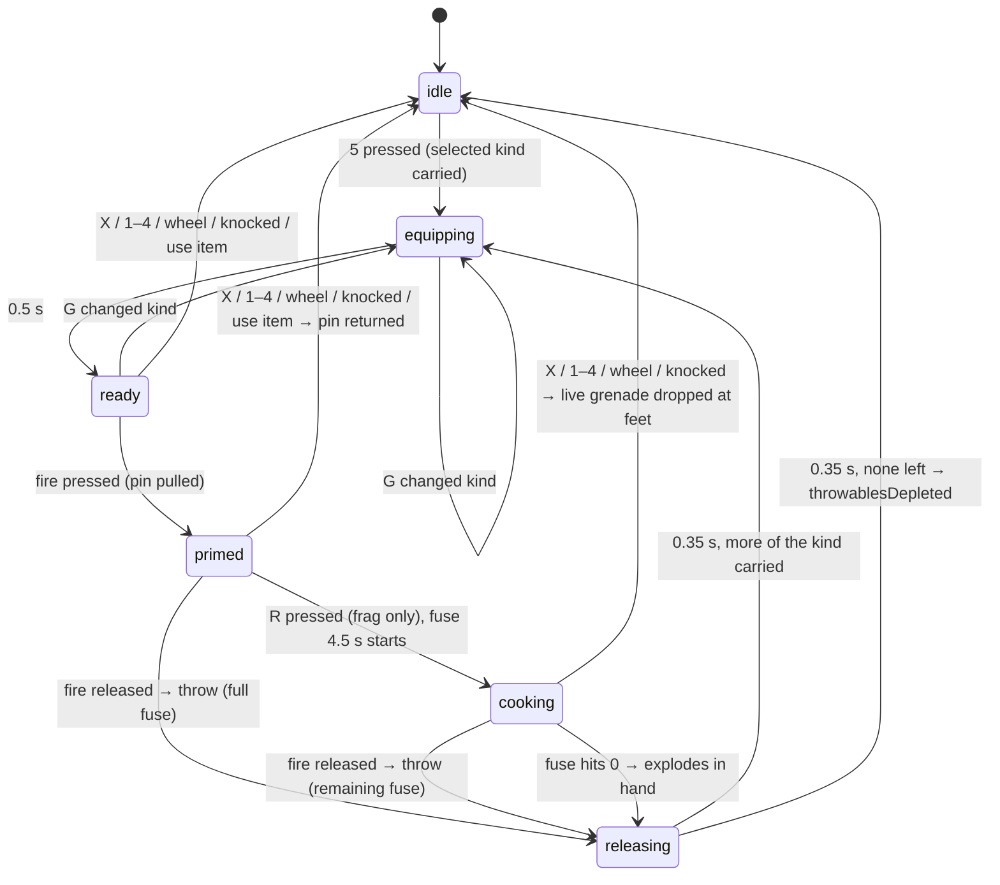
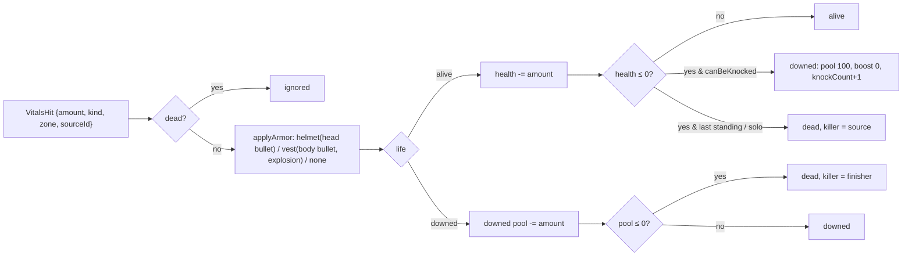
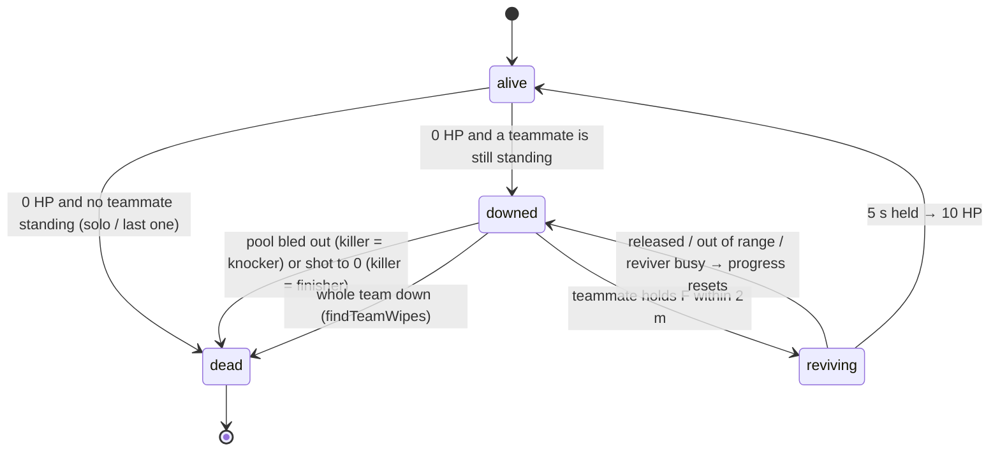
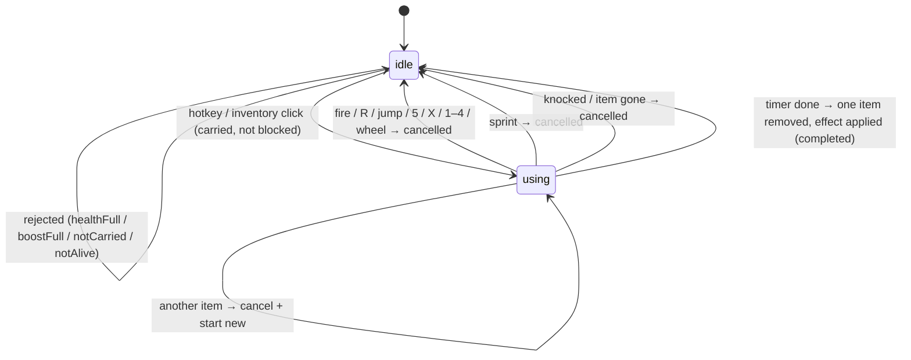

# Equipment design (milestone 2.5)

Throwables, consumables, boost, armor, backpacks, ammo items, inventory, knocked/revive and loot spawning. All of it is playable offline now. The rules are pure, deterministic and server-ready, so M4/M5 networking (`docs/backend/netcode.md` §8.3, §9–10) reuses the same code.

Contents:

1. [Principles](#1-principles)
2. [Item catalog](#2-item-catalog)
3. [Throwables](#3-throwables)
4. [Inventory](#4-inventory)
5. [Vitals, armor and consumables](#5-vitals-armor-and-consumables)
6. [Loot spawning](#6-loot-spawning)
7. [Code map](#7-code-map)
8. [Input bindings](#8-input-bindings)
9. [Client contract](#9-client-contract)
10. [Integration changes outside the equipment files](#10-integration-changes-outside-the-equipment-files)
11. [Phase 2 work breakdown](#11-phase-2-work-breakdown)
12. [Deviations from netcode.md](#12-deviations-from-netcodemd)
13. [Verification](#13-verification)
14. [Risks and open questions](#14-risks-and-open-questions)

---

## 1. Principles

- **Pure shared rules.** Everything lives in `packages/shared/src/equipment/**`. It has no Babylon imports and no `Math.random`. It uses no `Math.hypot` (it uses `len2`/`len3`). It has no enums or parameter properties, so it survives `erasableSyntaxOnly`. The same functions run in the browser, in Node tests and on a future server.
- **State in, state out**, like `stepWeapon`:
  - `ThrowState`, `ItemUseState`, `Vitals`, `InventoryState` and `PlayerEquipmentState` are plain data.
  - Hot per-tick sets use typed arrays: `ThrowableSet` is a struct-of-arrays and fire cells are a `Float32Array`. `ThrowableSet` is mutated in place, in the style of R7 in the architecture doc.
- **Injected world.** Every geometric question goes through `RaycastFn` (from `weapons/types.ts`):
  - throwable bounces
  - explosion occlusion
  - smoke wall probes
  - fire ground probes and wall checks
  - flash occlusion

  The client passes a Havok static-world query. Tests pass an analytic plane/box world (`equipment/testWorld.ts`).
- **Seeded randomness only.**
  - Loot is seeded from `(matchSeed, buildingId, spotIndex)`.
  - Smoke and fire shapes are seeded from `(matchSeed, throwableId)`.
  - Throwable ids are `ownerSlot << 16 | throwCounter`, so a predicted grenade and the server's grenade have the same name.
- **Tick-derived gates.** `deriveEquipmentModifiers(state)` gives speed scale, sprint/jump/weapon gates and crawl from tick state, never from render state (architecture R3).
- **Friendly fire is on.** Area effects return a damage request for every entity in range, including the thrower and teammates. Policy (for example a warmup no-damage phase) belongs to the caller.

## 2. Item catalog

All numbers live in `equipment/items.ts`, `throw.ts`, `throwables.ts`, `explosion.ts`, `smoke.ts`, `fire.ts`, `flash.ts` and `vitals.ts`. Weights use PUBG capacity units. `ITEM_IDS` order is the u8 wire code (append only).

### 2.1 Throwables

| Item | Weight | Fuse | Cook | Bounce (restitution / tangential loss) | Effect |
|---|---|---|---|---|---|
| Frag grenade | 12 | 4.5 s total. From the R cook press, or from release if not cooked | Yes. Explodes in hand at 0 | 0.35 / 0.25 | 140 dmg inside 2 m, linear to 0 at 9 m; × exposure (3 sample points); vest applies |
| Smoke grenade | 14 | 2 s after release | No | 0.30 / 0.30 | Cloud of 10 seeded puffs, radius 6.5 m, 35 s (grow 3 s, fade-in 1 s, fade-out 6 s), drift 0.04–0.12 m/s, blocks vision not bullets |
| Flashbang | 12 | 2 s after release | No | 0.40 / 0.25 | Blind ≤ 5 s by distance (full ≤ 6 m, none ≥ 24 m) × view angle, 0 if occluded. Ringing ≤ 6 s (full ≤ 8 m, none ≥ 32 m), ×0.4 if occluded |
| Molotov | 16 | Shatters on the first impact > 1 m/s, or after 4 s of flight | No | 0.20 / 0.40 | Fire patch on a 1 m ground grid, spread budget 3.2 m (uphill costs more), ≤ 40 cells, ~10 s burn, 5 dmg / 0.5 s, ignores armor |

**Throw launch.** Hand offsets and speeds come from `THROW`:

| Style | Speed | Loft over aim | Flat range | Hand position |
|---|---|---|---|---|
| Overhand | 19 m/s | +5° | ~37 m | Eye + 0.35 m forward + 0.2 m right |
| Underhand (aim held) | 9 m/s | +12° | ~10 m | Eye + 0.35 m forward + 0.15 m right, 0.55 m lower |

- Both styles add 0.8 × the player's velocity.
- The hand is pulled back from walls: `resolveThrowOrigin` casts eye → hand.

**Physics** (`THROWABLE_PHYSICS`):

- Gravity 9.81 m/s², linear drag 0.02 /s.
- Skin 0.04 m; up to 3 segment casts per tick, so nothing tunnels through thin walls.
- Ground is any surface with `normal.y > 0.7`. A ground impact slower than 1.5 m/s switches to **rolling**:
  - gravity projected onto the ground
  - 6 m/s² rolling resistance
  - rest below 0.3 m/s where static friction holds, which means slopes up to ~37°
- Grenades collide with the static world only in v1, not with players (netcode.md §9.2).

### 2.2 Consumables

| Item | Weight | Use time | Effect on completion | Can't use when |
|---|---|---|---|---|
| Bandage | 2 | 4 s | +10 HP, capped at 75 | HP ≥ 75 |
| First Aid Kit | 10 | 6 s | HP → 75 | HP ≥ 75 |
| Med Kit | 20 | 8 s | HP → 100 | HP = 100 |
| Energy Drink | 4 | 4 s | +40 boost | Boost = 100 |
| Painkiller | 10 | 6 s | +60 boost | Boost = 100 |

**While using:**

- Move speed ×0.5; no sprint, jump or weapons.
- **Cancelled by:**
  - sprint
  - fire
  - reload/R
  - jump
  - weapon switch (1–4 or wheel)
  - throwable key
  - holster
  - being knocked
  - the item leaving the bag
- **Health applies on completion only**, so a cancel race never heals.
- Starting another consumable replaces the current one.

### 2.3 Boost

- The bar runs 0–100 and decays 0.4 points/s, so a full bar lasts 250 s.
- **Heal pulses:** every 6 s, based on the tier at pulse time:

  | Boost | HP per pulse |
  |---|---|
  | 1–20 | +1 |
  | 21–60 | +2 |
  | 61–90 | +3 |
  | 91–100 | +4 |

- **Speed bonus:** ×1.025 at ≥ 60, ×1.06 at ≥ 90.
- Being knocked clears boost.
- **Approximate total heal:** an energy drink from empty heals ~25 HP over 100 s, a painkiller ~42 HP over 150 s, and a full bar ~100 HP over 250 s.

### 2.4 Armor

Durability counts **absorbed damage**. A piece absorbs `reduction × damage` (capped by remaining durability), loses that much durability, and is destroyed at 0.

| Level | Reduction | Helmet durability | Vest durability |
|---|---|---|---|
| 1 | 30 % | 40 | 60 |
| 2 | 40 % | 70 | 100 |
| 3 | 55 % | 110 | 150 |

Which slot protects a hit:

| Damage | Protected by |
|---|---|
| Bullet to the head | Helmet |
| Bullet to the body | Vest |
| Bullet to a limb | Nothing |
| Explosion | Vest only |
| Fire, fall, zone, bleed | Nothing |

- Armor also protects the downed pool.
- **Example:** an L2 vest takes 12 AR body hits (8.8 absorbed each) before it breaks.

### 2.5 Backpacks, capacity, ammo, weapons

| Item | Capacity | Notes |
|---|---|---|
| Pockets (always) | 50 | |
| Any vest | +50 | |
| Backpack L1 / L2 / L3 | +150 / +200 / +250 | |

| Ammo | Weight / round | Ground stack | Weapons |
|---|---|---|---|
| 5.56mm | 0.5 | 30 | AR-4 (rifle) |
| 7.62mm | 0.7 | 15 | K-98 (sniper) |
| 9mm | 0.4 | 25 | P-9 (pistol) |
| 12 Gauge | 1.25 | 10 | S-12 (shotgun) |

- Weapons, armor and backpacks sit in slots and weigh nothing.
- Stacks are capped at 999 for ammo and 99 for everything else (fits the u10 wire quantity).

## 3. Throwables

### 3.1 Throw / cook state machine (`stepThrow`)



- **Pin pull:** needs a fresh press after `ready`, so holding fire while drawing does nothing.
- **Underhand:** decided at the release tick by whether aim (RMB) is held.
- **Order within a tick:** interruptions → timers → equip/kind switch → pin pull → cook → fuse → release. A fuse hitting 0 on the release tick explodes in hand.
- **Consumption:** `stepPlayerEquipment` removes the grenade from the inventory on the release tick. It returns a `ThrowRelease`; `spawnRelease` puts it into the `EquipmentWorld`.
- **While a throwable is in hand:** weapons are gated (`allowWeapons = false`). Sprint is off while the pin is pulled, and using an item is refused.

### 3.2 Flight, bounce, rest (`stepThrowables`)

The flight loop is shown above in §2.1.

- **Events:**
  - `bounce`: position, normal, impactSpeed; drives audio and dust
  - `rest`
  - `detonate`: position, contact normal, reason fuse/impact
- **Arc preview:** `predictThrowArc` runs the **same step** on a scratch set. It stops at the first contact (PUBG-style) or follows the whole flight. It writes xyz triples into a reused `Float32Array`. A test asserts the arc end equals the real first bounce bit for bit.

### 3.3 Detonations and area effects (`stepEquipmentWorld`)

- **Frag** (`computeExplosionHits`):
  - The blast origin is the contact point + 0.15 m along the normal.
  - For each entity it samples head, chest and feet. Heights depend on posture: stand 1.65/1.2/0.2, crouch 0.95/0.7/0.2, downed 0.45/0.3/0.15.
  - Each point counts its own falloff if the raycast blast → point is clear. Damage = 140 × mean.
  - Result: a target half behind a low wall takes partial damage; one fully behind a wall takes none.
  - The cheap horizontal reject happens before any ray.
- **Smoke** (`createSmokeCloud`, `smokePuffs`, `smokeTransmittance`, `smokeBlocksSight`):
  - At spawn, 8 horizontal rays at 1.2 m record free extents, so puff centers stay on the open side of walls.
  - Puffs (x, y, z, radius, density) are a pure function of the cloud and its age. The client renders exactly the volume that bots/relevance test sight lines against.
  - Transmittance multiplies `exp(−1.5 × chord × density)` over puffs. Sight is blocked below 10 %.
  - `smokeRadius(age)` is the netcode relevance radius.
- **Flash** (`flashExposure`): see §2.1. The world step computes occlusion blast → eye per entity.
  - `blind` sets `Vitals.blindSeconds`; `deaf` sets `Vitals.deafSeconds` (max with any current value).
  - The server can also use `blind` for an aim-spread penalty (netcode.md §9.3).
- **Molotov** (`createFirePatch`):
  1. Wall impacts are pulled back 0.3 m along the normal, then a ray probes down ≤ 4 m for ground (normal.y ≥ 0.707).
  2. Cheapest-first flood over a 1 m grid (8-neighbour). Each step:
     - probes ground under the neighbour (must exist, be walkable and within 0.5 m height of the parent), so ledges and curbs stop it
     - casts a knee-height ray parent → neighbour, so walls, fences and closed doors stop it
     - costs `step + 2.5 × climb − 0.5 × descent` (≥ half the step)
  3. A cell ignites at `cost / 4 m/s` and dies after ~10 s. Edge cells die up to 1.5 s sooner, ±0.6 s seeded jitter.
  4. **Damage:** 5 per 0.5 s (integer tick count, no drift) to feet within 0.8 m horizontal and −0.3..1.2 m vertical of a burning cell. Each patch counts an entity once per tick.
  5. **Water:** none on the map yet. When water exists, the ground probe should reject water surfaces (a surface id on `RayHit`, see §14).

## 4. Inventory

### 4.1 Slot model

| Slot | Holds | Key |
|---|---|---|
| `weapons[0]` primary 1 | rifle / shotgun / sniper | 1 |
| `weapons[1]` primary 2 | rifle / shotgun / sniper | 2 |
| `weapons[2]` sidearm | pistol | 3 |
| (melee, later) | — | 4 |
| throwable selection | carried kind (`selectedThrowable`), cycled by G | 5 |
| helmet, vest | `ArmorPiece { level, durability }` | — |
| backpack | level 0–3 | — |
| bag | one stack per item id, catalog order, weight-limited | Tab |

### 4.2 Rules (`inventory.ts`, every op returns `{ ok, inventory, … } | { ok: false, error }`)

- **Stack pickup:** takes as much as fits by weight and stack cap. The remainder stays on the ground and keeps its loot id. Nothing fits → `full`.
- **Weapon pickup:**
  - goes to the first empty slot of its class
  - otherwise replaces `replaceSlot` (primaries; default primary 1) or the sidearm
  - the old weapon drops **with its magazine**
- **Armor pickup:** swaps; the worn piece drops with its durability.
- **Backpack pickup:** swaps unless the bag contents wouldn't fit the smaller capacity (`overCapacity`).
- **Drop:** a stack (partial quantity), a weapon slot, a helmet/vest, or the backpack. Removing a vest or backpack is refused while the contents wouldn't fit.
- **Swap:** primaries only (`swapWeapons(0, 1)`).
- **Throwable selection:** follows the stock. When the selected kind runs out, it selects the first carried kind in frag → smoke → flash → molotov order, or null.
- **Validation for the server** (netcode.md §9.5): pickup distance ≤ `INTERACT.reach` (2.6 m eye → item; the client allows +0.4 m slack) and capacity. LOS is the server's extra check.

### 4.3 Migration from the 4-weapon loadout

Today `CombatSystem` spawns `DEFAULT_LOADOUT = [rifle, shotgun, pistol, sniper]` with `reserveAmmo` per weapon. The migration keeps that working until phase 2 flips it:

1. **Now (this phase).**
   - `createOfflineInventory()` holds the PUBG slots: rifle / sniper / pistol. The sniper is primary 2 and the shotgun has no slot.
   - It also holds level 2 helmet, vest and backpack, 120/20/48 rounds of 5.56/7.62/9mm, and a few of each throwable and consumable.
   - `CombatSystem` still ticks its own 4-slot `WeaponState` with reserve ammo. The two are independent.
2. **Phase 2, step A (slots).**
   - `CombatSystem` builds `WeaponState.slots` from `inventory.weapons`. That needs nullable slots in `WeaponState` (§10.2) so slot indices stay 0/1/2.
   - Keys 1/2/3 select them; 4 is unbound (future melee).
   - The shotgun becomes loot. Offline, spawn it on the ground next to the arena spawn.
   - Magazines sync back with `setMagazine` whenever they change.
3. **Phase 2, step B (ammo).** Behind a flag, before each weapon tick:
   - set the active slot's `reserve = reserveFor(inventory, weaponId)`
   - after the tick, `consumeAmmo(inventory, weaponId, reserveBefore − reserveAfter)`

   Then `WeaponDef.reserveAmmo` becomes the "spawn with" amount for dev kits only.
4. **M5.** Players spawn with no weapons and loot everything. `createOfflineInventory` stays as the training/dev kit.

## 5. Vitals, armor and consumables

### 5.1 Damage pipeline (`applyDamage(vitals, armor, hit, { canBeKnocked })`)



- Overflow damage is dropped (it doesn't carry into the downed pool).
- Health and damage round to 0.1, like `computeDamage`.
- The same pipeline serves any entity id: the local player now, remote players and bots later.

### 5.2 Knocked, revive, team wipe



- **Bleed-out** pool of 100 HP. Each knock in the same life bleeds faster:

  | Knock | Rate | Time to bleed out |
  |---|---|---|
  | 1st | 4 HP/s | 25 s |
  | 2nd | 6 HP/s | ~17 s |
  | 3rd+ | 9 HP/s | ~11 s |

  The bleed **pauses while a revive runs**.
- **Downed limits:** crawl at 1.2 m/s (`speedScale ≈ 0.18`, `crawl: true`). No sprint, jump, weapons, throwables or items. A cooking grenade is dropped; a pulled pin is returned.
- **`stepRevive(target, reviverId, active, dt)`:** the caller checks team, range (`VITALS.reviveRange`), that the reviver is alive, and that the reviver isn't using/throwing. Only one reviver at a time.
- **Team rules:**
  - `canBeKnocked(id, team, members)`: another member is still alive.
  - `findTeamWipes(members)`: downed members of teams with nobody standing. Call it after every damage/bleed event and `eliminate` them all.
  - Friendly fire can knock and finish teammates.

### 5.3 Item use state machine (`stepItemUse`)



Per-tick order in `stepPlayerEquipment`: vitals (boost pulse, decay, bleed, flash timers) → G cycle → item use → throw.

## 6. Loot spawning

`generateLoot(seed, pois, buildings)` takes MapLayout `ResolvedBuilding`s (Y resolved) plus `MapData.pois`, and returns `{ piles, items }`. Items get sequential `lootId`s. It is pure and reproducible in Node; `LOOT_TABLE_VERSION = 2` goes into the content hash. The client (`EquipmentSystem` map mode, which `OfflineMatch` uses) and the headless harnesses call it at match start for Map v1 and the real maps alike; nothing is baked into map data. Online has no ground loot yet (B5).

- **Spots:** `getPrefabLootSpots` (1.5 m grid, on floors, clear of geometry), transformed to world space.
- **Pile chance per spot, by POI tier:**

  | Tier | Chance |
  |---|---|
  | 0 | 12 % |
  | 1 | 16.5 % |
  | 2 | 22 % |

  - Open-air rooms (balconies, towers) ×0.6.
  - Buildings outside any POI: tier 0 ×0.8.
  - A building that rolls nothing gets one pile on a seeded spot.
- **Pile contents:** 1 roll, plus a chance of a 2nd and then a 3rd roll (35 / 45 / 55 % by tier). A weapon roll adds 2–3 stacks of its ammo, so a pile holds 1–4 items. Items sit on a 0.3 m ring around the spot.
- **Primary top-up:** a building with 3+ loot spots whose piles hold no primary (rifle, shotgun, sniper) gets one with 80 / 85 / 90 % chance by tier, drawn from the tier's weapon table without pistols, with 2–3 stacks of its ammo. It joins a seeded pile of that building with at most 2 items, else a new pile on a free spot.
- **Matching ammo:** a loose ammo roll takes the ammo of a gun already rolled in the same building 60 % of the time.
- **Category weights** (tier 0 / 1 / 2):

  | Category | Tier 0 | Tier 1 | Tier 2 |
  |---|---|---|---|
  | weapon | 19 | 22 | 25 |
  | ammo | 14 | 14 | 13 |
  | heal | 20 | 18 | 16 |
  | boost | 8 | 9 | 10 |
  | throwable | 10 | 12 | 13 |
  | armor | 14 | 14 | 15 |
  | backpack | 8 | 8 | 8 |
  | attachment | 0 | 0 | 0 (placeholder) |

- **Within categories:**
  - Weapons: pistol 30→12, shotgun 34→20, rifle 31→48, sniper 5→20. Military POIs scale sniper weight ×1.5.
  - Heals: bandage (×5) 60→50, first aid 32→36, medkit 8→14.
  - Throwables: frag 35–38, smoke 24–25, flash 20–22, molotov 18.
  - Armor/backpack levels: L1 70→50, L2 26→38, L3 4→12.
- **Density** (averages over 8 seeds, from `lootStats.test.ts`; `LOOT_STATS=1` prints them):

  | | Map v1 (74 buildings) | vn-hangxanh (190 buildings) |
  |---|---|---|
  | Piles / items | 300 / 660 | 263 / 692 |
  | Weapons (rifle, shotgun, sniper, pistol) | 142 (60, 41, 21, 20) | 193 (91, 56, 31, 16) |
  | Ammo / heal / boost / throwable / armor / backpack | 213 / 89 / 46 / 65 / 65 / 40 | 245 / 73 / 39 / 47 / 58 / 37 |
  | Buildings with 3+ spots holding a primary | 91 % | 91 % |
  | 3 random buildings hold a primary | 99.9 % | 99.7 % |

  Table version 1 had 99 / 81 weapons, 47 % / 29 % of 3+ spot buildings with a primary, and 84 % / 63 % for three buildings.
- **Stability:** each spot's RNG comes from `(seed, hash(buildingId), spotIndex)`, so editing one building never reshuffles another building's loot (tested).
- **Runtime ground loot:** a `GroundLoot` store with an 8 m spatial hash and `version` (netcode `lootVersion`).
  - Store operations: `takeGroundItem`, `setGroundQuantity`, `dropGroundItem`, `queryGroundLoot`.
  - `pickLootTarget(nearby, eye, viewDir)`: the smallest view angle inside a 35° cone within 2.6 m, otherwise the nearest item in reach.

## 7. Code map

| File | Contents |
|---|---|
| `packages/shared/src/equipment/items.ts` | `ITEMS` catalog, ids, wire codes, `INVENTORY` capacities |
| `inventory.ts` | `InventoryState`, pickup/drop/swap/stack ops, throwable cycling, ammo ↔ reserve bridge |
| `armor.ts` | `applyArmor`, slot rules, condition |
| `vitals.ts` | `Vitals`, `applyDamage`, `stepVitals` (boost, bleed, flash timers), consumable effects, `stepRevive`, `canBeKnocked`, `findTeamWipes` |
| `itemUse.ts` | `stepItemUse` |
| `throw.ts` | `stepThrow`, `throwLaunch`, `cookProgress` |
| `throwables.ts` | `ThrowableSet` (SoA), `stepThrowables`, `predictThrowArc`, `resolveThrowOrigin`, `throwId` |
| `explosion.ts` | `computeExplosionHits`, falloff, posture sample heights |
| `smoke.ts` | clouds, puffs, transmittance |
| `fire.ts` | `createFirePatch`, `stepFirePatch`, `fireDamageTargets` |
| `flash.ts` | `flashExposure` |
| `equipmentStep.ts` | `stepPlayerEquipment`, `deriveEquipmentModifiers`, `EquipmentWorld` + `stepEquipmentWorld`, `spawnRelease` |
| `loot.ts` | `generateLoot`, `GroundLoot`, `pickLootTarget` |
| `presets.ts` | `createOfflineInventory` |
| `testWorld.ts` | Analytic raycast world for tests (not exported) |
| `*.test.ts` | 86 tests (§13) |
| `apps/client/src/equipment/types.ts` | `EquipmentView`, `EquipmentActions`, event types |
| `apps/client/src/equipment/EquipmentSystem.ts` | Integration skeleton (§9.3) |

## 8. Input bindings

New actions in `apps/client/src/input/bindings.ts`. None of these keys were bound before. The only other raw-key users are the F3/F8/F9 debug keys and `dev/buildingsPreview.ts`, a separate dev page that uses F/T/O/L.

| Action | Key | Behaviour |
|---|---|---|
| `throwable` | 5 | Draw the selected throwable. Fire = pull pin, release = throw. Aim held at release = underhand. R while the pin is pulled = cook (frag) |
| `cycleThrowable` | G | Next carried throwable kind (not while the pin is pulled) |
| `interact` | F | Tap: pick up `lootTarget`. Hold: revive (phase 2 with teammates) |
| `inventory` | Tab | Open the inventory UI (phase 2; Tab was already browser-suppressed while locked) |
| `holster` | X | Put the throwable away (returns the pin, drops a cooking grenade). Later also holsters guns |
| `useBandage` | 7 | Bandage |
| `useFirstAid` | 8 | First aid kit |
| `useMedkit` | 9 | Med kit |
| `useBoost` | 0 | Energy drink, falling back to painkiller |

Existing R (reload) doubles as cook. Existing 1–4 and the wheel cancel item use and put a throwable away.

## 9. Client contract

### 9.1 `EquipmentView` events (fired during the tick, in sim order)

| Observable | Payload | Consumers |
|---|---|---|
| `onThrow` | shared `ThrowEvent`: `throwEquipStarted`, `pinPulled`, `cookStarted`, `throwReleased{style, fuse}`, `pinReturned`, `throwableHolstered`, `throwablesDepleted` | viewmodel anim, pin/throw audio, HUD |
| `onThrowableBounce` | `{id, kind, position, normal, impactSpeed}` | bounce audio, dust |
| `onDetonate` | `{id, kind, ownerId, position, normal, reason, inHand}` | explosion VFX/audio, camera shake |
| `onSmoke` | `spawned{cloud}`, `updated{cloud}` (4 Hz), `expired{id}` | smoke renderer, hiss loop |
| `onFire` | `spawned{patch}`, `expired{id}` | fire VFX, crackle loop |
| `onFlash` | `{position, exposure{blind, blindSeconds, deaf, deafSeconds}}` (local player) | whiteout overlay, tinnitus + mix duck |
| `onItem` | `picked`, `pickupFailed{error}`, `dropped{item}`, `dropFailed`, `throwableSelected` | pickup feed, loot rendering, inventory UI |
| `onUse` | `started{seconds}`, `progress{0..1}` (every tick), `cancelled{reason}`, `completed`, `rejected{reason}` | use ring, heal audio |
| `onArmor` | `damaged{slot, level, absorbed, durability, condition}`, `destroyed{slot, level}` | armor HUD, armor-hit/break audio |
| `onVitals` | `damaged{amount, kind, sourceId, position}`, `healed{source}`, `knocked`, `reviveStarted/Progress/Cancelled`, `revived`, `eliminated{killerId, cause}`, `respawned` | health HUD, hurt vignette, damage direction, death screen |
| `onAreaDamage` | `{targetId, kind, amount, remainingHealth, killed, point}` for soldiers/bots | hit marker, kill feed |

### 9.2 `EquipmentView` state (safe every frame)

| Group | State |
|---|---|
| Inventory | `inventory`, `capacity {used, max}`, `selectedThrowable`, `throwableCounts` |
| Throw | `throwState` (phase, kind, fuse), `cookProgress`, `fuseRemaining`, `throwArc {points, count, end, visible}` |
| Item use | `use {itemId, progress, seconds}` or null |
| Vitals | `vitals` (life, health, boost, downedHealth, reviveProgress, blindSeconds, deafSeconds…), `maxHealth`, `armor {helmet, vest}` |
| Gates | `modifiers {speedScale, allowSprint, allowJump, allowWeapons, crawl}` |
| World | `throwables` (snapshots), `smokes` (use `smokePuffs(cloud, buffer)`), `fires` (`FIRE_CELL_STRIDE` cells) |
| Loot | `groundLoot` (all items + `version`), `nearbyLoot`, `lootTarget` |

`EquipmentActions` (for the inventory UI), applied next tick:

- `pickUp(lootId, replaceSlot?)`
- `drop(DropTarget)`
- `useItem(itemId)`
- `swapPrimaries()`

`LOCAL_PLAYER_ID = 0`; practice soldiers are 1..n.

### 9.3 `EquipmentSystem` skeleton (works headless)

- Subscribes to `player.onTick` **after** `CombatSystem`. Uses narrow `EquipmentPlayer` / `EquipmentInputSource` interfaces, so a stand-in player and input can drive it.
- Queues one-frame presses between ticks (the `CombatInputQueue` pattern) and resolves quick-use hotkeys to carried items.
- Casts rays with a static-world Havok raycaster: no triggers, no blockers, ignores the player's own body.
- **Per tick:**
  1. pending UI actions
  2. `stepPlayerEquipment`, then emit its events
  3. spawn the release
  4. F pickup
  5. `stepEquipmentWorld`, with the entities being the local player plus alive targets
  6. route damage: local → `applyDamage` with armor; soldiers → `Damageable.applyDamage`
  7. flash exposure
  8. loot refresh (10 Hz)
  9. arc prediction while the pin is pulled
  10. offline respawn 5 s after elimination
- **Map mode:** `options.map = { pois, buildings: world.layout.buildings }` spawns ground loot. `soldierTargets(dummies)` adapts `TargetDummy`s.
- **`update()`**, called after `combat.update`, multiplies `modifiers.speedScale` and ANDs `allowSprint` into `player.modifiers`.

## 10. Integration changes outside the equipment files

Precise requests for phase 2. File owners in brackets.

### 10.1 `apps/client/src/game/Game.ts` [lead]

```ts
import { EquipmentSystem, soldierTargets } from "../equipment/EquipmentSystem";
// after `const combat = new CombatSystem(...)`:
const equipment = new EquipmentSystem(scene, input, player, {
  ...(world ? { map: { pois: world.map.pois, buildings: world.layout.buildings } } : {}),
  targets: () => soldierTargets(combat.targets.dummies),
});
// frame loop: player.update(dt); combat.update(dt); equipment.update(); presentation.update(dt); ...
// dispose, dev handle: add `equipment` to window.__twobullets; pass it to Hud / presentation / audio.
```

- `combat.gate = () => equipment.modifiers` (see 10.2).
- Cache the `soldierTargets` result once instead of per tick.

### 10.2 `CombatSystem.ts`, `CombatInputQueue.ts`, `combat/types.ts`, `combat/hitboxes.ts` [combat owner]

1. **Weapon gate.** Add an optional `gate: () => { allowWeapons: boolean }`. When it's false, the tick passes `fire = aim = reload = false` (selection still works; the equipment side holsters the throwable on 1–4/wheel). This stops guns firing while a grenade is in hand, while healing, or while downed.
2. **Health source.** `CombatView.health/maxHealth` should read `equipment.vitals.health` / `VITALS.maxHealth`, so the HUD has one source.
3. **Inventory weapons** (§4.3 A):
   - build slots from `inventory.weapons`
   - keys 1–3
   - sync magazines back through a new `EquipmentActions.setMagazine(slot, n)`, or have `EquipmentSystem` read `combat.weaponState` each tick
   - needs shared `WeaponState.slots: readonly (WeaponSlotState | null)[]` with `stepWeapon` skipping null slots [shared weapons owner]
4. **Ammo items** (§4.3 B): `reserveFor` before each tick, `consumeAmmo` on `reloadFinished`, behind a flag.
5. **`DamageHit.kind?: "bullet" | "explosion" | "fire"`** (`hitboxes.ts`), so soldiers pick explosion deaths and skip blood decals for fire. `soldierTargets` currently sends zone `"body"` and colliderId `${id}/area`.
6. **Armor on hit targets (M4).** When remote players/bots have an `ArmorLoadout`, `resolveImpact` calls `applyDamage(vitals, armor, {amount, kind: "bullet", zone, sourceId})` instead of subtracting raw damage.
7. **Tick-derived ADS gates (architecture R3).** Fold `deriveEquipmentModifiers` into the planned `deriveMoveModifiers`.

### 10.3 `PlayerController.ts`, `CharacterBody.ts`, `packages/shared/src/movement/**` [movement owner]

1. **Boost speed.** `movement.ts` clamps `speedScale` to `[0, 1]` (`clamp(input.speedScale, 0, 1)`), so boost's ×1.025/×1.06 is currently ignored. Clamp to `[0, 1.1]` and update the `PlayerModifiers.speedScale` doc.
2. **`allowJump`.** Add it to `PlayerModifiers`; `sampleInput` drops jump when false. Needed for healing and downed.
3. **Crawl.** A `crawl` modifier puts the player in a "prone" stance:
   - capsule ~0.6 m, eye 0.45 m
   - `Stance` gains `"prone"`
   - `canStand` checks apply
   - crawl speed comes from `speedScale`; the camera eases to the prone eye height
4. **Respawn.** `EquipmentSystem` calls `player.respawn()` 5 s after elimination (offline). `PlayerController.respawn` is fine as is.

### 10.4 Targets [targets / blood FX owner]

- `TargetDummy.applyDamage` already works with area damage. Optional: react to `DamageHit.kind` (explosion death clip, no blood spray for fire).
- **Soldier armor visuals** (helmet/vest meshes by level) are M5 remote-player work.

### 10.5 HUD and audio [see §11]

- `HealthPanel`: unhide `.tb-boost` and drive its 4 segments from `boostTier(vitals.boost)`. Downed state: red bleed-out bar from `vitals.downedHealth`.
- `GameAudio.playExplosion({ position, power })` is ready to hook to `onDetonate` (frag power 1, flash 0.6 with a sharper transient).

## 11. Phase 2 work breakdown

Three engineers, exclusive write ownership. All of them read `apps/client/src/equipment/types.ts` and must not edit `packages/shared/src/equipment/**` without the equipment architect.

### Engineer A — Throwables presentation

**Owns:** `apps/client/src/equipment/presentation/**` (new), grenade model entries in `assets/manifest.ts` (coordinate with the assets owner), `viewmodel/**` throwable additions (coordinate with the viewmodel owner).

1. **Grenades in flight/at rest.** Render meshes from `equipment.throwables`, interpolated between ticks. Spin by velocity. Match remote throwables by `id`.
2. **Viewmodel.** Draw/pin-pull/cook-hold/overhand/underhand/release clips driven by `onThrow` and `throwState`. Hide the gun while `throwState.phase !== "idle"`; heal clips while `use !== null`.
3. **Trajectory line** from `throwArc` (dashed, fades toward the end; landing marker at `end`).
4. **Explosion VFX** (flash, shockwave, debris, scorch decal) and camera shake by distance. Uses its own pooled effects; don't edit `fx/**` (blood FX owner) without coordination.
5. **Smoke renderer.** Soft particles/billboards per puff from `smokePuffs(cloud, buffer)` every frame, with density → alpha. Must match the gameplay volume.
6. **Fire renderer.** Flames per burning cell from `FirePatch.cells` (`isCellBurning`), plus a light flicker.
7. **Flash whiteout** screen effect (post-process or DOM layer) from `vitals.blindSeconds`, afterimage fade.

### Engineer B — Items, inventory, loot UI and interaction

**Owns:** `apps/client/src/equipment/loot/**` (new), `apps/client/src/ui/inventory/**` (new), `combat/CombatSystem.ts` + `CombatInputQueue.ts` for §10.2 items 1–4 (with the combat owner's review), `input/InputManager.ts` if hold detection needs it.

1. **Ground loot rendering.**
   - Instanced placeholder/real item meshes from `groundLoot.items`, rebuilt when `groundLoot.version` changes.
   - Highlight outline on `lootTarget`; interest-distance culling.
2. **Interaction prompt** ("F  Pick up Bandage ×5", "F  Swap AR-4") from `lootTarget` + `inventory`, and a pickup feed from `onItem`.
3. **Inventory screen (Tab):**
   - release pointer lock
   - weapon slots, armor/backpack with durability
   - bag list with weights and a capacity bar
   - vicinity list from `nearbyLoot`
   - drag to equip/drop through `EquipmentActions`
   - errors from `pickupFailed`/`dropFailed`
4. **Weapon/ammo migration** in `CombatSystem` (§4.3 A–B) and the weapon gate (§10.2.1).
5. **Revive hold interaction.** Hold F on a downed teammate: `stepRevive` wiring once teammates/bots exist, with the revive-progress UI shared with C.

### Engineer C — HUD and audio

**Owns:** `apps/client/src/ui/equipment/**` (new), `ui/HealthPanel.ts`, `ui/WeaponSlots.ts` (slot 5 / throwable counts), `apps/client/src/audio/equipment/**` (new) and equipment hooks in `audio/GameAudio.ts` / `AudioDirector.ts` (coordinate with the blood FX engineer, who currently edits `audio/**`).

1. **HUD:**
   - throwable slot (kind icon + count, G hint)
   - cook ring from `cookProgress` / `fuseRemaining`
   - use-progress ring from `use`
   - boost bar segments (`boostTier`, pulse on `healed{boost}`)
   - helmet/vest icons with level and `armorCondition`, flashing on `onArmor.damaged`, crossed out on `destroyed`
   - quick-heal hotkey strip (7/8/9/0 with counts)
2. **Downed/death UI:** bleed-out bar, "being revived" progress, eliminated screen, respawn countdown.
3. **Damage feedback:** directional hurt indicator from `onVitals.damaged.position`; explosion/fire kill feed from `onAreaDamage`.
4. **Audio:**
   - pin pull, spoon/cook click, throw whoosh
   - bounce by surface and `impactSpeed`
   - frag explosion (replace the `playExplosion` placeholder), flash bang
   - smoke hiss loop and molotov ignite/crackle loops following `smokes`/`fires`
   - bandage/first-aid/medkit/drink/pill foley driven by `onUse`
   - armor hit/break
   - tinnitus with a mix duck/low-pass driven by `vitals.deafSeconds`
   - Distances and occlusion go through the existing `AudioWorldProbe`.

### Lead / integration

- `Game.ts` wiring (§10.1).
- Assigning §10.3 (movement: boost clamp, `allowJump`, crawl stance) and the shared `WeaponState` nullable slots.

## 12. Deviations from netcode.md

These are intentional. §9 of netcode.md should be updated when M5 starts.

| Topic | netcode.md | This design | Why |
|---|---|---|---|
| Module paths | `shared/src/throwables`, `items`, `loot` | `shared/src/equipment/**` | One owner and one barrel for M2.5; the split is mechanical if wanted |
| Frag fuse | 5.0 s, fuse starts on pin pull | 4.5 s, starts on R cook (PUBG), else on release | Product brief |
| Frag damage | 150 base, full ≤ 2.5 m, 0 at 9 m, 3 rays head/chest/pelvis | 140 base, full ≤ 2 m, 0 at 9 m, 3 posture-aware points head/chest/feet with per-point falloff | Partial cover gives partial damage; downed targets sample low |
| Bandage | +15 HP | +10 HP | Product brief |
| Molotov | 9 discs of 2.2 m, 9 s, 10 HP/s checked every 6 ticks, smoke extinguishes | Up to 40 cells of 1 m flooded with slope/wall limits, ~10 s, 5 dmg / 0.5 s, no smoke extinguish | Brief asks for slope spread and wall blocking. Replicate `AreaEffectStart{seed}`; cells re-derive from the static world |
| Smoke | Analytic sphere 0 → 6.5 m | Seeded puff cluster within 6.5 m, wall-probed, with a transmittance query | Vision blocking that respects walls; `smokeRadius(t)` still exists for relevance |
| Flash | max 4 s | blind ≤ 5 s, ringing ≤ 6 s | Product brief |
| Capacity | 150 + 50 × backpack level | 50 pockets + 50 vest + 150/200/250 backpack | PUBG numbers; weights per item |
| Armor durability | % of max, `absorbed × 100 / maxDur` | Absolute absorbed-damage points (40–150) | Simpler, same behaviour; send as u7 % of max on the wire |
| Throw speeds | 22 / 11 m/s | 19 / 9 m/s with loft 5° / 12° and drag | Tuned with drag to similar ranges |
| Downed | not specified | 100 pool, bleed 4/6/9 HP/s, 5 s revive to 10 HP, team wipe | Product brief |

## 13. Verification

- **`pnpm typecheck`:** passes for shared and client.
- **`pnpm test`:** 289 tests pass, 86 of them new equipment tests:

  | File | Tests | Covers |
  |---|---|---|
  | `vitals.test.ts` | 19 | catalog integrity, armor math and durability, damage → knock/kill/finish, bleed-out timing, revive 5 s and cancel, team wipe, boost tiers/decay/pulses, heal caps |
  | `inventory.test.ts` | 14 | capacity, partial stacks, stack cap and order, weapon slot fill/swap/drop with magazine, ammo bridge, armor/backpack swaps and `overCapacity`, throwable cycling; item use timing, cancellation, rejection, switching |
  | `throw.test.ts` | 15 | equip/pin/throw, cook remaining fuse, explode in hand exactly at 4.5 s (also on a release tick), non-cookable kinds, underhand, inherited velocity, pin return vs live drop, knocked drop, auto-draw/depletion; player step consumption, weapon gating, G, use/throw exclusion, crawl modifiers |
  | `throwables.test.ts` | 11 | bitwise determinism, wall bounce without passing, no tunneling at 40 m/s, rest + fuse timing, rest on 15° and slide on 40°, molotov shatter and air-burst, swap-remove, arc = real first contact, throw origin wall pull-back |
  | `effects.test.ts` | 20 | falloff, exposure and range, wall vs low-cover occlusion, downed sampling; smoke growth/density/lifetime, sight blocking, seeding, wall-bounded puffs; fire spread budget, walls/ledges, downhill bias, wall-impact grounding, damage ticks; flash distance/angle/occlusion/close floor; world step frag/smoke/flash/molotov |
  | `loot.test.ts` | 7 | reproducibility, per-building stability, piles on room floors inside buildings, density and category floors for 10 players, tier bias, ground store ops, look-at target |

- **Headless NullEngine + Havok check** (scratch script, Map v1 terrain bake + all 43 building bodies, `EquipmentSystem` driven by a stand-in player and input):
  1. **Throw.** From 5 m, a frag hit the `town_house_nw1` wall first (normal +Z, 0.7 m up), bounced twice on the ground and detonated 4.98 m out.
  2. **Open soldier** (2.76 m, clear LOS): took 126.1 and died.
  3. **Soldier behind the wall** (6.62 m, all three sample rays blocked; it would take 48.1 without the wall): took 0.
  4. **Thrower:** took 84 self damage (the grenade rolled back to their feet). Frag count went 3 → 2.
  5. **Replay** was deterministic: identical detonation position on the second run.
  6. **Loot:** 413 items in 210 piles spawned against the resolved layout. 413/413 are on a floor (downward Havok ray gap 0.000 m); 398/413 are under a roof (the rest are on balconies and towers).

## 14. Risks and open questions

1. **Havok vs analytic parity.** Throwable flight is deterministic given identical raycasts. Cross-engine float differences in Havok hit points could diverge bounces on non-Chromium clients; netcode.md's 10 Hz `ThrowableState` corrections cover this.
2. **Rays start on the skin.** Havok doesn't report hits for rays starting inside a shape. The 4 cm skin keeps segments outside, but grenades wedged into tight concave corners (stair treads under a railing) could still slip through a seam. Watch for it in playtests; the fix is a 2-ray sweep or a sphere cast.
3. **Tick order.** `EquipmentSystem` runs after `CombatSystem` in the same tick, so the weapon gate reads last tick's equipment state (≤ 16 ms). That's acceptable offline. In `PlayerSim` the order should be modifiers → movement → equipment → weapon.
4. **Two health sources** until §10.2.2 lands: `CombatView.health` (HUD) and `EquipmentView.vitals`. Self-damage from grenades won't show on the current HUD until then.
5. **Weapons still fire while holding a grenade or healing** until the gate (§10.2.1) is wired. `EquipmentSystem` isn't constructed by `Game.ts` yet, so nothing changes in play today.
6. **Boost speed is clamped away** by `movement.ts` (§10.3.1); healing slow and crawl work through `speedScale` now.
7. **Smoke through thin floors/roofs.** Extents are probed horizontally only, so a smoke on a balcony can put puffs above/below the slab. Add vertical probes if it shows.
8. **Fire on multi-storey floors.** The ground probe starts 0.75 m above the parent cell, so a patch under a low table or stair can climb onto it. That's cosmetic; damage uses the same cells.
9. **Loot density** is tuned by eye for 10 players (~44 items, ~7 weapons each). Revisit after playtests. Radar Hill is sparse (7 piles) because it has only 2 buildings; consider outdoor POI spots (crates) in a later loot table version.
10. **Water** doesn't exist. Molotov water blocking needs a surface id on `RayHit` or a water query injected into `createFirePatch`.
11. **Team state offline.** The local player is a solo team, so they're eliminated instead of knocked, and revive can't be exercised in play until bots or teammates exist (it is unit-tested).
