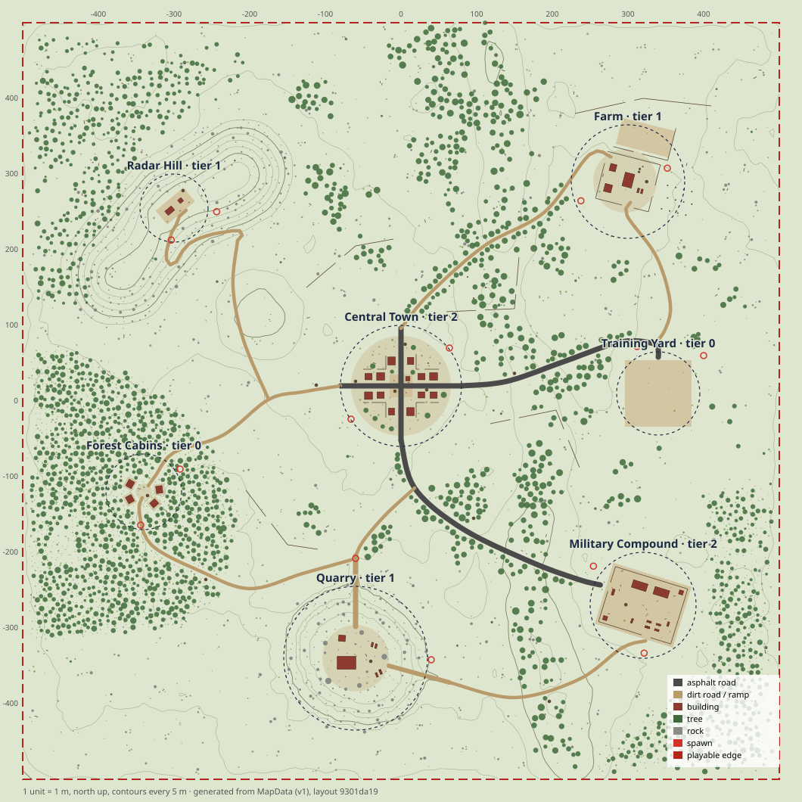

# Map v1 layout

Map v1 puts seven points of interest on the v1 terrain (`docs/map/terrain.md`), links them with asphalt and dirt roads, and fills the space between them with lone buildings, forests, groves, tree lines and field cover. Everything below the renderer is pure data: a Node server builds the same terrain, building positions, prop instances and colliders from `MAP_V1`.

The playable square shrank from 1×1 km to **500 × 500 m** on 2026-09-16 (the browser build was too heavy). The seven majors kept their interiors and moved closer together; the four minor POIs (Millbrook, Truck Stop, Hunter's Camp, Orchard) and the valley landform were dropped. POI content is authored at 1:1 — players did not shrink.

`mapV1.svg` is generated from MapData by `tools/map/build.ts`. It shows contours every 5 m, pads, roads, trees, rocks, fences, buildings, spawns (red rings) and each POI's radius and loot tier.

| Part | Where |
|---|---|
| Layout data | `packages/shared/src/map/mapV1.ts` (`MAP_V1`, `MAP_V1_POIS`, `MAP_V1_ROADS`, `MAP_V1_SCATTERS`, `MAP_V1_TRAINING_YARD`) |
| Pure helpers | `packages/shared/src/map/layout/`: geometry, prop catalog, roads, building resolution, scatter, POI frames, layout build, colliders, validation, SVG, worker transport |
| Terrain bake | `packages/shared/src/map/terrain/bake.ts`; output `apps/client/public/assets/map/mapV1.terrain.bin` |
| Client runtime | `apps/client/src/world/mapRuntime/` (wiring, spawns, out-of-bounds, overlay, audio hooks, Training Yard), `world/props/` (visuals, instancing, colliders), `world/vegetation/` (grass) |
| Build tool | `node --experimental-transform-types tools/map/build.ts [--check]` |

`draftMapV1.ts` stays as history: the terrain tests and the old `createDevMapV1` still use it.

## Try it

Open `http://localhost:5173/?map=v1` (DEV builds). With no query, or `?map=arena`, you get the arena as before.

- **Loading.** A loading card shows the stage and a progress bar. The console prints `[map] Map v1 ready in … ms` with a per-step breakdown.
- **Spawn.** You spawn at a random POI spawn (falling below the kill height picks another at random).
- **Handle.** `window.__twobullets.world` is the `MapRuntime`. `world.stats()` returns terrain, building, prop, collider and grass numbers.

## Load time

**Choice: a baked binary, with worker generation as the fallback.**

Why bake:
- **Speed.** A worker alone keeps the page responsive, but the wait stays at generation speed: about 0.27 s in Node (1.0 s at the old 1 km size) and several times that on the lead's main thread.
- **Size.** The bake is 0.59 MB (607,870 B) and decodes and verifies in well under 100 ms.
- **Parallel loading.** It downloads alongside the weapon and character models.

Why keep a worker fallback:
- A stale bake (someone edited the flatten regions and didn't re-bake) or a failed download never blocks the main thread.
- The page still loads, just slower, and the console says to re-bake.

**Pipeline.**
1. The main thread starts the `map-world` module worker (`layout/mapWorker.ts`, 49 KB, pure map code, no Babylon).
2. The worker downloads the bake, checks the header's inputs hash against the map's terrain spec and flatten regions, and gunzips the payload (`DecompressionStream`).
3. It rebuilds the heights (float32 bits XORed with a planar prediction, stored as byte planes), the mask and the paint.
4. It verifies `Terrain.checksum()` against the recorded one.
5. It runs `buildMapLayout` (buildings, props, scatter, about 30 ms).
6. It transfers the heights, mask, paint and instance arrays back. The main thread wraps them in a `Terrain` with `Terrain.fromSnapshot`, which copies and generates nothing.

**Determinism.** Generation code is untouched, apart from an optional progress callback. The golden terrain checksum test still passes. `layout.test.ts` checks that bake round-trips are bit-exact, that stale and corrupt bakes are rejected, and that a decoded terrain keeps flattening identically. `mapV1.test.ts` checks the recorded inputs hash and terrain and layout checksums, so a stale bake fails CI.

**Measured.** Node 24 on an M-series Mac with NullEngine and Havok (`scratchpad/layout/headless.ts`), on the 1 km layout; the table is kept as the shape of the load, with the 500 m sizes in the right-hand notes:

| Step | Where | ms |
|---|---|---|
| Bake decode + checksum verify | worker | 122 (the bake is now a quarter of the samples) |
| Layout (buildings, 8,230 prop instances) | worker | 93 (now 1,355 instances, ≈ 30 ms) |
| *Fallback: generate terrain* | *worker* | *976 (now ≈ 270)* |
| Terrain physics body | main | 18 |
| Terrain chunk meshes + horizon | main | 207 (16 chunks instead of 64) |
| Buildings: 85 placements (prefab geometry and AO bake, compound bodies) | main | ≈ 670 (now 62 placements; the bake is per prefab type, still the same 12 prefabs, so most of this stays) |
| Prop visuals + instances | main | 7 |
| Prop colliders | main | ≈ 47 (now 1,077 bodies, 158 shapes) |
| **Map total** | | **≈ 1.15 s** (≈ 0.2 s off-thread) |

The building geometry and AO bake is per prefab type, so it does not fall with the map; everything that scales with samples, placements or instances does.

- **Browser timing.** Browser numbers print on load. Environment textures and prop GLBs download in parallel and aren't counted above.
- **Biggest cost.** The building geometry and AO bake (the buildings kit's `getPrefabGeometry` cache) is the largest remaining main-thread block; see Risks.

**Rebuilding.** Run `node --experimental-transform-types tools/map/build.ts` after changing the terrain, flatten regions, buildings, props or scatter. It validates, writes the bake, the checksum record (`layout/mapV1Bake.ts`) and the SVG. `--check` only verifies.

## Points of interest

The seven centers are 135–425 m from each other (validated at ≥ 120 m; a minor POI of radius ≤ 40 m would be validated at ≥ 80 m and at least both radii + 40 m, but v1 has none left). Each POI is authored in a `PoiFrame` (local coordinates plus a yaw), so a whole POI can move or turn at once; the 2026-09-16 shrink moved the frames and left their contents alone.

| POI | Center (x, z) | Ground (m) | Radius | Buildings | Loot tier | Nearest |
|---|---|---|---|---|---|---|
| Central Town | (0, 20) | 30 | 80 | 5× two-story, 7× small, 3× ruined, bell tower (watchtower) | 2 | Radar Hill 176 m |
| Farm | (145, 150) | 31 | 75 | barn, farmhouse (two-story), cottage and bunkhouse (small), 4 container sheds | 1 | Central Town 195 m |
| Military Compound | (150, −150) | 28 | 70 | 2× barracks, 2× watchtower, guard booth, 7 containers (1 stacked) | 2 | Training Yard 135 m |
| Radar Hill | (−60, 185) | 47 | 45 | radar station, watchtower | 1 | Forest Cabins 153 m |
| Quarry | (−130, −110) | 4 (pit floor) | 85 | warehouse, 5 containers (1 stacked), ruined site office | 1 | Training Yard 168 m |
| Forest Cabins | (−190, 105) | 31 | 50 | 3× small, 1× ruined | 0 | Radar Hill 153 m |
| Training Yard | (20, −185) | 26 | 55 | blockout arena + soldier range (gate in the north wall) | 0 | Military 135 m |
| *Lone buildings* | countryside | – | – | 4× small, 5× ruined, 4 containers (road shoulders and fields, see below) | outskirts | – |

**Terrain features** under them: a ridge `[[-118, 138], [-60, 185], [-2, 232]]` (width 130, height 20) carrying Radar Hill, a hill at (60, −60) (r 55, height 9) east of town, and the quarry basin at (−130, −110) (r 85, floor radius 40, depth 22, 3 terraces). The valley landform is gone.

What gives each one its identity:

- **Central Town.**
  - Streets and square: an asphalt main street (E–W) and a cross street (N–S), meeting at a paved 30 m square.
  - Buildings: twelve houses face the streets, and a watchtower "bell tower" stands on the square's corner as the town silhouette.
  - Dressing: fenced back yards with gate gaps, garden trees and hedges, car wrecks and a half-built checkpoint.
- **Farm.**
  - Layout: a rotated farmyard (yaw 0.25) inside a paddock fence with three gates, around a barn, farmhouse, cottage and two container sheds.
  - Surroundings: a plowed dirt field to the north with an edge fence, and a hay meadow of round bales in rows to the east.
- **Military Compound.**
  - Perimeter: rotated 0.3, on a dirt pad. Concrete walls run along the south and east sides, and chain-link along the north and west with a 10 m gate. The guard booth's boom sits across the gate, and a breach in the south wall faces the quarry road.
  - Inside: two barracks, watchtowers in opposite corners, and a container yard with a stacked pair. Sandbags, barriers and military crates add cover.
- **Radar Hill.**
  - The station and a watchtower stand on the ridge crest (the highest ground inside the map, about 47 m), on a dirt pad aligned with the crest.
  - An about 9° switchback road climbs the ridge's south flank off the town cross road. It was traced along the contours, with hairpins rounded by hand.
- **Quarry.**
  - The terraced pit keeps the north ramp from the draft; a second ramp from the east means the pit isn't a trap.
  - The pit floor holds a warehouse, containers, rock piles and dense rock scatter. A ruined site office sits on the floor.
- **Forest Cabins.** Four cabins ring a small dirt clearing and face it, inside the dense western pine forest. The west road enters from the east and the forest–quarry track leaves south toward the quarry.
- **Training Yard.** The arena sits on its 88 m pad (floor 0.2 m above the pad), and `yard_road` ends at its north gate.
- **Lone buildings** (`roadsideBuilding` in `mapV1.ts`, poi `countryside`, outskirts loot): each faces its road from 10–16 m off the centerline, on its own pad. West road (−88, 61) ruin; east highway (87, 114) and (83, 156) houses; east ring (202, 24) two sheds, (236, −99) ruin and (176, 82) house; south highway (11, −93) ruin; forest–quarry road (−188, 28) house; quarry–compound road (21, −119) two sheds; fields (44, 138) and (214, 74) ruins.

**Loot tiers** (`PointOfInterest.lootTier`, used by `generateLoot`): 2 for the hot drops (town, military), 1 for the farm, radar and quarry, and 0 for the forest cabins and the yard. Lone buildings get outskirts loot (tier 0 × 0.8). Over 8 seeds the 62 buildings hold about 891 piles and 2,049 items (407 guns); with the outdoor piles, 1,047 piles and 2,445 items. Buildings carry their `poi`, so loot tables can subsample `BuiltBuilding.lootSpots` per tier.

**Spawns.** There are 20: three on the outskirts of each POI, plus two at the Training Yard, until landing exists. `spawnsByPoi` assigns each to its nearest POI center, so the offline spawn plan draws teams from 7 POIs; `TEAM_SPAWN_STACK` is 25 m, so 20 solo teams spread over 6 groups (3 or 4 teams each) and two teams sharing a spawn stay more than 20 m apart. They face the POI and are validated: walkable, under 30°, 2 m from buildings and collidable props, and ≥ 20 m inside the edge.

## Roads

Roads are `RoadSpec`s. Catmull-Rom control points (or straight legs) become flatten polylines:

| Style | Width | Falloff | Painted surface |
|---|---|---|---|
| Asphalt | 7 m | 5 m | `road` |
| Dirt | 4.5 m | 4 m | `dirt` |

They are applied after every pad, so they cut cleanly through pad edges.

| Road | Kind | Length | Connects |
|---|---|---|---|
| town_main, town_cross | asphalt | 160 + 148 m | town streets |
| highway_east | asphalt | 201 m | town → farm west gate |
| highway_south | asphalt | 120 m | town → Military Compound west gate |
| west_road | dirt | 213 m | town west → forest clearing |
| radar_approach + radar_switchbacks | dirt | 45 + 115 m | town cross road → up the ridge's south flank (≈ 9°) → radar pad |
| forest_quarry | dirt | 158 m | forest clearing → quarry north ramp top |
| quarry_military | dirt | 217 m | quarry east ramp → compound south breach |
| yard_road | dirt | 43 m | quarry–compound road → Training Yard north gate |
| east_ring | dirt | 467 m | farm → the east edge → south to the compound road |
| ramps | dirt | 82 + 78 m | quarry rim → floor (linear; north `[[-130, 10], [-130, -72]]`, east `[[-16, -140], [-91, -119]]`) |

**Totals:** 629 m of asphalt and 1.26 km of dirt, plus the ramps. `mapV1.test.ts` asserts:
- a road within each POI's radius;
- a road ending at the yard gate;
- a single connected network (roads join when they touch or meet on the same pad).

## Sightlines and cover

Crossing open ground between POIs should never be a death run or trivially safe. The layers that provide cover:

- **Field cover.** `field_cover` scatters clusters of 2–4 boulders, mossy rocks, large bushes, fallen logs or young firs, one cluster per about 50 m (density 0.04 clusters/100 m²).
  - Clusters stay outside POI cores and off roads.
  - A 160 m noise mask thins them in a few meadows, so some crossings are riskier than others.
  - One cluster in ten is anchored by a `rock_boulder_large` or `log_mossy`.
- **Gap filler.** `cover_fill` puts a `rock_boulder_large` wherever open ground still has no hard cover within 25 m (outside the dense woods). Straight crossings between POIs now pass within 25 m of hard cover at least every 58 m (216 m before); see `docs/map/cover-props.md`.
- **Big trees and rocks.** Fungus oaks in the western forest and on the wood edges, big boulders and open rock faces on steep slopes.
- **Groves and tree lines.**
  - Clumpy groves (north, south, east and west meadow masks) break long sightlines; each mask keeps open lanes between clumps. The north-east, east-field and south-east grove masks and the two river-valley rules went with the valley landform on 2026-09-16.
  - `field_oaks` puts a lone `tree_oak_large` in open meadows (≥ 40 m apart, outside the woods).
  - Conifer `south_woods` (with fungus oaks) fills the strip south of the western forest.
  - Tree lines run along both sides of every dirt road (`ROADSIDE_TREE_LINES`: 14 bands on 8 roads) and along one side of each highway.
- **Countryside props.**
  - Broken wooden field fences.
  - Hay-bale walls north of town, hay stacks in the fields round the farm and town.
  - Car wrecks on road shoulders, 80 m or more apart.
  - An abandoned roadblock on the south highway: barriers, sandbag walls and two wrecks.
- **Cover inside POIs.** See `docs/map/cover-props.md`:
  - hay-bale walls in the farm meadow;
  - sandbag walls, cable drums and pipe stacks in the compound, the town checkpoint and the quarry yard;
  - rock faces on the quarry terraces and the radar flank;
  - big oaks in town, round the farm and the forest clearing.

Scatter outlines were redrawn for the 500 m square on 2026-09-16 and the removed grove and orchard rules dropped. Densities fell about 25–30 % and grass went from 30 to 22 per 100 m², so the same walk shows a similar tree count per meter with far fewer instances in total.

## Props and scatter

**The gameplay catalog: `layout/props.ts`.**
- **Data.** Category, footprint, collision (none, trunk cylinder, or box with `bulletproof`), acoustic surface, `alignToTerrain` and sink per prop id.
- **Ids.** They match the environment manifest's `PropId` (`world/propAssets.ts`) wherever an asset exists, so the client draws the real GLB as soon as the pipeline marks it ready.
- **Map-only props** without an asset yet (`fence_wood`, `wall_concrete`, `rock_pile`) render as procedural stand-ins (`world/props/standInMeshes.ts`). The `sandbags`, `hay_bale` and `hay_stack` stand-ins stay in the catalog but Map v1 now uses `sandbag_barrier`, `hay_bale_wall` and `hay_bale_stack`.
- **Collision sizes.** They follow the manifest's measured bounds. Rock and prop hulls stay client-only in the manifest, so the shared boxes are the gameplay approximation that client and server both build.

**Scatter rules: `ScatterRule extends PropScatter`, all extras optional.**
- **Fields:** seed, noise density mask, edge fade, min/max slope, `avoidPads`, clearance, exclusion polygons, clusters (optionally with a large `anchor`), and `detail` (grass).
- **Cover fields:**
  - `spots`: hand-picked candidates instead of the lattice;
  - `faceDownhill`: front down the fall line, seated half a footprint downhill;
  - `minDistance` between the rule's own instances;
  - `bareRadius`: only where no `isHardCover` prop or building is that close;
  - `edgeBand`: only near the area outline.
  - `weightGrid` (+ `weightGridInvert`): a 0..1 density field on a regular grid, one digit "0".."9" per cell, multiplied into the spot's chance. Real-world city maps share one such grid, the wilderness coverage mask (`docs/map/real-world.md`): the woodland rules read it, the city dressing rules read it inverted.
- **Candidates.** One seeded candidate per cell of a jittered lattice anchored at the world origin, so any sub-rectangle expands to exactly the same instances.
- **Per-spot tests** (integer-hash randomness, `sinCos`-based slope thresholds):
  - polygon membership and the noise mask;
  - slope and dominant surface;
  - pads (trees and rocks), road distance and building outlines;
  - explicit prop footprints, spawn circles and earlier accepted footprints;
  - collidable instances keep 1.5 m beyond their collider from building entrances, and cluster members honour `exclude`.
- **Openings.** `PoiFrame.line` records its gaps (`MAP_V1_OPENINGS`); Map v1 adds them, widened by 3 m, to every non-detail rule's `exclude`.
- **Snapping.** Instances snap to `sampleHeight` minus sink × scale. Rocks tilt to the terrain normal; trees stay upright.
- **Instance format.** 7 floats: x, y, z, yaw, scale, normal x, normal z. Scales are quantized to 1/20 so collider shapes can be shared.

**Counts** (layout checksum `5dde2006`, 1,355 instances plus 62 buildings; 555 explicit placements, 800 from scatter):

| Category | Instances | Props |
|---|---|---|
| Trees | 255 | broadleaf_a 72, fir_b 67, broadleaf_b 39, fir_a 34, oak_fungi 18, oak_large 18, fir_young 7 |
| Bushes | 278 | bush_a 107, fern 78, bush_c 59, bush_b 34 |
| Rocks | 304 | rock_small 145, boulder_a 65, boulder_large 34, boulder_b 20, moss_b 20, moss_a 9, face_large 6, rock_pile 5 |
| Props | 518 | fence_wood 254, fence_chainlink 83, wall_concrete 43, sandbag_barrier 24, car_wreck 16, car_covered 14, hay_bale_stack 14, hay_bale_wall 12, cable_spool 10, log_mossy 10, road_barrier 9, stump_boubin 8, log_fallen 7, pipe_stack 6, barrel_rusty 3, others 5 |
| Grass (client only, near the viewer) | ≈ 450–700 visible | short / medium / tall clumps, density 22/100 m² under a patch mask |

**Per rule** (in expansion order):

| Rule | Instances |
|---|---|
| forest_west_oaks / forest_west_floor | 2 / 3 |
| ridge_edge_oaks / east_edge_oaks | 0 / 1 |
| south_woods_oaks / field_oaks | 1 / 10 |
| forest_west / forest_west_under | 79 / 135 |
| ridge_woods | 5 |
| east_woods / east_woods_under | 10 / 16 |
| south_woods / south_woods_under | 4 / 21 |
| north_groves / south_groves / east_groves / west_groves | 16 / 7 / 0 / 9 |
| town_gardens | 36 |
| highway_east_trees / highway_south_trees (original side) | 4 / 2 |
| roadside tree lines (`ROADSIDE_TREE_LINES`: 14 bands on 8 roads) | 69 |
| field_cover | 47 |
| field_hay_farm / field_hay_town | 0 / 2 |
| slope_boulders / slope_faces | 2 / 0 |
| radar_faces / quarry_faces (hand-picked spots) | 2 / 4 |
| slope_rocks | 81 |
| quarry_rocks | 127 |
| cover_fill | 13 |
| meadow_bushes | 92 |

The build prints the exact current values.

**Per 125 m cell** (the prop LOD cell size since 2026-09-16; x cell, z cell):

| z \ x | −2 | −1 | 0 | 1 |
|---|---|---|---|---|
| 1 | 177 (western forest) | 62 | 68 | 98 |
| 0 | 105 | 81 | 81 | 57 |
| −1 | 96 | 90 | 80 | 96 |
| −2 | 87 | 48 | 49 | 80 |

### Blank space

*History: measured on the 1 km map, before the 2026-09-16 shrink. The 500 m square carries about a sixth of the instances over a quarter of the area, so the gaps below are roughly what it still has; not re-measured.*

User feedback on the 43-building layout: "add more building, tree (too much blank space)". Measured on a grid of cell centers inside the playable square (`scratchpad` script, same layout data):

| Metric | Before (43 buildings, 2,253 trees) | After (85 buildings, 4,236 trees) |
|---|---|---|
| 50 m cells with no building, tree or hard cover within 40 m | 1.0 % | 0.3 % |
| 50 m cells with no building or tree within 40 m | 27.3 % | 2.3 % |
| 25 m cells with no building or tree within 25 m | 43.6 % | 12.6 % |
| 25 m cells with no building, tree or hard cover within 25 m | 10.4 % | 3.4 % |

- **Before**, the gap boulders already put hard cover almost everywhere, so the brief's first metric hid the problem. The emptiness players saw was the tree/building gap: a west-meadow corridor (x −225…−125 from z −325 to 125), the whole strip south of the western forest and quarry (z < −375), the north-east corner above the farm and the east fields past it.
- **After**, the remaining 25 m gaps are deliberate: the quarry pit and terraces, the Radar Hill slopes, the Training Yard and compound pads, the farm's plowed field and the meadows between clumps.

**Budget of the pass** (manifest LOD triangles, 100° view cone, worst of 8 directions; compare `docs/map/cover-props.md`). *Also 1 km history: for the current numbers see the headless render bench in `docs/perf/benchmark.md`.*

| | Before | After |
|---|---|---|
| Trees, worst case all at their last level (trunks are cover and never cull) | 30k | 55k (billboards are 6 tris; the 165 oaks are most of it) |
| Tree triangles in view: town square / radar pad / field town–farm | 28k / 35k / 73k | 41k / 59k / 87k |
| Tree triangles in view: forest clearing / deep western forest | 170k / 168k | 184k / 192k |
| Tree triangles in view: Millbrook / Hunter's Camp / Truck Stop / Orchard | 35k / 56k / 28k / 28k | 73k / 129k / 74k / 73k |
| Tree batches in view (prop × 250 m cell × level; cells are 125 m now) | 17–74 | 32–95 |
| Buildings, all 85 in view | 101k | 178k (`buildings.md` planned 154k for 60) |
| `rock_boulder_large` far levels (400 tris each, never cull) | 164 → 66k | 74 → 30k |

Net worst-case cover at far levels drops by about 10k: the extra oak and billboard triangles are smaller than the 90 gap boulders that trees replaced. If `?bench=v1` shows vertex cost in the woods, first thin `south_woods` or the grove densities; they are single numbers in `mapV1.ts`.

## Rendering

**Instanced props: `PropInstances`.**
- **Batches.** Thin instances per prop per 125 m cell, split into buckets of LOD level × "casts shadow". LOD distances come from the manifest (for example, firs switch at 45 m and become billboards at 140 m).
- **Shadow band.** Shadows are cast only within 70 m for trees, 50 m for rocks and props and 25 m for bushes, and never by billboards.
- **Updates.**
  - Instances are re-bucketed when the camera moves 4 m.
  - A cell that falls entirely into one bucket (most distant cells) is handled without per-instance work.
  - A batch's buffer is rewritten only when its membership changes.
- **Culling.** Past `cullDistance` from the manifest.

**Grass: `GrassField`.**
- **Expansion.** The detail rule expands per 16 m cell through the same `ScatterContext` (off roads, pads, dirt and buildings), cached for 400 cells.
- **Buffers.** One thin-instance buffer per clump prop and LOD, rebuilt every 8 m of movement.
- **Range.** Drawn within 45 m, shrinking to zero over the last 12 m instead of popping. No shadows, no collision.

**Headless batch counts** (stand-ins, one mesh per batch, before frustum culling; measured on the 43-building 1 km layout, not re-measured since):

| View | Prop batches | Shadow-casting instances | Grass |
|---|---|---|---|
| Town square | 195 | 61 | 607 |
| Forest cabins | 161 | 178 | 942 |
| Radar crest | 159 | 32 | 681 |
| 300 m above the center | 114 | 0 | 782 |

Real assets add one mesh per material per batch.

## Collision

- **Buildings.** One compound Havok body per building, with the shape shared per prefab (buildings kit).
- **Props: `PropColliders`** (from the pure `propColliderGroups`).
  - **Grouping.** Instances of the same prop at the same quantized scale form one group: one shape and one `PhysicsBody` over an invisible thin-instanced mesh. The Havok plugin creates a static body per instance, all sharing that shape. In total: 158 shapes and 1,077 bodies (219 and 6,080 on the 1 km layout).
  - **Trees** get trunk cylinders; the canopy never blocks.
  - **Rocks and set dressing** get yaw-only boxes, even when the visual is tilted.
  - **Fences** (`bulletproof: false`) sit on the `blocker` membership layer: they stop movement, and bullets pass through.
  - **Grass, bushes and ferns** get no collision.
- **Headless checks.**
  - Horizontal rays into every sampled collidable instance hit its own tagged collider, apart from terrain in front of some rocks on slopes.
  - Bullets pass 26/26 wooden fences and 28/28 chain-link fences.
  - Sprinting into trunks, walls and boulders never gets closer than trunk radius + capsule radius. Thin firs deflect the capsule around them.

## Audio hooks

`MapRuntime.attach(player, presentation.audio.probe)` registers:

1. **Surface providers**, in order:
   - `BuildingAcoustics.surface` finds the nearest face of the nearest building part (from prefab data, no rays) and maps its material slot through audio's `taggedSurface`. Results: house floors → wood, barn floor and walls → concrete, container floors → wood. It returns null outside buildings.
   - `terrainSurfaceProvider(terrain.surface)` covers terrain.
2. **`probe.enclosureProvider = BuildingAcoustics.enclosure`**:
   - 1 inside an indoor room;
   - 0 in open-air rooms (balconies, roofless ruins, tower platforms, the radar roof) and in the open;
   - null inside a building's bounds but outside its rooms, and over the Training Yard arena, so the probe's rays decide there.
3. **`metadata.surface`** on every prop collider mesh (`wood`, `concrete`, `metal`, `dirt`, `grass`, `gravel`), so hits on trees, rocks and fences resolve directly. Building bodies are deliberately left untagged, so the part-accurate provider above answers for them.

## Out of bounds

- **Warning.** Leaving the playable square (±250 m) shows a red warning with a countdown: "Outside the play area. Return in 9.4 s". The console logs it too.
- **Countdown.** It runs for `bounds.outOfBoundsGraceSeconds` (10 s in v1). Returning cancels it.
- **Respawn.** When the countdown runs out, the player respawns at the spawn nearest their position. `MapSpawns.respawnNear` narrows the level's spawn list to that one point for the call, because `PlayerController` only offers random respawns.
- **Falling.** Falling below `killY` still uses the controller's random respawn.

## Validation

**Pure checks: `validateMapLayout`, asserted by `mapV1.test.ts`.**
- Buildings stay ≥ 1 m from each other (stacked containers excepted) and ≥ 1 m from road edges.
- Terrain under every foundation stays below the floor and above the foundation bottom; containers sit on flat pads.
- Every entrance is at most a 0.35 m step from the ground outside.
- Major POI centers are ≥ 120 m apart; a minor POI (radius ≤ 40 m) is ≥ 80 m and at least both radii + 40 m from every other POI (`poiSpacing`, `minorPoiSpacing`, `minorPoiRadius`; `validateMapLayout` defaults, halved on 2026-09-16). Real-world maps pass `REAL_POI_SPACING` (120 / 85 / 40).
- Spawns are clear and walkable.
- No collidable scatter sits on a road.
- No collidable prop is within 1.5 m of a building entrance (`prop-at-entrance`), or in or next to a fence gate or wall breach (`prop-in-opening`, when `openings` are passed; `mapV1.test.ts` passes `MAP_V1_OPENINGS`).

**Unit tests: `layout.test.ts`** cover the geometry helpers, fence segmentation, bake round-trips, scatter exclusions and determinism, region-tiling equivalence and the worker pipeline's generate fallback.

**Headless check** (NullEngine + Havok + the client's `CharacterBody`): on the 43-building 1 km layout, all 14 spawns settled within 2 cm and walk 11–39 m each way with no ticks below ground. Not re-run since; the nav bench (`tools/bench/bots/nav.ts`) reaches all 7 POIs, 20 spawns, 96 entrances and 1,022 loot spots on the current map. Also verified:
- range rays reach all 10 soldiers;
- walking in through the yard gate works;
- the out-of-bounds countdown expires at 10.0 s and respawns at the nearest spawn;
- enclosure and surface lookups return the values above.

## What to check at `?map=v1`

**Load.** Watch the loading card, then find `[map] Map v1 ready in … ms (terrain bake …)` in the console. A `terrain bake not used` warning means the bake is stale.

**Vantage points.** Positions are feet coordinates (x, z). Heights come from the terrain, so fly or walk there with the DEV tools.

Moved with the POIs on 2026-09-16 and not re-checked in a browser since.

| Where | x, z | Look at |
|---|---|---|
| Radar tower platform | (−50, 193), 9 m up | The whole map: forest cabins in the pines (W), the town silhouette and bell tower (S), switchbacks below |
| Town bell tower | (9, 30), 9 m up | Streets, square, back-yard fences, garden trees; highways leaving east and south with their tree lines |
| Quarry east rim | (−23, −137) | Pit, both ramps, warehouse, rock scatter on the terraces |
| Military tower NE | (200, −133) | Walls vs. chain-link, gate and boom, container stack, the eastern woods behind |
| Farm meadow | (205, 130) | Hay rows as cover, paddock fence gates, plowed field |
| Open field between town and farm | (70, 85) | Field fences, hay, cover clusters: whether crossings feel fair |
| Training Yard gate | (20, −125) | `yard_road` into the north gate, soldier range working inside |
| Forest clearing | (−190, 105) | Tree density, canopy LOD and shadows within 70 m, grass fade at 45 m |
| Out of bounds | walk past x = 250 near (245, 60) | Warning, countdown, respawn at the nearest spawn |
| West meadow | (−180, −50), looking north | Whether the `west_groves` clumps keep open lanes and crossings still feel fair |
| East ring road | (215, −50), looking north | The ring's tree lines, the east woods strip, the farm and compound at either end |

**Visuals I could not verify** (no browser here):
- stand-in fence, wall, sandbag and hay meshes (faceted, vertex-coloured PBR);
- prop LOD and billboard pops at 45/140 m;
- the grass density and fade;
- tree shadow cut-off at 70 m;
- building floors meeting the pads (10 cm lip) and the chunk-edge look around pads and road embankments.

## Risks and follow-ups

- **Main-thread building bake.** It takes about 0.64 s (Node) inside `BuildingVisuals`' private geometry cache. `buildPrefabGeometry` is pure and could run in the map worker if the buildings kit exposed `primePrefabGeometry(id, geometry)`. Terrain chunk meshes (0.2 s) could move off-thread the same way with a `TerrainRenderer` option to accept prebuilt chunk geometry. Both files belong to other owners.
- **Draw calls.** Props take 115–195 batches per camera pass before frustum culling with stand-ins, and more with multi-material GLBs. Options:
  - bigger cells for small props;
  - merging bushes and rocks into shared atlased batches;
  - dropping LOD0 batches beyond the frustum.
  This is for the performance engineer. Grass is about 600–950 clumps at 400–1,100 triangles each; the density or radius may need tuning on real GPUs.
- **Collision parity.** Shared collision boxes and cylinders are hand-fitted to the manifest's measured bounds. The generated trunk cylinders for `tree_fir_b` (r 1.33 m) and `tree_fir_young` (r 0.95 m) look wrong in `environmentManifest.ts`, so I didn't use them. The asset pipeline should emit collision into shared data, so the server gets the hulls and nothing drifts.
- **Respawn at a point.** `MapSpawns.respawnNear` works around `PlayerController` having no `respawnAt(spawn)`. A small API there would remove the level-getter trick.
- **Stale bakes.** Editing `MAP_V1` flatten regions without re-running the build falls back to worker generation (seconds) and fails `mapV1.test.ts`. There is no root `pnpm` script yet (`map:build` would be `node --experimental-transform-types tools/map/build.ts`).
- **Tilted props** (rocks, wooden fences on slopes) keep yaw-only colliders, a few cm off the visual on steep ground.
- **Fence yaw uses `Math.atan2`** at authoring time. That's fine in V8 (Chrome and Node), but other engines could differ in the last ulp and change the layout checksum; gameplay isn't affected.
- **No HUD integration.** The loading card and out-of-bounds warning are the runtime's own DOM overlay; the UI can take them over later.
