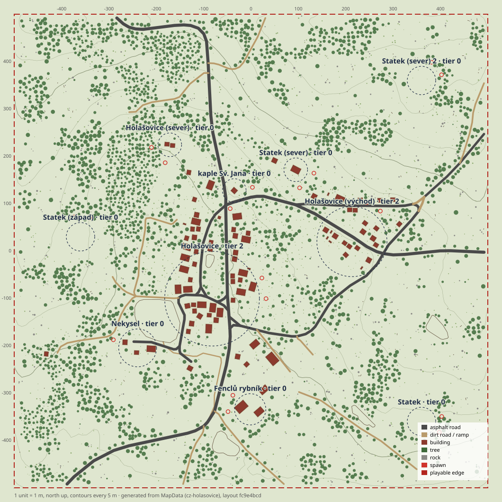
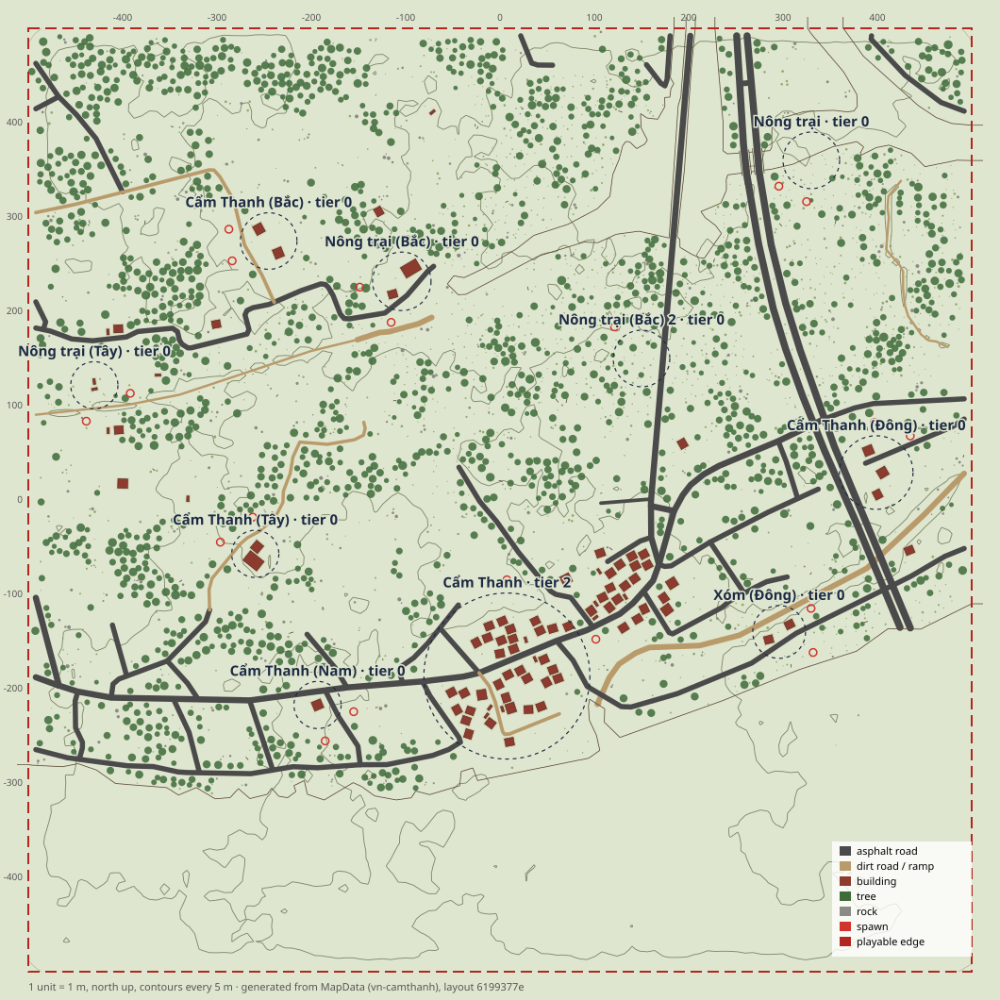
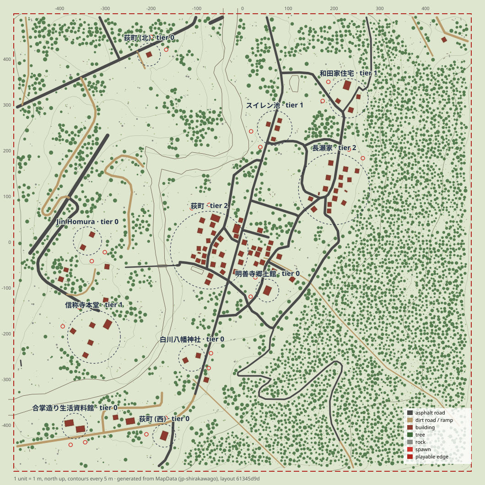
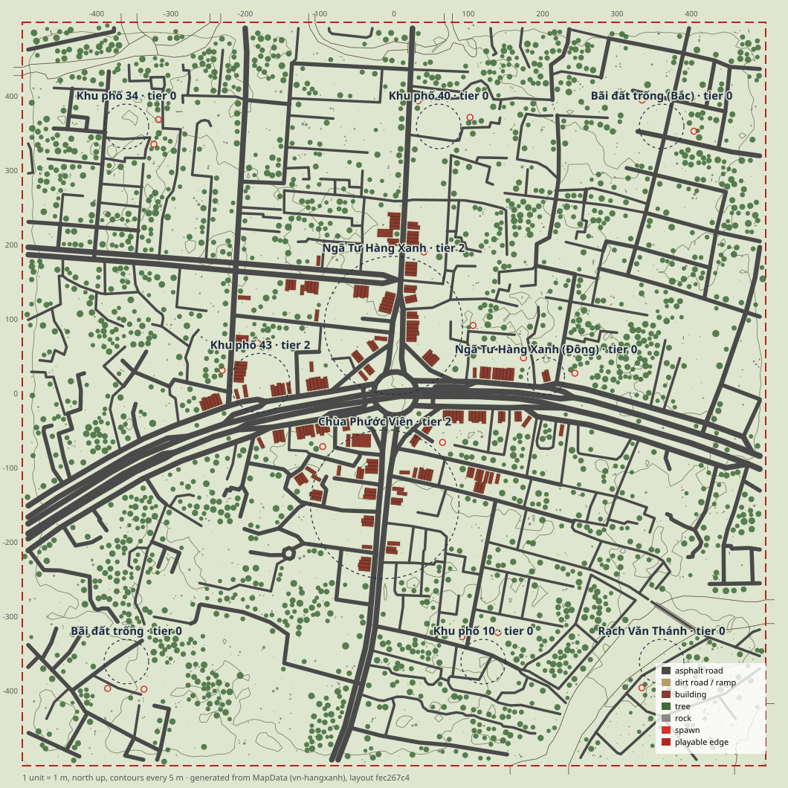
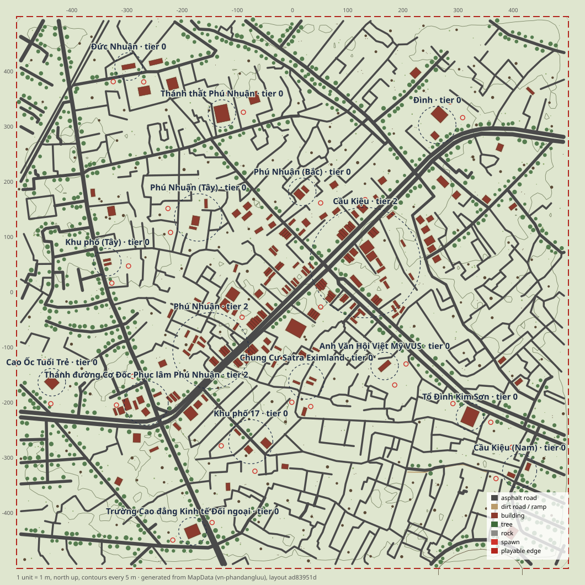

# Real-world maps (OpenStreetMap)

A real-world map is a 1×1 km square of a real place, rebuilt from OpenStreetMap roads, buildings, land use and water, plus scaled elevation, with the game's own building prefabs and props. Generation runs offline. The result is committed pure data (`MapData`), so the client and a Node server build identical terrain and layouts, and nothing is fetched at runtime.

Design and candidate places: [`docs/research/real-world-map-investigation.md`](../research/real-world-map-investigation.md).

| Map | Preview |
|---|---|
| Holašovice, CZ (recommended default) |  |
| Hội An – Cẩm Thanh, VN |  |
| Shirakawa-gō, JP |  |
| Ngã Tư Hàng Xanh, VN (city) |  |
| Phú Nhuận, VN (city) |  |

## Try it

- `http://localhost:5173/?map=cz-holasovice` (or `vn-camthanh`, `jp-shirakawago`) in DEV builds, once `Game.ts` uses `resolveMapDefinition` (`apps/client/src/world/mapRuntime/README-maps.md`).
- `?bots=1&map=<id>`: the offline bot match on that map.
- Headless: `node --experimental-transform-types tools/bench/bots/match.ts --map <id> --brain real`.

## Add any location

```sh
# A preset from tools/map/osm/places.ts
node --experimental-transform-types tools/map/osm/generate.ts cz-holasovice

# Any place: writes a new preset into places.ts, then generates it
node --experimental-transform-types tools/map/osm/generate.ts --lat 49.0156 --lon 14.4406 --name "Český Krumlov" \
  --cc cz --country Czechia [--id cz-krumlov] [--flat | --scale 0.5] [--max-relief 55] [--tropical]
```

Pick the center of a village or hamlet. The square is 1 km around it. What works well:
- **Building count:** about 60–400 buildings in the square. Fewer leaves open fields; dense towns get thinned to the cap and lose their character.
- **Roads:** a mapped road network.
- **Relief:** modest. Use `--scale 0.3` for valleys and `--flat` where the DEM is noise (coastal lowlands).

A run takes 10–60 s:
1. **Fetch** (`fetch.ts`, cached in gitignored `assets-src/map/osm/<id>/`):
   - one Overpass query for a 1.32 km square;
   - four AWS Terrain Tiles.
   - It sends a generic User-Agent (`twobullets-dev/0.1`) and no personal info. It waits 5 s or more between Overpass calls and backs off over three public mirrors on 429/504. Cached data is reused unless `fetch.ts <id> --refresh`.
2. **Convert** (pure, `packages/shared/src/map/real/convert/`), fixing the layout until it validates and every POI, spawn and door is reachable.
3. **Write** `packages/shared/src/map/real/<id>.ts`, `<id>.info.ts` and the `index.ts` registry.
4. **Build** (`tools/map/build.ts --map <id>` in a fresh process):
   - terrain bake `apps/client/public/assets/map/<id>.terrain.bin`;
   - checksum record `real/<id>.bake.ts`;
   - `docs/map/<id>.svg`;
   - picker preview `apps/client/public/assets/map/<id>.preview.svg`.
   - The generator then checks that the written module rebuilds the converter's exact layout checksum.

It exits 1 if validation issues or unreachable probes remain. After changing the converter, regenerate every map, then run `pnpm --filter @twobullets/shared test` (`real.test.ts` checks the bakes). `tools/map/build.ts --map all --check` verifies all outputs without writing.

## How OSM becomes a map

| Layer | Rule |
|---|---|
| Projection | Tangent plane at the center with the WGS84 meters-per-degree series. +X east, +Z north, meters. |
| Elevation | DEM sampled at 10 m and blurred to drop canopy and roof bumps. Measured from the lowest playable point, × `scale`, then smoothly compressed toward `maxRelief`. Stored as a 65 × 65, 20 m `heightGrid` terrain feature (Catmull-Rom, basic arithmetic only, so it passes the determinism rules). A gentle noise relief and the procedural mountain border stay. `flat` keeps only the noise. |
| Roads | Highway class → asphalt or dirt with a width: trunk 8 m … residential 5.5 m, service 3.8 m, track 3.5 m. `surface` and `width` tags override. Motorways, tunnels, driveways and parking aisles are skipped. Foot and cycle **bridges** are kept (3 m), since they are sometimes the only river crossing. Ways continuing each other are joined, simplified to 1 m and clipped 8 m inside the edge; stubs are dropped. `RoadSpec.width` is the additive field. |
| Creeks | Streams, ditches and small rivers become dry creek beds: cut flatten polylines 0.5–1.4 m deep, painted dirt (so trees and buildings keep off them). |
| Water | Water polygons (`natural=water`, riverbanks, reservoirs) are **not walkable**. A wooden fence (movement blocker, bullets pass) follows every bank, with gaps where roads cross. Crossings get railings on both shoulders that overlap the gap ends. Banks meeting the map edge run 12 m on into the border. Road ends inside water are trimmed to the bank. No water renderer yet: the fenced ground is plain grass. |
| Buildings | Footprint → minimum-area rectangle → prefab by tag and size (see below). The entrance (+Z) faces the nearest road. If it touches a road or creek (1.6 m gap), a neighbour (2 m) or water (5 m), the building is pushed back up to 8 m and nudged sideways, else dropped. The cap is 90: each 45 m settlement cluster gets a share by size, core first. Each building gets a rect pad at its mean natural height; neighbouring pads within 1.2 m share one level (a terrace). |
| POIs | 40 m clusters of placed buildings; sprawling ones are split into ~90 m parts. Accepted biggest first at ≥ 200 m (major) or ≥ 130 m and both radii + 40 m (minor, radius ≤ 40). With fewer than 10, named localities, then the open spot farthest from every POI, become landmark POIs (woods or fields). Names come from OSM place nodes, temples, chapels, museums, ponds and named areas (diacritics kept). Duplicates get a local direction word (`sever`, `Bắc`, `北`). Kind: farm (≥ 40 % barns or sheds), town (≥ 10 buildings), village; `village` is the additive `PoiKind`. Loot tier: 2 for ≥ 10 buildings (at most three), 1 for ≥ 4. |
| Spawns | Two per POI on rings just outside its radius, facing it. Each must be nearest to its own POI (spawn groups are by nearest POI), under 22°, off roads and water, and clear of buildings and fences. |
| Land use | Forests and woods: fungus oaks, then conifers (broadleaf in the tropics) and undergrowth, one rule per outline (28 largest). Wetland, scrub and orchards get their own rules. Residential areas get garden trees. Tree rows become 5 m bands. Farmland gets hay. Map-wide: groves, tree lines along roads, field cover clusters, lone oaks, slope rocks, gap-filling boulders, meadow bushes and grass. POI cores, water and fence gaps are excluded. |
| Isolation | A nav grid over terrain, roads and water fences alone finds land cut off by water (no bridge inside the square). Buildings, landmark POIs and spawns stay off it. |

**Prefab mapping** (`convert/buildings.ts`):

| Footprint | Prefab |
|---|---|
| Chapel, shrine, temple | `watchtower` under 70 m², else `barn` |
| Garage, shed, hut, anything under 38 m² | `container_open` / `_blue` (`house_small` from 60 m²) |
| Barn, stable, farm building | `barn` from 130 m², `warehouse` from 300 m² and 14 m wide |
| Industrial, commercial, retail | `warehouse` from 320 m², `barracks` when long, `house_two_story`, `house_small` |
| School, civic, hotel, apartments | `barracks` when long from 170 m², else `house_two_story` / `house_small` |
| House or untagged | long wings (≥ 17 m, 1.6:1) `barn`; ≥ 260 m² `barn` or `house_two_story`; ≥ 125 m² or 2+ levels `house_two_story`; else `house_small` (12 % ruined) |

The limits per map are 4 warehouses, 5 barracks, 4 watchtowers and 16 containers; extras fall back to barns or houses. `house_small` stays under 20 m², and roofs and carports are skipped.

**Fix-until-valid loop** (`convert/assemble.ts`), up to 12 passes, each rebuilding from scratch:
1. Place buildings.
2. Derive POIs, pads and terrain.
3. Pick spawns and scatter.
4. Run `validateMapLayout` (with `REAL_POI_SPACING` and the fence openings). Offenders are excluded or blocked: the later of an overlapping pair, a building off its pad, a steep entrance, a bad spawn.
5. Once validation is clean, run the nav reachability pass: POIs, spawns, entrances and ground-floor rooms must sit on the main component, with ≥ 98 % of loot spots reachable.

Everything is seeded from ids and OSM ids. There is no `Math.random`.

## The three maps

Generated from the OSM snapshot of 2026-09-15T03:54Z.

| | Holašovice (`cz-holasovice`) | Hội An – Cẩm Thanh (`vn-camthanh`) | Shirakawa-gō (`jp-shirakawago`) |
|---|---|---|---|
| Buildings kept / candidates | 90 / 139 | 90 / 392 | 90 / 274 |
| Dropped: conflicts / cap / validation+nav | 10 / 20 / 19 | 12 / 290 / 0 | 4 / 174 / 6 |
| Prefabs | 34 small, 3 ruined, 21 two-story, 22 barns, 2 warehouses, 7 containers, 1 watchtower (chapel) | 54 small, 6 ruined, 12 two-story, 2 barns, 16 containers | 32 small, 5 ruined, 41 two-story, 9 barns, 3 containers |
| POIs (settlements + landmarks) | 10 (7 + 3) | 10 (8 + 2) | 11 (11 + 0) |
| Spawns | 20 | 20 | 22 |
| Roads | 3.58 km asphalt, 2.05 km dirt | 7.28 km asphalt, 0.78 km dirt | 5.46 km asphalt, 1.94 km dirt (with the Deai-bashi footbridge) |
| Elevation | real 466–524 m → 47.5 m relief (×1) | flat (the DEM is canopy noise) | real 473–680 m → 51.6 m relief (×0.3, compressed) |
| Water | 5 ponds, 1.1 ha, 846 m fence | Thu Bồn and a channel, 28 ha, 3.6 km fence and railings | Shō river and ponds, 3.5 ha, 2.9 km fence |
| Prop instances | 5,529 | 4,492 | 9,620 |
| Validation | 0 issues | 0 issues | 0 issues |
| Reachable POIs / spawns / entrances / loot | 10/10, 20/20, 198/198, 100 % | 10/10, 20/20, 162/162, 100 % | 11/11, 22/22, 186/186, 100 % |
| Fenced water on the main nav component | 0 of 250 samples | 0 of 7,153 | 0 of 726 |
| Terrain bake | 2.26 MB | 2.43 MB | 2.31 MB |
| Map module | 136 KB | 113 KB | 126 KB |

POI names:
- **Holašovice:** Holašovice, Holašovice (východ), Nekysel, Fenclů rybník, Holašovice (sever), kaple Sv. Jana, and four landmark farms (Statek).
- **Cẩm Thanh:** Cẩm Thanh and its Bắc / Nam / Đông / Tây hamlets, plus Nông trại fields. OSM has no place nodes there, so the preset sets `localName`.
- **Shirakawa-gō:** 荻町, 長瀬家, 信称寺本堂, 和田家住宅, スイレン池, 合掌造り生活資料館, Jin Homura, 白川八幡神社, 荻町 (北), 荻町 (西), 明善寺郷土館.

**Headless bot matches.** `tools/bench/bots/match.ts --map <id> --brain real --seed 1`: 10 players in duos, normal difficulty, real brains, the map's own nav grid, spawn plan and loot.

| Map | Ends | Combat | Kills / knocks / revives | Stuck incidents (longest) | Tick p50 / p99 |
|---|---|---|---|---|---|
| Holašovice | last team | 4.4 min | 8 / 4 / 0 | 1 (10 s) | 0.35 / 1.14 ms |
| Cẩm Thanh | last team | 9.5 min | 9 / 9 / 4 | 5 (20 s) | 0.27 / 1.04 ms |
| Shirakawa-gō | last team | 8.5 min | 8 / 8 / 4 | 5 (10 s) | 0.47 / 1.43 ms |

## City maps (urban mode)

Two Saigon squares use `PlaceConfig.urban` and a per-map `buildingCap`. Without `urban`, the converter's output is unchanged: the three village maps regenerate byte for byte.

**What urban mode does:**
- **Roads:** alleys (hẻm) and unclassified ways are paved; service ways are 3.5 m.
- **Buildings from OSM footprints** (`urbanPrefabFor`, city set in `docs/map/buildings.md`). Tags on the footprint, or on an amenity/shop node inside it (`ParsedOsm.amenities`), pick the prefab:

  | Tags | Prefab |
  |---|---|
  | `place_of_worship`, church/temple/shrine buildings | `church` (christian, church/chapel/cathedral), else `pagoda`; under 90 m² a row house |
  | `marketplace` / `fuel` | `market_hall` (≥ 200 m², else `shop_kiosk`) / `petrol_station` |
  | school, college, university, kindergarten | `school` from 300 m², else `boarding_house` |
  | cafe, restaurant, fast food, bar | `cafe_terrace` up to 260 m², else `shophouse_french` |
  | bank, post office, townhall, police, civic | `office_tower` from 700 m², else `shophouse_french` |
  | apartments, hotel, dormitory, names starting "Chung cư" | `highrise_apartment` (≥ 8 levels or ≥ 1,100 m²), `apartment_block` (≥ 280 m²), `boarding_house` |
  | office, commercial / shop, retail | `office_tower` (≥ 500 m² or 6 levels), `shophouse_french`, `shop_kiosk`, `market_hall` |
  | industrial, sheds | `warehouse` (≥ 700 m²), `workshop`, `shop_kiosk` |
  | construction / house, villa ≥ 160 m² | `construction_site` / `villa` |
  | untagged | by width and area: row houses up to 6.5 m wide (narrow under 4 m, wide or mezzanine from 5.8 m), then shophouses, cafés, workshops, villas, apartment blocks, towers, in a mix seeded by the OSM id |

  - Limits per map: 3 high-rises, 4 office towers, 6 apartment blocks, 3 schools, 2 markets, 2 churches, 3 pagodas, 2 petrol stations, 3 construction sites, 6 villas, 6 workshops, 6 boarding houses. Extras fall back one step (tower → apartment block → boarding house → shophouse).
  - Landmarks (named, towers, apartment blocks, schools, places of worship, markets, petrol stations) rank first. Other real footprints rank ahead of generated frontage: rank × 0.02 / 0.3 / 0.5 for row houses.
- **Frontage rows** fill the streets OSM doesn't map:
  - fronts at the road gap, neighbours 0.16 m apart, a 3 m walk-through every 5–7 houses;
  - none on parks, pitches, school, market or hospital grounds, water or mapped footprints, or within 40 m of the center.
  - Each street class has a weighted mix of the tube-house variants, `shophouse_french`, `cafe_terrace` and `shop_kiosk`: main roads get taller shophouses, alleys lower ones. A slot never repeats the prefab next door.
  - Facade colours come from the placement position (`facadeColor`), so neighbours differ in prefab and usually in colour.
  - Frontage ids are `bld_9000000000000+n`, from road order.
- **Bridges** (`convert/bridges.ts`):
  - A bridge prefab is laid along a road where it crosses a water area, or where an OSM `bridge=*` highway crosses a waterway line.
  - Placement: centered on the crossing, 2 m of bank plus a 4 m ramp beyond the water at each end. The road must run within 0.8 m of the bridge axis over its whole length.
  - Size: a lane bridge for roads up to 3.9 m, a road bridge up to 8.6 m, lengths 16/80 and 24/40 m.
  - The shoulder railings of that crossing are dropped (the bridge parapets replace them). Bank fences keep their gap, which the bridge body closes.
  - Houses keep off the bridge rect. Bridges are map buildings (ids `bld_8000000000000+n`) without POI, pad or loot, and validation and reachability can exclude them.
- **Land use:** no village groves or field oaks. Instead:
  - park and grass rules (trees and bushes in `leisure=park/garden/playground`, `landuse=grass`, squares);
  - street trees along roads ≥ 5.5 m wide (they land in the walk-throughs and open lots, since houses and pads keep them out);
  - `urban_cover` clusters (covered cars, utility boxes, barrels, road barriers, the odd car wreck or pipe stack);
  - fewer garden trees and meadow bushes.
- **POI names:** markets, schools, churches, pagodas, apartment blocks and hospitals name POIs. Numbered quarters ("Khu phố 12") come after them.

## Names

- **No political map, POI, area or landmark names:** `convert/names.ts` (`isPoliticalName`) matches political figures and revolutionaries, political events and dates (30/4, Cách Mạng Tháng Tám), party and state organs (Ủy ban nhân dân, Công an, Quân khu), memorials, and the city name "Hồ Chí Minh" / "TP.HCM", ignoring case and diacritics, whole words only. Such OSM names never name a POI; the POI takes the next named thing nearby or a generic word. A place's `name`, `localName` or landmark name that matches stops the converter (and `generate.ts --name`). Historical kings, generals and scholars are not listed. Player-visible text says "Sài Gòn" for the city.
- **Road names keep the real street name**, political or not (owner decision 2026-09-15: street names are addresses players navigate by). The filter is not applied to road labels or street signs.
- **Road labels** (`convert/roadLabels.ts`, `MapData.roadLabels`): named trunk, primary and secondary roads of 100 m or more inside the map, tertiary from 200 m, any other named road from 300 m. Same-name ways join into chains, clipped and simplified to 2 m. Alleys ("Hẻm …") and names with a house number are skipped. The map screen (M) draws them along the road, upright, at the straightest stretches, once per 400 m, clear of POI names; below 2× zoom only trunk, primary and secondary names show. The minimap has none.
- **Landmarks** (`PlaceConfig.landmarks`, `MapData.landmarks`, additive): a named building picked by OSM way id. The converter resolves it to the placed building on that footprint (`generate.ts` fails when the footprint got no building). The map screen draws a small blue square with the name; the street signs put the name on its entrance facade. Not a POI: no spawns, loot tier or spacing. No map has one yet.

### Street signs

`layout/streetSigns.ts` (`planStreetSigns`, pure) plans them from `MapData` and the resolved buildings at load; `apps/client/src/world/streetSigns/StreetSigns.ts` renders them from `MapRuntime`. Visual only: no colliders.
- **Look:** Vietnamese blue blade (1.1 × 0.275 m) with a thin white border and the road name in white capitals, full diacritics, on a 3.2 m grey pole. Landmark boards are 2.8 × 0.7 m, 2.6 m above the floor, 8 cm off the entrance facade.
- **Corners:** where two labeled roads cross (T junctions included), one pole per junction (crossings within 28 m merge), with a blade along each road. The pole goes on the first corner, 0.9, 1.3 or 2 m past the widest road edge, whose pole and blade ends clear every road by 0.6 m (blade ends 0.1 m) and every building outline by 0.35 m. Crossings flatter than about 20° get none.
- **Along roads:** every 175 m (one per chain from 60 m), alternating sides, sliding up to 30 m along the road when blocked, skipped within 90 m of another sign naming the road and 12 m of any sign.
- **Rendering:** one merged mesh and one PBR material over a canvas atlas baked at load (512 × 128 px per name, Arial/Helvetica/Roboto/Noto stack). One draw call. Signs past 120 m (hysteresis 124 m) are hidden by collapsing their vertices onto a visible sign, rewritten only when the visible set changes, so the mesh bounds and frustum culling follow the nearby signs. No shadow casting. Planning takes 1–3 ms.

| Map | Road labels | Signs (corner / along) | Triangles | Most signs within 120 m | Draw calls |
|---|---|---|---|---|---|
| Holašovice | 0 | 0 | 0 | 0 | 0 |
| Cẩm Thanh | 5 | 13 (2 / 11) | ~420 | 4 | ≤ 1 |
| Shirakawa-gō | 1 | 1 (0 / 1) | 30 | 1 | ≤ 1 |
| Hàng Xanh | 8 | 20 (9 / 11) | ~710 | 7 | ≤ 1 |
| Phú Nhuận | 13 | 29 (12 / 17) | ~1,010 | 4 | ≤ 1 |

| | Ngã Tư Hàng Xanh (`vn-hangxanh`) | Phú Nhuận (`vn-phandangluu`; the id keeps the street name it was first generated under) |
|---|---|---|
| Center | junction node 2899907852 "Ngã tư Hàng Xanh" (10.80144, 106.71132) | the one-way primary road inside Phường Đức Nhuận, checked with Overpass `is_in` (10.80134, 106.68246) |
| Snapshot | 2026-09-15T05:23Z | 2026-09-15T05:34Z |
| Buildings (cap) | 190 (190) + 2 bridges, 24 types | 190 (190), 23 types |
| Row houses | 113: 23 mezzanine, 20 narrow, 17 ×3, 15 planters, 15 wide, 10 ×4, 8 ×2, 5 shed | 118: 26 narrow, 18 planters, 17 ×3, 13 ×2, 12 mezzanine, 12 wide, 12 shed, 8 ×4 |
| Shops and houses | 21 French shophouses, 13 kiosks, 9 cafés, 6 workshops, 6 boarding houses, 5 villas | 23 French shophouses, 14 cafés, 6 workshops, 5 kiosks, 4 villas, 1 boarding house |
| Landmarks | 6 apartment blocks, 4 office towers, 2 high-rises (Chung cư Mỹ Đức), Nhà Thờ Hàng Xanh, Chùa Phước Viên, 1 school, 1 market, 1 construction site | 4 apartment blocks, 3 high-rises, 3 office towers, 2 churches, 2 schools, 1 pagoda, 1 market, 1 petrol station, 2 construction sites |
| Bridges | Cầu Sơn (`bridge_road_24`, 9 m of water, at 24, 466); service bridge over Rạch Văn Thánh (`bridge_lane_80`, 65 m, at 381, −302) | none: Cầu Kiệu and the Nhiêu Lộc–Thị Nghè canal lie outside the square; the only mapped bridge is a 3 m alley bridge over a ditch at a T junction |
| Candidates | 427 OSM footprints + 6,643 frontage slots | 318 OSM footprints + 7,986 frontage slots |
| POIs | 17, 34 spawns | 16, 32 spawns |
| Roads | 316, 31.0 km paved | 389, 35.8 km paved |
| Water | Rạch Văn Thánh, Rạch Cầu Bông, Rạch Bà Láng, Hồ Văn Thánh: 2.7 ha, 2.3 km fence | Kênh Thị Nghè corner: 0.4 ha, 197 m fence |
| Prop instances | 2,456 | 1,500 |
| Validation / reachability | 0 issues, 1 pass; 17/17, 34/34, 201/201, loot 100 % | 0 issues, 1 pass; 16/16, 32/32, 197/197, loot 100 % |
| Loot (seeds 11–13) | 257–268 piles, 472–512 items | 246–256 piles, 453–488 items |
| Bot match (seed 1, duo, real brains) | last team, 8.7 min, 8 kills / 5 knocks / 1 revive, 11 stuck incidents (longest 10 s), tick p50/p99 0.39/1.55 ms | last team, 8.9 min, 8 / 7 / 3, 10 stuck (20 s), 0.40/1.46 ms |

POI names:
- **Hàng Xanh:** Ngã Tư Hàng Xanh, its Bắc / Đông / Tây / Nam parts, Khu phố 62, 43, 34, 60, Chung Cư Saigonland, Chung cư Mỹ Đức, Khu du lịch Văn Thánh.
- **Phú Nhuận:** Cầu Kiệu, Phú Nhuận and its Tây / Bắc parts, Thánh đường Cơ Đốc Phục lâm Phú Nhuận, Khu phố 17, Chung Cư Satra Eximland, Đình, Cao Ốc Tuổi Trẻ, Đức Nhuận, Trường Cao đẳng Kinh tế Đối ngoại, Thánh thất Phú Nhuận, Anh Văn Hội Việt Mỹ VUS, Tổ Đình Kim Sơn, and quarter parts.

Road names on the map screen and street signs (see "Names" below):
- **Hàng Xanh:** Điện Biên Phủ, Xô Viết Nghệ Tĩnh, Bạch Đằng, Cầu vượt Hàng Xanh, Đinh Bộ Lĩnh, Ngã tư Hàng Xanh, Nguyễn Gia Trí, Đường nội bộ Khu du lịch Văn Thánh.
- **Phú Nhuận:** Phan Đăng Lưu, Nguyễn Kiệm, Hoàng Văn Thụ, Phan Đình Phùng, Phan Xích Long, Thích Quảng Đức, Nguyễn Trọng Tuyển, Trường Sa, Đường Phùng Văn Cung, Đường Nguyễn Đình Chiểu, Trần Khắc Chân, Lê Tự Tài, Cầm Bá Thước.
- **Cẩm Thanh:** Đường Võ Chí Công, Cầu Cửa Đại, Đồng Khởi, Đường Rừng Dừa Bảy Mẫu, Thôn Thanh Nhì. **Shirakawa-gō:** 国道156号.

**Budget** (cap 190, measured in Node; Map v1 is 85 buildings, 178k tris, 6,509 compound children):

| Map | Tris, all buildings | Tris within 200 m of center | Compound children | Geometry + AO bake (types used) | Nav build |
|---|---|---|---|---|---|
| Hàng Xanh | 1.06 M | 0.67 M | 36.1k | 2.7 s (24 types) | 636 ms |
| Phú Nhuận | 1.04 M | 0.64 M | 35.3k | 2.8 s (23 types) | 637 ms |

- **Triangles** stay under 1.2 M, so no far LOD was needed. The tallest prefabs are cheap per height because their upper floors are closed bodies.
- **Loot** is well under the equipment caps (320 piles, 700 items). Phú Nhuận's cap went up from 170 to 190.
- **Main thread:** the per-prefab geometry and AO bake is now about 2.7 s for 23–24 prefab types (0.6–0.7 s before). This is the main load-time cost, a candidate for a worker or a precomputed bake. Havok building bodies take about 35 ms.
- **Stuck incidents** in the bot matches are all inside buildings: tube-house upper floors round the stair core and partition door (the original `tube_house_3/4` too), plus door pinches. None are in alleys.
- **Browser checks:** a `?bench=` run in a real browser is still needed.

## Runtime

- `apps/client/src/world/mapRuntime/maps.ts`:
  - `resolveMapDefinition(id)` → `{ id, name, map, bakeUrl, trainingYard }`. Real maps load their module as a separate chunk; the registry (`real/index.ts`) holds only the small `info` facts.
  - `mapChoices()` lists Map v1 and the real maps for menus.
- `MapRuntime.load(scene, environment, { ...definition, overlay })`: `trainingYard: null` skips the arena, its soldier range and its audio ray zone. Real maps have no Training Yard.
- `apps/client/src/ui/mapPicker`:
  - `MapPicker` shows a card per map (preview, name, country, POIs, buildings, road km, relief) and the selected map's credits.
  - It reports the chosen id through `selected`, `onSelect`, `onConfirm` and `confirmed`.
  - All text is in `strings.ts` for the i18n pass.
- `tools/map/build.ts --map <id>` builds one map, `--map all` builds everything. Without `--map` it builds Map v1 exactly as before, plus `mapV1.preview.svg`.

## Limits

- **Looks:**
  - Prefab repetition means a place reads like the real one from above (street plan, fields, woods, river), not up close. Shirakawa-gō's gasshō farmhouses become barns and two-story houses.
  - No water surface: fenced water is grass for now.
  - Palms are broadleaf trees.
- **Buildings:** capped at 90 (city maps set their own cap). Dense places (Cẩm Thanh has 392 candidates) keep their core and a share of each hamlet. Real houses 3–6 m from the street centerline get pushed back, so streets feel wider.
- **POI spacing:** real maps validate with 200 m / 130 m (Map v1 uses 250 m / 150 m).
- **Spawn groups:** 10–11 per map with 2 spawns each, so a 20-team solo match needs the spawn planner to share POIs.
- **Terrain:** heights are real only to ±1–2 m (SRTM at 20 m, blurred). Village pads flatten local slopes.
- **ODbL share-alike:** the generated modules and bakes are a derivative database. That is fine for the internal release; a public release must offer them under the ODbL.
- **City maps:**
  - Frontage rows are generated, not surveyed: the street plan is real, the individual houses are not.
  - The houses cluster within about 350 m of the center, so the outer landmark POIs are open ground.
  - Village scatter (groves, meadow bushes) still fills the blocks between streets.
- **OSM coverage** varies a lot. The Vietnam survey is in the investigation: most places are all-or-nothing.

## Licenses and credits

`apps/client/public/assets/map/credits.json` has the full attribution text; the picker shows the short lines.
- **OpenStreetMap (ODbL 1.0):** "© OpenStreetMap contributors", linking https://www.openstreetmap.org/copyright. Every real map needs it.
- **AWS Terrain Tiles:** the tilezen required attribution (https://github.com/tilezen/joerd/blob/master/docs/attribution.md). For these maps that is "SRTM and GMTED2010 terrain data courtesy of the U.S. Geological Survey", plus "produced using Copernicus data and information funded by the European Union - EU-DEM layers" for Holašovice.
- **Google Maps data is never used.** Its terms forbid it.

## Browser viewpoints (feet x, z; heights from the terrain)

| Map | Where | x, z | Look at |
|---|---|---|---|
| Holašovice | Village core | (−82, −100) | Houses and barns facing the streets, terraced pads, garden trees |
| Holašovice | East cluster | (213, 20) | Two-story houses along the tertiary road, road tree lines |
| Holašovice | Pond | (−197, −148) | Bank fence: can't be entered; walk the whole edge |
| Holašovice | Chapel | (−35, 128) | `watchtower` as the chapel, open fields to the north |
| Cẩm Thanh | Main hamlet | (7, −187) | Dense small houses, river bank fence to the south |
| Cẩm Thanh | River bank | walk south from (0, −300) | Fence continuity, road gaps with railings, no way into the water |
| Cẩm Thanh | NE channel | (280, 440) | Road crossing the channel: railings meet the bank fences |
| Shirakawa-gō | Ogimachi (荻町) | (−73, −17) | Two-story houses and barns on terraces, 0.3× valley slopes |
| Shirakawa-gō | Deai-bashi footbridge | (−143, −50) | 3 m bridge over the fenced river, railings on both sides |
| Shirakawa-gō | East slope | (200, 117) | 長瀬家 cluster, conifer woods up the valley side |
| Hàng Xanh | Junction | (0, 30) | Frontage mix, pastel facades, French shophouses and cafés round the open center |
| Hàng Xanh | Cầu Sơn | (24, 450) | Road bridge: ramps, parapets, bank fences meeting its sides |
| Hàng Xanh | Rạch Văn Thánh bridge | (355, −285) → (409, −320) | 80 m lane bridge across the fenced water; bots cross it |
| Hàng Xanh | Chung cư Mỹ Đức | (276, −287) and (224, −355) | Two high-rises on their real footprints, podium stair up to the terrace |
| Hàng Xanh | Chùa Phước Viên / market | (69, −59) / (−44, −62) | Pagoda gate, courtyard and roof; open market hall next to the junction |
| Hàng Xanh | Nhà Thờ Hàng Xanh | (−292, 226) | Church nave, bell tower and spire |
| Phú Nhuận | Center high-rise | (6, −65) | 16-floor tower right off the main street, shop podium, facade bands |
| Phú Nhuận | North landmarks | (−269, 365), (−218, 378), (−128, 324) | Market hall, office tower, high-rise |
| Phú Nhuận | Churches / petrol station | (272, 201), (−300, −202) / (−282, −265) | Pink church with bell tower; canopy and pump islands |
| Any | Out of bounds | walk past x = 500 | Warning and respawn, as on Map v1; bank fences run on into the border |

| Phú Nhuận | Street signs | walk the main road from (−120, −125) to (60, 45) | Blue name blades at the corners and along the road, readable from both sides, off the carriageway, hidden past ~120 m |
| Hàng Xanh | Street signs | (0, 30) | Corner poles round the junction, Điện Biên Phủ / Xô Viết Nghệ Tĩnh blades, diacritics intact |

Not verified in a browser yet:
- street signs: text orientation on both faces, atlas legibility, the hide distance;
- terrain and pad transitions on real slopes;
- the look of wide fenced grass where water should be;
- creek beds;
- the picker cards;
- load time with 90 buildings (same prefab set as Map v1, so similar).
