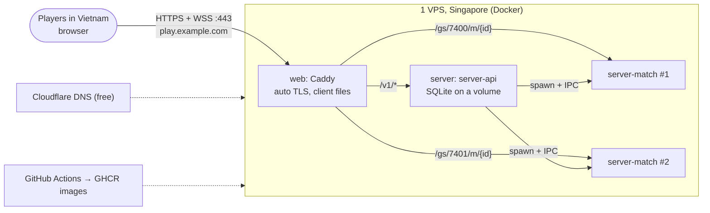

# Release plan: internal release (friends and testers)

- **Date:** 2026-09-15
- **Audience:** the owner. Plain language; game-dev terms are explained where they first appear.
- **Scope:** what "done" means for the first internal release, what is left to build, where to host it, what it costs, what you must do by hand, and how to release and roll back.
- **Related:** [runbook.md](runbook.md) (step-by-step operations), [../backend/architecture.md](../backend/architecture.md) (the long-term design), [../backend/platform.md](../backend/platform.md) (matchmaking, hosting and cost at scale).

## 1. The short version

- **Build the smallest thing that lets 2–20 friends play a full match together from a link.**
  - Guest login with a nickname, a lobby, a quick queue, bots filling empty seats.
  - One networked battle royale match on Map v1: landing, zone, loot, combat, knock/revive, results. Reconnect after a tab reload.
- **Host everything on one small Singapore VPS**, about **US$10–15 per month**, instead of the dedicated servers the long-term design plans for public launch (those start around US$136/month per box).
- **Already built today:** the control plane (`apps/server-api`), the contract for the lobby UI (`packages/contracts/src/{rest,ws,claims}.ts`), Docker images, the Caddy front door, a GitHub Actions release workflow and the deploy/backup/key scripts (`infra/`).
- **Still to build:** the battle royale loop on the match server (the biggest part), the server-side hooks that let `server-api` start match processes (§3.1), and the login/lobby screens in the client.

## 2. MVP definition

A "match server" is the Node process that runs the authoritative simulation (`apps/server-match`); the browser only predicts and draws. The "control plane" is everything around matches: accounts, lobbies, the queue, starting match servers, storing results (`apps/server-api`).

| # | Feature | Player sees | Done when |
|---|---|---|---|
| 1 | **Guest login** | Types a nickname (and the invite code, if set). Stays logged in on that browser. | `POST /v1/auth/guest` → access token + refresh secret. Nickname 3–16 characters, Vietnamese letters allowed. No email, no password. |
| 2 | **Lobby settings** | Picks mode (solo/duo/squad), match size (2–20), map (Map v1; real-world maps shown as "coming soon"), bots on/off, language (Vietnamese by default). | `GET /v1/catalog` drives the menus; the server validates every value. |
| 3 | **Custom match** | "Create lobby" gives a 6-letter code. Friends join by code, switch teams, the host presses Start. | Lobby REST + WS push; bots fill the empty seats when on. |
| 4 | **Quick play** | "Quick play" with a mode and size. The match starts when enough people wait, or after 30 s with bots. | Queue tickets, 1 Hz matchmaking pass, start-with-bots rule. |
| 5 | **Networked BR match** | Pick a landing spot, glide down, loot, fight, get knocked, get revived by a teammate in 5 s, the zone shrinks, a winner. About 10–12 minutes. | The match server runs the whole loop (§3.2); friendly fire and body blocking on. |
| 6 | **Results** | Placement, kills, knocks, revives, damage for everyone (bots marked). Recent matches on the profile. | Match server reports the result; `server-api` stores it in SQLite. |
| 7 | **Reconnect** | Reload the tab mid-match: back in the same body within 60 s. | `GET /v1/me/active-match` → `POST /v1/matches/{id}/join` gives a fresh join token (higher `epoch`); the match server re-attaches the player. |

**Not in the MVP** (on purpose): accounts with email/OAuth, parties outside lobbies, skill-based matchmaking, several regions, WebTransport (WebSocket over TLS only), anti-ESP relevance culling (friends only), replays, leaderboards, legal work for a public launch.

### UI strings for the front door (Vietnamese default, English)

| Key | Tiếng Việt | English |
|---|---|---|
| login.nickname | Tên hiển thị | Nickname |
| login.invite | Mã mời | Invite code |
| login.play | Vào chơi | Play |
| menu.quickPlay | Chơi nhanh | Quick play |
| menu.createLobby | Tạo phòng | Create lobby |
| menu.joinByCode | Vào phòng bằng mã | Join with code |
| settings.mode | Chế độ | Mode |
| mode.solo / duo / squad | Đơn / Đôi / Tổ đội | Solo / Duo / Squad |
| settings.players | Số người chơi | Players |
| settings.map | Bản đồ | Map |
| settings.bots | Thêm bot vào chỗ trống | Fill empty seats with bots |
| settings.language | Ngôn ngữ | Language |
| map.comingSoon | Sắp ra mắt | Coming soon |
| lobby.code | Mã phòng | Lobby code |
| lobby.team | Đội {n} | Team {n} |
| lobby.switchTeam | Đổi đội | Switch team |
| lobby.start | Bắt đầu | Start |
| lobby.leave | Rời phòng | Leave lobby |
| lobby.host | Chủ phòng | Host |
| queue.searching | Đang tìm trận… | Finding a match… |
| queue.botsIn | Bắt đầu cùng bot sau {s} giây | Starting with bots in {s} s |
| queue.cancel | Hủy | Cancel |
| match.connecting | Đang vào trận… | Joining the match… |
| match.reconnect | Kết nối lại | Reconnect |
| results.title | Kết quả trận | Match results |
| results.place / kills / knocks / revives / damage | Hạng / Hạ gục / Đánh gục / Cứu / Sát thương | Place / Kills / Knocks / Revives / Damage |
| error.nicknameInvalid | Tên cần 3–16 ký tự: chữ, số, dấu cách, _ - . | Nickname needs 3–16 letters, digits, spaces, _ - . |
| error.inviteRequired | Mã mời không đúng | Wrong invite code |
| error.lobbyFull | Phòng đã đầy | The lobby is full |
| error.lobbyClosed | Trận đã bắt đầu | The match has already started |
| error.noCapacity | Máy chủ đang bận, thử lại sau một phút | All servers are busy, try again in a minute |
| error.upgradeRequired | Có phiên bản mới, hãy tải lại trang | A new version is out, please reload |
| error.rateLimited | Thao tác quá nhanh, đợi một chút | Too fast, wait a moment |
| error.alreadyInMatch | Bạn đang ở trong một trận khác | You are already in a match |

## 3. What is left, in order

"Wave" = one agent-team round (3–4 agents with exclusive files, then a browser check), roughly one working session. Estimates are rough and assume the current code quality holds.

### 3.1 Platform track

| # | Step | Who | Effort | Status |
|---|---|---|---|---|
| P1 | `server-api` MVP: guest auth, JWKS, lobbies, queue, allocation, join tokens, SQLite results, health/metrics, tests | agents | — | **Done** (this wave) |
| P2 | Deploy kit: Dockerfiles, Caddy, compose, `.env.example`, release workflow, deploy/backup/keys scripts, runbook | agents | — | **Done** (this wave; images not built locally, see §8) |
| P3 | **server-match agent mode** (exact changes below) | 1 agent (server-match owner) | ½ wave | Next |
| P4 | **Client front door:** login, lobby, quick play, "match found" → connect with the API's join token, reconnect, results screen, vi/en strings | 3 agents (menu UI, API/WS client, net handshake) | 1 wave | Next, in parallel with P3 |
| P5 | First deploy on the VPS, invite 2–3 friends, fix what breaks | owner + lead | 1 evening | After P3, P4 and at least B1 |
| P6 | Light ops: nightly backup cron, free uptime check, weekly key/backup review | owner | 1 h once | With P5 |
| P7 | Later, only if needed: bundle the servers with rolldown (smaller images), Postgres instead of SQLite, a second host | agents | ½ wave each | Not planned |

**P3: server-match changes `server-api` needs** (`apps/server-match/src/main.ts`, `app.ts`, `host/LocalMatchHost.ts`, `session/SessionManager.ts`; contract unchanged, `packages/contracts/src/agent.ts`):

1. `--mode=agent`: load Havok, start the WS listener on `--host`/`--port`, create **no** match, disable `/dev/token` and the HS256 dev key, then send `{t:"ready", udpPort:0, wsPort}`.
2. On `{t:"jwks", keys}`: `verifier.setKeys(keys.map(ed25519KeyFromJwk))`. Can arrive again at any time (key rotation).
3. On `{t:"allocate", config}`: reject with exit code 3 unless `isCompatible(config.protocolVersion, config.contentHash)`; load the level for `config.mapId` (`v1` = Map v1, `arena`); `host.createMatch(config)`; use **`config.hostId`** for the directory's `hostId` (today it is the constant `LOCAL_HOST_ID`, so `hid` claims would fail); then send `{t:"phase", phase:"Warmup", freeSlots}` at once. **server-api treats the first `phase` message as the allocation acknowledgement** (30 s timeout).
4. Admission stays roster-only: `config.teams` lists every human and `bot:<n>` seat, and `chooseSlot` already rejects unlisted accounts.
5. Send `phase` on every lifecycle change, and `player {accountId, joined|left}` through `LocalMatchHost.onPlayer`.
6. At the end send `{t:"result", summary: MatchResult}` (placement by team elimination order, kills, knocks, revives, damage, survival time, `bot` flag), then `{t:"exit", code:0}` and exit. One match per process.
7. On `drain` or SIGTERM: send a `result` with outcome `aborted` (in combat) or `cancelled` (warmup) before exiting. Cancel with `cancelled` when no human joins within 120 s.
8. When `rules.fillWithBots`, run server bots in the `bot:<n>` seats (B6 below).

### 3.2 Networked battle royale track (M5 subset)

The offline versions of all of this exist (`?bots=1`); the work is making the server authoritative and replicating it.

| # | Step | What it means | Effort |
|---|---|---|---|
| B1 | **Match lifecycle** | Phases Warmup → LandingSelect → Glide → Combat → End on the server, countdown, results, P3 hooks. Damage off in warmup. | 1 wave |
| B2 | **Map v1 on the server** | Load terrain heightfield + building collision for `mapId: "v1"` (today the server only knows the arena). Measure memory and tick cost. | 1 wave |
| B3 | **Landing and glide** | Team picks a spot (team-only marker), players spawn in the air, shared glide/parachute step predicted like movement. | 1 wave |
| B4 | **Zone** | Server runs the shared zone schedule, zone damage, `ZonePhase` events; client draws the circle from server data. | ½ wave (with B3) |
| B5 | **Loot and equipment over the network** | Loot from the match seed, pickup/drop/use as input actions, inventory deltas to the owner, heals, armor, then grenades/smoke/molotov. Largest step. **Status (2026-09-16): loot and throwable waves done in code, browser check pending.** Protocol v7: server-generated loot streamed by area of interest, pickup/drop/swap actions, inventory-driven weapons and ammo, looted armor, death piles, server bots loot. Protocol v9: server-authoritative throwables (`throwItem` action, `ThrowableUpdate` 0x52 for grenades in flight, detonations, smoke, fire and per-player flashes), throwables back in the ground loot and in the starting kit, carried counts in the owner items group, server bots throw. Left: per-weapon remote models, remote throw animations. | 2 waves (both in code) |
| B6 | **Server bots** | Run the existing bot brain inside the match process on the same input path as humans; easy/normal/hard. | 1 wave |
| B7 | **Teams and revive on the wire** | Replicate teams (spectate cycling, teammate markers), revive progress events, results screen data. | ½ wave |
| B8 | **Reconnect polish** | Grace per phase (15 s warmup, 60 s later), auto-land a disconnected player, full-state resync. | ½ wave |
| B9 | **20-player load check** | 20 bots on Map v1 in one process on the VPS for 15 min: tick p99, memory, bandwidth. Decides `TB_MAX_MATCHES`. | ½ wave + owner run |

**Order:** P3 + P4 + B1 together → B2 → B3/B4 → B6 → first friends playtest (guns only) → B5 → B7/B8 → B9 → wider internal release. About **9–11 waves** in total.

## 4. Hosting recommendation

### 4.1 Why not the plan in platform.md yet

`platform.md` plans OVH Advance-1 bare metal in Singapore (US$136/month + setup fee, 6 cores) plus a cloud VM, managed Postgres and Redis: about US$190/month. That is right for hundreds of players. For an internal release with 1–3 matches at a time it is 10× more than needed. The code keeps the same shape (one match process per match, EdDSA join tokens, the agent IPC contract), so moving up later is a deploy change, not a rewrite.

### 4.2 Recommended MVP setup

- **Singapore** is the region: Ho Chi Minh City → Singapore averages about **37 ms**, Hanoi → Singapore about **67 ms** ([WonderNetwork](https://wondernetwork.com/pings/Singapore), numbers in platform.md §4.1). Both are fine for a shooter with lag compensation. Vietnam's international cables fail a few times a year; during a fault, ping to Singapore can jump.
- **One VPS** runs two containers: `web` (Caddy with automatic Let's Encrypt HTTPS, serving the client and proxying the API and match WebSockets) and `server` (`server-api`, which starts one `server-match` process per match on ports 7400–7419 inside the container). Only ports 80 and 443 are open to the internet.
- **The client files** (about 100 MB, 566 files) are served by Caddy from the same host. If downloads feel slow from Vietnam, move them to **Cloudflare Pages** (free; the free plan allows 20,000 files per site, and no file here is over 20 MB) and set `TB_CORS_ORIGINS`. Cloudflare has edge servers in Hanoi and Ho Chi Minh City.
- **DNS:** Cloudflare (free). Set the `play` record to **DNS only** (grey cloud). The game's WebSocket traffic then goes straight to Caddy without an extra hop.

### 4.3 Which VPS

A match of 20 players with server bots should need roughly 0.3–0.6 vCPU and ~250 MB (ADR 0001 measured 0.20 vCPU and 200 MB for 10 players on the arena; Map v1 and bots add cost; B9 measures it). Bandwidth is about 85 kbps per player ([ADR 0001](../backend/adr/0001-capacity-bandwidth-cost-baseline.md)), so a 12-minute, 20-player match uses about 150 MB.

| Option | Specs | Price per month | Notes |
|---|---|---|---|
| **OVHcloud VPS-2, Singapore (recommended)** | 4 vCores, 8 GB, 75 GB NVMe, 1 TB traffic then 10 Mbps cap, anti-DDoS | **US$8.50** with a 12-month commitment ([OVH VPS Singapore](https://www.ovhcloud.com/asia/vps/vps-singapore/)) | 3–4 concurrent 20-player matches with headroom. 1 TB covers ~6,000 matches. Month-to-month costs more; check at checkout. |
| OVHcloud VPS-3, Singapore | 6 vCores, 12 GB, 1 TB | US$12.32 (12-month) | If B9 shows VPS-2 is tight |
| DigitalOcean, Singapore | Basic 4 vCPU/8 GB: US$48. CPU-Optimized (dedicated vCPU) 2 vCPU/4 GB: US$42; 4 vCPU/8 GB: US$84. 4–5 TB transfer ([DO pricing](https://www.digitalocean.com/pricing/droplets)) | US$42–84 | Per-second billing: create it for playtest nights only (a 4 vCPU CPU-Optimized droplet for 40 h ≈ US$5). Dedicated vCPUs give steadier ticks. |
| Vultr, Singapore | Regular 4 vCPU/8 GB, 4 TB | about US$40 ([Vultr](https://www.vultr.com/products/regular-performance-compute/)) | Region prices can differ; check |
| Hetzner, Singapore | CCX13 (2 dedicated vCPU) €53.99 after the 2026 increase; Singapore traffic overage €7.40/TB ([Northflank](https://northflank.com/blog/hetzner-cloud-server-price-increases), [Hetzner SG](https://www.hetzner.com/cloud-singapore/)) | ~US$60 | Good CPUs, expensive traffic in Singapore |
| OVH Advance-1 bare metal (platform.md plan) | 6 cores/12 threads, unmetered | US$136 + setup | Public launch |
| A VPS inside Vietnam (Viettel IDC, VNPT, FPT, BizFly…) | varies | not researched | Lower domestic ping (single-digit to ~30 ms), but foreign players and payment/ID requirements vary. Worth a ping test if everyone is in Vietnam. |

Shared vCores (OVH, DO Basic, Vultr Regular) can stall for a few milliseconds when a neighbour is busy. `server-api` exports the worst tick p99 (`tb_match_tick_work_p99_ms_max`); if it often goes above ~8 ms or players feel rubber-banding, move to dedicated vCPUs.

### 4.4 Monthly cost

| Item | Recommended | Alternative |
|---|---|---|
| VPS | US$8.50–12.32 (OVH VPS-2/3, 12-month) | US$40–84 (Vultr/DO), or ~US$5–15 if rented only on playtest nights |
| Domain (`.com`) | about US$10–12 per **year** at Cloudflare Registrar's at-cost pricing ([Cloudflare Registrar](https://www.cloudflare.com/products/registrar/)) → ~US$1/month | any registrar |
| Cloudflare DNS / Pages | US$0 | — |
| GitHub Actions + container registry | US$0 for a public repo; a private repo has a free monthly allowance of Actions minutes and package storage, check [GitHub pricing](https://github.com/pricing) and delete old image tags | — |
| Backups | US$0 (OVH VPS includes a daily backup of the last 24 h; plus the nightly SQLite copy, kept off the server) | Cloudflare R2 free tier |
| **Total** | **≈ US$10–15 / month** | ≈ US$45–90 / month |

## 5. What you (the owner) must do yourself

Claude never asks for or handles your passwords, API tokens or private keys. Each of these takes a few minutes; [runbook.md](runbook.md) has the exact commands.

1. **Buy the VPS** (OVH VPS-2, Singapore, Ubuntu 24.04). Add your SSH public key during checkout.
2. **Register a domain**, or use one you own. Pick a subdomain such as `play.<yourdomain>`.
3. **Create a Cloudflare account** (free), add the domain, and create an `A` record `play` → the VPS IP, **DNS only**.
4. **Prepare the server:** create a `deploy` user, install Docker, open ports 22/80/443 only (runbook §1).
5. **GitHub:** push the repo; add the `production` environment with secrets `DEPLOY_SSH_KEY` and `DEPLOY_KNOWN_HOSTS` and variable `DEPLOY_SSH` (only if you want one-click deploys from Actions). If the images are private, create a read-only token for the VPS to pull them.
6. **Generate secrets on the server:** the JWT signing key (`infra/scripts/keys.sh generate`), `TB_INVITE_CODE` and `TB_METRICS_TOKEN` (`openssl rand -hex 24`). Put them in `/opt/twobullets/.env`, `chmod 600`.
7. **Share the link and invite code** with friends privately (Zalo/Messenger group), not publicly.
8. **Look after backups:** copy `/opt/twobullets/backups/` to your laptop or cloud storage now and then.

## 6. Security basics

- **Secrets live only on the server:** `.env` (mode 600) and the JWT key file inside the Docker volume (mode 600). Nothing secret is in git, in images, or in GitHub logs. `infra/.env.example` has no real values.
- **Tokens:** everything is signed with **Ed25519** (EdDSA) keys. Access tokens last 12 h (audience `api`); join tokens last 120 s, work once, for one match on one host (audience `match`), and travel inside the first WebSocket message, not in URLs, so proxy logs never contain them. Rotate keys every ~90 days or at once if leaked (runbook §7).
- **Personal data:** only a nickname and language. No email, no real name, no IP stored in the database. Caddy access logs contain IPs and are rotated (5 × 10 MB). Tell testers this in one line.
- **Keep strangers out:** set `TB_INVITE_CODE`. Lobbies are private (code only) by default.
- **Rate limits:** 10 logins per IP per minute, 120 API calls per account per minute, 50 push messages per 10 s, 16 KB request bodies, WebSocket frames ≤ 16 KB on match servers. The match server already limits inputs per tick and kicks floods.
- **Exposure:** only 80/443 (Caddy) and SSH are open. `/metrics` is not reachable from the internet. SSH with keys only, no root login, `unattended-upgrades` on.
- **Game authority:** the server decides movement, hits, damage, loot. The browser can be modified by anyone, so never trust it for anything that matters. Anti-ESP culling (hiding enemies behind walls from the network) waits until a public release.

## 7. Release checklist

**Before every release**

- [ ] `pnpm typecheck` and `pnpm test` pass locally (or on the `release` workflow).
- [ ] The phase was checked in a real browser (`.claude/skills/browser-verify`), including one full match against bots.
- [ ] `PROTOCOL_VERSION`/`CONTENT_HASH` changed? Then the client and servers ship together (they always do with this setup) and open tabs get "reload" (426).
- [ ] No match is running (`deploy.sh` refuses otherwise), or players were told.
- [ ] Nightly backup exists from the last 24 h (`ls /opt/twobullets/backups`).
- [ ] Tag: `git tag v0.x.y && git push origin v0.x.y`. The workflow builds and pushes the images.
- [ ] `infra/scripts/deploy.sh v0.x.y` (or run the workflow with "deploy").
- [ ] Open `https://play.<domain>`: log in, create a lobby, start with bots, play 2 minutes, reload the tab mid-match (reconnect), see the result.
- [ ] Post the version and changes in the testers' group.

**First release only**

- [ ] §5 steps 1–6 done; `https://play.<domain>/readyz` answers `{"ok":true}`.
- [ ] Invite code set; a friend on mobile data (not your Wi-Fi) can log in and join.
- [ ] Backup cron installed and one backup copied off the server.

**Rollback** (runbook §4): `infra/scripts/deploy.sh rollback` restores the previous image tag in under a minute. Database changes are forward-only and additive, so the older API keeps working with the newer database. If a migration ever is not backward-compatible, restore the pre-release backup (runbook §6) as part of the rollback.

## 8. What was verified

- `apps/server-api`: 31 tests (auth, nickname rules, invite code, rate limit, refresh rotation, JWKS rotation and pruning, lobby create/join/team/settings/start with bots, quick queue fill and timeout start, allocation failure and crash handling, results ingest and history, 426 upgrade), including **join tokens verified by server-match's real `JoinTokenVerifier`** and the process allocator driving a fake match process over the IPC contract. A local run from sources with `TB_ALLOCATOR=fake` served login → queue → match → join token.
- **Not verified:** Docker images and `compose.local.yml` were not built on this machine (Docker is not installed, and memory swap was nearly full). The Caddyfile, compose files, workflow and shell scripts have only been syntax-checked by eye and `bash -n`. The first real run is P5.
